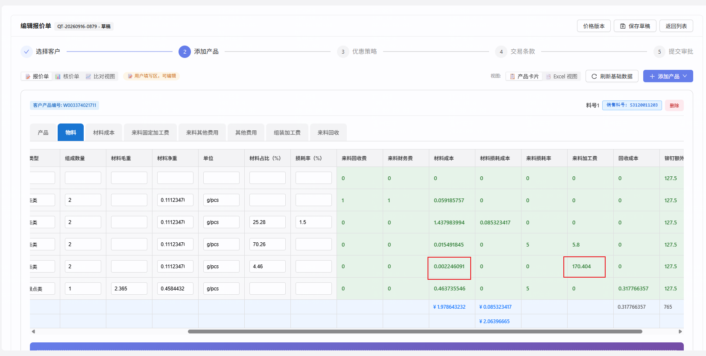
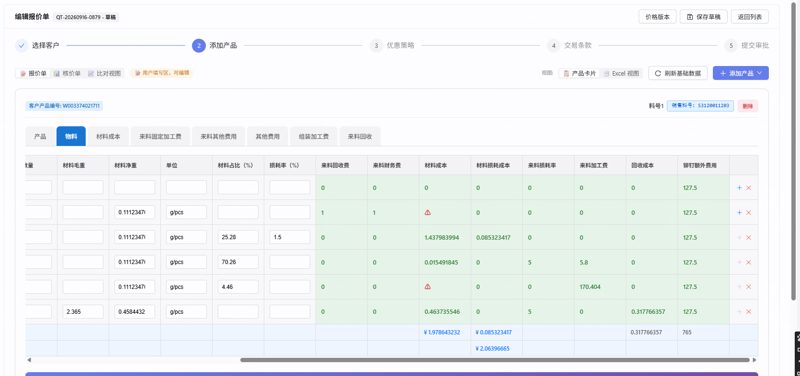

# repair-260916 · 改了上游页签的值，本页签公式仍按旧值算，再切页签显示 ⚠

> **返修对象**：`repair-260803-公式SUM内引用宿主页签字段`（它定下的 `b_field` 取值规则「本行原始数据里有这个键就用它，缺键才用本轮算出的值」，以及其 `需求文档.md` 第 35 行的前提「原始行从来不含公式算出的东西，前后端同构」）
> **状态**：开发中 · 闸门 A0 已过（方案甲）· 闸门 A 已过（2026-09-16 用户「开工」）· 分支 `fix/repair-260916-bfield-stale-rowdata`
> **档位**：标准档（涉及金额公式与前后端算值一致性，不满足轻量档判据 ①）
> **立项日期**：2026-09-16（`date +%y%m%d` 实取 = `260916`）· **BACKLOG**：`BL-0297`
> **立项期实测原始输出**：[`证据/立项期实测-260916.md`](./证据/立项期实测-260916.md)；离线判决脚本与夹具：[`证据/离线判决/`](./证据/离线判决/)

### 本任务的用户裁决（均为 2026-09-16 对话内选项卡作答）

| # | 问题 | 用户选择 |
|---|---|---|
| `D-1` | 走哪条路径 | **A 立项 · 标准档** |
| `D-2`（A0） | 修法选哪个 | **甲：前端计算前去掉本行数据里存的公式值**（候选见 ⑤ 末「已否决备选」） |
| `D-3` | 顺带发现的两件事 | **都登记 BACKLOG** → `BL-0298`（行数据里公式列物化值与卡片不一致）、`BL-0299`（前后端不一致的上报似乎没到后端） |
| `D-4`（开工后 AC 变更） | S-E 修复前对照轮发现：前端 Excel 快照列合计是 12 位原值相加、后端列小计是 9 位值相加，AC-6「9 位完全相等」在修复后也可能差 1（与本缺陷无关；立项时主线据 0879 单一数据点误判口径） | **A：AC-6 改为容差判据 ≤ 0.0000001**，修复前对照要求差 ≥ 0.0001 |
| `D-5` | 上述小数口径不一致要不要登记 | **登记** → `BL-0302`（原拟 `BL-0300`，该号已被他会话占用，master `6dc054d6` 登记时改号） |

---

## ① 问题描述

### 用户原话

> 报价单[QT-20260916-0879]中,我在来料其他费用页签中把来料加工费 150.8-> 170.404. 回到物料页签中,来料加工费的列值成功修改,但是材料成本的公式结果没有修改,再切换一次后,直接显示错误

### 客观现象

报价单 `QT-20260916-0879`（模板「施耐德5.4模板」v1.6，草稿）→ 产品卡片 `S3120011203` →「物料」页签（BOM 树）：

| 行 | 料号 | 来料加工费 | 材料成本（页面） | 材料成本（后端算的） |
|---|---|---|---|---|
| 5 | 00257 | 170.404 ✅ 已是新值 | 截图 1：`0.002246091`；截图 2：**⚠** | `0.002418226` |
| 2 | S3110520422（上级零件） | 0 | 截图 1：`0.059185757`；截图 2：**⚠** | `0.059189199` |

其余 4 行显示值与后端一致。页面不报错，第一次看到时数字「看起来正常」，只是没变。

---

## ② 复现 / 发现方式

- **发现者**：用户在开发环境（`5174` → `8081` → `cpq_db_0724`）编辑草稿时发现。
- **频率**：**必现**，触发条件三者同时满足：
  1. 页签公式在「跨页签汇总」里引用了**本页签另一个公式列**（本例：「材料成本」的 SUM 目标式里引用本行「来料加工费」「来料损耗率」，二者本身是取自「来料其他费用」的公式列）；
  2. 在页面上修改了被引用列的上游数据（本例：「来料其他费用」的「费用」）；
  3. **没有刷新页面**就去看该页签。
- **「再切一次才出 ⚠」的条件**：编辑请求返回时，页面正停在「物料」页签（对账只比较当时显示的页签）。
- **环境**：`10.177.152.12:5432/cpq_db_0724`。

### 复现步骤（任一「施耐德5.4模板」草稿单均可，本任务测试用 0879 的副本）

1. 打开草稿单编辑页 → 第 2 步「添加产品」→ 产品卡片 →「物料」页签，记下 00257 行「材料成本」。
2. 切到「来料其他费用」，把 00257「来料加工费」行的「费用」改成另一个数，点空白处失焦。
3. 立即点「物料」：「来料加工费」列已变，「材料成本」没变。
4. 停在「物料」几秒（等编辑请求返回），切走再切回：00257 与 S3110520422 的「材料成本」变 ⚠。
5. 刷新页面：「材料成本」变成正确的新值，⚠ 消失。

### 复现的数据面证据（只读，原始输出见证据 §1）

- 「物料」`row_data` 00257 行里**存着**公式列 `来料加工费: "170.404"`、`材料成本: "0"` 等；
- 后端 `quote_card_values` 物料页签 `formulaResults`：00257 材料成本 `0.002418226`、S3110520422 `0.059189199`；
- `quote_excel_values`：`col_1`（材料成本）`1.978643233`、`col_3`（产品单价）`1.804291594`，而单据行小计 `1.804467171`。

---

## ③ 需求结果

| 编号 | 期望 | 对应 AC |
|---|---|---|
| **E-1** | 在上游页签改值后**不刷新**，本页签里引用它的公式列立即按新值显示，且与后端算出的值 9 位相同 | AC-1 / AC-3 / AC-4 / AC-5 |
| **E-2** | 不出现「前后端算值不一致」的 ⚠（两边本来就应一致） | AC-2，及 AC-4/5/7 的「⚠ 个数 0」 |
| **E-3** | 切页签、刷新页面后数值稳定不变 | AC-4 |
| **E-4** | 保存后，前端写入的 Excel 视图快照（**Excel 导出**所用）里的「材料成本」「产品单价」与卡片、单据总价一致 | AC-6 |
| **E-5** | 详情页（只读）与编辑页同口径 | AC-7 |
| **E-6** | 条件公式的条件若引用本页签公式列，按本轮算出的值选分支（与后端一致） | AC-11 |
| **反向 E-7** | **真正的公式错误仍显示 ⚠**（如「细项引用命中多行」），不能修成「把告警关了」 | AC-9 |
| **反向 E-8** | 不含此类引用的页签、未编辑的单据、核价单视图，显示值与修复前完全相同 | AC-8 / AC-10 |
| **反向 E-9** | 存草稿**仍把公式结果写进行数据**（所见即所得的既有契约不变），只是写入的是本轮算出值 | AC-12 |
| **反向 E-10** | 公式引用本行**输入列**时行为不变：用户填的值优先、显式清空按 0（`repair-260803` FR-2） | AC-11 |
| **E-11** | 类型检查、既有单测、既有 E2E 无新增失败 | AC-13 / AC-14 |

📌 本返修没有对应的产品级 AC 缺口：`E-1`~`E-5` 是公式引擎「与后端对账一致」「编辑即时重算」的既有要求（`task-260806-报价编辑链路优化与前后端对账` 阶段①、`repair-260803` FR-1）。

---

## ④ 问题原因 / 报告

### 一句话根因

公式在跨页签汇总里引用**本行另一个公式列**时，规则是「本行存的数据里有这个值就用存的」；**前端的「本行数据」就是上次保存的整行快照，里面连公式结果也存着**，所以读到的是上次保存时的旧值；后端的「本行数据」只有基础资料和用户输入，没有公式结果，所以总是用本轮算出的新值 → 前后端不一致 → 对账把差异标成 ⚠。

（`formulaEngine.ts` `case 'b_field'`：`currentRow[key] != null` 优先，否则 `hostFieldValues`；前端 `currentRow` = `comp.rows[i]` = 库 `row_data`；后端 `currentRowRaw` = `driverRow + editValues`。）

### 证据链（均可复跑）

**1. 数值反推**（证据 §2）：00257 的材料成本 = 4.46% ×（镍价 105 + 来料加工费）÷ 1.13 × 净重 × 数量。

| 来源 | 材料成本 | 反推出用的来料加工费 |
|---|---|---|
| 截图（前端） | 0.002246091 | **150.8**（旧值） |
| 库里（后端） | 0.002418226 | **170.404**（新值） |

**2. 代码事实**（证据 §4）：前后端 `b_field` 取值规则相同，差别只在「本行原始数据」装了什么——
- 前端：两个计算入口（`computeAllFormulas` / `resolveRowForTree`）都是 `currentRowForEval = row`，`row` 来自 `comp.rows`（库 `row_data`）；
- `row_data` 里有公式结果：存草稿把公式结果写进 `rowData`（`QuotationWizard.tsx` `buildDraftPayload`，所见即所得，`方案制定前必读.md` 改动 7），后端每次编辑后也用写时算齐（`RowDataMaterializer`）整行重写；
- 编辑响应只回灌 `quoteCardValues / quoteExcelValues / quoteValuesAt`，**不刷新其他页签的 `comp.rows`**，所以改完上游页签后，本页签的原始行一直是旧的；
- 后端 `currentRowRaw = driverRow + editValues`，编辑记录只含用户改过的输入字段 ⇒ 公式列键缺失 ⇒ 落到本轮算出值。

**3. 离线判决**（证据 §3，前端真实引擎 + 本单真实数据，单变量对照）：

| 组 | 本行原始数据里的「来料加工费」 | 00257 材料成本 | 上级零件行 |
|---|---|---|---|
| 对照：库里现值 | 170.404 | 0.002418226 | 0.059189199（6 行 × 8 列与后端逐格一致） |
| 只改回加载时的旧值 | **150.8** | **0.002246091**（= 截图） | **0.059185757**（= 截图） |
| 再去掉原始行里的公式列 | — | 0.002418226（= 后端） | 0.059189199（= 后端） |

非树入口 `computeAllFormulas` 同样复现。

**4. ⚠ 的来源**：「物料」是树形页签，走 `computeTabFormulasTree`，这条路径**不产生计算错误标记**；截图 2 中 00144 仍显示 `0.463735546`（非树入口会把它算成 0），证明当时走的是树入口 ⇒ ⚠ 只能是「前后端算值不一致」对账标记（`handleSnapshotCellEdit` → `reconcileTab`，拿**当时显示的页签**比对），而它恰好只落在前后端值不同的两行。
⚠️ 未查清：共享后端日志（09-14 起）没有任何一条 `[reconcile-diff]`，即差异似乎从未上报到后端（前端先写本地状态再发请求且吞掉失败，所以 ⚠ 照样显示）→ 已登记 `BL-0299`，不在本次范围。

### 引入时间线

| 日期 | 提交 | 事件 |
|---|---|---|
| 2026-06-21 | `9eff9f8e` | `RowDataMaterializer` 写时算齐：公式结果写回 `row_data`（所见即所得存草稿更早就在写） |
| 2026-08-04 | `a07629ed`（合并 `b80b85b2`） | `repair-260803` 给 `b_field` 加「键缺失才回落本轮算出值」，前提是「原始行不含公式结果」—— **这个前提在前端从一开始就不成立** |
| 2026-09-16 08:39Z | — | 「物料」组件 `COMP-0002` 导入本库，**第一次出现「`b_field` 引用本页签公式列」的配置**；`repair-260803` 当年点名的 `COMP-0157` 已不在本库 |
| 2026-09-16 19:0x | — | 用户编辑 0879 时撞上 |

### 影响面（证据 §5、§7）

- **配置**：全库只有 `COMP-0002「物料」`及其在「施耐德5.4模板」**v1.0~v1.7 全部 8 个版本**的冻结快照含此引用（每份 8 处）；「`b_field` 引用非公式列」「条件公式引用本页签公式列」均为 **0**。
- **单据**：该模板下草稿 9 张（`QT-20260916-0872`~`0880`，19:51 采样）。
- **用户可见后果**：
  - 编辑后、刷新前，「材料成本」「铆钉额外费用」等引用了「来料加工费 / 来料损耗率」的列显示旧数；停在该页签会变 ⚠。
  - **旧数会被存进 Excel 视图快照**：0879 的「材料成本」`1.978643233`、「产品单价」`1.804291594`，与单据总价 `1.804467171` 差 `0.000175577`（= 这一格的新旧差）。同模板正常的 5 张单，这两个值与后端 9 位完全相等。
  - **Excel 导出带出旧数**：`GET /api/cpq/quotations/{id}/export-excel-view`（`ExcelViewService#exportExcelView`）有快照时按快照逐行输出，所以导出文件里就是上面的旧值。
  - 卡片值、行小计、单据总价由后端计算，**不受影响**。
  - 📌 **页面上的「Excel 视图」不走这份快照**：报价侧 `getExcelView` 按库里 `row_data` 现算（`buildTabJoinEffectiveRows` → `ComponentDataEffectiveRows.compute`，普通页签只做列求和、不重算公式），因此它显示的是**后端写时算齐的物化值**。本单这 4 列物化值为 0 ⇒ 按代码推断页面 Excel 视图的「材料成本」会显示 0（**未在页面验证**）——这是 `BL-0298` 的后果，不是本缺陷，本次不修。
- **潜在面**：凡是公式通过「本行原始数据」读到公式列的地方（`b_field`、条件公式的条件列）都受同一规则影响；而 `row_data` 里的公式值除了会过时，**还可能本来就是错的**（本单 4 列物化值为 0，`BL-0298`）。

### 为什么测试没拦住

1. `repair-260803` 的测试（`test.md` T-03/T-04 及共享夹具 `cross-tab-cases.json`）直接喂引擎，**手搓的宿主行里没有公式列键** ⇒ 只验证了「键缺失时回落」，从未出现「键在、值过时」这种真实输入（`change-protocol.md` §2「夹具必须从真实数据取材」同族）。
2. 前后端对拍夹具（`qt20260804-0068`、树公式夹具）的公式没有「`b_field` 引用公式列」。
3. 没有任何 E2E 覆盖「改上游页签 → 不刷新 → 看下游页签」这条序列。

---

## ⑤ 修复方案（闸门 A0 裁决：方案甲）

### 改什么

**只改前端 `cpq-frontend/src/pages/quotation/QuotationStep2.tsx` 里的两个公式计算入口**（`computeAllFormulas`、`computeTabFormulasTree`/`resolveRowForTree`）：

1. **求值用的「本行原始数据」去掉本页签公式列**：构造 `currentRowForEval` 时，基于「剔除本组件所有 `FORMULA` 字段键」的行副本进行（🚫 不修改传入的 `row` 对象），后续的输入列默认值补齐、单位换算、跨页签匹配视图（`buildHostMatchRow`）都基于这份副本。效果：`b_field` 引用公式列时，键缺失 → 回落本轮算出值；树求值里经 `treeCtx.rowBundles[].currentRow` 取行值的路径随之一致。
2. **条件公式的条件取值**：两个入口里的 `lookup`，列名是本组件 `FORMULA` 字段时直接取本轮算出值（`fieldValues`），不读原始行（与后端 `selectConditionalExpr` 的实际取值结果一致）。
3. **调用方不改**：编辑页（活动页签渲染、`buildCrossTabRows`、`computeTabSubtotalsByColumn`、`computeFormula`）、详情页 `ReadonlyProductCard`（`buildFormulaCache`、活动页签渲染）、向导 `QuotationWizard`（`snapshotRows`）共 14 个调用点都经这两个入口；`buildExcelSnapshot` 不传本行数据、消费 `buildCrossTabRows` 的结果，随源头自动修正。
4. **补回归测试**：真实数据夹具（0879）+ 构造组件单测 + E2E（见 `test.md`）。

### 协议级判定与检查点清单（`change-protocol.md` §2 步骤 1）

- **是协议级改动**：`QuotationStep2.tsx` 属渲染主链路（`frontend.md` §2.1 第 5 条），必须跑 E2E，并在编辑页 / 详情页 / 核价单视图分别验证。
- **不涉及**：字段类型、枚举、接口契约、数据库迁移、缓存 key。

| # | 检查点 | 处理 |
|---|---|---|
| 1 | `computeAllFormulas` → `evaluateExpression(currentRowForEval)` | **改**（剔除公式列键） |
| 2 | `computeAllFormulas` 条件 `lookup` 先读 `row[col]` | **改**（公式列取算出值） |
| 3 | `resolveRowForTree` → `currentRowForEval` → `computeTabFormulasTree` 的 `evaluateExpression` 与 `treeCtx.rowBundles[].currentRow` | **改** |
| 4 | `computeTabFormulasTree` 条件 `lookup` 先读 `rows[i].row[col]` | **改** |
| 5 | 两个入口的 `buildHostMatchRow(fields, currentRowForEval, …)` | 随 1/3 使用剔除后的行；与后端匹配视图（公式列不注入）一致 |
| 6 | `formulaEngine.ts` 内部 `tree_ref` 求值、`cross_tab_ref` 子求值（`mergedRow = hostRow + ar`） | 不改；继承入口传入的行 |
| 7 | `QuotationStep2.tsx` 产品小计的两处 `evaluateExpression`（不传本行数据） | 不涉及 |
| 8 | `buildExcelSnapshot.ts` 的 `evaluateExpression`（`currentRow=undefined`） | 不改；消费 `buildCrossTabRows`，随源头修正 |
| 9 | 14 个入口调用点（编辑页 8 / 详情页 4 / 向导 2） | 不改；回归验证覆盖编辑页、详情页、存草稿 |
| 10 | 存草稿 `rowData` 写公式结果（所见即所得） | **不改**（`E-9`） |
| 11 | 后端 `FormulaCalculator` / `RowDataMaterializer` | **不改**（后端取值本来正确；物化值问题归 `BL-0298`） |

### 本期明确不做

| 不做 | 去向 / 理由 |
|---|---|
| 改后端任何代码 | 后端「本行原始数据」不含公式结果，取值本来正确 |
| 改 `formulaEngine.ts` 的 `b_field` 取值顺序 | 保持与后端逐字对称；即方案乙，已否决 |
| 停止在 `row_data` 里存公式结果 | 所见即所得是既有契约（`方案制定前必读.md` 改动 7、AP-11） |
| 修后端写时算齐的物化值（本单 4 列为 0），以及因此受影响的**页面 Excel 视图**数值（它按 `row_data` 现算） | `BL-0298` |
| 查「前后端不一致的上报没有到后端」 | `BL-0299` |
| 批量修存量单据里已落库的 Excel 视图旧值（如 0879） | 用户下次编辑并保存即覆盖；需要批量修另议 |
| `0874` / `0875` 的 Excel 差额、`0880` Excel 快照滞后的观察 | 成因与本缺陷不同，未深查（证据 §7） |
| 编辑后刷新其他页签的原始行 | 即方案丙，已否决 |

### 已否决备选

- **乙：前后端一起改 `b_field` 取值顺序（公式列优先用本轮算出值）** —— 后端本来正确也要动，属跨端改动；只修了 `b_field` 一种引用，条件公式读本行公式列的同类隐患仍在。
- **丙：每次编辑后用后端最新行数据刷新整卡所有页签** —— 只能解决「过时」，解决不了「存的公式值本身就错」（本单 4 列为 0）；请求往返期间仍会短暂算错、闪 ⚠。

---

## ⑥ 验收标准

### 测试数据约定（所有 E2E / 真机 AC 共用）

- **基准单** `QT-20260916-0879`（id `a566efeb-72fe-48f9-b2c8-e1543283beab`）：🚫 **只读引用，不在其上编辑**。
- **副本 Q′**：`POST /api/cpq/quotations/a566efeb-72fe-48f9-b2c8-e1543283beab/copy`（请求体 `{}`）生成；记录返回的 id 与单号。同模板复制会**整份继承**值快照与各页签行数据、不重算（`QuotationService#copy`）。**每跑一轮 AC-1~AC-8、AC-12 用一张新副本**，用例结束 `DELETE /api/cpq/quotations/{Q′ id}` 回收自己建的那张。
- **起始态 T0**：新副本建好后，打开 Q′ 编辑页 → 第 2 步 → 产品卡片 →「物料」页签（🚫 不保存、不改任何值）。
  **T0 前置断言**（任一不满足：停下报主线，🚫 不许自行改期望值）：
  - 「物料」页签：00257 来料加工费 `170.404`、材料成本 `0.002418226`；00256 来料损耗率 `5`、材料成本 `0.015491845`；S3110520422 材料成本 `0.059189199`；00255 `1.437983994`；00144 `0.463735546`；⚠ 个数 0；
  - Q′ 的 `quote_card_values`：材料成本页签 Ni 单价 `105`、Cu `101.1392`、Zn `24.1695`、Ag `28892.5`；产品页签税率 `1.13`；来料固定加工费页签「加工费」小计 `127.5`。
  - 🚦 **过程中守恒**：AC-3、AC-6 查库时顺带复核上面这组单价与税率；**任何一项变了（如 Cu 变成 `101.13921`）即停下报主线**，本轮字面期望值作废（它们只在这组输入下成立）。
- 下文的「⚠ 个数」指页面上公式单元格的 ⚠ 标记数量；数值断言一律按 9 位小数比较。
- **期望值来源**：证据 §3.3（前端真实引擎按修复后口径离线算出，E0 与后端现值逐位一致）。
- 📌 **列合计口径**：后端列小计是「每格先舍到 9 位再相加」（证据 §3.3：E0 后端 `1.97881881` = 9 位值累加；12 位累加是 `1.978818811`）；🚨 **前端 Excel 快照是 12 位原值相加**（`D-4` 更正，证据 §8.1），两者可差 1e-9 量级，故 AC-6 用容差判据。算后端侧期望时 🚫 不要用 12 位原值累加。

### 单点

**AC-1 · 改上游值后，不刷新即按新值算**（E-1）
- 前置：T0。
- 操作：「来料其他费用」→ 00257「来料加工费」行「费用」`170.404` → `200`，点空白处失焦 → **不刷新**，立即点「物料」。
- 断言：00257 行「来料加工费」显示 `200`、「材料成本」显示 `0.002678099`；S3110520422 行「材料成本」显示 `0.059194397`；00255 `1.437983994`、00144 `0.463735546`、00256 `0.015491845` 不变。
- 修复前（阳性对照，master 前端同操作）：00257 显示 `0.002418226`、S3110520422 显示 `0.059189199`。

**AC-2 · 编辑请求返回后不出现 ⚠**（E-2）
- 前置：AC-1。
- 操作：停在「物料」，等 `…/quote-card-edit` 请求返回 200 后再等 3 秒；点「来料其他费用」再点回「物料」。
- 断言：「物料」6 行 × 8 个公式列（来料回收费 / 来料财务费 / 材料成本 / 材料损耗成本 / 来料损耗率 / 来料加工费 / 回收成本 / 铆钉额外费用）全部显示数字，**⚠ 个数 0**；AC-1 的三个数值不变。
- 修复前（阳性对照）：S3110520422 与 00257 的「材料成本」显示 ⚠，悬停提示以「前后端算值不一致」开头。

**AC-3 · 页面值与后端存值一致**（E-1）
- 前置：AC-2。
- 操作：只读查库 Q′ 的 `quotation_line_item.quote_card_values` →「物料」页签 `formulaResults`。
- 断言：00257「材料成本」= `0.002678099`，S3110520422 = `0.059194397`，与 AC-1 页面显示逐位相同。

**AC-7 · 详情页同口径**（E-5）
- 前置：AC-6 完成后的 Q′。
- 操作：打开 Q′ **详情页** → 产品卡片 →「物料」。
- 断言：00257 材料成本 `0.000921968`、00256 `0.016191348`、S3110520422 `0.059173264`；⚠ 个数 0。

**AC-12 · 存草稿仍写公式结果，且写的是新值**（E-9）
- 前置：AC-4 第 1 步完成（尚未刷新）。
- 操作：点「保存草稿」，抓取该请求的请求体。
- 断言：请求体里「物料」页签 00256 行的行数据**仍含**「材料成本」「来料损耗率」两个键，值分别为 `0.016191348`（9 位舍入后）与 `10`；00257 行「来料加工费」= `200`、「材料成本」= `0.002678099`（9 位舍入后）。
- 修复前（阳性对照）：00256 行「材料成本」为 `0.015491845`。

### 序列

**AC-4 · 连续改、切页签、刷新，数值稳定**（E-1 / E-2 / E-3）
- 前置：AC-3。
- 操作与断言（每一步都断言 ⚠ 个数 0）：
  1. 「来料其他费用」→ 00256「来料损耗率」行「比例」`5` → `10`，失焦 → 点「物料」：00256 来料损耗率 `10`、材料成本 `0.016191348`；S3110520422 `0.059208387`；00257 仍 `0.002678099`。
  2. 点「产品」→ 点回「物料」：上面三格不变。
  3. 刷新页面（F5）→ 进「物料」：上面三格不变。
- 修复前（阳性对照）：第 1 步 00256 显示 `0.015491845`。

**AC-6 · 保存后 Excel 视图快照与 Excel 导出，同卡片、单据总价一致**（E-4）
- 前置：AC-5。
- 操作：点「保存草稿」并等请求返回成功 → 只读查库 → 调 `GET /api/cpq/quotations/{Q′ id}/export-excel-view` 下载导出文件。
- 断言（`D-4` 2026-09-16 改为容差判据，原判据见本节末）：
  - `|库中 Q′ quote_excel_values.rows[0].col_1（材料成本） − 同一时刻 quote_card_values 物料页签 subtotalByColumn.材料成本| ≤ 0.0000001`，且后者 = `1.97800612`；
  - `|col_3（产品单价） − 库中 Q′ quotation_line_item.subtotal| ≤ 0.0000001`；
  - 导出文件中 Q′ 这一行 `col_1`、`col_3` 两格（表头是列键，见 `api.md`）的数值，与库中快照同名两格在 9 位小数上相同。
- 容差依据：前端 Excel 快照列合计按 12 位原值相加，后端列小计按 9 位值相加（证据 §8.1 更正、S-E master 轮请求体原文），两者存在与本缺陷无关的 1e-9 量级差（登记 `BL-0302`）；本 AC 场景的缺陷偏差为 1e-3 量级，容差 1e-7 能干净区分二者。
- 🚫 **不断言页面上「Excel 视图」的显示值**：报价侧该视图按 `row_data` 现算，受 `BL-0298`（物化值错误）影响，不属本次（见 ④ 影响面）。
- 修复前（阳性对照，同一序列操作）：上面两个差的绝对值都 **≥ 0.0001**（S-E master 轮实测：`col_1 1.97979737357 − 1.97800612 = 0.00179125357`；`col_3 1.805445734 − 1.803654481 = 0.001791253`），导出文件同样不等。
- ~~原判据（闸门 A 版）：`col_1 = 1.978006120` 且与后端列小计 9 位完全相等；`col_3` 与行小计 9 位完全相等~~ —— 作废原因：立项时误判前端 Excel 快照口径（`D-4`）。

### 边界

**AC-5 · 上游值改为 0**（E-1）
- 前置：AC-4。
- 操作：「来料其他费用」→ 00257「来料加工费」行「费用」`200` → `0`，失焦 → 点「物料」。
- 断言：00257 来料加工费 `0`、材料成本 `0.000921968`；S3110520422 `0.059173264`；00256 仍 `0.016191348`；⚠ 个数 0。

**AC-11 · 现网无样本的两类引用（仅单元测试覆盖）**（E-6 / E-10）
用真实入口 `computeAllFormulas` 与 `computeTabFormulasTree` **各跑一遍**，构造组件：
- a) **条件引用公式列**：公式列 X = 输入列 A × 2；公式列 Y 为条件公式「X > 10 → 公式 P（结果 1），否则 → 公式 Q（结果 2）」。本行原始数据 A = `8`、X 存旧值 `1`。断言 Y = `1`（按本轮 X = 16 判断）。修复前 Y = `2`。
- b) **引用输入列**：公式列 Z = 跨页签 SUM（源页签 1 行，v = `5`）目标式 `v × b_field N`，N 为本页签输入列。本行 N = `3` → Z = `15`；本行 N = `''`（显式清空）→ Z = `0`。修复前后结果相同。
- c) **入参不被改写**：调用后，传入的原始行对象的键集合与值与调用前逐一相同（含公式列键仍在）。
- ⚠️ 全库扫描（证据 §5）：「条件引用本页签公式列」「`b_field` 引用非公式列」均为 **0 个组件** ⇒ 本条**无法 E2E / 真机验收**，闸门 B 按 `testing.md` §2 显式列为「仅单元测试覆盖」。

### 回归（反向）

**AC-8 · 核价单视图不变**（E-8）
- 前置：AC-5 状态的 Q′。
- 操作：在 **master 前端**（共享 `5174`）与**修复分支前端**分别打开 Q′ 编辑页 →「核价单」→ 逐个页签截取全部公式列显示值。
- 断言：两份数值表逐格相同，且非空（至少 1 个页签有 ≥ 1 个公式值）。

**AC-9 · 真正的公式错误仍显示 ⚠**（E-7）
- 前置：`QT-20260916-0874`（v1.2 快照「管理费公式」末项为明细引用，物料页签销售料号命中 2 行，见 RECORD 2026-09-17）。先在 **master 前端**确认其**详情页**「产品」页签「管理费」显示 ⚠；不成立则停下报主线换样本。
- 操作：修复分支前端打开 0874 **详情页**（🚫 不进编辑页）→「产品」页签。
- 断言：「管理费」仍显示 ⚠，悬停提示包含「细项引用命中多行」。

**AC-10 · 未编辑的单据显示值不变**（E-8）
- 操作：修复分支前端打开以下**详情页**（只读，🚫 不进编辑页）：
  - `QT-20260916-0879` →「物料」页签；
  - `QT-20260914-0866`（正泰测试模板2 v1.3）→ 每张产品卡片的「BOM」页签（树形，公式列：材料管理费、物料成本）；
  - `QT-20260913-0859`（正泰测试模板1 v1.2）→ 每张产品卡片的「材质元素」页签（公式列：元素小计）。
- 断言：
  - 0879 物料页签 6 行 × 8 个公式列 = 库中其 `formulaResults`（9 位逐格相等），⚠ 个数 0；
  - 0866、0859 上述页签的全部公式单元格显示值，与 **master 前端**（共享 `5174`）同一时刻截取的值逐格相同；两张单各自至少 1 个公式单元格为非 0 数字（否则停下报主线换样本）。

**AC-13 · 类型检查、单元测试无新增失败，新增单测能区分修复前后**（E-11）
- `cd cpq-frontend && npx tsc -b` → 0 错误；
- `npx vitest run src` → 失败用例集合 ⊆ master 基线失败集合（`test-report.md` 列出两份清单）；
- 本任务新增的单元测试（真实数据夹具 `QT-20260916-0879` + AC-11 构造组件）：在 **master 代码上**，对应「改上游值后按新值算」（AC-1 的离线等价）与 AC-11a 的用例**必须失败**；在修复分支上**全部通过**（证伪，`testing.md` §4.4）。

**AC-14 · 页面可加载，既有 E2E 无新增失败**（E-11）
- 修复分支临时前端上，`src/pages/quotation/QuotationStep2.tsx` 的模块地址返回 HTTP 200；
- `e2e/quotation-flow.spec.ts`：修复分支前端与 master 前端各跑一次，失败用例集合相同（A/B 同型，决策台账 `quotation-flow.spec.ts` 条：该 spec 现状全红，🚫 不以「全绿」为判据）。

### 自检证据（闸门 B 汇报必附）

- AC-1~AC-7、AC-9、AC-10 的截图（修复前 / 修复后成对），归档到本目录 `证据/`；
- AC-3、AC-6 的 SQL 原始输出；AC-12 的请求体原文；
- AC-13、AC-14 的命令原始输出与失败清单（master / 修复分支各一份）。

### 三类覆盖自查

| 类 | AC |
|---|---|
| 单点 | AC-1、AC-2、AC-3、AC-7、AC-12 |
| 序列 | AC-4（改 → 切 → 切回 → 刷新）、AC-6（改 → 保存 → 查快照 → 导出） |
| 边界 | AC-5（改为 0）、AC-11（现网无样本的两类引用、显式清空、入参不改写） |
| 反向 / 回归 | AC-8、AC-9、AC-10、AC-13、AC-14 |

📌 **并发编辑 / 权限不足**：本缺陷只发生在草稿编辑页的本地计算，与权限、并发无关；草稿态以外不可编辑（后端 `editCardValue` 非 DRAFT 直接拒绝），不单列 AC。
