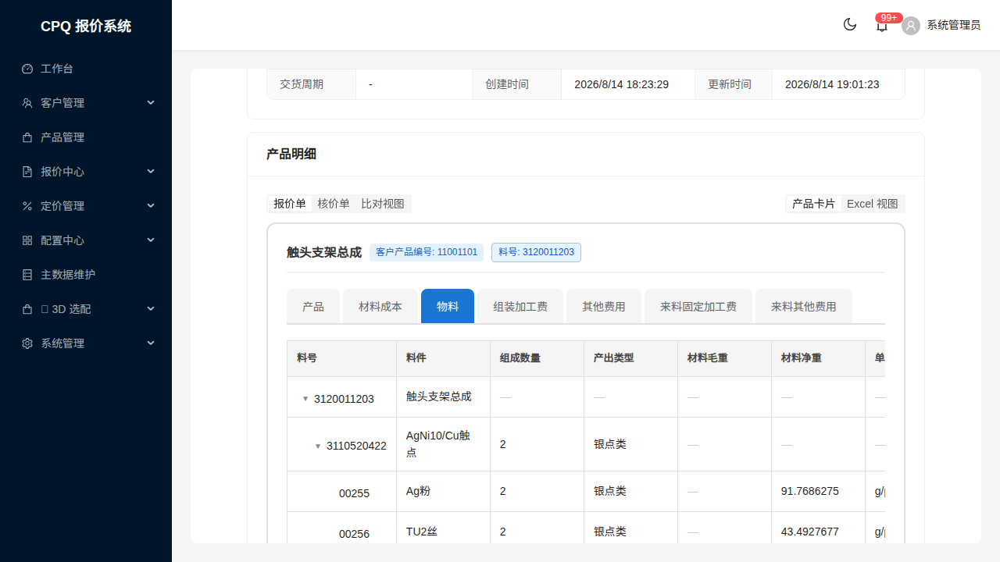

# test-report · repair-0814 详情页报价树多出「版本」列

- **执行人**：技术总监（主线亲验，未采信子代理结论）
- **执行日期**：2026-08-14
- **分支**：`fix/repair-0814-detail-version-col`（worktree `.claude/worktrees/repair-0814-detail-version-col`）
- **环境**：前端 worktree 临时 Vite `127.0.0.1:5199`（`node_modules` 软链主仓）；后端主仓 `8081`（本次零后端改动）；DB `cpq_db_0724`

---

## 1. 结论

**AC-1 ~ AC-8 全部达成**，其中 AC-2 由「代码等价性证明」达成（说明见 §4）。

| AC | 结论 | 证据 |
|---|---|---|
| AC-1 报价侧详情页无版本列 | ✅ | E2E 表头输出 + 截图 |
| AC-2 核价侧逐位不变 | ✅（等价性证明） | §4 |
| AC-3 表体/表尾对齐 | ✅ | E2E 逐行 `td` 数 == 表头列数；tfoot 2 行 `Σ colSpan` == 表头列数 |
| AC-4 树能力不退化 | ✅ | 截图：缩进分层 + `▼` 折叠箭头 + 料号文本正常 |
| AC-5 值不变 | ✅ | 纯 JSX 渲染开关改动，取值链路零改动（§4 等价性同理） |
| AC-6 非树页签版本列不受影响 | ✅ | `activeComponentVersionable` 未改动，其定义本就含 `isCosting &&` |
| AC-7 自检证据 | ✅ | §2 |
| AC-8 防回归断言落地 | ✅ | 新增详情页 E2E test，且**还原实验**证明其非空验证（§3） |

---

## 2. 自检证据

```
npx tsc --noEmit -p tsconfig.json          → 0 错误 ✅（改动后 + 还原实验回滚后各跑一次）
curl 127.0.0.1:5199/src/pages/quotation/ReadonlyProductCard.tsx → 200 ✅
curl 127.0.0.1:5199/src/pages/quotation/QuotationStep2.tsx      → 200 ✅
```

后端：本次零改动，未触发 Quarkus 重启；`8081` 业务端点 401（应用在跑、鉴权正常）✅
N+1 自检：**不适用**（零后端改动，无新增循环 / 无 repository 调用 / 无 `SqlViewExecutor.execute`）。

---

## 3. E2E

### 3.1 新增 test（详情页）—— PASS

```
PW_BASE_URL=http://127.0.0.1:5199 npx playwright test --config=e2e/playwright.config.ts \
  e2e/quotation-bom-tree.spec.ts -g "repair-0814" --reporter=list

[QBT] 详情页 BOM树表头: ["料号","料件","组成数量","产出类型","材料毛重","材料净重","单位",
  "材料占比","损耗率","来料回收费","来料财务费","材料成本","材料损耗成本","来料损耗率",
  "来料加工费","回收价格","回收成本","公式10","原材料成本","材料价格","铆钉额外费用"]
[QBT] 详情页 tfoot 行数 = 2
[QBT] 详情页 BOM树 加载中 = 0
  ✓  1 [chromium] › 报价侧详情页 BOM 树：表头不含「版本」列 + 表体/表尾与表头列数对齐（repair-0814 AC-1/AC-3/AC-8） (8.9s)
  1 passed (43.5s)
```

**截图**：`./修复后-详情页报价树无版本列.png`（QT-20260814-0179 详情页 →「物料」页签，表头 `料号 | 料件 | 组成数量 | …`，树缩进与 `▼` 折叠箭头正常）



### 3.2 还原实验（证明测试非空验证）—— 按预期变红

把 `ReadonlyProductCard.tsx` 回滚到 `HEAD`（其余不动）后重跑同一 test：

```
[QBT] 详情页 BOM树表头: ["料号","版本","料件","组成数量","产出类型", …]   ← 版本列回来了
→ expect(headers).not.toContain('版本') 失败
```

这同时是**用户所报现象的机器复现**。随后恢复修复，重跑 → `1 passed` ✅

### 3.3 既有 2 个 test 失败 —— **既有夹具漂移，与本次改动无关**

`quotation-bom-tree.spec.ts` 顶部 `QUOTATION_ID = 1f8c146d-…`（QT-20260721-2067）**在当前库已不存在**：

```sql
select quotation_number,status from quotation where id='1f8c146d-20cd-438b-9b4a-53a98f3cbdb9';
→ 0 行
```

故 `enterQuoteTreeTab()` 恒返 false，前两个 test 恒失败。**归因方式**：不是靠猜，是靠上面这条 SQL 直接证否夹具存在性（比 A/B 更强的证据）。
本次新增的 test 因此**自带独立、现存的夹具**（QT-20260814-0179 / COMP-0202「物料」），不依赖那个死夹具。
既有夹具的修复不在本次范围 → 归入 `BL-0158` 家族（E2E 夹具漂移）。

### 3.4 未跑 `quotation-flow.spec.ts`

理由见 `test.md` T3：该 spec 在干净 master 上已恒 3 失败（夹具单缺产品分类 → Step1「下一步」禁用），跑它不产生有效信号。本次改动面由 `quotation-bom-tree.spec.ts` 覆盖。

---

## 4. AC-2 / AC-5 的等价性证明（为什么核价侧和数值必然不变）

本次全部改动形如 `X` → `{isCosting && X}` / `2` → `(isCosting ? 2 : 1)`。当 `isCosting === true` 时：

| 改动点 | 核价侧求值结果 | 与改动前 |
|---|---|---|
| 表头版本 `<th>` | `{true && <th…/>}` → 渲染同一个 `<th>` | 逐字相同 |
| 行内版本 `<td>` | `{true && <td>…</td>}` → 渲染同一棵子树（`VersionSelectDropdown` / 纯文本分支内部一字未改） | 逐字相同 |
| 空数据 `colSpan` | `(true ? 2 : 1)` = `2` | 相同 |
| tfoot 小计 / 合计占位 | `<td />{true && <td />}` = 2 个 `<td />` | 相同 |

数值（AC-5）：`columnSumsByComp` / `compSubtotals` / `sumTabColumns` / `computeProductSubtotal` 的入参与调用点**一行未动**，改动只发生在「是否渲染某个单元格」层面，不参与任何求值。

因此核价侧渲染与两侧数值**在结构上不可能改变**，无需再跑一遍数值 A/B。

---

## 5. 顺带修复（用户同批裁决）

`QuotationStep2.tsx` tfoot **合计**行占位补 `cardSide === 'COSTING'` 闸门 —— 补齐 `7fadf5e8` 漏改的第 4 处。
验证：`tsc` 0 错误 + Vite 200；核价侧同样按 §4 等价性不变；报价侧树页签合计行占位由 2 格降为 1 格，与表头一致。

---

## 6. 遗留

- `BL-0174`：BOM 树系统固定列口径抽共享单一来源（AP-50 结构性收敛），本次未做。
- `quotation-bom-tree.spec.ts` 前两个 test 的夹具需重建（既有问题，本次未处理）。
