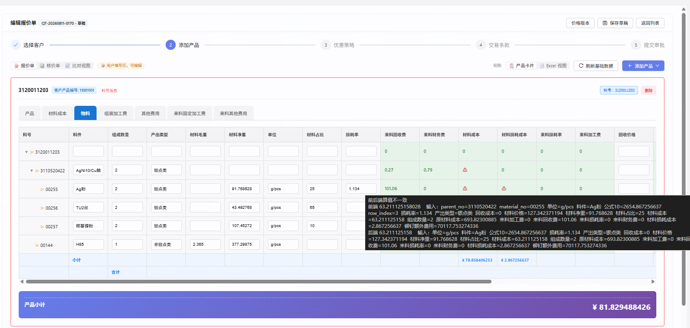

# 问题说明 — 编辑单元格后报「前后端算值不一致」（对账阈值与结果尺度不对称，结构性误报）

- **立项日期**：2026-08-12
- **类型**：repair（BUG 修复）
- **归属主任务**：`dev-docs/task-0801-公式计算精度优化/`
- **引入来源**：同主任务下的子任务 `task-0810-公式计算12位显示9位/`（提交 `fd83cac1`，2026-08-11）
- **强关联**：`dev-docs/task-0806-报价编辑链路优化与前后端对账/`（对账 + 提交闸门的实现方与 `D4 阈值` 决策方）
- **报告人**：主线（技术总监）
- **状态**：🟢 **闸门 A 已过**（2026-08-13 用户裁决方案，见 §5）—— 待进场实施，**目前尚未改任何代码**
- **优先级**：**P0**（阻断提交，且该类差异**永不消解**）
- **BACKLOG**：用户裁决**不登记**（改动小、当天闭环，走 dev-docs + `docs/RECORD.md` 记录即可）

---

## 1. 问题描述

用户在报价单编辑页修改「材料净重」单元格并失焦、触发重算后，单元格出现 ⚠ 告警：**前后端计算结果不一致**。



截图中 tooltip 原文：

```
前后端算值不一致
前端 63.211125158028   输入：parent_no=3110520422  material_no=00255  单位=g/pcs  料件=Ag粉  公式10=2654.867256637 …
后端 63.211125158      输入：单位=g/pcs  料件=Ag粉  公式10=2654.867256637 …
```

同一屏内至少 3 个单元格同时告警（`3110520422` 行的「材料成本」、`00255` 行的「材料成本」与「材料损耗成本」）。

**关键观察**：两个值并不是"算错"，而是**同一个数被截在了不同小数位数上**——

```
前端 63.211125158028   （12 位）
后端 63.211125158      （ 9 位）
round(63.211125158028, 9) = 63.211125158    ← 完全相等
```

界面上用户看到的两个数字甚至是**逐字符相同**的（显示层统一按 ≤9 位格式化），⚠ 纯粹是判定层噪声。

---

## 2. 复现 / 发现方式

**发现方式**：用户手工操作时发现并截图上报（非监控、非测试发现 —— 见 §4.6 测试缺口）。

**复现步骤**：

1. 打开报价单 `QT-20260811-0170`（状态 DRAFT）→ 编辑 → 步骤 2「添加产品」
2. 定位料号 `3120011203` → 切到 **物料** 页签
3. 修改任一行的「材料净重」→ 单元格失焦
4. **现象**：「材料成本」等 FORMULA 列出现 ⚠，hover 显示 `前后端算值不一致`，前端 12 位 / 后端 9 位
5. 点「提交审批」→ 被 `409 RECONCILE_PENDING` 拒绝，弹出 `ReconcilePendingDrawer`「提交校验未通过：前后端算值不一致」
6. **反证（确认不是算错）**：把 tooltip 里前端值四舍五入到 9 位，与后端值逐位比对 → 相等

**环境**：dev 默认 profile → `10.177.152.12:5432/cpq_db_0724`；lineItem `f57bfe0c-ba0c-4850-afdf-f23b81a3aa7e`。

**关键复现条件**（满足其一即可，不限于本单）：DRAFT 报价单 + 报价侧（`cardSide === 'QUOTE'`）+ 活动页签内存在**工作值第 10~12 位非零**的 FORMULA 列。含除法或跨页签 SUM 的公式几乎必中。

---

## 3. 需求结果（期望行为）

| # | 期望 |
|---|---|
| E-1 | 前后端**在同一尺度上算得相同**时，**不得**报「前后端算值不一致」——尤其不能因为一边是 12 位工作值、另一边是 9 位结果值这种口径差异而告警 |
| E-2 | 提交闸门只拦**真实**的算值分歧；结构性口径差异不得阻断提交 |
| E-3 | 存在**真实**分歧（量级达到用户可见的显示精度）时，**仍然**要告警并阻断提交 —— 对账的阳性能力不能丢 |
| E-4 | 告警一旦出现，必须**存在可消解路径**（用户改正后能恢复提交），不能出现"怎么改都消解不掉、只能重启后端"的死锁 |
| E-5 | 本次修复**不改数**：落库值、显示值、导出值与修复前逐字节一致 |

---

## 4. 问题原因 / 报告

### 4.1 根因（三层，缺一不成灾）

#### 第一层｜比较对象的尺度天然不对称（12 位 vs 9 位）

| 侧 | 产物 | 尺度 | 代码位置 |
|---|---|---|---|
| **前端** | `formulaCache[字段]` → 对账取的就是它 | **12 位**（`CALCULATION_SCALE`） | `formulaEngine.ts:824` `return result === null ? '0' : toCalculationString(result)`；`toCalculationString` 见 `precision.ts:57`，按 `CALCULATION_SCALE = 12` 定尾 |
| **后端** | 快照 `tabs[].formulaResults[].values[字段]` → 对账拿它当基准 | **9 位**（`FORMULA_RESULT_SCALE`） | `FormulaCalculator.java:1113` `results.put(name, PrecisionPolicy.roundFormulaResult(working))`；第二条路径 `:1244`（BOM 树单元格拓扑）同样 `roundFormulaResult` |

后端**内部**传给下游公式的是 12 位 `working`（`ctx.fieldValues.put(name, working)`），**只有落进快照的那一份被压到 9 位**。也就是说：**后端从不产出 12 位的 `formulaResults`**，而前端拿 12 位去比它。

⇒ 两侧差值上界恒为 **5×10⁻¹⁰**（9 位四舍五入的半个 ulp），且只要工作值第 10~12 位不全为 0，差值必然 > 0。

#### 第二层｜容差被设成 10⁻¹²，比结构性差距小 3 个数量级

```ts
// cpq-frontend/src/utils/formulaEngine.ts:827
export function isWithinTolerance(
  frontendValue: DecimalValue,
  backendValue: DecimalValue,
  tolerance: DecimalValue = '0.000000000001',   // 1e-12
): boolean { … }
```

`QuotationStep2.tsx:2744-2750` 的 `valuesReconcile` 直接吃这个默认容差。

> 结构性差距上界 `5e-10` ＞ 容差 `1e-12`，**差 500 倍**。
> ⇒ 凡工作值第 10~12 位非零的公式结果，**100% 触发误报**，且**无论用户怎么改都消解不掉**（改完还是 12 位 vs 9 位）。

本例「材料成本」走的是条件公式 `银点材料成本公式`（component `74c0cede-094e-478c-a8fe-8f0028d538cd` 物料），表达式含 `材料占比/100`、`组成含量(%)/…` 多级除法，产出 12 位无限小数是常态。

#### 第三层｜规格自相矛盾（真正的病根，必须由用户裁决）

`task-0810` 的文档把这条写成了**显式要求**：

> `task-0810-公式计算12位显示9位/需求文档.md:82` — **FR-12 对拍与提交闸门**：对账阈值按 12 位工作值判定；前后端不一致仍阻止提交，**不因显示同为 9 位而放过第 10~12 位差异**。
> `task-0810-公式计算12位显示9位/fronttask.md:69` — 对账比较按 Decimal 差值…阈值为 `10^-12` 的工作值比较，**不以 9 位显示相同作为相等**。

FR-12 要求「按 12 位工作值判定」，但**后端侧根本不提供 12 位工作值**（`formulaResults` 被 `roundFormulaResult` 压到 9 位，且这是 task-0810 自己保留的既有契约）。

**一个只有单边能满足的判定条件 = 恒不成立。** 这不是实现走样，是需求本身不自洽 —— 所以修复方向必须先在「改判定口径」与「补 12 位数据源」之间做出选择（§5）。

### 4.2 证据链

**证据 1｜后端快照实测：`formulaResults` 最多 9 位，从无 10 位以上**

```sql
-- 库：10.177.152.12:5432/cpq_db_0724
WITH t AS (SELECT jsonb_array_elements(quote_card_values->'tabs') AS tab
           FROM quotation_line_item WHERE id='f57bfe0c-ba0c-4850-afdf-f23b81a3aa7e'),
     fr AS (SELECT tab->>'tabName' AS tab_name, jsonb_array_elements(tab->'formulaResults') AS r FROM t),
     kv AS (SELECT tab_name, (jsonb_each_text(r->'values')).* FROM fr)
SELECT tab_name, key, max(length(split_part(value,'.',2))) AS max_dp
FROM kv WHERE value ~ '^-?[0-9.]+$' GROUP BY 1,2 ORDER BY max_dp DESC;
```

| tab | 字段 | 最大小数位 |
|---|---|---|
| 物料 | 原材料成本 / 材料成本 / 材料损耗成本 / 铆钉额外费用 / 材料价格 / 公式10 | **9** |
| 物料 | 来料加工费 | 3 |
| 物料 | 来料财务费 / 来料回收费 / 来料损耗率 | 2 |

**没有任何字段超过 9 位** —— 与 `roundFormulaResult` 行为一致，证明后端不可能给出 12 位。

**证据 2｜本例告警行的后端值**

```
物料 / 3120011203/3110520422/00255::Ag粉
  材料成本     = 63.211125158     （前端 63.211125158028，9 位对齐后完全相等）
  材料损耗成本 = 2.867256637
  原材料成本   = 693.82300885
```

**证据 3｜显示层证明"用户看到的两个数一样"**

`ComponentCell.tsx:313` → `formatNumber(val, { isComputed: true })` → `resolveDecimals` 对计算列封顶 `DISPLAY_SCALE = 9`（`formatNumber.ts:20-25`）。⇒ 界面上两个值渲染出来逐字符相同。

**证据 4｜提交闸门确实被这类噪声卡死**

- 前端 `reconcileTab` 把差异**全量**（跨页签累积）上报 `POST reconcile-report`（`QuotationStep2.tsx:2820-2832`）
- 后端 `ReconcileDiffStore.report()` 是**整份替换**语义，非空即入 `pending` Map（`ReconcileDiffStore.java:39-46`）
- 提交时 `QuotationService.java:771` → `SubmitGateService.assertLineSettled()` → 有 pending 即抛 `ReconcilePendingException`（409）
- **消解条件只有两个**：① 前端上报空数组；② 后端进程重启（`ReconcileDiffStore` 是进程内 `ConcurrentHashMap`）。本类差异**永远无法通过 ① 消解**

### 4.3 时间线：这是 2026-08-11 引入的回归

| 时间 | 提交 | 变化 | 当时是否误报 |
|---|---|---|---|
| 2026-08-07 | `2942a4d8`（task-0806 阶段①） | 对账上线。`valuesReconcile` = `Math.abs(an-bn) < Math.pow(10, -DISPLAY_SCALE)`，当时 `DISPLAY_SCALE = 6` ⇒ 阈值 **1e-6** | ❌ 不误报（1e-6 远大于 5e-10） |
| 2026-08-11 | `fd83cac1`（task-0810） | ① 前端公式返回值 `number` → 12 位十进制串；② `isWithinTolerance` 默认容差 **0.01 → 1e-12**；③ `valuesReconcile` 改调 `isWithinTolerance()` 吃默认容差；④ `DISPLAY_SCALE` 6 → 9 | ✅ **开始必然误报** |

> 即便 task-0810 只是把 `10^-DISPLAY_SCALE` 保留下来（现为 1e-9），本 BUG 也不会发生（2.8e-11 < 1e-9）。
> **决定性改动是"把容差写死成工作精度 1e-12"这一条。**

### 4.4 影响面

| 维度 | 结论 |
|---|---|
| **触发条件** | DRAFT 报价单 → 报价侧 → 编辑任一单元格失焦 → 活动页签内任何工作值第 10~12 位非零的 FORMULA 列 |
| **命中率** | 含除法/跨页签 SUM 的公式列 ≈ 必中。本例 6 行中 5 行的「材料成本」全部非整 9 位 |
| **功能影响** | ① UI 满屏 ⚠ 噪声，真差异被淹没（对账的唯一价值就是把真差异叫出来，现在信噪比归零）；② **提交被 409 阻断且不可自愈** |
| **数据影响** | **无**。落库值、显示值、导出值全部正确 —— 纯判定层缺陷（符合 task-0806 `D1 只标记不自动改数`） |
| **临时规避** | 重启后端清空 `ReconcileDiffStore`，然后**不做任何单元格编辑**直接提交（编辑一次就会重新上报） |
| **非报价侧** | 核价侧 `useSnapEdit` 恒 false，不走对账，不受影响 |

### 4.5 重要限定

本报告只能证明**存在**一类结构性误报，**不能证明现网所有 ⚠ 都是误报**。真差异（若有）目前被噪声完全掩盖，必须在修好判定口径后重跑，剩下的 ⚠ 才是需要单独立案追查的真问题（见 §6 AC-6）。

### 4.6 为什么测试没拦住（缺口复盘）

| 用例 | 归属 | 声称结果 | 实际缺口 |
|---|---|---|---|
| **TC-121**（task-0806 `test.md:109`）「仅末位小数不同 → **不报警**」，即阈值负例 | task-0806 阶段① | **未执行**（test-report 原话：*"时间预算内未做'仅末位小数差'的精确阈值边界构造"*） | **这正是本 BUG 的专用探针**。唯一直接覆盖阈值边界的用例被跳过 |
| TC-066 / TC-076（task-0810 `test.md:335,350`）「前 9 位同、第 10~12 位异 → 阻断」+「移除篡改后恢复通过」 | task-0810 | PASS | 只验了"**注入差异能阻断**"（正例）；"无差异不误报"依赖夹具，夹具公式结果若不超 9 位就永远测不出本问题（**待核实**：需查 exact-5 夹具的公式是否含除法） |

**教训（建议沉淀进 `docs/反模式.md`）**：

> 对账 / 校验类功能，**"该报的报得出来"（正例）与"不该报的不报"（负例）必须成对验证**。只跑正例的告警器，上线后表现为"永远在报"，与"永远不报"同样等于没有告警器 —— 而且前者还会连带阻断业务（本例的提交闸门）。
> 推论：**任何跨端数值比较，先写死"两侧比较对象的尺度契约"，再定容差；容差小于两侧尺度差 = 恒告警。**

---

## 5. 修复方案

> ✅ **已裁决**（2026-08-13，用户拍板；方案对比报告已于对话输出，本段只落裁决结果）

| 项 | 内容 |
|---|---|
| **选定方案** | **把对账的比较口径统一到结果精度（9 位）** —— `valuesReconcile` 在比较前先把前端 12 位工作值按 `FORMULA_RESULT_SCALE` 归一，后端值本就是 9 位（幂等），容差仍保留 `1e-12` 用于吸收同尺度下的末位噪声 |
| **选定理由** | ① 语义是**口径统一**而非放大容差 —— 两侧在同一尺度上比，不依赖任何数字巧合；② 与既有契约自洽（后端 `roundFormulaResult` 存 9 位 + 前端显示封顶 9 位）；③ **改动面最小且自适应** —— 将来 `FORMULA_RESULT_SCALE` 改成别的值，判定自动跟随，不会像"写死阈值"那样留哑雷；④ 不动引擎、不动快照契约、不动存量数据，零数据风险 |
| **改动面** | `cpq-frontend/src/pages/quotation/QuotationStep2.tsx#valuesReconcile`（1 个函数）<br>```ts
const an = formatFormulaResult(precisionValue(a));   // 9 位
const bn = formatFormulaResult(precisionValue(b));   // 后端本就 9 位，幂等
if (an != null && bn != null) return isWithinTolerance(an, bn);  // 容差仍 1e-12
```<br>**后端零改动**；`isWithinTolerance` 默认容差**不动**（避免波及其它调用方） |
| **已知风险与接受依据** | 真差异 < 5×10⁻¹⁰（9 位四舍五入的半个 ulp）会被判为一致。**接受**：该量级比显示精度低 3 个数量级，用户界面上不可见、业务上无解释力；且大于该量级的分歧仍会被抓出并阻断提交（AC-3 专项验证阳性能力不丢） |
| **被否方案** | **B｜容差放宽到 1e-9** —— 是"放大容差"而非"统一口径"，成立依赖「半 ulp 5e-10 < 1e-9」这一数字巧合，`FORMULA_RESULT_SCALE` 一改即失效，是哑雷。<br>**C｜后端补 12 位工作值** —— 唯一能让 FR-12 名副其实的方案，但 `formulaResults` 是比对视图/价格升版/复制单/树删除重算 4 条链路的数据权威，改尺度要连带评估存量快照、导出与冻结单据，且 12 位工作值对业务无解释力，收益不抵风险。 |
| **明确排除的错误做法** | ❌ **让前端 `computeAllFormulas` 直接产出 9 位**。看似更彻底（两侧引擎产物天然同尺度），实则**会改数**：后端链式公式是以 12 位 `working` 向下游传播的（`ctx.fieldValues.put(name, working)`），前端若改成 9 位传播，多级公式会累积出**真实**偏差，反而制造新的真分歧。<br>**正确模型：传播用 12 位（两侧一致），只在「落快照 / 显示 / 比较」三个边界收到 9 位。** 本方案正是补齐"比较"这个边界 |
| **是否推翻既有需求条款** | **是**。`task-0810/需求文档.md:82` **FR-12**「对账阈值按 12 位工作值判定…不因显示同为 9 位而放过第 10~12 位差异」→ **改写为「按结果精度 `FORMULA_RESULT_SCALE` 判定」**；`task-0810/fronttask.md:69` 同步改写；两处均需留演进史说明推翻原因（后端从不产出 12 位基准，原条款不可执行）。`task-0806/需求文档.md` 的 `D4` 同步对齐 |

### 5.1 已知限制（实施与复核阶段发现，2026-08-13 登记，**不改变方案裁决**）

| # | 限制 | 性质 | 处置 |
|---|---|---|---|
| **L-1** | **`1e-12` 容差在本调用点已成死代码** | 事实修正 | 归一后两侧都是精确的 9 位小数，最小非零差是 `1e-9`，恒 > `1e-12` ⇒ 判定实际退化为**「9 位上的精确相等」**。§5 表格里"容差保留 1e-12 吸收同尺度末位噪声"的说法**在本调用点不成立**（在 `isWithinTolerance` 的其它调用点仍成立）。保留该参数无害，但代码注释与文档不得再宣称它在这里起作用 |
| **L-2** | **舍入边界的残留误报，前端单侧无法闭合** | 已接受的风险 | 若前后端各自的 12 位工作值存在 1 ulp 级差异，且该值恰落在 9 位舍入的中点附近，会一个进位一个不进位 → 归一后差 `1e-9` → **仍误报且仍不可消解**。<br>**为什么前端补不了**：后端存进快照的值本身已是 9 位，我们手上**没有**后端的 12 位工作值可作兜底比较 —— 这是方案 A 的固有属性，只有方案 C 能真正闭合 |
| **L-3** | **两侧 12 位工作值"必然逐位相同"无法被证明** | 不确定性 | 后端复核结论：除法口径**逐字对称**（两侧都 `scale=12 / HALF_UP`，每次除法后强制重新量化）；但乘/加/减的有效数字上限**不对称** —— 后端 `MathContext.DECIMAL128`（34 位）vs 前端 Decimal.js `precision: 80`（80 位）。要撞线需要"连续 3~4 次以上乘法且中间无除法介入"的公式片段，现有公式样例未见此形状，但**未做全量公式配置穷举**。另有两点静态读码无法验证：JEXL3 内部 `add/subtract/multiply` 的实际实现、前端公式语法树与 JEXL AST 的分组等价性 |
| **L-4** | **该风险当前不可观测** | 观测缺口 | 后端的 12 位 `working` 只存在于方法内局部变量与 `ctx.fieldValues`（内存态），**从不写日志、不进 DTO、不落库**。即便现网真存在 1 ulp 分歧，现有系统没有任何手段能捕捉到它 —— 唯一可观测的后端产物永远是四舍五入后的 9 位值 |

**为什么仍不升级到方案 C**（主线判断）：
1. L-2 的风险面比原 BUG 窄 3+ 个数量级 —— 原 BUG 是「任何第 10~12 位非零的公式列 100% 必现」，L-2 是「极少数公式 × 极少数落在临界点的输入」；
2. 症状可区分：L-2 表现为罕见、非必现、卡在临界点，与本次的必现型死锁有本质区别，运维上能分辨；
3. 方案 C 也**不会让它变得可观测**（除非同时新增 12 位工作值的埋点/持久化，那是另一个决策）。

**成本最低的后续动作（不阻塞本次交付，建议另立）**：加一组**跨端一致性单测** —— 取一批代表性生产公式配置 + 同一批输入，分别跑出前后端的 12 位工作值逐条 diff。这是把 L-3 从「结构化推理」升级成「实证」的最小代价路径。

---

### 附带修复（随本方案一并做，不单独立项）

- **F-1**：把 `task-0806` 的 **TC-121**（「仅末位小数不同 → 不报警」阈值负例）补成单测 —— 这是唯一能拦住本类 BUG 的探针，当初标「未执行」，不补下次照犯（见 AC-4）
- **F-2**：给 `isWithinTolerance` 默认容差加注释：**"默认值是同尺度末位噪声容差；跨尺度比较必须先归一"**，防止再有人直接吃默认值

---

## 6. 验收标准

| # | 验收项 | 判定方式 | 对应期望 |
|---|---|---|---|
| **AC-1** | 复现路径（§2 步骤 1-3）执行后，物料页签 **⚠ 数量 = 0** | 真机操作 + 截图 | E-1 |
| **AC-2** | 同单点提交**不再**返回 `409 RECONCILE_PENDING`，且**未重启后端** | F12 Network 看提交响应码 | E-2、E-4 |
| **AC-3** | 注入真差异（Playwright `page.route` 篡改后端返回值**第 8 位**小数，即 >1e-9 量级）→ **仍然阻断**；移除注入后恢复通过 | E2E（等价 task-0810 TC-076） | E-3 |
| **AC-4** | 单测锁边界：仅第 10~12 位不同 → 判**一致**；仅第 8 位不同 → 判**不一致**（即补齐 task-0806 TC-121 负例 + 保留正例） | `npm test` | E-1、E-3 |
| **AC-5** | 三视图（报价单 / 核价单 / 详情页）显示值与修复前**逐字节一致**；`quote_card_values` 落库值不变 | 修复前后 DB `quote_card_values` diff + 三视图截图对比 | E-5 |
| ~~AC-6~~ | ~~真差异普查~~ —— **用户裁决本次不做，另立任务**。因此本 repair 交付时**只能声明「结构性误报已消除」，不得声明「前后端已一致」**；`test-report.md` 必须原样写明这条限定 | —（转另立任务） | §4.5 限定 |
| **AC-7** | `task-0810/需求文档.md` FR-12 与 `fronttask.md:69` 已按最终方案改写并留演进史；`task-0806/需求文档.md` D4 同步对齐 | 文档 diff | 规范 |
| **AC-8** | 前端自检：`npx tsc --noEmit` 0 错误；改动的 `.tsx` 经 Vite `curl` 返 200；`QuotationStep2.tsx` 属 E2E 强制清单 → 跑 `quotation-flow.spec.ts` 并附 `'加载中' final count = 0` 证据 | 见 `CLAUDE.md` §修改后强制自检 | 规范 |

---

## 7. 裁决记录（闸门 A · 2026-08-13）

| # | 事项 | 裁决 |
|---|---|---|
| 1 | 修复方案 | **比较入口归一到结果精度（9 位）**，详见 §5 |
| 2 | `task-0810` FR-12 处置 | **改写为「按结果精度 `FORMULA_RESULT_SCALE` 判定」**；同步改 `需求文档.md:82` + `fronttask.md:69`，并留演进史说明推翻原因 |
| 3 | BACKLOG 登记 | **不登记 BL-0164**，直接进场修；收尾走 `docs/RECORD.md` + `dev-docs/INDEX.md` |
| 4 | 真差异普查（原 AC-6） | **本次不做，另立任务**；本 repair 交付口径相应收窄（见 §6） |

**下一步（闸门 A 已过）**：按 `任务平台规则.md` §3 补 `fronttask.md`（前端唯一改动点）/ `backtask.md`（说明后端零改动的判定依据）/ `api.md`（说明契约零变更）/ `test.md` → 建 worktree + 特性分支 → 实施 → 主线亲验 → 合并 → 闸门 B 用户真机验收。

---

## 附录 A｜代码位置速查

| 环节 | 文件:行 | 内容 |
|---|---|---|
| 前端公式结果（12 位） | `cpq-frontend/src/utils/formulaEngine.ts:824` | `toCalculationString(result)` |
| 工作/结果/显示精度常量 | `cpq-frontend/src/utils/precision.ts:3-7` | `CALCULATION_SCALE=12` / `DISPLAY_SCALE=9` / `FORMULA_RESULT_SCALE=9` |
| **容差 1e-12** | `cpq-frontend/src/utils/formulaEngine.ts:827-833` | `isWithinTolerance` 默认参数 |
| **对账判定** | `cpq-frontend/src/pages/quotation/QuotationStep2.tsx:2744-2750` | `valuesReconcile` |
| 对账主体 + 上报 | `QuotationStep2.tsx:2766-2836` | `reconcileTab`（全量上报） |
| 编辑触发点 | `QuotationStep2.tsx:2838+` | `handleSnapshotCellEdit` |
| 前端取值来源 | `QuotationStep2.tsx:3487-3496` | `preComputedCaches` ← `computeAllFormulas` |
| 单元格显示（≤9 位） | `pages/quotation/components/ComponentCell.tsx:313` + `utils/formatNumber.ts:20-25` | `resolveDecimals` 对计算列封顶 `DISPLAY_SCALE` |
| **后端结果落 9 位** | `cpq-backend/.../quotation/service/FormulaCalculator.java:1113`、`:1244` | `PrecisionPolicy.roundFormulaResult(working)` |
| 后端精度策略 | `cpq-backend/.../common/PrecisionPolicy.java:19-25` | `CALCULATION_SCALE=12` / `FORMULA_RESULT_SCALE=9` |
| 差异存储（进程内） | `.../quotation/service/reconcile/ReconcileDiffStore.java:33-46` | `ConcurrentHashMap`，整份替换 |
| 提交闸门 | `.../reconcile/SubmitGateService.java:38-50` ← `QuotationService.java:771` | 有 pending 即 409 |
