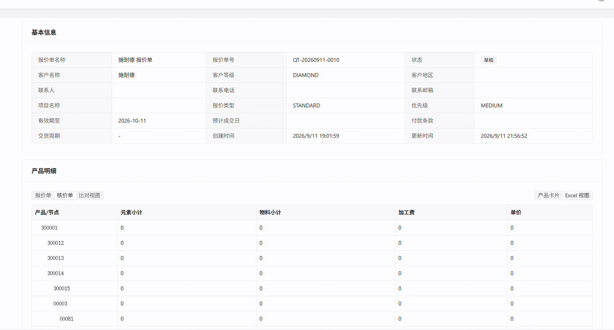

# 核价 Excel 视图四列恒 0 —— 取数源对不上（核价侧不落 `component_data`）

- 立项日期：2026-09-11
- 类型：repair（系统级缺陷，**该功能自引入起从未在核价侧工作过**）
- 返修对象：`task-260712-报价单中的核价单数据展示问题修复`（同一主题：核价侧数据无法正确展示；其根因「核价侧自渲染 vs 报价侧读快照的不对称」正是本缺陷的上游）
- 发现于：`repair-260911-连表公式匹配键宿主侧取不到取数列` 的闸门 B 验收
- 状态：**待 A0 裁决**（① ~ ④ 已写完，⑤⑥ 待用户裁决方案后补）

---

## ① 问题描述

### 用户原话

> 核价侧的EXCEL视图取值不到

### 客观现象

报价单详情页 → 产品明细 → **核价单 → Excel 视图**：`元素小计` / `物料小计` / `加工费` / `单价` **四列全部为 `0`**，按 BOM 树节点逐行列出（`300001` / `300012` / `300013` / `300014` / `300015` / `00003` / `00081`），**无报错、无提示**。



⚠️ **同一张单、同一时刻，核价侧「产品卡片」视图的数是对的**（`00003`=233922.5 / `00081`=5204745 / 小计 5438667.5，`repair-260911` 刚交付并经用户验收）。两个视图**长期打架**。

---

## ② 复现 / 发现方式

| 项 | 值 |
|---|---|
| 发现人 | 用户（在 `repair-260911` 的闸门 B 验收中顺带发现） |
| 环境 | 后端 `8091`（主仓 `-Dquarkus.profile=uat`）/ 前端 `5090` |
| 库 | `10.177.152.12:5432/cpq_db_0910` |
| 报价单 | `QT-20260911-0010`（`405ab315-…`），卡片 `S0001`（`line_item b7066093-…`） |
| 核价模板 | `核价通用1`（`ffae0668-…`，`COSTING`/`PUBLISHED`） |
| 频率 | **必现，且不限于本单** —— 见 ④ 影响面：全库 11 行 / 5 张单 / **3 个不同核价模板**，无一例外 |

### 复现步骤

1. 打开报价单 `QT-20260911-0010` 详情页 → 产品明细
2. 切「核价单」→ 右上角切「Excel 视图」
3. 四列全 `0`；切回「产品卡片」→ 数是对的

### 只读取证

```bash
export PGPASSWORD=joii5231
# 核价 Excel 值：本单四行的非零单元格数
psql -h 10.177.152.12 -U postgres -d cpq_db_0910 -c "
select li.product_part_no_snapshot,
 (select count(*) from jsonb_array_elements(li.costing_excel_values::jsonb->'rows') r, jsonb_each(r) v
   where v.key like 'col_%' and (v.value #>> '{}') not in ('0','')) as 非零单元格
from quotation_line_item li where li.quotation_id='405ab315-3ee6-43e0-8a4d-9837b762ab81';"
```

---

## ③ 需求结果

### 阳性期望

- **E-1** 核价 Excel 视图的 `TAB_JOIN_FORMULA` 列，能取到**核价侧**各页签的总计。
- **E-2** 本单 `S0001` 四列的期望值应等于核价卡片值里对应页签的权威总计（**已实查**）：

  | 列 | 表达式 | 对应页签权威总计 |
  |---|---|---|
  | `col_1` 元素小计 | `[材质元素(总计)]` | **489985** |
  | `col_2` 物料小计 | `[BOM(总计)]` | **5438667.5** |
  | `col_3` 加工费 | `[加工费(总计)]` | **5.8** |
  | `col_4` 单价 | `[核价小计1(总计)]` | **5438673.3** |

  ⚠️ **这四个数是「卡片值里各页签 subtotal」的实查结果，不是我推算的 Excel 应显示值**。
  Excel 每行都引用「(总计)」，**逐行是否应显示同一个总计、还是应按行取值**，属于配置语义问题，A0 时须一并确认 —— 🚫 不要把这张表直接当成 AC 的断言值。

### 阴性 / 反向期望

- **E-3 报价侧 Excel 视图不许回归**：本单报价侧 `quote_excel_values` 现有非零单元格（4 行各 3 个），修复后必须逐位不变。
- **E-4** 真没有数据的页签仍应为 `0`，不得为了「让它有值」而编造回退值。
- **E-5** 不得引入活表穿透：已发布模板的取数仍须走冻结快照（`task-260806` 的不变量）。

---

## ④ 问题原因 / 报告

> 🚩 **本节推翻过我自己两版结论**，过程如实保留在末尾「诊断过程中的两次误判」，因为它们正是这类问题最容易踩的坑。

### 一句话根因：**两个独立根因，互为必要条件，缺一不可**

| # | 根因 | 后果 |
|---|---|---|
| **R1** | `CardEffectiveRows.parse` 把有效行**只按 `componentId:sortOrder` 一个键登记**，而 Excel 列配置的 `tabKey` 是**裸 `componentId`** ⇒ `subtotalOf(tabKey)` 精确查 map 必然 miss | 返回 `null` ⇒ 列值 0 |
| **R2** | `CardEffectiveRows.java:141`/`:148` 用 `.decimalValue()` 读 `subtotal`/`subtotalByColumn`，而库里它们是 **JSON 字符串**（`jsonb_typeof` 实查 = `string`）⇒ Jackson 对 `TextNode` 返回 `BigDecimal.ZERO` | **静默**得 0 |

🚨 **只修 R1 页面仍然全 0**（后端 `B-1` 交付后实测）。隔离实验证明：R1+R2 都修才出真值，且 R2 变体在单键态下仍全 0。

**两条都是「同一改动只落地一半」**：R1 是 `5f1b2d72`（2026-06-19）的双键登记只做在 `ComponentDataEffectiveRows`；R2 是 `fd83cac1`（2026-08-11，task-0810 精度契约）把**写侧改成字符串、读侧没跟着改**。

### 判决性证据：两条路径的键登记不一致

| 求值路径 | 谁走它 | 键登记 | 出处 |
|---|---|---|---|
| `ComponentDataEffectiveRows` | 报价侧 Excel（`effectiveRows == null` 分支，从 `component_data` 现算） | **双键** —— `out.put(cid, tr)`「裸 componentId（Excel 列 tabKey 约定）」+ `out.putIfAbsent(cid + ":" + sort, tr)`「componentId:sortOrder（CardRef 约定）」 | `ComponentDataEffectiveRows.java:235-236`、`:253-254`（**注释原文就写着这两个约定**） |
| `CardEffectiveRows.parse` | **核价 Excel 树**（`buildLineTreeRows` → `parseEffectiveRows(costingCardValues)`） | **单键** —— `String tabKey = cid + ":" + sortOrder; … out.put(tabKey, new TabRows(...))` | `CardEffectiveRows.java:~89` / `:148` |

而 Excel 列配置里的 tabKey 是裸 componentId（实查 `核价通用1` 的 `excel_columns`，四列均为 `a2d0dc3a-…` / `1e41ecb6-…` / `36eb1efb-…` / `203382c5-…`，**无 `:sortOrder` 后缀**）。

取值处是精确 map 查询，无回退：

```java
// CardDataProvider.java:97-101
public BigDecimal subtotalOf(String tabKey) {
    if (effSubtotal != null) return effSubtotal.get(tabKey);   // ← 裸键查 "cid:sort" 键的 map，必然 null
    ...
}
// TabJoinPlanEvaluator.java:307   s = provider.subtotalOf(tabKeyOf.get(tok.alias()));
```

### R2 的证据（后端隔离实验 + 主线实查）

**主线实查库（`costing_card_values` 的 jsonb 类型）**：

```
页签      | subtotal类型 | 值        | subtotalByColumn类型
BOM       | string       | 5438667.5 | object
材质元素  | string       | 489985    | object
加工费    | string       | 5.8       | object
核价小计1 | string       | 5438673.3 | (null)
```

**后端真实数据离线重放**（零 DB 写、零服务）：

```
[PROBE][AS-IS  双键已生效 keys=8] col_1..col_4 = 0E-12（四列仍 0）
[PROBE] raw subtotal node isTextual=true asText=489985     decimalValue()=0
[PROBE][H2-subtotal-as-string-tolerant] col_1=489985 col_2=5438667.5 col_3=5.8 col_4=5438673.3
```

⇒ 逐位等于 AC-1 期望值。**全工程 12 处 `.decimalValue()` 里，只有 `CardEffectiveRows.java:141/:148` 这两处没有 `isNumber()` 守卫，其余 10 处全有。**

📌 同一根因还导致 `[页签.列名(总计)]` 这类**列小计引用**恒 0（`subtotalByColumn` 的值也是字符串）。

### 这个根因能解释全部三个观察（没有一个需要额外假设）

| 观察 | 解释 |
|---|---|
| 核价 Excel 四列全 0 | 卡片值路径单键 ⇒ 裸 tabKey miss |
| 报价 Excel 有值（本单 4 行各 3 个非零） | `component_data` 路径双键 ⇒ 裸 tabKey 命中 |
| **置 NULL 重算后仍全 0**（已实测） | 根因与快照新旧无关，重算多少次都 miss |

### 判决性对照（数据侧）

| | 走哪条路径 | 键登记 | Excel 非零单元格 |
|---|---|---|---|
| **报价侧** `quote_excel_values` | `ComponentDataEffectiveRows` | 双键 | 本单 4 行**各 3 个非零** |
| **核价侧** `costing_excel_values` | `CardEffectiveRows.parse` | 单键 | **全库 11 行 / 5 张单 / 3 个不同核价模板，全部 0** |

⇒ 核价 Excel 视图在这个库里**从来没有算出过任何非 0 值**。

### 引入时间线

| 提交 | 日期 | 关系 |
|---|---|---|
| `761063cb` feat(tabjoin): `ExcelViewService.buildRowData` 接入 TAB_JOIN_FORMULA 列(v2) | — | 功能引入 |
| **`5f1b2d72` fix(excel-view): TAB_JOIN columns render 0 — recompute effective-rows + subtotals from `row_data`** | **2026-06-19** | 🚨 **同一根因的第一次修复**。commit message 原文：「**根因①: Excel 列 tabKey 是裸 componentId, 持久化 CardDataProvider(key=componentId:sortOrder) resolve() 解析不到 -> 明细列取不到行 = 0**」，修法「裸 componentId/componentId:sortOrder **双键登记**」。<br>但双键登记**只做在新写的 `ComponentDataEffectiveRows`**（`component_data` 路径），**`CardEffectiveRows.parse`（卡片值路径）一行未动**。验证也只验报价侧（`GET /quotations/{id}/excel-view` 返 `A=0.0774/B=0/C=0.2245`） |

⇒ **不是回归**，是**同一诊断只落地了一半**，核价侧的同一症状从未被覆盖。
⚠️ 这与刚交付的 `repair-260911`（`431c9df2` 只修树聚合、漏修 `evalCrossTab` 匹配路径）**是同一种失败形态的第二次出现** —— 按 `change-protocol.md §6`，同类根因第 2 次出现应提议升级为规则。

### 影响面

> 🚩 **2026-09-12 更正（主线立项时统计口径错误）**：原文写「全库 11 行 / 5 张单 / 3 个核价模板全部 0」。
> **实查真相**：其余 7 行的核价模板 **`excel_view_config` 为 NULL**（压根没配 Excel 视图组件），其 `costing_excel_values` 是 `{"rows": []}`（**0 行**）—— 那是「没有这个功能」，不是「功能坏了」。
> 我那条 SQL 用「非零单元格数 = 0」当判据，把两类算成了同一类。

**真正受影响**（实查）：

| 单据 | 模板 | Excel 行数 | 状态 |
|---|---|---|---|
| `QT-20260911-0010`（S0001/S0004/S0008/S0012） | `核价通用1`（唯一配了 Excel 组件的核价模板） | 7 / 6 / 6 / 5 | **四列全 0 ← 本缺陷** |
| 其余 7 行（4 张单 / 2 个模板） | `excel_view_config` = NULL | 0 | 未配置该功能，不在范围 |

- **核价 Excel 导出**：走同一份 `costing_excel_values`（**未实测**，按数据源推断）
- **不影响**：核价「产品卡片」视图（`repair-260911` 已验收）；报价侧 Excel（双键路径 + 前端权威写入）

### 为什么测试没拦住

`5f1b2d72` 的验证是「真实端点返回 A/B/C 三个非零值」—— **验的是报价单**。核价侧同一路径**没有任何用例**：既无「核价 Excel 有值」的断言，也无「两条 effective-rows 路径键口径一致」的契约测试。
⇒ 一个只覆盖一半的修复，配一份只覆盖同一半的测试。

### 诊断过程中的两次误判（如实记录）

| 版本 | 我的判断 | 被什么推翻 |
|---|---|---|
| v1 | 「是 `repair-260911` 修好前的旧快照没刷新」 | **实测**：置 NULL 后调生产端点重算（HTTP 200 / 0.70s），四列**仍全 0** |
| v2 | 「核价侧不落 `component_data`，而 Excel 只从该表求和」 | **读代码**：核价 Excel 走的是 `buildLineTreeRows` → `parseEffectiveRows(costingCardValues)`，**读的正是卡片值**；我把 `effectiveRows == null` 那条（报价侧）分支误当成了核价的路径 |

⚠️ v1 的误判导致用户**基于错误前提批准了一次写操作**（置 NULL + 重算，实际无损害，备份在 `scratchpad/backup-costing_excel_values-260911.json`）。
📌 两次误判的共同点：**都是「读了一段代码就推断整条路径」，没有沿调用链走到底**。v3 结论是沿 `buildLineTreeRows → parseEffectiveRows → CardEffectiveRows.parse → CardDataProvider.subtotalOf → TabJoinPlanEvaluator` 全链读出来的，且能解释全部三个观察。

> ⚠️ **v3 仍未做运行时实证**（未改代码验证「加了裸键就出值」）。判据是**代码路径 + 键形态比对 + 三个观察全吻合**。A0 选定方案后，实现方必须先做「先跑红」验证。

---

## ⑤ 修复方案

> 2026-09-11 闸门 A0 用户裁决：**方案甲**。

### 做什么

在 `CardEffectiveRows.parse`（`cpq-backend/.../service/card/CardEffectiveRows.java`）产出 map 时**同时登记两个键**，对齐 `ComponentDataEffectiveRows` 已有的约定：

```java
// 现状（单键）
String tabKey = cid + ":" + sortOrder;
out.put(tabKey, new TabRows(rows, subtotal, byCol));

// 目标（双键，与 ComponentDataEffectiveRows:235-236 同款）
out.put(cid, tr);                              // 裸 componentId —— Excel 列 tabKey 约定
out.putIfAbsent(cid + ":" + sortOrder, tr);    // componentId:sortOrder —— CardRef 约定
```

⚠️ **两个键的优先级要与既有实现逐字一致**：裸键用 `put`、复合键用 `putIfAbsent`。

> 🚩 **2026-09-12 更正**：本行原写「裸键由**先出现的**那个占」—— **写反了**。`put` 是**后者覆盖**，`putIfAbsent` 才是首者胜。
> 后端按**代码形态**（与 `ComponentDataEffectiveRows:235-236` 逐字一致）实现，是对的；契约测试第 4 个用例已把「裸键后者胜 / 复合键首者胜」这个非对称语义钉死在两条路径上。

### 为什么安全（已排查，不是推断）

| 消费点 | 加裸键的影响 |
|---|---|
| `CardDataProvider.fromEffectiveRows:52-58` | 逐 entry 拷贝进三个 map，**不累加** ⇒ 多一组指向同一 `TabRows` 的条目，无重复计数 |
| `CardEffectiveRows.filterByNodeId:169-182` | 遍历后 `put` 进**新建** map，同样不累加 |
| `ExcelViewService` 三个调用点（`:228` / `:263` / `:1097`） | 都只做「按 tabKey 取」，不遍历求和 |

### R2 修法（2026-09-12 追加，用户 A0 裁决「甲：本次一并修」）

`CardEffectiveRows.java:141` / `:148` 读 `subtotal` / `subtotalByColumn` 时改为**数字与字符串都能读**：

```java
// 现状：TextNode 上 decimalValue() 静默返回 ZERO
BigDecimal subtotal = tab.path("subtotal").decimalValue();

// 目标：与全工程其余 10 处 .decimalValue() 同款守卫
JsonNode n = tab.path("subtotal");
BigDecimal subtotal = n.isNumber() ? n.decimalValue()
                    : (n.isTextual() && !n.asText().isBlank() ? new BigDecimal(n.asText()) : BigDecimal.ZERO);
```

- ⚠️ 写侧（`CardSnapshotService` 的 `PrecisionPolicy.toPlainDecimalString`）**不动** —— task-0810 的精度契约是「字符串承载十进制」，本次是把读侧补齐到该契约，不是推翻它
- ⚠️ 空串 / 非法数字要落 `ZERO` 而不是抛异常（这条路径此前从不抛，不许改变异常语义）
- 📌 `subtotalByColumn` 里每个列值同样是字符串，一并处理

### 配套（防再漏一半）

加一条**契约测试**：断言 `CardEffectiveRows.parse` 与 `ComponentDataEffectiveRows.compute` 对同一份输入产出的**键集合口径一致**（都含裸键与复合键）。
> 本缺陷与 `repair-260911` 是同一种失败形态的第二次出现（同一诊断只落地一半），这条测试是唯一能在下次拦住它的东西。

### 交付收尾：存量刷新（2026-09-12 用户裁决「甲」，**由主线执行，不派子代理**）

🚨 **代码修好后页面仍会是 0**，必须刷存量。实测依据（测试工程师 Playwright 抓全量请求）：

- 页面数据源**只有** `GET /quotations/{id}`，其 `costingExcelValues` 与库里存量**深度相等**（7 行逐字段一致）⇒ **页面读落库快照，不实时算**
- `ensure-excel-values` 的谓词是 `costing_excel_values IS NULL`，本单 4 行**非 NULL** ⇒ **不会自愈**
- `saveDraft` 的 `invalidateCardValues` 只置 `*_card_values` 为 NULL，**不碰 `*_excel_values`** ⇒ 编辑也不会触发

**执行步骤**（主线在亲验通过后、合并前做，走 `CLAUDE.md` §3.2 三步前置）：

1. 先 `SELECT count(*)` 确认命中面 = **4**（`WHERE quotation_id='405ab315-…' AND costing_excel_values IS NOT NULL`）
2. 导出这 4 行现值到 scratchpad 备份（可原样写回）
3. `UPDATE … SET costing_excel_values = NULL WHERE quotation_id='405ab315-…' AND costing_excel_values IS NOT NULL`
4. 调**生产端点** `POST /api/cpq/quotations/{id}/ensure-excel-values` 重算（🚫 不手工造数据）
5. 验证四列 = AC-1 期望值

⚠️ **机制缺陷单独登记，不在本次修**：Excel 值没有任何失效触发点、`ensureExcelValues` 无 `forceRecomputeAll` ⇒ **任何计算修复都传导不到已算过的 Excel 快照**。这是结构性问题，加 force 的触发时机要单独想清楚（Excel 值重算比卡片值贵）。

### 不做

- 🚫 不改 `CardDataProvider.subtotalOf` 的「精确命中、不做 sortOrder 回退」语义（已否决方案乙 —— 那是刻意设计，且同组件多实例时有歧义）
- 🚫 不改任何模板的 `excel_columns` 配置（已否决方案丙 —— 治标，新建模板还会再犯）
- 🚫 不改 Excel 列的表达式语义（见 ⑥ 的「已知语义」）

> 已否决备选：**乙**（取值侧加裸键回退）—— 推翻 `CardDataProvider` 刻意的「不回退」设计，同 componentId 多实例时有歧义；**丙**（改模板配置 tabKey）—— 3 个核价模板要逐个改，新建模板还会再犯，且涉及已发布模板冻结。

---

## ⑥ 验收标准

> 环境：后端 `8091`（uat）/ 前端 `5090` / 库 `cpq_db_0910`。**以下引用的每个数字都已实查**（`costing_card_values` 各页签 `subtotal`）。

### 🚨 已知语义（不是缺陷，验收前必须先认它）

Excel 四列的表达式都是 `[页签(总计)]`，而 `filterByNodeId` **原样保留 `subtotal` 不按节点重算** ⇒ **修好后，每一行（每个 BOM 节点）显示的都是同一个整页签总计**。

这是配置表达式的必然结果，引擎忠实计算。若业务上希望「按节点取值」，那是**另一个配置问题**（要把表达式从 `(总计)` 改成明细引用），🚫 不在本次范围，也不要为此在引擎里加特例。

### 阳性

> ⚠️ **AC-1 需要 R1 + R2 两个根因都修才可能达成**（实测只修 R1 仍全 0）。


- **AC-1**（单点）打开 `QT-20260911-0010` 详情页 → 产品明细 → 核价单 → Excel 视图，卡片 `S0001` 的每一行四列显示：

  | 列 | 表达式 | 期望值 |
  |---|---|---|
  | 元素小计 | `[材质元素(总计)]` | **489985** |
  | 物料小计 | `[BOM(总计)]` | **5438667.5** |
  | 加工费 | `[加工费(总计)]` | **5.8** |
  | 单价 | `[核价小计1(总计)]` | **5438673.3** |

- **~~AC-2~~ 🚫 作废（2026-09-12，用户裁决）** —— 原文要求用 `QT-20260911-0009` 做跨模板验证，但该单的核价模板 `c9a2afb4` 的 **`excel_view_config` 为 NULL**，其 `costing_excel_values` 是 `{"rows": []}`（0 行），根本不渲染 Excel 视图。
  **全库只有 2 个模板配了 Excel 组件**（`施耐德1` 报价侧 / `核价通用1` 核价侧）⇒ **核价侧的「跨模板样本」不存在**，9134.85 那组数字任何代码改动都渲染不出来。
  **归因**：主线写 AC 时把「模板没配 Excel 视图」误统计成了「四列全 0」（见 ④ 影响面的更正）。

### 阴性 / 无副作用

- **AC-3**（报价侧零回归）**判据口径 2026-09-12 修订**：断言对象是**库里已落盘的** `quote_excel_values` —— 本单 4 行现有非零单元格（**各 3 个**）在整个开发与验收过程中**逐位不变**（数值等价比对无差异）。
  ⚠️ **不再断言「后端 bootstrap 路径产出不变」** —— 修 R2 后该路径产出必然从 `0` 变成真值（`72903.41 / 437420.46 / 437420.60`），那是**修复生效的正确表现**，不是回归。
  📌 该路径只在「从未 `saveDraft` 的新行」上跑（`CardSnapshotService:1169`：报价侧 Excel 值前端权威）；库里现存的 `33903.41 / 203420.46 / 203420.60` 是前端写入的既有值，本次不动它。
  ⚠️ **比对方法**：用「键集合一致 + 叶子数值等价」，🚫 **不要逐字节 diff** —— 实测仅打开编辑页（autosave）就会把叶子 number 归一成 string（`1`→`"1"`），数值不变；且比对器本身要做一次变异实验证明有鉴别力。
  > ⚠️ **不要用逐字节 diff** —— 实测仅打开编辑页（autosave）就会把叶子 number 归一成 string（`1`→`"1"`），数值不变。用「键集合一致 + 叶子数值等价」的比对器，并对比对器本身做变异实验。
- **AC-4**（不引入活表穿透）已发布模板的取数仍走冻结快照，`loadFrozenComponentMetaMap` 的 `TemplateNotFrozenException` 语义不变（`task-260806` 不变量）。
- **AC-5**（契约测试）新增用例断言 `CardEffectiveRows.parse` 与 `ComponentDataEffectiveRows.compute` 的**键集合口径一致**（同一 componentId 既能用裸键取到、也能用 `cid:sortOrder` 取到，且两者指向同一 `TabRows`）。
- **AC-6**（既有测试面）后端 `CardEffectiveRows*` / `ComponentDataEffectiveRows*` / `ExcelView*` / `TabJoin*` 相关测试全绿；前端 `tsc` 与单测不受影响（本次预期**零前端改动**，若有改动须说明理由）。

### 还原实验（必做）

- **AC-7**（2026-09-12 同步为**双向 2×2 矩阵**，与 `backtask.md` B-4 一致）两个根因**各自单独还原都必须跑红**：

  | 配置 | 期望 |
  |---|---|
  | R1=修 · R2=还原 | 四列回 `0` + 契约测试红 |
  | R1=还原 · R2=修 | 四列回 `0` |
  | R1=还原 · R2=还原 | 四列回 `0` |
  | **R1=修 · R2=修** | **四列 = AC-1 期望值，全绿** |

  🚫 直接就绿的用例没有鉴别力，打回重写。
  ⚠️ **契约测试的夹具必须是生产形态**（`subtotal` 为字符串、tab 内无 `sortOrder`）—— 否则「只还原 R2」时它会全绿（实测：改夹具前 0 失败，改后 3 失败）。

### 自检证据

- **AC-8** 交付时附一行「已自检」：后端相关测试类结果 · dev server 存活探测（前端 200 / 后端 401）· AC-1 与 AC-2 的页面截图或接口原始响应 · 报价侧比对结果。
