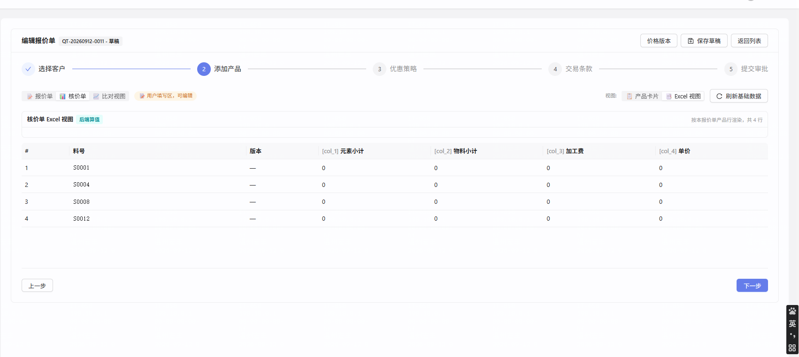
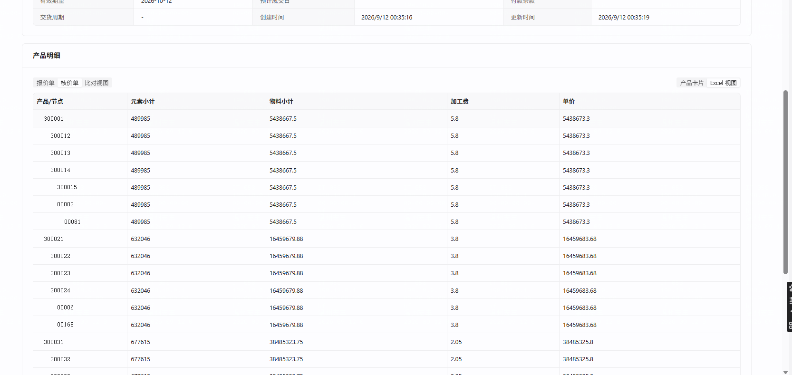

# 核价 Excel 视图：详情页形态不对 + 编辑页取数走错路径

- 立项日期：2026-09-12
- 类型：repair（**闸门 B 未通过的返修**）
- 返修对象：`repair-260911-核价Excel视图取数源对不上`（同主任务 `task-260712` 下平铺）
- 状态：**待 A0 裁决**（① ~ ④ 已写完）

---

## ① 问题描述

### 用户原话

> 这是我建的新单子：报价单编辑页 / 报价单详情页（附两张截图）

追问形态时的裁决原话：

> **详情页数据也不正常，暂时不要展示成树状，详情让用户在卡片中看**
> （编辑页形态）**保持现状：每个产品一行，只把数字填对**

### 客观现象（新单 `QT-20260912-0011`）

| 页面 | 现象 |
|---|---|
| **编辑页** → 核价单 → Excel 视图 | 4 行（每产品一行），**四列全 `0`**；标注「后端算值」「按本报价单产品行渲染，共 4 行」 |
| **详情页** → 产品明细 → 核价单 → Excel 视图 | **按 BOM 节点树状展开**（S0001 展成 7 行），四列**有值但每行重复同一个整页签总计** |




⇒ **两个页面对同一份数据给出两种完全不同的呈现，且都不是用户要的。**

---

## ② 复现 / 发现方式

| 项 | 值 |
|---|---|
| 发现人 | 用户（在 `repair-260911-核价Excel视图取数源对不上` 的闸门 B 验收中，自己新建单据验证） |
| 环境 | 后端 `8091`（uat）/ 前端 `5090` / 库 `cpq_db_0910` |
| 单据 | `QT-20260912-0011`（`658ad486-dabe-4770-a851-73e4005ce66f`），创建于 2026-09-12 00:35 |
| 频率 | **必现**（新建单据即如此，不是存量数据问题） |

### 只读取证

```bash
# 编辑页实际调的端点：4 行、四列全 0、无 __nodeId
curl -s -b <cookie> "http://localhost:8091/api/cpq/quotations/658ad486-…/excel-view?templateId=ffae0668-…"

# 库里落的是树形 7 行、有值（详情页读它）
psql -d cpq_db_0910 -c "select li.product_part_no_snapshot,
  jsonb_array_length(li.costing_excel_values::jsonb->'rows') 行数,
  li.costing_excel_values::jsonb->>'treeMode' treeMode
  from quotation_line_item li join quotation q on q.id=li.quotation_id
  where q.quotation_number='QT-20260912-0011';"
```

---

## ③ 需求结果

### 用户裁决的目标形态

**核价 Excel 视图 = 每个产品一行，四列显示该产品各页签的总计。两个页面一致。**

- **E-1** **编辑页**：仍是「每个产品一行」（4 行，形态不变），但四列显示正确的总计值。
- **E-2** **详情页**：**不再按 BOM 节点树状展开**，改为与编辑页一致的「每个产品一行」。
- **E-3** 要看行级明细，用户去**产品卡片视图**看（Excel 视图只给总计），这是用户明确的产品决策。

### 阴性 / 反向期望

- **E-4** **报价侧 Excel 视图不许受影响**（形态与数值都不变）—— `getExcelView` 与 `buildExcelValues` 都是报价/核价共用。
- **E-5** 核价**产品卡片视图**不许受影响（`repair-260911-连表公式…` 刚验收的成果）。
- **E-6** 真没有数据的页签仍显示 `0`，不得编造回退值。

---

## ④ 问题原因 / 报告

### 两个独立问题

| # | 问题 | 性质 |
|---|---|---|
| **P1** | **编辑页四列全 0** | 缺陷 —— 走了第三条路径，取数源里核价侧根本没有数据 |
| **P2** | **详情页展示成 BOM 树状** | **不是缺陷，是形态选择错了** —— `costingTree=true` 是既有设计（`P2-B 核价 Excel 树`），但用户判定不要 |

### P1 根因（已实证）

核价 Excel 有**三条**渲染路径，本次返修前只修好了其中一条：

| 路径 | 入口 | 取数源 | 状态 |
|---|---|---|---|
| A | 详情页 → `buildLineTreeRows(li, tpl, cust, **cardValuesJson**)` | `costing_card_values` | ✅ `repair-260911` 已修（双键 + 字符串读） |
| B | 落库 → `buildExcelValues(4 参)` → `buildLineRowData(li, tpl, cust, **cardValuesJson**)` | `costing_card_values` | ✅ 同上（**且本来就是「每产品一行」**） |
| **C** | **编辑页** → `getExcelView` → `buildRowData(li, columns, tpl, formulaByName, customerId)` **5 参重载，不传 `effectiveRows`** | ⇒ `effectiveRows == null` 分支 ⇒ `buildTabJoinEffectiveRows` ⇒ **`quotation_line_component_data`** | ❌ **核价侧从不往该表落数据**（核价是自渲染）⇒ tabKey 一个都命不中 ⇒ 四列恒 0 |

**判决性证据**（主线实测）：

```
GET /quotations/658ad486-…/excel-view?templateId=ffae0668-…
→ 行数 = 4
  {'col_1': '0', 'col_2': '0', 'col_3': '0', 'col_4': '0'}   × 4
  （且返回体里没有 __nodeId / __hfPartNo —— 与详情页的树形 7 行是两套东西）
```

代码位置：`ExcelViewService.getExcelView:160` `buildRowData(li, columns, templateId, formulaByName, quotationCustomerId)` —— 第 6 参 `effectiveRows` 缺省为 `null`。

📌 **这正是我在 `repair-260911` 诊断中一度提出、又被自己推翻的那个假设** —— 它在**详情页路径上是错的**（详情页走 A，读卡片值），但**在编辑页路径上完全成立**。当时我把 A 的结论推广到了全部路径。

### P2 的来源（不是 bug）

`CardSnapshotService:1225 / 1406 / 2099` 三处调用 `buildExcelValues(managed, costingTpl, customerId, costingCardValues, **true**)`，`costingTree=true` ⇒ 走 `buildLineTreeRows` 按 BOM spine 逐节点出 N 行，并写 `treeMode: true`。

而四列表达式都是 `[页签(总计)]`、`filterByNodeId` 原样保留 `subtotal` ⇒ **每个节点行显示的都是同一个整页签总计**。

⇒ 展开成 7 行却每行一样，是「树形展开」与「总计表达式」两个设计叠加的必然结果。**用户判定：不要树形。**

### 影响面

- **P1**：所有核价模板配了 Excel 组件的报价单，**编辑页** Excel 视图恒 0（实测新建单据即如此）
- **P2**：所有核价 Excel 视图的**详情页**与**落库数据**（`treeMode: true` + N 行）
- **不影响**：报价侧（走同样代码但有 `component_data`，且不走 `costingTree`）；核价产品卡片视图

### 为什么上一轮没发现

`repair-260911` 的 **AC-1 只写了「打开详情页 → 产品明细 → 核价单 → Excel 视图」**，编辑页一个字没提；形态问题则被我在文档里当成「已知语义（不是缺陷）」主动排除了。

🚩 **这是主线 AC 覆盖缺口的同型第二次**：上一个任务（连表公式）漏了 Excel 视图这个消费方，这次漏了同一视图的另一个入口 + 没有把「形态是否符合预期」列入验收。
**共同点**：影响面分析只问「哪个数据被改了」，没问「**这个数据有几个入口在消费、用户期望的呈现是什么**」。

---

## ⑤ 修复方案

> 2026-09-12 闸门 A0 用户裁决：**方案甲 —— 两处都切到「每产品一行 + 取卡片值」**。

### 核心事实：目标形态的路径**仓库里已经存在，而且已经是好的**

`buildExcelValues(li, tpl, cust, cardValuesJson)`（4 参重载）→ `ExcelViewService.buildLineRowData(li, tpl, cust, **cardValuesJson**)`：
**每个 line item 出一行**，且**传了卡片值** ⇒ 走 `parseEffectiveRows` → `CardEffectiveRows.parse`（`repair-260911` 已修双键 + 字符串读）。

⇒ 本次不是新写渲染逻辑，是**把另外两条路径切到它上面**。

### 改动两处

| # | 改哪 | 怎么改 |
|---|---|---|
| **① 详情页 / 落库形态** | `CardSnapshotService` 三处调用点（`:1225` / `:1406` / `:2099`） | `buildExcelValues(managed, costingTpl, customerId, costingCardValues, **true**)` 的 `costingTree` 改为 **`false`** ⇒ 走 4 参重载 ⇒ 每产品一行 + 取卡片值，`treeMode` 键不再写入 |
| **② 编辑页** | `ExcelViewService.getExcelView:160` | `buildRowData(li, columns, templateId, formulaByName, quotationCustomerId)` ⇒ **核价侧**改为传入该行的 `costingCardValues` 作为 `effectiveRows` 来源（走 6 参重载 / 或与 `buildLineRowData` 统一），**报价侧行为逐位不变** |

### 边界

- 🚫 **不删 `buildLineTreeRows`** —— 切掉后它没有生产调用方了，但**保留并标注「暂不使用」**（用户可能改主意要树形；删代码是另一个决定）
- 🚫 **不改 `CardEffectiveRows`**（`repair-260911` 刚交付，本次不动）
- 🚫 **不改列表达式语义**（四列仍是 `[页签(总计)]`）
- ⚠️ `getExcelView` 是**报价 / 核价共用端点**：核价分支的改动必须做到报价侧**逐位不变**

### 存量处置（用户裁决：交付时统一刷一次）

切成非树后，存量 `costing_excel_values` 仍是老的 `{rows: N, treeMode: true}`，**不会自愈**（`ensure-excel-values` 只补 `IS NULL`）。
交付时由**主线**执行一次刷新（§3.2 三步前置）：命中面确认 → 备份 → 置 NULL → 走生产端点 `ensure-excel-values` 重算。涉及 `QT-20260911-0010` 与 `QT-20260912-0011` 两张单共 8 行。

> 已否决备选：**乙**（只修编辑页、详情页保留树形）—— 不满足「不要树状」的裁决，两页面继续不一致；**丙**（前端改成读快照）—— 快照本身就是树形，读了还是树。

---

## ⑥ 验收标准

> 环境：后端 `8091`（uat）/ 前端 `5090` / 库 `cpq_db_0910`。**下表每个数字都已实查**（`costing_card_values` 各页签 `subtotal`）。

### 目标形态（两个页面必须一致）

**每个产品一行，四列 = 该产品对应页签的总计。**

| 卡片 | 元素小计 | 物料小计 | 加工费 | 单价 |
|---|---|---|---|---|
| S0001 | **489985** | **5438667.5** | **5.8** | **5438673.3** |
| S0004 | **632046** | **16459679.88** | **3.8** | **16459683.68** |
| S0008 | **677615** | **38485323.75** | **2.05** | **38485325.8** |
| S0012 | **641025** | **34249252.5** | **4.7** | **34249257.2** |

### 阳性

- **AC-1**（编辑页）打开 `QT-20260912-0011` 编辑页 → Step2 → 核价单 → Excel 视图：**4 行**，四列逐格等于上表。
- **AC-2**（详情页）同一张单详情页 → 产品明细 → 核价单 → Excel 视图：**同样 4 行、同样的值**，**不再出现 BOM 节点行**（页面上不得出现 `300012` / `00081` 这类子件料号作为独立行）。
- **AC-3**（落库形态）刷新后 `costing_excel_values` 每个 line item **`rows` 长度 = 1**，且**不再含 `treeMode` 键**。

### 阴性 / 无副作用

- **AC-4**（报价侧零回归）报价侧 Excel 视图**形态与数值都不变**：本单报价侧 `quote_excel_values` 落库值逐位不变；`GET /excel-view`（报价模板）返回的行数与列值改动前后逐位相同。
  ⚠️ 比对用「键集合一致 + 叶子数值等价」，🚫 不用逐字节 diff；比对器本身要做变异实验。
- **AC-5**（核价卡片视图零回归）核价「产品卡片」视图不受影响：`S0001` BOM 页签仍为 `00003`=233922.5 / `00081`=5204745、小计 5438667.5（`repair-260911-连表公式…` 的成果）。
- **AC-6**（真无数据仍为 0）某页签卡片总计确为 0 时，对应列仍显示 `0`，不得编造回退值。
- **AC-7**（不删代码）`buildLineTreeRows` 仍在，且带「暂不使用」注释；不得顺手删除。

### 还原实验（必做）

- **AC-8** ① 把 `costingTree` 改回 `true` → 详情页/落库回到树形 N 行 ⇒ AC-2/AC-3 必须红；② 把 `getExcelView` 的卡片值传参撤掉 → 编辑页回到四列全 0 ⇒ AC-1 必须红。**两个方向各自都要能跑红。**
  🚫 直接就绿的用例没有鉴别力，打回重写。

### 自检证据

- **AC-9** 交付时附「已自检」一行：后端相关测试类结果 · dev server 探活（前端 200 / 后端 401）· AC-1 与 AC-2 的页面截图 · 报价侧比对结果。
