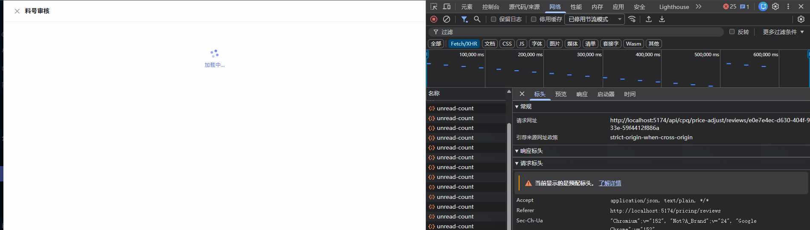
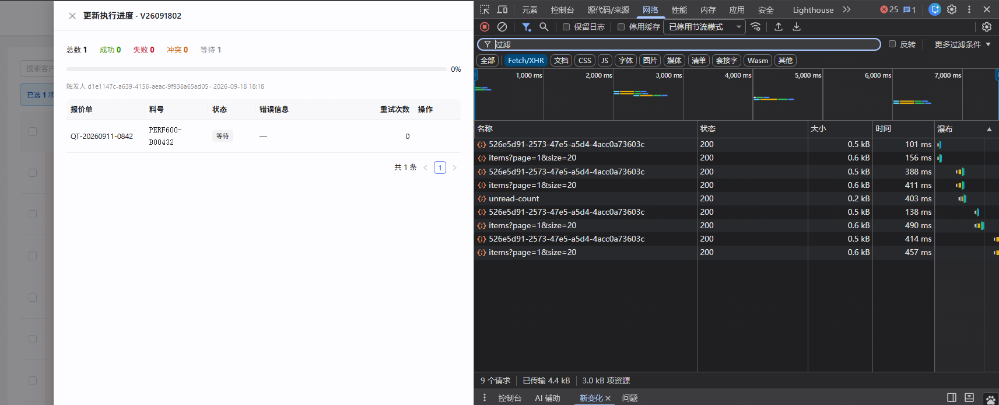

# 问题说明 · 大单升版超时（审核抽屉打不开 / 更新任务失败）+ 涨跌率小幅变动显示 +0%

> **返修对象**：`task-260729-客户价格调整策略和价格版本`（通道 B 审核与升版链路 + 版本明细/元素矩阵/审核抽屉的涨跌列）
> **路径**：A 标准档（用户 2026-09-18 确认；问题 1 由用户裁决并入本任务）
> **状态**：立项 —— 闸门 A0 已过；2026-09-18 采纳会话 cpq-76 评审方案 A 修订为 v2（裁决见 ⑤ D-5 ~ D-7），**待闸门 A**

---

## ① 问题描述

### 用户原话（2026-09-18）

> 1. 价格调整前和调整后的调整金额查了1元,调整比例0%
> 2. 料号审核页面打开超时报错
> 3. 点击通过并升版后,无线循环调用: /api/cpq/price-adjust/jobs/526e5d91-2573-47e5-a5d4-4acc0a73603c,永远停留在这个页面

### 现象截图

**现象 1**：版本明细 · V26091802，银本期价 28893.5、上期价 28892.5，差 1 元，「涨跌」列显示 `+0%`。


**现象 2**：「料号审核」抽屉一直「加载中…」，请求 `GET /api/cpq/price-adjust/reviews/e0e7e4ec-d630-404f-933e-59f4412f886a` 挂起，最终前端报超时。



**现象 3**：点「通过并升版」后进入「更新执行进度 · V26091802」，总数 1 / 成功 0 / 失败 0 / 冲突 0 / **等待 1**、进度 0%，前端每 2 秒轮询一次 `GET /api/cpq/price-adjust/jobs/526e5d91-…`。



---

## ② 复现 / 发现方式

- **发现者**：用户在共享开发环境（前端 5174 → 后端 8081 → 库 `cpq_db_0724`）手工操作发现，2026-09-18 18:07~18:19。
- **前置数据**：
  - 客户 `CUST-0004`，调价策略参与元素只有银（Ag）；手工「立即生成」得到版本 `V26091802`（18:06:35 生成，同时作废 `V26091801`）。
  - 待审核料号 `PERF600-B00432`（review `e0e7e4ec-…`），它的**判断依据单**是 `QT-20260911-0842`（DRAFT，**1200 个产品行**，性能测试造的大单）。
- **操作步骤**：
  1. 定价管理 → 价格调整策略 → 版本轨迹 → 点 `V26091802` 看版本明细 → 看到现象 1（**必现**）。
  2. 价格调整审核 → 点料号 `PERF600-B00432` 打开审核抽屉 → 约 60 秒后报超时（**依据单是大单时必现**）。
  3. 对同一料号点「通过并升版」→ 进度抽屉停在「等待 1 / 0%」约 60 秒 → 任务结束为**失败**（**依据单是大单时必现**）。
- **频率与触发条件**：问题 2、3 只在**判断依据单 / 被更新的报价单行数很多**时出现。本库现有 3 张 ≥ 300 行的单，全在 `CUST-0004` 名下：`QT-20260908-0628`（1845 行）、`QT-20260909-0629`（1845 行）、`QT-20260911-0842`（1200 行）。

---

## ③ 需求结果（期望行为）

| 编号 | 期望 | 对照 |
|---|---|---|
| E-1 | 元素价格有变动时，「涨跌」列不得显示成 `0%` / `+0%` —— 小幅变动也要看得出幅度（显示口径见 ⑤ D-3） | 父任务 验收 #3（元素矩阵涨跌幅）、§11.5.2 审核抽屉「涨跌」列 |
| E-2 | 依据单是 1200 行 / 1845 行的大单时，料号审核抽屉能在前端超时之前打开，并显示「调整后小计」（不降级成「未试算」） | 父任务 §11.5.2 三段结构、验收 #22「审核页预算值与实际重算逐位一致」 |
| E-3 | 对大单上的料号点「通过并升版」，更新任务能**成功**完成，报价单该行按本版价重算 | 父任务 验收 #14、#15 |
| E-4 | 更新任务执行期间，进度抽屉能看出「正在执行」（而不是一直显示「等待 / 0%」）；真失败时错误信息是人能看懂的原因，不是 `Error invoking subclass method` | 父任务 验收 #52「更新失败可找回」、裁决 19「进度 + 部分成功可重试」 |
| E-5 | 生成新版后的预算试算不能因为大单把料号**静默漏出待办池**（现状：试算超时的料号既不进池也不推进版本，只在后台日志里报错） | 父任务 B4.4「单料号预算失败不连累同版其他料号」、裁决 22 |
| E-6 | 服务重启或执行入口异常后，更新任务**不得永久停在「执行中」**（前端会永久轮询）：未完成的明细变成可重试的「失败」，已成功的明细在版本记录里有据可查；「批量重试」能重跑失败明细（2026-09-18 评审补入，D-5） | 父任务 验收 #52、§3.4「批量重试 FAILED + CONFLICT」 |
| E-7 | 预算被打断后能**续跑**，已处理的料号不重复试算，没处理到的料号最终都进入待办池或推进版本；已作废版本名下不再残留「待处理」审核（2026-09-18 评审补入，D-5） | 父任务 B4.4、验收 #7 |
| **反-1** | 🔒 `R` 版本快照（初版定型 / 本期 R）的内容**不得变少**：仍是「全部产品行 × 全部页签 × 全部行」的整单双侧快照，切版预览照样能看到完整原貌 | 父任务 §11.7.0、验收 #53、#55 |
| **反-2** | 🔒 升版的**隔离性**不变：只重算被通过料号的那一行，其它行逐字节不动；审核页预算值与实际升版结果**仍逐位一致** | 父任务 验收 #14、#15、#22 |
| **反-3** | 🔒 真失败 / 真冲突仍要报出来 —— 不许为了「不失败」把异常吞掉标成功，也不许把超时拉长到无限 | 父任务 验收 #16、#52 |
| **反-4** | 🔒 小单（如 12 行的 `QT-20260913-0860`）的现有行为与耗时不回退 | — |

---

## ④ 问题原因

### 问题 1：涨跌率小幅变动显示 `+0%` —— 不是算错，是位数截断

**一句话**：1 ÷ 28892.5 ≈ **0.0035%**，页面把涨跌率换算成百分比后**只保留 1 位小数**，舍成 0；前面的「+」是因为后端存的值确实大于 0。

**证据链（可复跑）**：

```sql
-- 库里存的涨跌率 = 0.000035（6 位小数）
SELECT v.version_no, i.element_code, i.current_price, i.previous_price, i.change_rate
  FROM element_price_version_item i JOIN element_price_version v ON v.id = i.version_id
 WHERE v.customer_no = 'CUST-0004' AND v.version_no IN ('V26091801','V26091802');
-- V26091802 | Ag | 28893.500000000000 | 28892.500000000000 | 0.000035000000
```

- 前端三处各写了一份同样的格式化（`rate × 100` → 保留 1 位 → 去尾零）：
  版本明细 `cpq-frontend/src/pages/pricing/price-adjust/VersionTrailPanel.tsx:22`、
  元素矩阵（最近 10 版）`.../price-adjust/ElementMatrix.tsx:18`、
  料号审核抽屉 `.../price-adjust-review/ReviewDetailDrawer.tsx:33`。
  `0.000035 × 100 = 0.0035` → 保留 1 位 = `0.0` → 去尾零 = `0` → 值为正加 `+` → **`+0%`**。
- 后端算涨跌率时只留 **6 位小数**（`PriceAdjustVersionGenerationService.java:176-177`，`divide(previousPrice, 6, HALF_UP)`），折成百分比只剩 4 位。
  **隐患**：元素单价自 `task-260916` 起支持 9 位小数，银价 2.9 万量级时，变动小于约 0.015 元，涨跌率会被**存成 0**，页面显示 `0%`、连正负号和颜色都没有 —— 看起来像「没变」。

**引入时间线**：后端 6 位来自 `c94e10d4`（2026-08-02，task-0729 B3）；前端 1 位来自 `fd83cac1`（2026-08-11，task-0810 精度契约）。此前测试数据的涨跌幅都是百分之几的量级，1 位小数够用，所以没暴露。

**为什么测试没拦住**：父任务验收 #3 只断言「有涨跌幅、涨红跌绿」，没有「变动很小时仍可辨」的边界用例。

---

### 问题 2 + 3：同一个根因 —— 对大单「升版」一行，一次要跑满 60 秒，被事务超时强行中止

**一句话**：升版某个料号时，系统要给这张报价单**整单拍两次快照**（升版前的「初版」原貌 + 升版后的「本期」），拍快照时**一行一行地查库**。1200 行的单就是 2 × 1200 = **2400 次查询**，加上其它要扫整张单的步骤，一次升版约 48 秒；和后台同时在跑的预算试算一抢资源，就超过 60 秒的事务上限被中止。审核抽屉打开时会**当场试算**一次升版，「通过」后的更新任务会**真做**一次升版 —— 两处踩的是同一个坑。

**证据链（可复跑）**：

1. **逐行查询的位置**：`MaterialVersionUpgradeService.buildWholeQuotationSnapshot`（`cpq-backend/.../priceadjust/service/MaterialVersionUpgradeService.java:1020-1041`）先取整单全部产品行，再在循环里对每一行执行
   `SELECT component_id, snapshot_rows FROM quotation_line_component_data WHERE line_item_id = :lid`。
   它被 `upgrade()` 调两次：`:318 materializeAndSealInitialRevision`（初版定型）与 `:425 updateCurrentPeriodRevision`（本期 R）。
   - 试算（dryRun）整体回滚，所以「初版定型」**每次试算都重做一遍**（库里 `QT-20260911-0842` 的 `quotation_price_revision` 至今 0 行）。
   - `upgrade()` 里还有一处整单扫描：S8 `QuotationLineItem.list("quotationId", q.id)`（`:386`，整单实体全量载入再求和；0629 实测 3.2 s）。紧随其后的 `recomputeDraftHeaderTotals(q.id)`（`:419`）**不是**整单扫描 —— 它本来就是一条 `SUM`（`CardSnapshotService.java:1097`，2026-09-18 评审更正）。本单没有 QUOTE_CARD 冻结结构，每次试算还会触发 `ensureStructure` 补建（随回滚作废，下次再建）。
2. **单次查询耗时**：对该单前 200 行逐行执行上述 SQL，墙钟 **3.10 s**，平均 **14.9 ms/次**（库在 `10.177.152.12`，跨网络）。⇒ 2400 次 ≈ **36 s**（**推算**，未加计时埋点逐段实测）。
3. **耗时与单子大小成正比**（8081 日志，摘录见 `证据/8081日志摘录-260918-1800至1825.log`）：
   - 12 行的 `QT-20260913-0860`：一次试算升版约 **2.3 s** 完成（18:10:26.8 → 18:10:29.1）。
   - 1200 行的 `QT-20260911-0842`：初版定型前后两段分别约 **21 s**（18:13:48.2 补建结构 → 18:14:09.5 初版定型）与 **26 s**（→ 18:14:35.9 本期 R），合计约 48 s；在资源争抢下多次超过 60 s 被中止。
   - 1845 行的两张单：每次都跑满 60 s 后失败。
4. **问题 2 的时间线**：`18:17:47.55` 审核抽屉请求进后端（`[perf] review-detail N=1 sql=2`）→ 进入当场试算（`PriceAdjustReviewService.detail` → `safeDryRunAdjustedSubtotal`，`:241`）→ `18:18:47.63` 试算被事务超时中止，后端降级为「未试算」再返回。
   前端请求超时同为 **60 秒**（`cpq-frontend/src/services/api.ts:8`），**先一步**报错 ⇒ 用户看到的是「打开超时报错」。
5. **问题 3 的时间线**：`18:18:47.48` 点「通过」建任务（后端先同步推进版本指针、再异步执行）→ `18:18:47.71` 开始执行 → 升版同样跑满 60 s，`18:19:47.80` 被中止 → `18:19:47.87` 任务结束，状态 **FAILED**，明细错误信息只有 `Error invoking subclass method`（异常外壳，真正原因是事务已被超时回收）。
   - 执行期间明细状态一直是「等待」、进度 0%：更新「执行中」和写结果在同一个事务里，事务没提交之前外面看不到任何变化。
   - 截图时刻 18:19:09 正处在这 60 秒里。按前端代码（`JobProgressDrawer.tsx:79-86`），任务状态离开 RUNNING 后轮询即停；现在调接口返回的也确是 `status=FAILED`。**18:19:47 之后是否仍在轮询，主线未复现**，若用户确实看到了，属另一个前端问题，需另查。
   - **数据现状**：「通过」时已把 `PERF600-B00432` 的版本指针推到 `V26091802`（设计如此：个别单失败不回退指针，父任务 §11.6.3.2），但报价单该行**还是旧价**；此时点「重试」会以同样方式再失败。
6. **排除锁等待**：执行期间采样 `pg_stat_activity`，相关会话状态为 `idle in transaction / ClientRead`（数据库在等 Java 端发下一条语句），不是锁等待 ⇒ 时间花在应用侧的往返与处理上。

**连带影响（同根因）**：

- **料号静默漏出待办池**：版本生成后，预算试算按料号逐个跑（`PriceAdjustBudgetService.onVersionGenerated`，本客户 4558 个料号）。落在上述 3 张大单里的料号，每个都跑满 60 s 后失败 → 该料号**既不进待办池、也不推进版本指针**，只在日志里报「处理失败」。截至 18:25，两个版本合计已失败 32 个。
- **被作废的旧版预算还在跑**：`V26091801` 在 18:06:35 已被作废，但它的预算循环没有停（循环里不检查版本是否已作废），和新版的循环一起占着 8081 与数据库，拖慢所有页面，预计持续数小时；作废后它又往待办池里加了 13 条点不了的「待处理」审核（19:00 实查）。
- **预算没跑完的料号不会自己回来**（2026-09-18 会话 cpq-76 评审发现，主线复核）：D-4 重启后预算循环不会续跑。实查 `V26091802` 范围 4558 个料号：有审核行的 13 个、指针已推进的 1 个，**两样都没有的 4545 个**。
- **更新任务可能永久停在「执行中」**（同上评审发现，主线读码复核）：`approve` 用 `runAsync` 执行 `executeJob`（`PriceAdjustReviewService.java:471`），`executeJob` 没有 `try/finally`，`finalizeJob` 之前任何未捕获的异常或一次服务重启，都会让批次永久停在 `RUNNING`；前端只要状态是 `RUNNING` 就每 2 秒轮询（`JobProgressDrawer.tsx:79-80`），即「无限循环调用」；此时重试按钮只对 `FAILED` / `CONFLICT` 显示，而「批量重试」只捞 `WAITING` / `CONFLICT`（`PriceAdjustJobExecutionService.java:264-267`）⇒ 无从恢复。用户现象 3 那次批次最终是 `FAILED`（已核实），但这条路真实存在。

**引入时间线**：

| 提交 | 日期 | 引入了什么 |
|---|---|---|
| `27afafcb` | 2026-08-02 | task-0729 B0-R：`R` 版本整单快照（逐行查询由此引入） |
| `98078cdc` | 2026-08-07 | repair-0807 FR-5：审核抽屉打开时当场对依据单试算一次 |
| — | 2026-09-09 ~ 09-11 | task-260825 大单量性能测试造出 1200 / 1845 行的大单，问题从此可见 |

**之前为什么不犯**：父任务设计时实测整单快照「单份平均 40 kB、最大 77 kB（32 单）」（父任务需求说明 §11.10.6「实现纪律（性能）」），当时库里最大的单只有十几行；`task-260806`（更新任务性能优化）也是按 18 个 job item 的小单量测的。1200 行的单上，这张单的 `snapshot_rows` 合计约 5 MB，1845 行的单约 8.8 MB。

**为什么测试没拦住**：价格调整链路的全部测试夹具都是小单；没有任何用例覆盖「依据单 / 被更新单行数上千」的场景；后端 N+1 硬指标（`docs/rules/backend.md §1`）要求 SQL 条数与 N 无关，但这条循环里的 N 是「整单行数」而非「被升版的行数」，只看「只升版了 1 行」时不容易意识到它是 N+1。

---

## ⑤ 修复方案

### 裁决记录

| 编号 | 日期 · 来源 | 裁决 |
|---|---|---|
| D-1 | 2026-09-18 · 闸门 A0 | 问题 2+3 核心改法 = **丁**：整单快照一次完成 + 试算不拍快照 + 整单合计改汇总查询（甲）**+ 同一任务里同一张单的多行，本期快照只在这张单全部跑完后写一次** |
| D-2 | 2026-09-18 · 闸门 A0 | 三个连带问题**全部并入**：执行中可见 + 看得懂的失败原因 / 预算失败料号不再静默消失 / 作废版本的预算循环及时停 |
| D-3 | 2026-09-18 · 闸门 A0 | 问题 1 口径 = 百分比最多 4 位小数去尾零；非零但舍成 0 显示 `+<0.0001%` / `-<0.0001%`；后端涨跌率改存 12 位（`public.element_price_version_item.change_rate` 实查为 `numeric(18,12)`，**不迁移**），历史版本不回算；三处格式化收成一个公共函数 |
| D-4 | 2026-09-18 · 用户批准 | 重启 8081 停掉两个后台预算循环 —— **已执行**（19:10:58 热重启；此后日志无预算行、库里无挂起事务） |
| D-5 | 2026-09-18 · 用户采纳会话 cpq-76 评审「方案 A」 | ① 修正 v1 设计的两处缺陷：写本期版本记录改为**加入调用方事务**；作废判定改为**带锁复核**；② 补重启 / 异常后的收尾：执行入口兜底、服务启动时收尾中断批次、预算续跑、批量重试包含失败明细；③ 快照改为**库内一条语句拼装写入**；④ 收紧速度门槛。评审第 3.2 / 3.3 节与同模块其他循环查库走 **`BL-0308`**（cpq-76 已登记） |
| D-6 | 2026-09-18 · 用户许可 | 亲验可在开发库真实操作：重试失败明细（`PERF600-B00432`）、通过 7 + 3 个料号、合并重启后 `V26091802` 预算自动续跑（补跑约 4545 个料号）。另加 1 个 12 行小单料号作速度基准（见 ⑥ 环境口径） |
| D-7 | 2026-09-18 · 用户确认 | 生产后端为**单实例部署** ⇒ 配置项 `cpq.price-adjust.startup-recovery.enabled` 默认开启（第 14 条）；测试 profile 关闭、临时后端显式关闭 |
| D-9 | 2026-09-18 · 亲验期用户批准（§3.2 红线单独批） | AC-21 亲验：在开发环境批次执行中**热重载 8081 一次**（同 D-4 方式：touch 被监视的 java 源文件，内容不变），为此另真实通过 `PERFHOT-B00070`～`B00074` 5 个料号（10 条明细）；被中断的明细事后由主线重试补齐。呈报时主线已提示风险：平缓停机下未完成明细可能走执行入口兜底（`UNEXPECTED_ERROR`「执行未完成」）而非 AC-21 文案的 `EXECUTION_INTERRUPTED`，结果不符时回来裁决 |
| D-8 | 2026-09-18 · 开发中用户裁决（S-BE 测试员发现契约缺口） | 审核列表接口补 `budgetError` 字段（只加不改），前端「预算失败」标签悬停显示原因（第 18、19 条）。AC-17 原文不变；页面可见部分单列 **AC-26**。起因：审核列表 / 详情 DTO 原本都不返回 `budgetError`、前端只显示标签，v2 文档里「前端不改」「接口已有」的表述有误 |

### 后端（逐项认领见 `backtask.md`）

1. **整单快照库内拼装**：写版本快照改为**一条** `INSERT … SELECT … ON CONFLICT` 语句，数据不出库。
   - 本期：`ON CONFLICT (quotation_id, based_version_id) DO UPDATE` —— 三列快照整单覆写（父任务 E11-5）、`upgraded_material_nos` **追加去重、保持原有顺序**、`quote_total_amount`、`sealed = true`、`last_updated_at`；新建时 `revision_no` 规则不变（`R` + **应用时区**的 `yyMMdd` + 两位当日流水；日期由 Java 传参，不用库时区）。
   - 初版：`ON CONFLICT (quotation_id) WHERE based_version_id IS NULL DO UPDATE … WHERE 已有行 sealed = false`（已定型不动）。
   - 执行前 `em.flush()`，保证本事务刚写的卡片值与行数据能被这条语句读到。
   - 拼装口径与旧实现逐项一致：键 = 产品行 id；行卡片值为 SQL NULL ⇒ JSON `null`；没有组件数据的行 ⇒ `{}`；`component_id` 为空 ⇒ 键 `"null"`。
   - 参考拼装（只读实测：`QT-20260911-0842` 0.12 s、`QT-20260909-0629` 0.49 s；原「读出来在 Java 里拼」光读取就要 1.7 s / 7.5 s）：
     ```sql
     WITH l AS (SELECT id, quote_card_values, costing_card_values FROM quotation_line_item WHERE quotation_id = :qid),
          m AS (SELECT cd.line_item_id, jsonb_object_agg(COALESCE(cd.component_id::text,'null'), cd.snapshot_rows) comp
                  FROM quotation_line_component_data cd JOIN l ON l.id = cd.line_item_id GROUP BY cd.line_item_id)
     SELECT jsonb_object_agg(l.id::text, l.quote_card_values),
            jsonb_object_agg(l.id::text, l.costing_card_values),
            jsonb_object_agg(l.id::text, COALESCE(m.comp,'{}'::jsonb))
       FROM l LEFT JOIN m ON m.line_item_id = l.id
     ```
   - 顺带消除两个并发问题：两个批次同时并入同一本期记录时丢失「已升版料号」（原读-改-写）、初版并发定型撞唯一键。
2. **试算不拍快照**：`upgrade(dryRun=true)` 跳过初版定型与本期快照（试算最后整体回滚，快照本来就会被丢弃；两个试算使用方 —— 预算 `PriceAdjustBudgetService.runDryRunSnapshot`、审核抽屉 `PriceAdjustReviewService.dryRunAdjustedSubtotal` —— 实查只读行小计与卡片值）。
3. **整单合计改汇总查询**（S8）：`em.flush()` 后一条 `SUM(line_total_amount) … composite_type IS DISTINCT FROM 'PART'`，取代整单实体全量载入；舍入口径照旧。
4. **同单多行只写一次本期快照（丁）+ 事务边界**：
   - 写本期快照的 bean `CurrentPeriodRevisionWriter#write(…)` **加入调用方事务（`REQUIRED`）**，自己不开新事务。
   - **单条完整路径**（单条重试、管理端点）：在 `upgrade()` 自己的事务里调用 —— 看得见本事务刚升版的数据和刚插入的初版记录，快照不会读到旧价，编号不会撞。
   - **分组路径**（`executeJob`）：`upgrade()` 带「本期快照延后」选项执行各行（初版定型仍在第一行的事务里做）；这张单的行**全部提交之后**，由 `PriceAdjustJobExecutionService` 里新增的一个 `@Transactional(REQUIRES_NEW)` 方法调用 writer 写一次，并把本组成功料号一次性并入。
   - 分组写快照失败 ⇒ 本组成功明细改「失败」，`errorCode = REVISION_WRITE_FAILED`，信息「价格已更新，但版本记录写入失败，请重试」；单条重试走完整路径，同版本重跑结果不变。
5. **执行中可见**：每条明细执行前用独立短事务把状态置 `RUNNING` 并提交；`GET /jobs/{jobId}` 新增 `running`。
6. **看得懂的失败原因**：异常沿根因链翻译 —— 事务超时 / 语句取消 ⇒ `EXECUTION_TIMEOUT`「执行超时（超过 60 秒）被中止，本行未更新，可重试」；其余 ⇒ `UNEXPECTED_ERROR`「根因类名: 根因信息」。单条重试路径同样落库并重新汇总批次。
7. **预算失败料号不再静默消失**：某料号预算抛异常时另开事务 find-or-create 审核行，`budget_status = FAILED`、`budget_error` 可读（超时为「预算试算超时（超过 60 秒）」）；写之前做第 8 条的带锁复核。前端已有「预算失败」标签与「重算」入口，前端不改。
8. **作废即停（带锁复核）**：
   - 预算在本料号事务里**第一次写库（审核行或版本指针）之前**，`SELECT status FROM element_price_version WHERE id = :v FOR SHARE` 复核，锁持有到本料号事务提交；状态不是 `PENDING` ⇒ 不写，并通知循环停止，日志「版本已作废，停止剩余 N 个料号」。
   - 作废一方（`PriceAdjustVersionGenerationService.generateVersion` 把旧版置 `SUPERSEDED` 那段）在 `voidPendingByVersion` **之前显式 flush** 版本状态的更新（现有代码两者谁先执行没有保证）⇒ 与上一条的共享锁互斥：要么作废等在途料号提交后再作废（能作废到它），要么在途料号等作废提交后读到 `SUPERSEDED` 而不写。
   - 兜底：循环因作废退出时，对旧版再执行一次 `voidPendingByVersion`（幂等）。
9. **涨跌率存 12 位**：`divide(…, 6, HALF_UP)` 改 12 位；已生成版本不回算。
10. **执行入口兜底收尾**：`executeJob` 整体 `try/finally` —— 任何 `Throwable`（含 `Error`）都不许让批次停在 `RUNNING`：`finally` 里把本批仍为 `WAITING` / `RUNNING` 的明细标「失败」（原因按第 6 条翻译），再汇总批次。通过 / 批量重试 / 单条重试的异步派发补记 ERROR 日志（现状异常被吞掉，日志里看不到）。
11. **服务启动时收尾中断的批次**（受第 14 条开关控制）：启动后执行一次 ——
    - 找 `status = RUNNING` 且其明细全部在**本实例启动之前**就已停止更新的批次（批量查询，条数与批次数无关）；
    - 其中 `WAITING` / `RUNNING` 明细 ⇒「失败」，`errorCode = EXECUTION_INTERRUPTED`，信息「执行中断（服务重启），本行未更新，可重试」；
    - `SUCCESS` 明细所在单的本期快照若缺这些料号（分组路径在「行已成功」与「写快照」之间被打断）⇒ 按单补写（同第 4 条分组写法）；
    - 重算批次计数与状态。
12. **预算续跑**（受第 14 条开关控制）：
    - 预算循环开头**一次批量**取出「本版本已有审核行的料号」与「指针已指向本版本的料号」，循环跳过它们 —— 续跑幂等，已处理料号不重复试算；
    - 服务启动后：对每个待处理版本，若范围内仍有「既无审核行、指针也未指向本版本」的料号 ⇒ 异步续跑该版本（同一版本同时只跑一个循环）。
    - 开发库现状（2026-09-18 实查）：需要续跑的实际只有 `CUST-0004 / V26091802`（4545 个料号，即 D-6 批准的补跑）；其余 4 个待处理版本的范围只有 1~2 个料号。
13. **批量重试包含失败明细**：「批量重试」重新执行本批 `FAILED` + `CONFLICT` 明细（`STALE` 不动），与接口注释 §3.4 一致（现状只捞 `WAITING` / `CONFLICT`，失败明细不会被重跑）。
14. **启动收尾开关**：新配置项 `cpq.price-adjust.startup-recovery.enabled`（默认 `true`）；`application-test.properties` 设为 `false`（测试进程连共享测试库，不许动别人的批次、不许在后台起预算循环）；临时后端与 `quarkus.scheduler.enabled=false` 同理必须带 `-Dcpq.price-adjust.startup-recovery.enabled=false`（否则连上开发库就会把 8081 正在跑的批次判成中断）。🔒 **前提：后端单实例部署**（多实例会互相把对方在跑的批次判成中断）。
15. **观测点**：每次升版结束打 `[perf] upgrade li=%s quotation=%s lines=%d dryRun=%b sql=%d ms=%d`（`sql` = 本次升版执行的 SQL 条数）；每次写快照打 `[perf] revision-write quotation=%s kind=INITIAL|CURRENT ms=%d`。

18. **审核列表返回预算失败原因**（D-8）：`ReviewListItemDTO` 新增 `budgetError`（String，可空；取 `material_price_review.budget_error`），在 `PriceAdjustReviewService.toListItem` 赋值（随行对象已加载，零新增 SQL）。

### 前端

16. **公共涨跌率格式化**：新增共享函数，版本明细（`VersionTrailPanel`）、元素矩阵（`ElementMatrix`）、料号审核抽屉（`ReviewDetailDrawer`）三处改用。规则：`rate × 100` 最多 4 位小数去尾零；非零但舍完为 0 ⇒ `+<0.0001%` / `-<0.0001%`；涨红（`#cf1322`）跌绿（`#389e0d`）；恰为 0 ⇒ `0%` 无色无符号；空 ⇒ `—`。
17. **进度抽屉显示执行中**（`JobProgressDrawer`）：计数行在「冲突」与「等待」之间新增「执行中 N」（取 `running`）；「等待」= 总数 − 已终态 − 执行中。按原型 `原型图/进度抽屉.html` 1:1 还原。
19. **「预算失败」标签悬停显示原因**（D-8，`PriceAdjustReviewPage`）：`budgetError` 非空时，给已有的红色「预算失败」标签包一层悬停提示，内容 = `budgetError` 原文；为空时标签照常显示、无提示。不改布局、不加列。

### 影响面与协议级判断

- **不迁移、不改表结构、不新增 / 删除接口**。接口只做加法与行为修正：`JobDTO.running`；明细 `errorCode` 新增 `EXECUTION_TIMEOUT` / `REVISION_WRITE_FAILED` / `EXECUTION_INTERRUPTED`；批量重试开始包含失败明细（见 `api.md`）。
- 新增配置项 1 个（第 14 条）；`application-test.properties` 增加 1 行。
- `upgrade()` 调用方：更新任务、预算、审核抽屉、`QuotationAdminResource:101`。新选项默认值 = 现状行为。
- 不碰字段类型、渲染层、公式引擎（非 AP-44 协议级改动）；不碰 `三大核心模块基线.md`。
- 父任务约束全部保留：整单双侧快照（§11.7.0）、隔离性（验收 #14）、预算与执行逐位一致（#15 / #22）、失败可找回（#52）。

### 本次明确不做

| 事项 | 去向 |
|---|---|
| 调价改为「直接改 `_record` 元素单价、渲染从 `_record` 取价」（用户在 A0 前提出） | 已否决：没打中耗时点；改单价后派生值仍要重算；审核仍要试算；版本回看仍要整单快照；`_record` 当渲染源已被 task-260911 否决；粒度多对一；覆盖仅 27/208 张在途单；核价侧无 `_record`。「子件组单价调价时不更新」单独登记 **`BL-0307`** |
| 每次升版约 2 秒的固定开销（同批次不变数据每条明细重读、冻结结构一次升版读 3 遍、`LineDiscountService.loadMetas` 循环查组件）、预算按单批量试算、同模块其他循环查库（待办池列表 / 批量通过 / 影响面 / 审核详情多元素试算 / `PriceReconciler` 等） | **`BL-0308`**（P1，cpq-76 登记，本任务结案后立项） |
| 作废版 `V26091801` 名下 13 条残留「待处理」审核的清理 | 数据改动（§3.2 红线），闸门 B 报影响行数与恢复方式，请用户单独批准 |
| 多实例部署下的启动收尾 | 不支持；前提为单实例（第 14 条） |

已否决备选：乙（抽屉改读预算结果）—— 抽屉数字不再实时、需迁移与改接口；丙（只调大超时）—— 只是掩盖，违反后端 N+1 硬规；v1 设计「写本期快照自带新事务」—— 评审证实单条路径会写出旧价快照与重复编号，已改为加入调用方事务（D-5）。

---

## ⑥ 验收标准

> **环境口径**：「开发环境」= 5174 → 8081 → `cpq_db_0724`；主线亲验在开发环境用**真实数据**做（D-6 许可）。测试片跑在 `cpq_db_test`，用**自造前缀数据**（见 `test.md`）。
> **亲验用到的真实数据**（2026-09-18 实查）：客户 `CUST-0004`，待处理版本 `V26091802`（银 本期 28893.5 / 上期 28892.5 / 库存涨跌率 `0.000035`）；失败明细 job `526e5d91-…` item `941fa233-…`（`PERF600-B00432` @ `QT-20260911-0842`）；待处理审核 12 条，其中 9 条的活单只在 `QT-20260911-0842`（1200 行），3 条（`PERFHOT-B00221/B00239/B00291`）的活单同时在 `QT-20260909-0629`（1845 行）与 `QT-20260911-0842`。三张单 `quotation_price_revision` 均为 0 行。
> **速度基准 T₀**：先通过 12 行小单上的料号 `0028-2609000056`（`QT-20260913-0860`，从未升过版），从点「通过」到批次完成的耗时记为 **T₀**。测试片在自己的私有小单上测自己的 T₀。

### 问题 1：涨跌率显示

- **AC-1**（单点 · 阴性）：开发环境，定价管理 → 价格调整策略 → 版本轨迹，点 `V26091802` 那一行的「明细」链接打开「版本明细」（2026-09-18 措辞更正：原写「点 `V26091802`」，实测版本号格为纯文本、入口是行尾「明细」；可观测断言不变）→ 银那一行「涨跌」列显示 **`+0.0035%`**，红色（`#cf1322`）；不再显示 `+0%`。
- **AC-2**（单点）：同一数值在另外两处显示一致：① 该客户「元素矩阵」中 `V26091802` 列银格的涨跌小字显示 `+0.0035%`；② 打开 `V26091802` 任一待处理料号的审核抽屉，「一、为什么变」表格银行「涨跌」列显示 `+0.0035%`。
- **AC-3**（单点 · 存储）：新生成的版本，涨跌率按 12 位小数存：上期价 `28892.5`、本期价 `28892.501` ⇒ 库中 `change_rate = 0.000000034611`。
- **AC-4**（边界 · 显示）：涨跌率为 `0.000000034611` 时三处都显示 **`+<0.0001%`**（红）；为 `-0.000000034611` 时显示 **`-<0.0001%`**（绿）；为 `0` 时显示 **`0%`**（无颜色、无正负号）；为 `-0.0125` 时显示 **`-1.25%`**（绿）；为空时显示 **`—`**。
- **AC-5**（无副作用）：已生成版本不回算 —— 改动上线后 `V26091802` 银的 `change_rate` 仍为 `0.000035000000`。

### 问题 2+3：大单升版

- **AC-6**（单点 · 阴性 · 问题 2）：开发环境，打开料号 `PERF600-B00007`（依据单 `QT-20260911-0842`，1200 行）的审核抽屉 → **5 秒内**加载完成，无报错；「三、逐单明细」里依据单那一行「调整后小计」显示**数值**（不是「未试算」也不是「—」）；「合计对单价影响」为数值。
- **AC-7**（无副作用 · 试算不写库）：AC-6 打开抽屉前后，`QT-20260911-0842` 的 `quotation_price_revision` 行数、各行 `last_updated_at`，以及该单全部产品行的 `subtotal` 与 `quote_card_values` 的 md5 **完全不变**。
- **AC-8**（序列 · 阴性 · 问题 3）：开发环境，① 先打开料号 `PERF600-B00432` 的审核抽屉，记下依据单行「调整后小计」X → ② 到「更新任务」页找到批次 `526e5d91-…`，对失败明细点「重试」→ ③ 该明细变「成功」，**耗时 ≤ 1.5 × T₀** → ④ `QT-20260911-0842` 中 `PERF600-B00432` 那一行：元素银的单价 = `28893.5`，行小计 = X（**逐位相等**）→ ⑤ 刷新页面后再看，状态与数值不变。
- **AC-9**（序列 · 同单合并 · 1200 行）：开发环境，在审核页勾选 `PERF600-B00007 / B00217 / B00259 / B00368 / B00485 / B00598` 与 `PERF0909-B00150` 共 7 个料号（活单都只在 `QT-20260911-0842`）→ 批量通过 → ① 执行过程中进度抽屉出现「执行中 1」，明细逐条从「执行中」变「成功」；② 7 条全部「成功」，**（从通过到批次完成的耗时 ÷ 7）≤ 1.5 × T₀**；③ 该单 `V26091802` 对应的本期版本记录**只有 1 行**，其「已升版料号」含这 7 个 + AC-8 的 `PERF600-B00432`（共 8 个）；④ 本批次对该单的 `[perf] revision-write … kind=CURRENT` 日志**恰好 1 行**。
- **AC-10**（序列 · 跨两张大单）：开发环境，批量通过 `PERFHOT-B00221 / B00239 / B00291` → 6 条明细（`QT-20260909-0629` 3 条、`QT-20260911-0842` 3 条）全部「成功」，（总耗时 ÷ 6）≤ 1.5 × T₀；两张单**各**只有 1 行 `kind=CURRENT` 写入日志；`QT-20260909-0629` 生成初版（已定型）与 `V26091802` 本期版本记录各 1 行，两行 `revision_no` 不同。
- **AC-11**（隔离 · 反-2）：AC-9 前后，`QT-20260911-0842` 中**未被通过的**任取 3 个产品行，`snapshot_rows`、`row_data`、`quote_card_values`、`subtotal` 的 md5 **逐字节不变**；被通过的 7 行，每行小计 = 通过前在审核抽屉看到的「调整后小计」。
- **AC-12**（快照内容 · 反-1）：分组路径升版后，该单本期快照三列（报价卡片值 / 核价卡片值 / 页签行数据）= **按口径从原表独立计算的结果**（键 = 产品行 id；行卡片值为空 ⇒ `null`；没有组件数据的行 ⇒ `{}`；解析后逐项相等）；其中被升版行的报价卡片值 = 该行升版后的 `quote_card_values`。
- **AC-13**（查询次数与行数无关）：同一模板、同一组件结构的两张单（12 行 / ≥1000 行），对同一料号各做一次试算与一次正式升版 ⇒ `[perf] upgrade … sql=` 的条数**两两相等**；≥1000 行单的每次 `[perf] revision-write` 耗时 **≤ 1 秒**。
- **AC-14**（边界 · 快照写入失败）：注入「分组写本期快照失败」→ 该单本批成功明细全部标「失败」，错误码 `REVISION_WRITE_FAILED`，信息「价格已更新，但版本记录写入失败，请重试」；对其中一条点「重试」→ 变「成功」，该行价格与小计与重试前相同，本期版本记录写入且含该料号。
- **AC-15**（边界 · 失败原因可读）：注入明细执行超时 → 该明细「失败」，错误码 `EXECUTION_TIMEOUT`，信息「执行超时（超过 60 秒）被中止，本行未更新，可重试」；注入其它异常 → 错误码 `UNEXPECTED_ERROR`，信息以根因类名开头、**不含** `Error invoking subclass method`；**单条重试**路径发生同样异常时，明细状态与信息同样落库，批次计数随之更新。
- **AC-16**（单点 · 执行中可见 · 显示）：更新任务执行中，进度抽屉计数行显示「执行中 1」，「等待」= 总数 − 已完成 − 执行中；该明细状态标签为「执行中」；批次结束后 30 秒内不再发出 `GET /jobs/{jobId}` 请求。
- **AC-20**（序列 · 单条路径首次升版）：对一张**从未升过版**的单，用「单条重试」完成首次升版 ⇒ 该单 `quotation_price_revision` 恰好 2 行：初版（`based_version_id` 为空、已定型）与本期（`based_version_id` = 目标版本）；**两行 `revision_no` 不同**（`R<当天>01` / `R<当天>02`）；本期快照里被升版行的报价卡片值 = 该行升版后的 `quote_card_values`；初版快照里该行 = 升版前的值。（开发环境由 AC-8 的那次重试同时验证）
- **AC-21**（序列 · 重启收尾）：批次执行中（≥1 条已成功、≥1 条执行中、≥1 条等待）服务重启 ⇒ 重启完成后 60 秒内：执行中与等待的明细变「失败」，错误码 `EXECUTION_INTERRUPTED`，信息「执行中断（服务重启），本行未更新，可重试」；已成功明细所在单的本期版本记录「已升版料号」包含它们；批次状态离开「执行中」，表头计数与明细一致；进度抽屉停止轮询。
- **AC-22**（边界 · 执行入口兜底）：注入明细执行抛 `Error`（不是 `Exception`）⇒ 批次状态为「失败」而**不是**停在「执行中」；未完成明细为「失败」；日志有对应 ERROR 行。
- **AC-24**（序列 · 批量重试含失败明细）：批次里 `FAILED`、`CONFLICT`、`STALE` 明细各 ≥1 条 → 点「批量重试」⇒ `FAILED` 与 `CONFLICT` 明细重新执行（执行中可见「执行中」）并变「成功」；`STALE` 明细状态与重试次数不变。

### 连带：预算

- **AC-17**（单点 · 阴性 · 预算失败可见）：注入某料号预算试算超时 → 待办池出现该料号，预算状态「预算失败」，原因「预算试算超时（超过 60 秒）」；撤掉注入后点「重算」→ 预算状态变「就绪」。
- **AC-18**（序列 · 作废即停）：给测试客户生成版本 V1，预算进行中（注入慢试算制造窗口）→ 再手动生成 V2（作废 V1）⇒ ① V1 的预算循环退出后，**V1 名下 `status = PENDING` 的审核数 = 0**；② 日志出现「版本已作废，停止剩余 N 个料号」且 N > 0；③ V2 的预算照常进行。
- **AC-23**（序列 · 预算续跑）：版本预算处理到一半时中断（前 k 个料号已处理）→ 触发续跑 ⇒ ① 前 k 个料号的审核行 `updated_at` 不变（未重复试算）；② 续跑结束后，范围内「既无审核行、指针也未指向本版本」的料号数 = 0。开发环境：合并重启后 10 分钟内，`V26091802` 范围内已处理料号数**至少增加 120**（平均每个 ≤ 5 秒），期间日志无「预算试算超时」。
- **AC-26**（单点 · 显示 · D-8）：审核列表里预算状态为「预算失败」的料号，鼠标悬停红色「预算失败」标签 ⇒ 出现提示，内容为该料号 `budgetError` 原文（如「预算试算超时（超过 60 秒）」）；`budgetError` 为空时标签照常显示、悬停无提示；「重算」链接照常可点。
- **AC-25**（边界 · 开关）：以 `cpq.price-adjust.startup-recovery.enabled=false` 启动的实例，不改动任何「执行中」批次、不启动预算续跑：启动前后所有 `RUNNING` 批次及其明细的状态、各版本审核行数完全不变。

### 回归

- **AC-19**（无副作用 · 小单 · 反-4）：12 行以内的小单，同一料号升版，改动前后结果逐位一致：`subtotal`、`quote_card_values`、整单 `total_amount`、本期快照三列（解析后逐项相等）。
