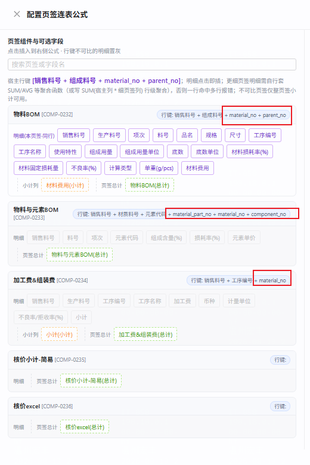

# repair-0814 · 行键（rowKeyFields）中英口径混存致连表可比判定失真

- **归属主任务**：`dev-docs/task-260801-页签连表公式配置优化/`（连表公式抽屉 + `TabFieldMatrix` 可比判定是本任务交付物）
- **引入来源**：`客户组件模板/核价组件/核价组件模板-简易.json` 导入后，在「组件管理 → 行键」列**逐个勾选复选框**保存所致（本地 2026-08-13 23:11~23:23，即 bundle 落盘后 8~20 分钟的那轮手工补页签属性）。**非某个子任务的代码提交引入**，是配置数据被两套口径先后写入。完整取证与点击顺序还原见 §2.1。
- **立项日期**：2026-08-14
- **BACKLOG**：`BL-0169`（本条修复）、`BL-0170`（UI 与规则口径失配，二期）
- **姊妹任务**：`dev-docs/task-260806-模板发布全量冻结/repair-260814-发布冻结后tabType护栏误拦/`（`BL-0168`）—— 同一天、同一批组件（`COMP-0232`/`COMP-0233`）在配置「核价模板-简易」时暴露的另一个问题。两者根因不同（那条是护栏前提失效，本条是行键口径混存），**互不依赖，可并行修**。共同教训：`task-0806` 冻结改造后，若干以「活表配置外溢到已发布模板」为前提的旧逻辑/旧注释未随之复审。

---

## ① 问题描述

在「配置页签连表公式」抽屉里，三个核价组件的行键徽标显示成**中文字段名 + 英文视图列名混在一起**：



| 组件 | 抽屉显示的行键 |
|---|---|
| 物料BOM `COMP-0232` | 销售料号 + 组成料号 **+ material_no + parent_no** |
| 物料与元素BOM `COMP-0233` | 销售料号 + 材质料号 + 元素代码 **+ material_part_no + material_no + component_no** |
| 加工费&组装费 `COMP-0234` | 销售料号 + 工序编号 **+ material_no** |

用户提问：这些自动多出来的英文项，是系统约定还是配置错误。

---

## ② 复现 / 发现方式

- **发现人 / 方式**：用户在配置核价模板的页签连表公式时肉眼发现，截图反馈。
- **环境**：`10.177.152.12:5432/cpq_db_0724`（默认 profile 开发库），组件目录 = 核价组件模板-简易，模板「核价模板-简易」（PUBLISHED `78e79801`、ARCHIVED `4923447a`）。
- **复现步骤**：
  1. 组件管理 → 定位 `COMP-0232 物料BOM` → 打开「配置页签连表公式」抽屉；
  2. 左栏页签卡片右上角的「行键:」徽标即显示混合值；
  3. 以 `COMP-0232` 为宿主时，`物料与元素BOM` 的明细 chip 全部**置灰**，tooltip 提示「行键 […] 与宿主 […] 不可比；可改用「…(总计)」」。
- **触发条件的一般化描述**：任一组件的 `row_key_fields` 里**同时**存在「字段名口径」的项和「driver 视图列名口径」的项时必现。产生路径是：
  1. 组件以字段名口径落库（bundle 导入 / 按 `rule-0724 §2.4 C3` 手工配置）；
  2. 有人在组件管理「行键」列勾选复选框 —— 该复选框只读写 `resolvedColumn`（driver 真实列名），看不见已有的中文项，勾选即**追加**一份列名；
  3. 前端 `computeFinalRowKeyFields()` 的「锚定列保留」把候选反查不到的中文项**永久保留**，两套口径就此并存，且中文项在 UI 上**无法取消**。

### 2.1 这三组英文 key 具体是怎么产生的（取证）

**时钟基准**：本地 `PDT (UTC-7)`，DB `Etc/UTC`，两者一致（实测 `now()=2026-08-14 07:37:56+00` ↔ `date=2026-08-14 00:37:56 PDT`）。下表统一换算为**本地时间**。

| 本地时间 | 事件 | 证据 |
|---|---|---|
| 2026-08-13 23:03 | bundle 落盘（`核价组件模板-简易.json` / `-组件.sql`） | 文件 mtime |
| 2026-08-13 **23:11:42** | `COMP-0232` 被保存 | `component.updated_at = 2026-08-14 06:11:42+00` |
| 2026-08-13 **23:22:35** | `COMP-0234` 被保存 | `= 06:22:35+00` |
| 2026-08-13 **23:23:01** | `COMP-0233` 被保存 | `= 06:23:01+00` |
| 2026-08-13 **23:35:09** | 用户截图反馈本问题 | 截图文件名 `shot_20260813_233509.png` |

即：**bundle 生成后 8~20 分钟内**，三个组件在组件管理页各被保存过一次 —— 正是 bundle `__delivery.⚠️导入后必须手工补的属性` 要求的那轮手工补配（旁证：`COMP-0233` 的 `tab_type` 从 bundle 的 `null` 变成了 `材质元素`，`element*Field` 三项也是那时补的）。

**决定性推理：必须有人真的点了行键复选框，"只是保存"不会产生英文项。**
加载组件时 `setRowKeyFields(服务端值)` = 纯中文项，此时所有复选框显示未勾选。若配置者不碰行键列直接保存，则
`computeFinalRowKeyFields(checked=中文项, serverRowKeyFields=中文项, candidates)` → `preservedAnchors` 也是中文项 →
并集仍是中文项，**英文列名无从产生**。只有 `onToggleRowKey(col, true)`（`ComponentManagement.tsx:1677-1683`，
`Set.add(col)` 追加到末尾）才会把 `resolvedColumn` 写进去。

**点击顺序可还原**（`Set` 保插入序 ⇒ 数组尾部英文项的先后 = 点击先后）：

| 组件 | 尾部英文项顺序 | 还原出的点击动作 |
|---|---|---|
| `COMP-0232` | `material_no`, `parent_no` | 先勾「料号」，再勾「销售料号」 |
| `COMP-0233` | `material_part_no`, `material_no`, `component_no` | 依次勾「料号」「销售料号」「元素代码」（三项全勾） |
| `COMP-0234` | `material_no` | **只勾了「销售料号」，漏了「工序编号」** |

`COMP-0234` 勾了一半这点，反过来佐证这是**人工逐个点击**而非任何批处理/自动填充。

**旁证：同一次改名，别的角色字段都跟上了，唯独行键没跟上。**
用户后来把 `COMP-0232`「组成料号」、`COMP-0233`「材质料号」两个字段改名为「料号」。实测这两个组件的
`part_no_field` / `part_name_field` / `sort_field` / `element_code_field` / `element_price_field` **全部已指向改名后的字段名，零断链**
（`COMP-0232` 料号列=料号、名称列=品名、排序列=项次；`COMP-0233` 料号列=料号、元素列=元素代码、元素单价列=元素单价）。
**只有 `row_key_fields` 停在旧名** —— 因为那几个角色字段在 UI 上都是**下拉选字段名**（改名即联动），
而行键是**按列名的复选框**，中文项在界面上根本不显示，自然也不会跟着改名走。这条独立佐证了 R2 是使能根因。

**「谁」无法追溯（已知取证边界）**：`component` 表无 `updated_by/created_by` 列；`operation_log` 只覆盖
`TEMPLATE`(26 条) / `CUSTOMER`(3 条)，**`COMPONENT` 类型 0 条**，这三个组件 id 在该表命中 0 行。
因此只能定位到「哪一次配置会话窗口」，定位不到操作人。组件变更无审计属独立缺口，见文末「附：本次未采纳但已记录的观察」。

---

## ③ 需求结果

- **E-1**：三个组件的 `row_key_fields` 收敛为**单一口径 = 字段名**（`rule-0724/2-组件与字段.md §2.4 C3`），与全库其余 132 个有行键组件一致。
- **E-2**：行键项必须是该组件 `fields[].name` 里**真实存在**的字段名 —— 当前 `组成料号`（COMP-0232）/ `材质料号`（COMP-0233）在字段被用户改名为「料号」后已不存在，属于恒空段，须跟上。
- **E-3**：修正后 `COMP-0232 物料BOM` 与 `COMP-0233 物料与元素BOM` 在连表公式抽屉里**互为可比**（`{销售料号,料号} ⊆ {销售料号,料号,元素代码}`），元素明细可被物料BOM 的公式引用。
- **E-4（反向期望，防止"把告警关掉"）**：可比判定本身**不放宽**。语义确实不同的页签对（如 `物料BOM{销售料号,料号}` vs `加工费&组装费{销售料号,工序编号}`）修正后**仍应判为不可比、仍应置灰**，只留「(总计)」引用。本次只清数据口径，不动 `comparable()` / `tabComparable()` 任何一行。
- **E-5**：行键的**唯一性不得退化** —— 修正后各组件行键在真实数据上仍须唯一，不得出现撞键（撞键会导致 editRows 串行 / 末值×行数塌缩，见 `记忆 cpq-rowkey-uniqueness-disambiguation`）。
- **E-6**：`客户组件模板/核价组件/核价组件模板-简易.json` 同步修正，避免二次导入原样复现。
- **E-7**：UI 与规则的口径失配（见 ④-根因 R2）本次**不修代码**，但必须登记 BACKLOG，且在本文写清残留风险。

---

## ④ 问题原因 / 报告

### 4.1 根因（分层）

**R1（数据层 · 直接原因）**：`component.row_key_fields` 同时含两套命名空间的项。

**R2（实现层 · 使能原因）**：组件管理「行键」列的复选框只认 driver 列名，与配置规则要求的字段名口径失配 ——

| 位置 | 口径 |
|---|---|
| `rule-0724/2-组件与字段.md §2.4 C3` | 「`rowKeyFields` 存**字段名**（中文原名），不是 SQL 列名」 |
| `FieldConfigTable.tsx:532` | `checked = rowKeyFields.includes(cand.resolvedColumn)` —— 只认**列名** |
| `FieldConfigTable.tsx:541` | `onToggleRowKey(col, checked)`，`col = cand.resolvedColumn` —— 只写**列名** |
| `ComponentManagement.tsx:1039-1049` | `computeFinalRowKeyFields = 勾选 ∪ 反查不到 resolvedColumn 的存量项` —— 中文项作「锚定列」**永久保留** |

结果：按规则配的中文行键，在 UI 上一律显示「未勾选」；使用者以为漏配去勾一下，就永久变成混合，且**删不掉**。

**R3（校验层 · 未拦住原因）**：`ComponentService.validateRowKeyConfig()`（`:878-917`）只校验「每个 key 是非空字符串」。其注释（`:907-909`）明写「方案 A：rowKeyFields 引用的是 driverRow 的底层列……配置期无法对 fields 校验存在性」—— 这是 2026-06-13 之前的旧口径注释，**未随 06-13 的口径收敛更新**，既没拦住混合，也误导后来人。

### 4.2 证据链（可复跑）

1. **UI 显示直取库值，系统未做任何自动追加**
   - `TabFieldMatrix.tsx:109` → `行键: {def.rowKeyFields.join(' + ')}`
   - `ComponentTabDefService.componentsToTabDefs():69` → `parseStringList(c.rowKeyFields)`，纯读
   - `ComponentService.java:576/689` → 「直接透传 JSON 字符串」，纯写
2. **库中现值**
   ```sql
   SELECT code, row_key_fields FROM component WHERE code IN ('COMP-0232','COMP-0233','COMP-0234');
   -- COMP-0232 ["销售料号","组成料号","material_no","parent_no"]
   -- COMP-0233 ["销售料号","材质料号","元素代码","material_part_no","material_no","component_no"]
   -- COMP-0234 ["销售料号","工序编号","material_no"]
   ```
3. **英文项与中文项一一对应同一逻辑列**（即重复计入）
   | 组件 | 中文字段 | 其 `basic_data_path` | 对应英文项 |
   |---|---|---|---|
   | COMP-0232 | 销售料号 | `$wl_bom_view.parent_no` | `parent_no` |
   | COMP-0232 | 料号 | `$wl_bom_view.material_no` | `material_no` |
   | COMP-0233 | 销售料号 / 料号 / 元素代码 | `.material_no` / `.material_part_no` / `.component_no` | 三项全在 |
   | COMP-0234 | 销售料号 | `$jgf_view.material_no` | `material_no` |
4. **全库口径分布（135 个有行键的组件）**
   ```
   含非字段名 key 的组件数 = 3   （即本次这三个）
   含 V279 列名(hf_part_no/material_code)的组件数 = 0
   ```
   → **字段名是全库事实标准**，列名口径在本库已无存量。
5. **同族老组件写法与 bundle 逐字一致**（佐证 bundle 本身没配错）
   `COMP-0048 物料BOM = ["销售料号","组成料号"]` / `COMP-0049 = ["销售料号","材质料号","元素代码"]` / `COMP-0060 = ["销售料号","工序编号"]`
6. **可比判定的实害**
   - `TabFieldMatrix.tsx:12-15` → `tabComparable = comparable(self, source)`
   - `formulaSerialize.ts:1406-1408` → `comparable(a,b) = isSubset(a,b) || isSubset(b,a)`（**纯字符串集合包含**）
   - 现状：`{销售料号,组成料号,material_no,parent_no}` vs `{销售料号,材质料号,元素代码,material_part_no,material_no,component_no}` → 互不包含 → **不可比 → 明细置灰**
   - 修正后：`{销售料号,料号}` ⊆ `{销售料号,料号,元素代码}` → **可比**
7. **候选行键在真实数据上唯一**（`cpq_db_0724`，PRICING 分区 `is_current`）
   ```
   material_bom_item  (material_no, component_no)                 重复组 = 0
   element_bom_item   (material_no, material_part_no, component_no) 重复组 = 0
   unit_price(SELF_PROCESS) (code, operation_no)                  重复组 = 0
   ```
8. **运行时对两套口径都容错**（说明现网未爆炸、只是"脏且判定失真"）
   `FormulaCalculator.computeRowKey(rkf, fields, driverRow, bdv)`（`:1426-1450`）：①直读 `driverRow[名]` ②`resolveRowByFieldName` 按字段定义解析（`BASIC_DATA` 分支 `:1779-1793` 走 `basic_data_path`）。全工程 6 个调用点**全是 4-arg 版**，只认列名的 2-arg 版已无活调用。

9. **【2026-08-14 复发后补做 · 决定性实验】导入链路不会追加英文列名**
   用户当天新建目录「核价模板2」导入 `COMP-0241~0244` 后，行键**再次**出现英文项，怀疑是导入带进来的。实测排除：
   - 用同一份 bundle（`rowKeyFields` 纯中文）导入到临时目录 → 落库 `COMP-0245~0248` 行键**纯中文**，且 `created_at = updated_at`（**从未被改过**）。实验数据已全部清理（4 组件 + 目录均 DELETE 200，残留 0）。
   - 代码侧印证：`ComponentImportService:352-354` 对 `rowKeyFields` 是 `nodeToJson` **纯拷贝**；`remapImportedRefsInDirectory`（`:597`）只重映射引用，不碰行键。
   - 时间戳侧印证：`COMP-0241~0244` 的 `created_at` **全部是 08:33:53**（同一秒 = 批量导入），而 `updated_at` 分别是 `08:34:06 / 08:34:47 / 08:34:58 / 08:35:08`（**各不相同，间隔 13~75 秒**）⇒ 导入后被**逐个**打开保存过。
   ⇒ **根因 R2 确证**：污染只可能来自导入后的人工勾选。这次英文项比首次**更全**（`COMP-0243` 同时有 `material_no` + `operation_no`），恰是「知道该配行键、看见复选框全未勾、于是把该勾的都勾上」的行为特征 —— 而中文行键在 UI 上本来就不显示。

### 4.3 引入时间线（口径演进）

| 时间 | 产物 | 口径 |
|---|---|---|
| 2026-06-01 | `plans/2026-06-01-报价单整份快照-Phase1.md §5.1` | 引入 `rowKeyFields`；`computeRowKey(rkf, driverRow)` 直读 → 事实口径 = **driver 列名** |
| 2026-06-13 前 | V278 预填用中文展示名 | 直读恒 null → rowKey 全空 → 草稿重刷编辑值错位（事故） |
| 2026-06-13 | **`V279__fix_row_key_fields_namespace.sql`** | 4 个组件改为 `child_hf_part_no/material_code/element_name/process_code`；迁移头注明「命名空间因组件而异，视图产出中文列的组件保持不动」 |
| 2026-06-13 | `plans/2026-06-13-rowkey-field-driver-col-resolution.md` | 认定「`row_key_fields` 存**字段名**」才是正确模型，`computeRowKey` 加二级解析，前后端同步 → **双口径兼容**，字段名成为主口径 |
| 2026-06-15 | `plans/…rowkey-uniqueness-disambiguation.md` | 撞键 → `uniquifyRowKeys` 加 `#序号` |
| 2026-06-16 | `plans/…subtotal-amount-rowkey-field-attributes.md` | `rowKeyFields` 升为「组件级角色字段」挂表列（绕开 AP-44），顺带绕开冻结（INDEX §0 第 90 行） |
| 2026-07-21 | `task-0721` | 树页签 `buildRawRowKeys` 加 `nodeId::` 前缀（报价侧 `deleted != null` 才生效；核价侧不加） |
| 2026-07-24 | **`rule-0724/2-组件与字段.md §2.4 C3`** | 固化「存字段名（中文原名），不是 SQL 列名」→ 配置侧唯一权威 |
| 2026-07-27 | `repair-0727` | 四套行身份收敛，`buildRawRowKeys` 成单一产出口径 |
| 2026-08-01 | **`task-0801`（本 repair 的主任务）** | `TabFieldMatrix` 新增消费者：按行键**集合包含**判跨页签可比 → 口径不一致从此有了**可见后果** |
| 2026-08-05 | `repair-0805/backend-rowkey-contract.md` | 复核 4 处调用全走 4-arg 三件套，6/6 逐字命中 |
| 2026-08-06 | `task-0806 模板发布全量冻结` | `rowKeyFields` 进 `template_component_snapshot`；`refresh-template-snapshots` 端点**删除**；`freeze` 仅零快照模板可用 |

**结论**：口径本身在 2026-06-13 已收敛为「字段名」，V279 的列名是那之前的临时修法。**约定不矛盾，矛盾的是 UI 实现（R2）与旧注释（R3）没跟上这次收敛。**

### 4.4 影响面

| 面 | 影响 | 严重度 |
|---|---|---|
| 连表公式配置（截图现场） | 行键集合虚胖 → 本该可比的页签对被判不可比 → 明细 chip 置灰，只能引「(总计)」 | **主** |
| 行身份 / editRows 对齐 | rowKey 段变长、含恒空段与重复段；唯一性未破（4-arg 容错），未观测到串行/塌缩 | 低 |
| 已存公式 | 全库公式中含 `material_no`/`parent_no` 的 = **0 条**，`match` 尚未固化任何列名 → 现在改代价最低 | 无 |
| 已发布模板 | `template_component_snapshot`（PUBLISHED `78e79801` + ARCHIVED `4923447a`）已冻结同样的混合值 | 见「已知限定」 |
| 存量单据 | 引用该模板的 2 张 DRAFT（`27c7ada5`、`e36d7c17`，均 2026-08-14 建、各 1 行） | 低 |
| 其它组件 | 全库 135 个有行键组件中另外 132 个均为纯字段名口径，**不受影响、不需要动** | 无 |

### 4.5 已知限定

1. **PUBLISHED 模板快照本次不同步**（用户裁决 Q3）。`task-0806` 后 `refresh-template-snapshots` 已删、`freeze` 仅零快照可用，官方通路只有「新版本重新发布」。因此本次只修**组件定义层**，`模板「核价模板-简易」v1` 的冻结快照仍是混合值，其渲染 / 公式求值仍吃旧值，**待下次发版自然带上**。
   > 组件管理里的连表公式抽屉读的是 `ComponentTabDefService`（`component` 表实时值），**不读快照** —— 所以截图现场的问题改完组件即消失，这也是本限定可接受的原因。
2. **UI 失配不修**（用户裁决 Q2）：改完后这三个组件的行键复选框在 UI 上显示为**未勾选**，谁再去勾一下就会重新变成混合。已登 `BL-0170`。
3. **删单重建的次序**（裁决 Q3 + Q4 的组合后果）：既然 PUBLISHED 快照不动，删掉那 2 张 DRAFT 后**重建的新单仍会从 v1 快照拿到混合行键**。本次不解决单据层，仅保证组件定义层干净。

### 4.6 为什么测试没拦住

1. `validateRowKeyConfig` 是**软校验**（更新路径 `hard=false`，只 WARN），且按旧口径只校非空字符串 → 混合值合法通过（R3）。
2. 组件导入（`ComponentImportService:353`）对 `rowKeyFields` 是 `nodeToJson` 原样拷贝，**无口径校验**；`task-0805` 加的绑定校验只覆盖 `basic_data_path` / `$view`，不含行键口径。
3. 可比判定（`comparable`）纯字符串集合运算，**不会报错**，只会让 chip 置灰 —— 属于「不报错只是不可用」的静默失效，单测/E2E 都没有针对「混合口径」的用例。
4. 该组合只在「先按规则配中文 → 再在 UI 勾选」这一特定人工次序下产生，无自动化路径可覆盖。

---

## ⑤ 修复方案（用户已裁决 · 2026-08-14）

### 选定方案：统一到**字段名口径**，只清数据、不动判定逻辑

**改动 1 · 三个组件的 `row_key_fields`（组件管理 UI 或后端 API PUT，落 `cpq_db_0724`）**

| 组件 | 现值 | 改为 | 依据 |
|---|---|---|---|
| `COMP-0232` 物料BOM | `["销售料号","组成料号","material_no","parent_no"]` | `["销售料号","料号"]` | 「组成料号」已被改名为「料号」；父件(parent_no)+子件(material_no) 唯一性实证 0 重复 |
| `COMP-0233` 物料与元素BOM | `["销售料号","材质料号","元素代码","material_part_no","material_no","component_no"]` | `["销售料号","料号","元素代码"]` | 「材质料号」已被改名为「料号」；(料号,材质,元素) 实证 0 重复 |
| `COMP-0234` 加工费&组装费 | `["销售料号","工序编号","material_no"]` | `["销售料号","工序编号"]` | (料号,工序) 实证 0 重复 |

**改动 2 · bundle 同步**：⚠️ **执行期修正** —— 初版 bundle 内部其实是**自洽的**（字段名与行键都叫「组成料号」/「材质料号」，是库里后来被用户改名为「料号」才分叉），所以「bundle 配错了」的说法不成立，手工改它反而会制造第二种命名。
改为**按当前库整体重新导出**（`GET /api/cpq/component-directories/f0b44fc1…/export`），并把 `__delivery` 段合并回去 + 更新说明。重导顺带带来三项对齐：① 字段改名跟随；② 补齐导入后手工配的 `partNoField`/`partNameField`/`sortField`/`tabType`；③ 补进 UI 后加的 `COMP-0235 核价小计-简易`、`COMP-0236 核价excel`（初版只有 3 个组件）。
`__delivery` 新增 `⚠️行键口径（repair-0814）` 段：写明字段名口径 + **「导入后不要在行键列勾复选框」** 及其后果。配套 `核价组件模板-简易-组件.sql` 的三处行键注释同步。

**改动 3 · 存量单据**：删除 2 张 DRAFT（`27c7ada5-5c66-4f7d-8be9-bcb90454242c`、`e36d7c17-5bc5-46a0-83dc-1ef06e064e14`），由用户重建。

**改动 4 · BACKLOG 登记**：`BL-0169`（本修复）、`BL-0170`（UI 行键复选框与 `rule-0724 §2.4 C3` 口径失配，P1，二期修）。

**不做**：不动 `comparable()` / `tabComparable()` / `computeRowKey()` 任何一行代码（E-4）；不动 `template_component_snapshot`；不动另外 132 个组件。

### 为什么选它

- 与 `rule-0724 §2.4 C3`（配置侧唯一权威）一致，与全库 132/135 的事实标准一致；
- 唯一能让 `物料BOM ↔ 物料与元素BOM` 变可比的方案（核价把元素成本汇总到物料行的必备前提）；
- 现在全库 0 条公式固化过列名，代价窗口最小。

### 已知风险

- UI 复选框仍会显示未勾选，存在被再次污染的风险（`BL-0170` 覆盖，本文 §4.5-2 已记）；
- PUBLISHED 模板层与单据层本轮不覆盖（§4.5-1 / §4.5-3）。

### 被否方案（各一句）

- **统一到列名口径**（`["parent_no","material_no"]` …）：与 §2.4 C3 冲突、与全库另外 132 个组件不一致，且跨口径集合永远不可比，等于把问题扩散到整库。
- **只删英文、保留原中文**：`COMP-0232` 会退化成只靠「销售料号(=父件)」，同父多子直接撞键。
- **改 `comparable()` 让它按语义/列名归一后再比**：属于放宽判定，违反 E-4，且会掩盖真正语义不可比的页签对。

---

## ⑥ 验收标准

| AC | 判定方式 | 期望 |
|---|---|---|
| **AC-1 口径单一（阴性）** | `SELECT code,row_key_fields FROM component WHERE code IN ('COMP-0232','COMP-0233','COMP-0234')` | 三条均为纯中文字段名，无 `material_no`/`parent_no`/`material_part_no`/`component_no` |
| **AC-2 行键项真实存在** | 全库口径扫描 SQL（§4.2-4 同款）对这 3 个组件跑 | 「非字段名」计数 = 0 |
| **AC-3 可比恢复（阳性）** | 组件管理 → `COMP-0232` → 配置页签连表公式 | 徽标只显示中文；`物料与元素BOM` 明细 chip **不再置灰**，可点击插入 |
| **AC-4 反向期望仍生效** | 同一抽屉，宿主 `COMP-0232`，看 `加工费&组装费` | **仍置灰**（`{销售料号,料号}` 与 `{销售料号,工序编号}` 互不包含），tooltip 仍提示改用「(总计)」 |
| **AC-5 唯一性不退化** | §4.2-7 三条重复组 SQL 重跑 | 三条均为 0 |
| **AC-6 无副作用（值/显示不变）** | 改前后各调一次 `expand-driver` / 打开核价卡片对照 | 行数、单元格值、行序逐条一致（行键只做后台行身份对齐，用户不可见） |
| **AC-7 其它组件零波及** | 全库扫描：含非字段名 key 的组件数 | 由 3 → **0**，且总数仍为 135 个有行键组件 |
| **AC-8 bundle 同步** | `grep rowKeyFields 核价组件模板-简易.json` | 三处与 AC-1 值逐字一致 |
| **AC-9 强制自检声明** | 后端未改代码 → 无需重启；若走 API PUT 则记录返回码 | PUT 200 / 或 SQL `UPDATE 1` × 3；前端未改代码 → 无需 tsc/Vite 自检（在报告中显式说明"零代码改动"） |
| **AC-10 BACKLOG 登记** | `BACKLOG.md` | `BL-0169` 标完成、`BL-0170` 待开发 P1 |

---

## 附：本次未采纳但已记录的观察

- `ComponentService.validateRowKeyConfig` 的注释（`:907-909`）仍停留在 2026-06-13 之前的「rowKeyFields = driverRow 底层列」旧口径，与 `rule-0724 §2.4 C3` 相反，是本次误配的**认知诱因之一**。建议随 `BL-0170` 一并更正注释（本轮不动代码，故仅记录）。
- **组件变更无审计**（§2.1 取证边界）：`component` 表无 `updated_by/created_by`，`operation_log` 只覆盖 `TEMPLATE`/`CUSTOMER` 两类
  （29 条里 26+3，`COMPONENT` 0 条）。组件是模板与报价渲染的上游，配置改动却查不到操作人 —— 本次因此只能定位到时间窗口。
  是否补 `COMPONENT` 类审计**待用户裁决**，未登记 BACKLOG。
