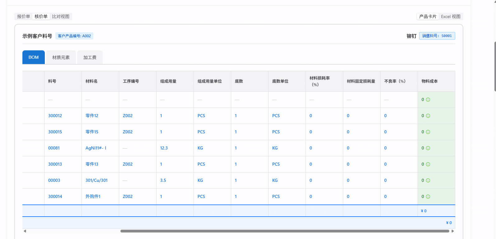

# 连表公式匹配键宿主侧取不到取数列（BASIC_DATA）→ SUM 恒 0

- 立项日期：2026-09-11
- 类型：repair（系统级缺陷，非某次改动引入的回归）
- 返修对象：`task-260801-页签连表公式配置优化`（连表公式 / `cross_tab_ref` 主线）
- 同族前案：`repair-260814-行键中英口径混存致连表可比判定失真`、`repair-260814-行键复选框写列名致口径污染`（配置层同族）；`431c9df2` C* 族取数列静默返 0（**求值层同根因，本次是它的漏修分支**）
- 状态：**待 A0 裁决**（① ~ ④ 已写完，⑤⑥ 待用户裁决方案后补）

---

## ① 问题描述

### 用户原话

> 我在后端 8091(401,鉴权正常)、前端 5090(200)中床创建了报价单[QT-20260911-0010]，我给 BOM 页签中的物料成本列配置的公式 `{SUM([材质元素.元素成本]) * [组成用量] * [底数] * (1 + [材料损耗率（%）] + [不良率（%）])}`，帮我分析下产品卡片[S0001]的这一列计算结果全是 0 的问题

### 客观现象

核价单 → 产品卡片 `S0001`（客户产品编号 `A002`）→ BOM 页签 → **「物料成本」列 7 行全部为 `0`**，页签小计 `¥ 0`，卡片合计 `¥ 0`。

**无任何报错、无红框、无提示** —— 页面表现为「已经算完了，结果就是 0」。



同一行的其它列均正常渲染（料号、材料名、组成用量 12.3 / 3.5、底数 1、损耗率 0 等）。

---

## ② 复现 / 发现方式

| 项 | 值 |
|---|---|
| 发现人 | 用户（配置完核价通用模板后首次查看卡片） |
| 环境 | 后端 `8091`（主仓 `cpq-backend`，`-Dquarkus.profile=uat`）；前端 `5090`（`VITE_API_TARGET=http://localhost:8091`） |
| 库 | **`10.177.152.12:5432/cpq_db_0910`**（uat profile 默认值，见 `application-uat.properties:45`） |
| 报价单 | `QT-20260911-0010`（`id=405ab315-3ee6-43e0-8a4d-9837b762ab81`，`status=DRAFT`） |
| 产品卡片 | `S0001` / 客户产品编号 `A002`（`line_item_id=b7066093-ebc9-4a78-b1e4-4ca47298b73e`） |
| 核价模板 | `核价通用1`（`ffae0668-0850-452a-8764-2d71e00d17af`，`COSTING` / `PUBLISHED`） |
| 组件 | 宿主 `COMP-0016 BOM`（`a2d0dc3a-…`）；源 `COMP-0017 材质元素`（`1e41ecb6-…`） |
| 频率 | **必现**（该模板下所有卡片、所有行） |

### 复现步骤

1. 打开报价单 `QT-20260911-0010` → 切「核价单」→ 产品卡片 `S0001`
2. 看 BOM 页签「物料成本」列 → 7 行全 `0`
3. 切「材质元素」页签 → 「元素成本」列有值（2835 / 64000 / 3150 / 420000）

### 只读取证命令

```bash
export PGPASSWORD=joii5231
psql -h 10.177.152.12 -U postgres -d cpq_db_0910 -tAc \
"select jsonb_pretty(costing_card_values) from quotation_line_item
 where id='b7066093-ebc9-4a78-b1e4-4ca47298b73e';"
```

---

## ③ 需求结果

> ⚠️ 本缺陷无对应存量 AC（`task-260801` 的 AC 覆盖的是抽屉配置体验，未覆盖求值期的匹配键取值口径）。
> 按 `task-docs.md §5`「找不到对应 AC = 需求有缺口，先补 AC」——⑥ 节将补齐，本节先列期望。

### 阳性期望（该算出来的要算出来）

- **E-1** 宿主页签用于 `match` 的字段，**无论 `field_type` 是 `BASIC_DATA` / `DATA_SOURCE` / `INPUT_*` / `FIXED_VALUE`**，匹配键都应能按**字段名**取到该行的值。
- **E-2** 本单 `S0001` BOM 页签「物料成本」列，修复后应为：

  | 行（料号） | 生产料号 | 匹配到的材质元素行 | SUM(元素成本) | × 组成用量 | 期望值 |
  |---|---|---|---|---|---|
  | `00003` | 300013 | Cu 2835 + 301 64000 | 66835 | × 3.5 × 1 × (1+0+0) | **233922.5** |
  | `00081` | 300015 | Cu 3150 + Ag 420000 | 423150 | × 12.3 × 1 × (1+0+0) | **5204745** |

  页签小计「物料成本」= **5438667.5**。

### 阴性 / 反向期望（该是 0 的仍要是 0，该不变的不许变）

- **E-3** `300012` / `300013` / `300014` / `300015` 四行**仍为 0** —— 这些料号在材质元素页签中确实没有对应行，空集返 0 是正确语义，**不许被"修"成非 0**。
- **E-4** 根行（层级 1，`__nodeId=300001`，各列全空）**仍为 0**。
- **E-5** **报价侧不许回归**：同一张卡片报价侧 `COMP-0011 BOM` 的「物料成本」当前值 `203420.460972186`、材质元素「材料成本」小计 `33903.410162031`，修复后必须**逐字节不变**。
- **E-6** 匹配键任一侧**真为空**时仍判不匹配（不得把 `null` 与 `null` 判成相等而虚假命中）。
- **E-7** 用户在输入框里**显式清空**某个 `INPUT_*` 匹配字段时，仍尊重置空（现有 `currentRowRaw.get(name) != null` 语义不许被破坏）。
- **E-8** 前后端两端结果**逐位一致**（`FormulaCalculator` 与 `formulaEngine`/`QuotationStep2` 对拍）。

---

## ④ 问题原因 / 报告

### 一句话根因

`cross_tab_ref` 的 `match` 两侧走**两套不同的命名空间**：源页签侧按**字段名**取值，宿主页签侧按 **driver 视图列名**取值；只有 `INPUT_NUMBER/INPUT_TEXT/INPUT` 三种类型会被额外补一份「字段名 → 值」，**`BASIC_DATA` / `DATA_SOURCE` 字段按字段名永远取不到** → `isBlank(bv)` 恒真 → 全部候选行判不匹配 → `hits` 空集 → `SUM` 返回 `BigDecimal.ZERO`，**静默**。

### 证据链（可复跑）

**（1）源数据是好的，不是「没数」**

材质元素页签四行「元素成本」= 2835 / 64000 / 3150 / 420000，小计 489985，`formulaResults` 均已算出（见 ② 的取证命令输出 `tabs[1]`）。

**（2）匹配键的值本身是对得上的**

| 页签 | 生产料号 | 料号 |
|---|---|---|
| BOM（`resolvedRows`） | 300013 / 300015 | 00003 / 00081 |
| 材质元素（`resolvedRows`） | 300013 / 300015 | 00003 / 00081 |

⇒ **不是数据对不上，是取不到值。**

**（3）代码路径**

```java
// FormulaCalculator.java:536-540
Object av = arow.get(pair.path("a").asText(""));          // 源页签行 = resolvedRows，键是【字段名】
Object bv = ctx.currentRowRaw.get(pair.path("b").asText("")); // 宿主行，键是【driver 视图列名】
if (isBlank(av) || isBlank(bv) || !valEquals(av, bv)) { ok = false; break; }
```

- `ctx.currentRowRaw = toRawRowMap(mergedRow)`（`:1370`）—— 键即 driver 列名（`production_no` / `component_no`）
- `fillInputDefaultSourceByFieldName`（`:2651-2673`）白名单**只有** `INPUT_NUMBER / INPUT_TEXT / INPUT`
- 源侧行来自 `CardSnapshotService.java:3157` 注释：「每算完一个组件即把其**按字段名标量行**(resolvedRows) 存入 `crossTabRows`」
- `COMP-0016` 的匹配字段：`生产料号 → $builder_a2d0dc3a9506.production_no`、`料号 → $builder_a2d0dc3a9506.component_no`，两者 `field_type` 均为 **`BASIC_DATA`**
- 空集出口：`:559-565` `hits.isEmpty()` → `return BigDecimal.ZERO`（**不报错**）

**（4）判决性差分实验 —— 同一张卡片，报价侧算对、核价侧全 0**

| | 报价侧 `COMP-0011` | 核价侧 `COMP-0016` |
|---|---|---|
| 公式形态 | `SUM(材质元素.材料成本) × 组成数量 × (1+损耗率)` | `SUM(材质元素.元素成本) × 组成用量 × 底数 × (1+损耗率+不良率)` |
| 页签顺序 | BOM(1) 在 材质元素(2) **之前** | BOM(0) 在 材质元素(1) **之前** |
| 匹配字段 `field_type` | **INPUT_TEXT** | **BASIC_DATA** |
| 结果 | **203420.460972186** ✅ | **0** ❌ |

⇒ **排除竞争假设「页签算序 / 拓扑序未生效」**（若是算序问题，报价侧同样的声明序也该归零；实测不归零）。唯一变量是 `field_type`。

**（5）全库盘点（`cpq_db_0910`）**

```sql
WITH m AS (SELECT c.id, c.code, pair->>'b' AS bfield
  FROM component c, jsonb_array_elements(c.formulas) fo,
       jsonb_array_elements(fo->'expression') tok, jsonb_array_elements(tok->'match') pair
  WHERE tok->>'type'='cross_tab_ref')
SELECT m.code, m.bfield,
  (SELECT f->>'field_type' FROM component c2, jsonb_array_elements(c2.fields) f
    WHERE c2.id=m.id AND f->>'name'=m.bfield) AS b_type FROM m ORDER BY 1;
```

| 组件 | 侧 | `b` 字段类型 | 现状 |
|---|---|---|---|
| COMP-0002 / COMP-0011 | 报价 | `INPUT_TEXT` | 正常 |
| **COMP-0005 / COMP-0016** | **核价** | **`BASIC_DATA`** | **恒 0** |

### 引入时间线

| 提交 | 日期 | 与本缺陷的关系 |
|---|---|---|
| `0d9999d7` feat(formula): 后端 `cross_tab_ref` token 求值 | — | **缺陷自此存在**：`match` 的 `b` 侧一开始就读 `currentRowRaw`（driver 列名空间） |
| `4020e08e` fix(formula): 宿主行 `currentRowRaw` 补 INPUT default_source 解析(方案B, **cross_tab match 键**) | 2026-06-13 | **专门为修这个症状而做**，但只覆盖 `INPUT_*` 三型 —— `BASIC_DATA` / `DATA_SOURCE` 留在盲区 |
| `431c9df2` fix(task-0803): **C\* 族聚合取数列(BASIC_DATA)静默返 0** —— 两端修复 + 夹具补盲区 | 2026-08-04 | **同一根因在树聚合路径被抓到并修复**（新增 `buildTreeAggPresenceView`，见 `FormulaCalculator.java:403-411` 注释）。`evalCrossTab` 的 `match` 路径**同病未修** |

⇒ 本缺陷**不是回归**，是 `431c9df2` 那次修复的**漏修分支**；此前未暴露，是因为报价侧的存量组件全部用 `INPUT_TEXT`，而 `BASIC_DATA` 是取数配置器（`$builder_*`）产物的默认类型，核价侧新配的组件才第一次踩到。

### 影响面

- **直接**：`COMP-0016`（核价通用1）、`COMP-0005` 两个组件的跨页签公式列恒 0；核价单物料成本 → 卡片小计 → 单据总额逐级少算，且**无任何错误信号**
- **潜在**：凡用取数配置器建的组件（字段默认 `BASIC_DATA`）+ 跨页签匹配，**一律中招**。随配置器铺开，命中面只增不减
- **不影响**：报价侧现有 `COMP-0002` / `COMP-0011`（`INPUT_TEXT`）；同页签内的普通公式；`targetExpr` 内的 `b_field`（走 `hostFieldValues` 通道，`repair-0803` 已修）

### 为什么测试没拦住

前后端共享夹具 `cross-tab-cases.json`（后端 `src/test/resources/`、前端 `src/utils/__fixtures__/`）的 `currentRow` **直接以字段名为键**：

```json
"aRows": [{"子件":"P1","单重":0.8}],
"currentRow": {"子件":"P1"}
```

即两端 harness 都在一个「driver 列名恰等于字段名」的理想世界里对拍，**从未构造「driver 列名 ≠ 字段名」的真实形态**。

这正是 `431c9df2` 自己在 commit message 里点名过的盲区 —— 但它只补了 `tree-formula-parity-cases.json`（`git show --stat 431c9df2`：5 个文件，**不含 `cross-tab-cases.json`**）。同一句诊断，只落地了一半。

---

## ⑤ 修复方案

> 2026-09-11 闸门 A0 用户裁决：**方案甲**。

### 总原则

**只给「匹配」这一步单独建一份「按字段名的宿主行视图」，不动 `currentRowRaw` 本身。**

`currentRowRaw` 是共享结构，还被 `b_field` 求值、KSUM 的 `mergedCurrentRow`、单位换算三处消费；往它里面塞新键会外溢到这些路径，且与 `repair-0803` 决策 **D-2**（明确否决「往 `currentRowRaw` 写回」，理由是污染 KSUM 匹配键 + 绕过单位换算时机）冲突。新建独立视图则把影响面精确限定在匹配判定上。

同族先例：`431c9df2` 为树聚合的「有值」判定新增 `buildTreeAggPresenceView`（`FormulaCalculator.java:399-433`），本次是把同一手法补到 `evalCrossTab` 的匹配路径。

### 后端

1. `RowContext` 新增一份**宿主行匹配视图**（如 `hostRowForMatch`），在 `buildRowEvalCtx`（`:1341-1378`）构造：以 `currentRowRaw` 为底，叠加 `resolveRowByFieldName(fields, driverRow, basicDataValues, editValues, null)` 的**按字段名**解析结果。
2. **叠加口径：仅键缺失才补**（`currentRowRaw` 已有该键就不覆盖）—— 保住「显式清空 `""` 尊重用户置空」的既有语义（E-7）。
   ⚠️ `buildTreeAggPresenceView` 现有写法是 `merged.putAll(byFieldName)`（**后者整体覆盖**），**不要照抄这一行**。
3. `evalCrossTab`（`:512-590`）中以「宿主行」身份参与判定的两处改读新视图：
   - `hits` 过滤里 `match` 的 `b` 键取值（`:539`）—— 同时覆盖外层 SUM 族与 KSUM（`projectToHostKey`）分支，两者共用这个循环
   - `predicate` 求值传入的宿主行（`:544`，SUMIF 族）
4. **不动**：`b_field` 的取值链（`:242` `currentRowRaw → hostFieldValues` 回落，由 `repair-0803` 定义）、单位换算、`targetRowValue` 的多 source 广播逻辑。

### 前端（同构）

1. `QuotationStep2.tsx` 已有 `buildResolvedRow`（`:1327`，源侧 `cross_tab_ref` 按字段名取数用），**复用它**为宿主行构造匹配视图，不新造解析器。
2. `evaluateExpression` 增加一个可选的「匹配用宿主行」入参，缺省回落现有 `currentRow`；`formulaEngine.ts` 的 `aggregateRows`（`:557`）匹配处改用它。
3. `QuotationStep2.tsx` **两处**求值素材构造点都要传（`:716-730` 与 `:1051-1064`，后者是 `buildRowMaterials` 的同构副本）—— 漏一处就是 AP-50 式的「一个视图对、另一个错」。

### ⚠️ 实现中必须消解的一处既有前后端分歧

同样是「原值为空时按字段名补」，两端对**空字符串**的判定不一致：

| 端 | 判据 | `""` 会不会被补 |
|---|---|---|
| 后端 `fillInputDefaultSourceByFieldName:2662` | `currentRowRaw.get(name) != null` | **不补**（尊重显式清空） |
| 前端 `buildResolvedRow:1345` | `out[key] == null \|\| out[key] === ''` | **会补** |

新视图两端必须统一到**后端口径**（键存在即权威，`""` 不补），并由 AC-6 的对拍用例锁死。

### 诊断信号（D-a）

`match` 键在宿主行取不到值时，写入现有 `outDiag` 通道给出可见提示（前端渲染层已有 `crossTabError` 的展示位），不再静默返 0。

> 已否决备选：
> - **乙 · 放开 `fillInputDefaultSourceByFieldName` 的类型白名单** —— 会往共享的 `currentRowRaw` 外溢到 `b_field` / KSUM / 单位换算三条路径，且推翻 `repair-0803` D-2 裁决。
> - **丙 · 只加配置期校验与渲染期报错，不改取值口径** —— 不解决「用 `BASIC_DATA` 字段做匹配」这一合法诉求，只是把静默 0 变成红字。

---

## ⑥ 验收标准

> 环境一律为：后端 `8091`（uat profile）/ 前端 `5090` / 库 `cpq_db_0910`；单据 `QT-20260911-0010`、卡片 `S0001`（`line_item_id=b7066093-ebc9-4a78-b1e4-4ca47298b73e`）。

### 阳性（该算出来的要算出来）

- **AC-1**（单点）打开该单核价单 → 卡片 `S0001` → BOM 页签，**料号 `00003` 行**「物料成本」显示 **233922.5**；**料号 `00081` 行**显示 **5204745**。
- **AC-2**（单点）同页签底部「物料成本」列小计显示 **5438667.5**；卡片合计随之由 `¥ 0` 变为非 0。
- **AC-3**（单点·跨类型）引擎级用例：宿主行的 driver 列名为 `prod_no`、字段名为「生产料号」，字段类型分别取 **`BASIC_DATA`** 与 **`DATA_SOURCE`** 各跑一遍；源页签两行「元素成本」= `100` / `200`，匹配键值同为 `P1`。两种类型下 `SUM` 结果均为 **`300`**（修复前均为 `0`）。
  证明修复覆盖的是「非 INPUT 类型」整类，不是只给 `BASIC_DATA` 打补丁。

### 阴性（该是 0 的仍是 0）

- **AC-4** 同页签 `300012` / `300013` / `300014` / `300015` 四行及根行（层级 1）「物料成本」**仍为 `0`** —— 这些料号在材质元素页签确无对应行，空集返 0 是正确语义。
- **AC-5** 匹配键任一侧**真为空**（`null` / `""`）时仍判不匹配，不得出现「两个空值判等」的虚假命中。断言：构造 A 行匹配列为空、宿主行同列为空的用例，聚合结果为 `0` 而非该行值。

### 无副作用

- **AC-6**（前后端对拍 + 还原实验）`cross-tab-cases.json`（后端 `src/test/resources/`、前端 `src/utils/__fixtures__/`，**两份内容必须一致**）新增「driver 列名 ≠ 字段名」用例组，至少含：① `BASIC_DATA` 匹配键命中；② `DATA_SOURCE` 匹配键命中；③ **两个分支的显式清空 `""` 都要锁**：`INPUT_*` 匹配键清空时不匹配；**`BASIC_DATA` 匹配键清空时不被按字段名解析值覆盖**。
  > 📌 **2026-09-11 开工后修正（用户裁决）**：本条原文只写了 `INPUT_*`，但 ⑤ 节那张分歧表点名的是前端 `buildResolvedRow:1345`（**`BASIC_DATA`/`DATA_SOURCE` 分支**），两处是独立代码，`INPUT` 那条锁不住 `BASIC_DATA` 那条。前端工程师做还原实验时发现按原文写的用例**回退也不变红**（没有鉴别力），据此追出本条口径错误。原文是主线写 AC 时的疏漏。
  要求：**先跑红**（在修复前这些用例必须失败，且失败的是匹配数而非报错），修复后两端**逐位一致**全绿。
- **AC-7**（报价侧零回归）同一张卡片报价侧 `COMP-0011 BOM`「物料成本」**仍为 `203420.460972186`**、材质元素「材料成本」小计**仍为 `33903.410162031`**，逐字节不变。
  取证：`select quote_card_values from quotation_line_item where id='b7066093-…'` 改动前后 diff 为空。
- **AC-8**（既有测试面）后端公式相关测试全绿（`FormulaCalculator*` / `*Parity*` / `CrossTab*`）；前端 `quotation` 目录单测全绿；`tsc` 0 错误。

### 序列（有状态的连续操作）

- **AC-9** 🚫 **不适用（2026-09-11 用户裁决，不补替代验证）**。

  原文要求「在核价单 BOM 页签把 `00081` 行『组成用量』由 12.3 改为 10 并失焦 → 保存 → 切页签 → 刷新 → 数值稳定」。

  **实测该动作在核价侧做不出来**：核价模板『核价通用1』三个组件（`COMP-0016`/`COMP-0017`/`COMP-0018`）的字段**全部是 `BASIC_DATA` / `FORMULA`，一个 `INPUT_*` 都没有** ⇒ 整张核价卡片没有任何可编辑单元格，单元格内 `input` 恒为 0 个；连带「保存草稿」也触发不了（不改动即提示「无改动，无需保存」，0 次写请求）。

  **用户裁决（2026-09-11）：核价单本来就该全只读** ⇒ 本条 AC 描述的是一个**在核价侧不存在的场景**，不是交付缺口，也不挪到报价侧做替代验证（报价侧的零回归已由 AC-7 覆盖并亲验通过）。

  **归因**：主线写 AC 时未实查这些列的 `field_type` 就假定「组成用量」可编辑，违反 `task-docs.md §4`「AC 里引用的事实必须实查」。⇒ 本次序列类覆盖缺失，已在结案「拦截点」按**审用例/亲验**如实登记。

### 边界 / 诊断

- **AC-10**（D-a）当宿主行确实取不到某个 `match` 键（例如把公式的匹配字段名改成一个不存在的字段），该列显示可见诊断（`outDiag.crossTabError` 通道），文案指明是哪个页签的哪个匹配键取不到值，**而不是静默显示 0**。

### 自检证据

- **AC-11** 交付时随附一行「已自检」声明，至少含：后端 `mvnw test` 相关测试类结果 · 前端 `tsc` 0 错误 · dev server 存活探测（前端 200 / 后端 401）· AC-1/AC-2 的实际页面截图或接口原始响应。
