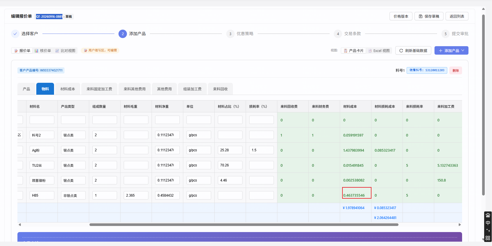

# repair-260916 · 勾了「小计」的列，在公式编辑器里选不出「字段列」引用

> **返修对象**：`task-260801-页签连表公式配置优化`（公式编辑抽屉左栏的选字段面板 `TabFieldMatrix`）。缺陷的引入早于该任务，见 ④ 4.4
> **关联待办**：`BL-0293`（本返修覆盖它「同一段文字两种算法、看不出区别」的一面；它「勾选/取消小计时提示已有公式」的一面，用户裁决本次不做，见 D-4）
> **状态**：立项 · 闸门 A0 已过（方案甲，2026-09-16）· ⏳ **闸门 A 待确认**
> **档位**：标准档 —— 碰公式文字的写法规则，而这套写法由前端、后端两处各自解析（跨端契约）；且改法有岔路
> **立项日期**：2026-09-16（`date +%y%m%d` 实取 = `260916`）
> **证据目录**：[`证据/离线判决/`](./证据/离线判决/)（脚本 + 当次原始输出，可复跑）

### 本任务的用户裁决（均为 2026-09-16 对话内选项卡作答）

| # | 问题 | 用户选择 |
|---|---|---|
| `D-1` | 编辑器这个缺陷怎么处理 | **现在就立项修**（路径 A） |
| `D-2` | 对勾了小计的列，编辑器里要能点选出哪几种引用 | 用户原话：「**不要修改公式取数规则,我就是想区分 我选的是字段列还是小计列,可以正确的选择和公式计算即可**」⇒ **计算规则一条不改**；只要求：选得出、分得清、算得对 |
| `D-3` | Excel 类组件「同一段文字，页面和后端理解不同」本次一起修吗 | **一起修**。⚠️ 主线当时把差异说成「理解相反、值可能不一样」，**说重了**；更正后的事实见 ④ 4.3，闸门 A0 时一并向用户更正 |
| `D-4` | 勾选/取消某列「小计」时，要不要提示已引用它的公式 | **不做**，靠新写法让文字与算法一一对应后自然看得出 |
| `D-5`（A0） | 改法选哪个 | **甲：小计写成 `[页签.列(小计)]`，`[页签.列]` 固定表示本行的值**（候选见 ⑤ 末「已否决备选」） |
| `D-6` | `BL-0293` 怎么登记 | **标为进行中并挂到本返修** |
| ~~`D-7`~~（开发期扩范围，2026-09-17；**已被 D-15 作废**） | 导出包升 1.2 后，前端导入抽屉的「旧格式」判断要不要一起改 | ~~甲：一起改（F-10、AC-16⑤）~~ —— D-15 决定导出包不升版，本项随之撤销 |
| `D-8`（开发期，2026-09-17） | AC-6b 原写法 `SUM([宿主.数量] * [加工费.加工费(小计)])` 与现行「行级聚合须至少引用一个来源页签明细列」冲突（主线 AC 写错） | **改成带来源明细列的写法**，不改规则（见 AC-6b；原型状态 B 标注同步更正） |
| `D-9`（开发期，2026-09-17） | Excel 列的 SUMIF 类函数（前后端统一后页面也得 0） | **保存时拦截 + 工具条对 Excel 隐藏这组按钮**；另登记 BACKLOG「Excel 连表公式支持 SUMIF」 |
| `D-10`（开发期，2026-09-17） | 后端 Excel 公式「除以小数就报错」的原有缺陷 | **本次修**（后端除法先把小数转成精确数；前端移植同步；共享夹具加用例） |
| `D-11`（开发期，2026-09-17） | Excel 组件抽屉保存时是否也按 5.1 拦截非法 `(小计)` 写法 | **要，补齐**（AC-18 增断言） |
| `D-12`（开发期，2026-09-17） | AC-16① v1.0 旧包按既有树页签规则本来就导不进来 | **按实际改写**（后被 D-15 进一步改写，见 AC-16） |
| `D-13`（开发期，2026-09-17） | AC-15⑥ 后端重算 Excel 视图与页面存值本来就不同（与本次无关） | 用户原话：「**这个问题记录一下,本任务结案后立项修复**」⇒ 本任务只断言「本次改动前后后端重算值不变」 |
| `D-14`（开发期，2026-09-17） | 上项原有问题是否登记 BACKLOG | **登记，P1** |
| `D-15`（开发期，2026-09-17） | 存量改写（迁移 V446、导入旧包改写）要不要做 | 用户原话：「**存量数据不改,功能修复后我自己修正**」；追问后确认旧导出包导入**也不自动改** ⇒ 撤销迁移、撤销导入改写、导出包版本保持 `1.1`、撤销 F-10；现有 3 个 Excel 列与旧包导入后的 Excel 列由用户手动修正 |

---

## ① 问题描述

### 用户原话

> 问题报价单[QT-20260916-0881]
> 根据我配置的公式,我用计算器算出材料成本的结果是0.2125851125705723,但是报价单算出的结果是 0.463735546.
> 分析下 0.463735546这个计算结果的计算过程,列出过程给我看下

> 把加工费改成按料号匹配，怎么配置的? 我把来料固定加工费.加工费 删除,重新选择 按料号匹配的加工费,结果还是使用的小计,这就出现个问题,小计列和按料号匹配同时存在,无法区分

> （D-2 作答）不要修改公式取数规则,我就是想区分 我选的是字段列还是小计列,可以正确的选择和公式计算即可

### 客观现象

1. **报价单算的数比用户手算的大**：`QT-20260916-0881`「物料」页签 H85（料号 00144）「材料成本」显示 `0.463735546`，用户按自己配的公式手算得 `0.2125851125705723`。
   差额 `0.251150442` = `0.002365 × 120 / 1.13`：公式里「来料固定加工费·加工费」取的是**这一列的合计 127.5**（料号2 的 120 + H85 的 7.5），用户本意是**按料号只取 H85 那一行的 7.5**（计算过程见 `docs/RECORD.md` 2026-09-17 同单两条）。
2. **重新选也选不出来**：用户在组件管理打开该公式，删掉这一项，从左栏「来料固定加工费」卡片的「明细」组重新点「加工费」，保存后**仍是整列小计**。
   库里实查：组件 `COMP-0002`「物料」的公式「非银点类材料成本公式」，该项在 `05:30:45Z`（组件 `updated_at`）保存后仍为整列小计（`component_subtotal`，采样 `2026-09-17T05:49Z`）。⚠️ 那次保存是否即用户所述操作，主线无法确认；存储形态与用户描述一致。
3. **两个选项看起来不同，插进去的文字一样**：左栏同一张卡片里，蓝色「明细」组的「加工费」和橙色「小计列」组的「加工费(小计)」，点下去插进公式框的都是 `[来料固定加工费.加工费]`。保存后再打开，两种算法也显示成同一段文字。页面不报错、不提示。

---

## ② 复现 / 发现方式

- **发现者**：用户在开发环境（`5174` → `8081` → `cpq_db_0724`）配置组件公式时发现；主线读代码并直接运行前端真实解析函数确认（见 ④ 4.2）。
- **频率**：**必现**。触发条件只有一个：被引用的列在它所在的组件里**勾了「小计」**。
- **前置数据**：组件目录「施耐德成环检测」
  - 宿主：`COMP-0002`「物料」，行键 `销售料号` + `料号`
  - 被引用：`COMP-0004`「来料固定加工费」，行键 `销售料号` + `料号`，「加工费」列**勾了小计**
- **操作步骤**：
  1. 组件管理 → 目录「施耐德成环检测」→「物料」→ 公式 →「非银点类材料成本公式」→ 编辑。
  2. 在右侧公式框里删掉 `[来料固定加工费.加工费]`。
  3. 左栏「来料固定加工费」卡片 →「明细」组 → 点「加工费」（蓝色）。
  4. 保存。重新打开该公式，或查库。
- **期望**：存成「按行键找到对应行取值」（与引用一个没勾小计的列时一样）。
- **实际**：存成「整列小计」（`component_subtotal`），与点橙色「加工费(小计)」的结果完全相同。
- ⚠️ **主线复现的边界**：第 3 步的界面点击**主线没有亲手在浏览器里做**，依据是用户报告 + 代码（两个选项插入的文字逐字相同，见 4.2 ①）；「这段文字保存后存成什么」一步由主线**实跑前端真实解析函数**证实（见 4.2 ④）。
- **环境**：`10.177.152.12:5432/cpq_db_0724`。

---

## ③ 需求结果

> **AC 对照**：本返修的 AC 在 ⑥ 编写（闸门 A0 裁决后按下列 `E-x` 逐条出）。
> 父任务 `task-260801` 的 `AC-3`（点 chip → token「正确」插入光标处）与 `AC-17`（搜索前后插入逐字一致）只约束了**插在哪、前后是否一致**，**从未定义「明细选项对小计列应得到什么」** ⇒ 这是父任务 AC 的缺口，由本返修 ⑥ 补上。

| # | 期望行为 |
|---|---|
| **E-1** | 对**勾了小计**的列，点「明细」插入的引用，保存后**按字段列算**：存储形态与算法和「引用一个没勾小计的列」**完全相同**（按两个页签共有的行键找对应行取值） |
| **E-2** | 点「小计列」插入的引用，保存后仍是**整列小计**（现状不变） |
| **E-3** | 两种引用在公式框里**写法不同、显示不同、颜色标记与实际算法一致**；保存后再打开，显示与保存前一致；原样再保存，算法不变 |
| **E-4** | 用户原场景能配出来：把「非银点类材料成本公式」里的加工费改为字段列引用后，按 `QT-20260916-0881` 的冻结数据，H85「材料成本」= `0.212585104`（④ 4.2 ⑤ 离线值）。真实新建单的值随当时元素单价变化（`V445` 起元素单价为 9 位小数） |
| **E-5** | Excel 类组件：同一段连表公式文字，页面算的值与后端算的值**按同一规则**得出（D-3） |
| **反向 E-6** | **计算规则一条不改**（D-2）：字段列引用命中多行仍显示 ⚠；命中 0 行的行为不变；`SUM([页签.列])`、`[页签.列(总计)]`、`[页签(总计)]` 的含义不变 |
| **反向 E-7** | **存量公式的计算结果不变**：现有 15 处整列小计引用、1 处 `SUM` 引用小计列（见 4.5），在编辑器里打开后原样保存，算法也不变 |
| **反向 E-8** | 该拦的仍要拦：引用不存在的列、行键不可比页签的字段列，仍标红、仍不能保存 |
| **不做 E-9** | 勾选/取消某列「小计」时提示已引用它的公式（D-4） |

---

## ④ 问题原因 / 报告

### 4.1 根因（一句话）

公式文字里「`[页签.列]`」这种写法**只有一种**，它到底按「整列小计」算还是按「字段列」算，是**保存那一刻看这一列勾没勾小计**决定的 —— 勾了就只能是整列小计。
而左栏又给勾了小计的列**同时**摆了「明细」和「小计列」两个选项，两个都插入这同一段文字。所以对小计列来说，「明细」这个选项是**假的**：点了也得不到字段列引用，编辑器里没有任何点选方式能得到它。

### 4.2 证据链（均可复跑）

**① 两个选项插入的文字逐字相同**（`cpq-frontend/src/pages/template/tabjoin/TabFieldMatrix.tsx`）
- 「明细」组：`:150`、`:157` → `onInsert(\`[${ref}.${f}]\`)`
- 「小计列」组：`:190` → `onInsert(\`[${ref}.${f}]\`)`（只有显示文字多了「(小计)」，插入的文字没有）

**② 面板数据把勾了小计的列放进两组**
- `ComponentTabDefService.java:87` 非文本字段一律进「明细」（`detailFields`），`:90` 勾了小计的**再**进「小计列」（`subtotalCols`）
- 模板级同口径：`ExcelViewService.java:1318` / `:1321`

**③ 保存时的解析规则**（`cpq-frontend/src/pages/component/formulaSerialize.ts`，函数 `expressionToTokens` `:483`）
- `:1007`：不带「(总计)」且列在 `subtotalCols` 里 → **整列小计**（`component_subtotal`）；否则 `:1019` → 字段列（`cross_tab_ref` `agg=NONE`，按行键匹配）
- `:630-640`：`SUM([页签.列])` 单列写法**不查** `subtotalCols`，直接按行键匹配求和 —— 这是目前唯一能绕开的手写方式
- `:817`：行级表达式 `SUM(... [页签.小计列] ...)` 里，小计列**又**被判为整列小计 —— 同一个 `SUM` 里，单列写法与表达式写法对小计列的处理不同
- 回显 `tokensToDrawerExpression`（`:1084`）：整列小计 `:1119-1131` 回显 `[名称.列]`；字段列 `:1264` 也回显 `[名称.列]` ⇒ **两种算法显示同一段文字**
- 着色 `classifyRefSegment`（`:1603`）：`:1633` 只要不带「(总计)」且在 `subtotalCols` 里就标黄「小计」，**不看是否在 `SUM(...)` 内** ⇒ `SUM([来料固定加工费.加工费])` 里那一块也标黄，而它实际是按行求和

**④ 实跑前端真实解析函数**（`证据/离线判决/parse.mts`，输出 [`parse-输出-260916.txt`](./证据/离线判决/parse-输出-260916.txt)）
用本例两个组件的真实行键与小计列构造页签定义，三种写法的结果：

| 公式文字 | 存成 | 回显 | 再保存是否不变 |
|---|---|---|---|
| `[来料固定加工费.加工费]` | 整列小计（`component_subtotal`） | `[来料固定加工费.加工费]` | 不变 |
| `SUM([来料固定加工费.加工费])` | 按 `销售料号`+`料号` 匹配求和（`cross_tab_ref` `agg=SUM`） | `SUM([来料固定加工费.加工费])` | 不变 |
| `[来料固定加工费.加工费(总计)]` | 同上一行 | `SUM([来料固定加工费.加工费])` | 不变 |

复跑：`cd cpq-frontend && node --import ../dev-docs/task-260801-页签连表公式配置优化/repair-260916-小计列无法选为字段引用/证据/离线判决/hook.mjs ../dev-docs/.../parse.mts`（node 24）

**⑤ 对照组：两种算法在本单上的值**（`证据/离线判决/evalh85.mts`，输出 [`evalh85-输出-260916.txt`](./证据/离线判决/evalh85-输出-260916.txt)）
前端真实引擎 `evaluateExpression` + 本单模板快照里的原公式（[`snap.jsonl`](./证据/离线判决/snap.jsonl)，模板「施耐德5.4模板」v1.8）+ 本单真实行值：
- 原公式（整列小计）→ `0.463735546257`，**与页面显示逐位一致**（对照组成立）
- 只把加工费一项换成按行匹配求和 → `0.212585103779`，与用户手算 `0.21258511…` 前 8 位有效数字一致

**⑥ 库里的存储形态**：`COMP-0002`「非银点类材料成本公式」该项 = `component_subtotal`（`value=加工费`，`component_code=COMP-0004`），采样 `2026-09-17T05:49Z`。

### 4.3 Excel 类组件：同一段文字，前端和后端各用一套规则（D-3 相关 · 已更正）

Excel 类组件的「页签连表公式」列**存的就是公式文字本身**（`component.excel_columns[].expression`），有两处求值：

| 求值处 | 规则 | 对 `[页签.小计列]` | 对 `[页签.非小计列]` |
|---|---|---|---|
| 页面（`buildExcelSnapshot.ts:327` → `expressionToTokens`，**不传宿主行键**） | 同 4.2 ③ | 整列小计 | 字段列，但匹配条件为空 ⇒ 被引用页签多于 1 行时**得 0 并报「细项引用命中多行」**（**已实跑**，见下） |
| 后端（`TabJoinPlanEvaluator.parseTok` `:28`；`evalExpression` `:92`） | 只认「(总计)」后缀，不带即明细 | 逐行取值，**整项按各行相加** | 同左 |

- **后果（更正后）**：单独一项 `[物料.材料成本]` 时，页面 = 整列小计、后端 = 各行相加，**在「小计 = 各行之和」时两者数值相同**；与其他明细相乘等**组合写法**时结果不同。主线在 D-3 提问时说成「理解相反、值可能不一样」，**偏重**。
- **实跑**（`证据/离线判决/excel_bare_detail.mts`，输出 [`excel_bare_detail-输出-260916.txt`](./证据/离线判决/excel_bare_detail-输出-260916.txt)）：本单物料 6 行「材料成本」，前端对 `[物料.材料成本]`：勾小计时得 `1.978941064`（整列小计）；**假设未勾小计**时得 `0` 并报「细项引用命中多行」。后端同一写法按各行相加得 `1.978941064`。⇒ **Excel 里引用未勾小计的列，前端恒为 0、后端为各行之和**（现网 0 列这样写，故未暴露）
- **后端这条求值现在被谁用**（`codegraph_callers` 实查）：`ExcelViewService.buildRowData`（`:447`，内含 `:546` 连表列求值）被 `getExcelView`（`:132`）、`buildLineRowData`（`:225`）等调用：
  - 导出 `exportExcelView`（`:873`）先调 `getExcelView` 得后端重算行作**兜底**，再优先取 `quote_excel_values`（前端算好的值）
  - 服务端生成 Excel 值快照：`CardSnapshotService.buildExcelValues`（`:2831`）→ `buildLineRowData`
  - 抽屉试算：`:1159`
  - `docs/反模式.md` AP-59 记录页面显示值由前端算。⇒ **前后端两套规则都在生效**，只是分别落在「页面/已存值」与「兜底/服务端生成」两条路上；`buildExcelValues` 在哪些时机写入、是否会覆盖前端存值，**未核实**
- **现网命中面**（`证据/离线判决/scan_subtotal_refs.py`，输出 [`scan-输出-260916.txt`](./证据/离线判决/scan-输出-260916.txt)）：
  - 连表公式列共 **8 列**，分布在 3 个 Excel 组件：

    | 组件 | 列 | 公式文字 | 是否命中本缺陷 |
    |---|---|---|---|
    | `COMP-0011` ex1 | `col_1` / `col_2` / `col_3` | `[物料.材料成本]` / `[物料.回收成本]` / `[产品小计(总计)]` | 前两列命中（裸引用小计列） |
    | `COMP-2269` Excel | `col_1` / `col_2` | `[材质元素.元素小计]` / `[小计(总计)]` | 第一列命中 |
    | `COMP-2509` E | `col_1` ~ `col_3` | 均为 `[页签(总计)]` | 不命中 |

  - **这些 Excel 组件正被已发布模板使用**。Excel 组件不进模板组件关联表（`template_component` / `template_component_snapshot` 均 0 行），而是由 `template.excel_view_config.excel_component_id` 引用（采样 `2026-09-17`）：
    - `COMP-0011` ← 「施耐德5.4模板」**v1.0 ~ v1.9 共 10 个已发布版本**，关联报价单行 11 条（`QT-20260916-0881` 所用的 v1.8 在内）
    - `COMP-2269` ← 「取值测试模板1」v1.0，报价单行 12 条
    - `COMP-2509` ← 「正泰测试模板2」v1.0 ~ v1.4，报价单行 17 条
    - ⚠️ 主线最初只查了 `template_component` / 快照表与 `excel_view_config` 里的公式文字，得出「未被任何模板引用、不影响任何报价单」，**是错的**（引用存的是组件 ID，不是公式文字）；已按上面更正
  - 🚨 **Excel 列定义对已发布模板也是实时读组件，没有冻结**：`ExcelColumnResolver.getEffectiveColumns`（`:47`）按 `excel_component_id` 直接 `Component.findById`（`:75`）读 `component.excel_columns`。⇒ 本返修若改变这几列的**解析方式**或**存储文字**，会**立即**作用于上述全部已发布版本的现有报价单，不像页签公式那样受模板冻结保护。此条与 E-7「存量结果不变」直接相关，⑤ 必须据此设计
  - **本单实测**：`QT-20260916-0881` 的 `quote_excel_values`：`col_1` = `1.978941064`、`col_2` = `0.317766357`，分别等于物料页签「材料成本」「回收成本」的列小计（`quote_card_values.subtotalByColumn`）。「材料成本」6 行之和也是 `1.978941064` ⇒ **这种单独一项的写法，两套规则在本单上同值**；差异只会出现在与其他明细组合运算时（见上表后果一条）

### 4.4 引入时间线

| 时间 | 提交 | 事件 |
|---|---|---|
| 2026-06-10 | `0303ebd5` | 组件级页签定义端点：勾了小计的列**同时**进「明细」和「小计列」 |
| 2026-06-10 | `baa2fcae` | 「公式序列化桥支持 component_subtotal 往返」：把「小计列」选项插入的文字从 `[页签.列(总计)]` **改为** `[页签.列]`，并让解析按 `subtotalCols` 把它判为整列小计。**从这一刻起两个选项插入同一段文字**，「明细」选项对小计列失效。此前两个选项的文字不同 |
| 2026-08-01 | `c3af4cc5` / `7f4f6e77` | `task-260801` 左栏改版（上下卡片、搜索），沿用原插入文字与着色规则，问题延续 |
| 2026-09-17 | —（只读排查） | `QT-20260916-0874/0877`「管理费」排查首次记录「同一段文字两种算法、看不出区别」→ 登记 `BL-0293` |
| 2026-09-17 | —（只读排查） | 本次：用户实际去点「明细」，暴露「明细选项对小计列无效」这一面 |

### 4.5 影响面

- **所有组件类型的公式编辑抽屉**（页签组件 / 小计组件 / Excel 组件）：凡要引用**别的页签里勾了小计的列**，都点不出字段列引用；按行取值只能手写 `SUM(...)`（按行相加），「只取对应那一行、多行报错」的写法无法表达。
- **用户后果**：想按料号取值的公式实际取了整列合计，**金额算大且不报错、不提示**。本单 H85「材料成本」`0.463735546` vs 应为 `0.212585104`，只有手工对账才发现。
- **存量公式**（开发库 `cpq_db_0724`，采样见 4.3 输出文件）：
  - **15 处**整列小计引用，分布在 4 个组件：`COMP-0001`（2）、`COMP-0002`（8）、`COMP-0003`（1）、`COMP-0009`（4）；被引用列：物料「回收成本/材料成本/材料损耗成本」、产品「税率/管理费」、来料固定加工费「加工费」
  - **1 处**用 `SUM` 按行引用小计列：`COMP-2506`「公式1」→ `COMP-2507`「材质成本」
  - 按现行规则，这 16 处在编辑器里打开后原样保存，算法不变（4.2 ④ 往返为「不变」）
  - ⚠️ 未盘点：已发布模板的冻结快照里的公式（快照不随组件变，本缺陷只影响「编辑并保存」这一步，不改快照内已存的算法）
- **Excel 类组件**：见 4.3。3 个 Excel 组件被 3 个模板的 16 个已发布版本使用，其中 2 列命中本缺陷；这些列**不受模板冻结保护**，任何改动立即生效于现有报价单。

### 4.6 为什么测试没拦住

1. **测试站在「文字 → 算法」一侧，没有站在「用户点的是哪个选项」一侧**：`formulaSerialize.test.ts` 的夹具与真实形态一致（`金额` 同时在 `detailFields` 与 `subtotalCols`，`:48-49`），并断言 `[COMP_RL.金额]` → 整列小计（`:610`）—— 它把这一步**钉成了正确**；但没有任何用例断言「点明细选项得到字段列」。`tabFieldMatrix.test.ts` 只测行键可比判定，**不测两组选项插入的文字**。
2. **测试跟着实现一起改**：`baa2fcae` 把「小计列」选项文字改成与「明细」相同时，同一提交同步更新了测试以匹配新行为。
3. **需求层缺口**：父任务 `AC-3` / `AC-17` 只约束插入位置与搜索前后一致，没定义「明细选项对小计列应得到什么」（见 ③ 开头）。
4. **前后端两套解析没有共享夹具**：Excel 连表公式在前端走 `expressionToTokens`、后端走 `TabJoinPlanEvaluator.parseTok`，两者没有共用的「同一段文字 → 同一结果」对拍用例（对比：`cross_tab_ref` 求值有前后端共享夹具 `cross-tab-cases.json`，见 `docs/反模式.md` AP-55）。

---

## ⑤ 修复方案（闸门 A0 裁决：方案甲）

### 5.1 写法规则（本返修唯一的「契约」变化）

| 公式文字 | 含义（**计算规则不变**，只是文字 → 算法的对应关系变了） | 变化 |
|---|---|---|
| `[页签.列]`（别的页签） | **本行的值**：按两个页签共有的行键找对应行取值（`cross_tab_ref` `agg=NONE`）。**与这一列勾没勾小计无关** | 🔄 原先：列勾了小计就当整列小计 |
| `[页签.列(小计)]` | **这一列的整列小计**（`component_subtotal`）。只允许用于勾了小计的列 | 🆕 新写法 |
| `[页签.列(总计)]` / `SUM([页签.列])` 等函数写法 | 按行键匹配后聚合（不变；前者回显为后者） | 不变 |
| `[页签(总计)]` | 整页签金额合计（不变） | 不变 |
| `[列]` / `[本页签.列]` | 本行本页签的列（不变） | 不变 |

**写法细则**（均为「报错、不保存」，不许静默兜底）：

| 情形 | 处理 | 提示文案（逐字） |
|---|---|---|
| `(小计)` 用在没勾小计的列（含不存在的列） | 块标红，保存拒绝 | `页签「{页签}」的列「{列}」没有勾选小计，不能写成「(小计)」` |
| `(小计)` 用在本页签自己的列 | 块标红，保存拒绝 | `不能引用本页签自身的小计：[{页签}.{列}(小计)]` |
| `[页签(小计)]`（没写列名） | 块标红，保存拒绝 | `「(小计)」要写在列名后面，如 [页签.列(小计)]；整页签合计请写 [页签(总计)]` |
| `SUM([页签.列(小计)])` 等**单列**函数写法 | 保存拒绝 | `{函数}() 里不能再对小计求和：[{页签}.{列}(小计)] 已是整列小计` |
| `KSUM` 等 K 系列函数内出现 `(小计)` | 保存拒绝 | `{函数}() 内不支持 (小计) 小计引用 [{页签}.{列}(小计)]，请引用明细字段或把小计放到外层`（与现有「(总计)」文案同构） |
| `SUMIF` 等条件函数的条件或取值里出现 `(小计)` | 保存拒绝 | `{函数}() 里不支持「(小计)」引用 [{页签}.{列}(小计)]` |
| 行级函数表达式里出现 `(小计)`，如 `SUM([A.x] * [B.y(小计)])` | **允许**，该块按整列小计参与逐行运算（沿用现行对小计列的处理） | — |

> `{页签}` 为公式里实际写的页签引用串（名称或编号），`{列}` 为列名，`{函数}` 为实际函数名（大写）。
> **判定顺序**（一个引用同时命中多条时只报第一条）：没写列名 → 本页签自身 → 所在函数不允许 → 列没勾小计。页签引用串查不到时沿用现有「未知页签」报错。

**Excel 组件的连表公式列**（开发期裁决 D-9、D-11 补入）：
- 上表各项拦截**同样适用于 Excel 组件抽屉的保存**（原先只标红不拦截）。
- 出现 `SUMIF` / `COUNTIF` / `AVGIF` / `MINIF` / `MAXIF` → 保存拒绝，文案 `Excel 列暂不支持 SUMIF 类函数（SUMIF / COUNTIF / AVGIF / MINIF / MAXIF）`；公式工具条对 Excel 组件不再显示这组函数按钮（页签组件、小计组件不变）。

### 5.2 改哪些地方（协议级改动检查点清单，`change-protocol.md §2` 步骤 1）

**判定**：是协议级改动 —— 同一套公式文字由前端（`expressionToTokens`）与后端（`TabJoinPlanEvaluator`）各自解析，属跨端契约。~~另有数据迁移~~（D-15 撤销，本任务**无迁移**）。**不涉及**：字段类型、枚举、接口路径与请求/响应结构、缓存 key、渲染主链路（`QuotationStep2.tsx` 等 `frontend.md §2.1` 第 5 条所列文件均不改）。

| # | 位置 | 处理 |
|---|---|---|
| **前端** | | |
| P1 | `formulaSerialize.ts` `expressionToTokens` 顶层 `[别名.列]` 分支（现 `:1007`） | 去掉「列在 `subtotalCols` 里就判小计」；识别 `(小计)` 后缀 → `component_subtotal`（字段结构与现行一致：`value`/`tab_name`/`component_code` 均按现行规则填，`label`=`{页签名}·{列}`，**不带** `is_tab_total`）；5.1 细则的各项报错 |
| P2 | 同文件行级函数表达式分支（现 `:817`） | 同 P1：`(小计)` → `component_subtotal`；无后缀一律按来源页签列 |
| P3 | 同文件单列函数快捷路径（现 `:630-640`） | `(小计)` → 报错（5.1） |
| P4 | 同文件 K 系列内层（现 `:715`）、`SUMIF` 取值解析 `parseValueExpr`（现 `:425-470`）与条件解析 | `(小计)` → 报错（5.1） |
| P5 | 同文件回显 `tokensToDrawerExpression` 顶层 `component_subtotal`（现 `:1119-1131`）与行级表达式内（现 `:1222-1231`） | 非整页签合计、列名非空 → 回显 `[{页签名}.{列}(小计)]`；其余回显不变 |
| P6 | 同文件着色 `classifyRefSegment`（现 `:1603`，黄色分支 `:1633`） | 只有 `(小计)` 后缀且列确为小计列才标黄；5.1 各违规情形标红；无后缀一律按明细规则判色 |
| P7 | 同文件文件头语法说明（`:11-21`） | 按 5.1 更新 |
| P8 | `tabjoin/TabFieldMatrix.tsx` | 「小计列」组选项插入 `[{页签}.{列}(小计)]`；**本页签卡片不显示「小计列」组**；「明细」组与「页签总计」不变 |
| P9 | `tabjoin/FormulaEditorPanel.tsx` | 图例「小计」说明改为「小计 · [页签.列(小计)]」；公式框占位示例改为 `例:[投料.金额] * [加工.工时] + [回料.金额(小计)] + [回料(总计)]`（以原型为准） |
| P10 | `TabJoinFormulaDrawer.tsx` `buildColumn`（现 `:368-388`） | 提取页签引用时同时去掉 `(小计)` 后缀 |
| P11 | `quotation/buildExcelSnapshot.ts`（`TAB_JOIN_FORMULA` 分支） | Excel 连表公式列的**前端求值口径改为与后端 `TabJoinPlanEvaluator.evaluateColumn` 一致**（见 5.3）；`CARD_FORMULA` 分支不改（全库 0 列，见 4.3 补查） |
| P12 | 测试：`formulaSerialize.test.ts`、`tabjoin/tabFieldMatrix.test.ts`、`buildExcelSnapshot.test.ts`、`subtotalColRefEndToEnd.test.ts` 及新增 | 按 ⑥ 与 `test.md`；**只允许**改动 `test.md` §5「允许调整的既有断言清单」里列出的断言 |
| P22 | `tabjoin/FormulaEditorPanel.tsx`（SUMIF 类函数按钮组，现 `:145-157`） | 对 Excel 组件不显示该组按钮（D-9） |
| P23 | `TabJoinFormulaDrawer.tsx` Excel 保存分支（现 `:467-480`） | 保存前按 5.1 拦截非法 `(小计)` 写法与 SUMIF 类函数（D-9、D-11），文案见 5.1 |
| **后端** | | |
| P13 | `TabJoinPlanEvaluator.parseTok`（`:28`）及其调用点（`evalRow` `:190`、`hasBareDetail` `:130`、`evaluateColumn` `:290-316`） | `(小计)` 与带列名的 `(总计)` 同义：取列小计（`provider.subtotalOfColumn`）；`[页签(小计)]` 无列名 → 抛错，文案同 5.1 |
| P14 | `ExcelViewService.validateTabJoinConfig`（`:1380`） | 认 `(小计)`：参与「页签已声明」校验、**不**参与「裸明细跨行键类」校验；无列名 → 400，文案 `页签连表公式列 {col_key} 的「(小计)」要写在列名后面，如 [页签.列(小计)]`（与现有同方法报错同一前缀风格） |
| ~~P15~~ | ~~新迁移 `V446__repair260916_tabjoin_subtotal_suffix.sql`~~ | **D-15 撤销**：删除该迁移文件（只在一次性库 `cpq_db_rp0916c` 上应用过，共享库均未应用） |
| P24 | `quotation/service/tabjoin/SafeArithmetic.java` `divide`（现 `:22-27`） | 除数/被除数为浮点字面量时先按其十进制文本转成精确数再算，不再抛错（D-10）；前端移植版同步 |
| ~~P16~~ | ~~`ComponentImportService` + `ComponentExportBundle`~~ | **D-15 撤销**：不做导入改写、版本号保持 `1.1`、`legacyBundleTreeHint` 判定恢复原样；相关新增类与测试一并删除 |
| ~~P16b~~ | ~~`ComponentImportDrawer.tsx:170`~~ | **D-15 撤销**（随 D-7 作废）：恢复原样 |
| P17 | 测试：`TabJoinPlanEvaluator*Test`、`TabJoinConfigValidationTest`、导入导出相关测试及新增 | 按 ⑥ 与 `test.md` |
| **两端共享** | | |
| P18 | 新增共享对拍夹具 `tabjoin-excel-cases.json`（前端 `src/pages/quotation/__fixtures__/` 与后端 `src/test/resources/` 各一份，**内容逐字节相同**） | 同一组 Excel 列文字 + 同一组页签行数据 → 同一期望值；两端各一个测试读它（参照 AP-55 `cross-tab-cases.json` 模式） |
| **文档** | | |
| P19 | `dev-docs/rule-260724-组件模板配置/5-公式与Excel列.md` 中涉及 `[页签.列]` 含义的段落、`docs/反模式.md` AP-59 坑 2 的写法描述 | 按 5.1 更新（主线结案时做） |
| P20 | `dev-docs/main-api.md` | 接口路径与结构不变 ⇒ 不回写端点；在 `test-report.md` 写明「本次无接口契约变更」，公式写法变更记在 `api.md` |
| ~~P21~~ | ~~`deploy/db/`~~ | 本任务无迁移，不涉及 |

### 5.3 Excel 连表公式列：前端对齐后端口径

后端 `TabJoinPlanEvaluator.evaluateColumn` 的口径（**以后端现行实现为准，本返修不改它的计算，只让它认 `(小计)`**）：

1. 表达式按顶层 `+` / `-` 拆项；
2. 带「(总计)」或「(小计)」的引用取标量（整页签合计 / 列小计）；
3. 表达式里所有不带后缀的 `[页签.列]` 所在页签，按第一个有行键的页签的行键**对齐成宽行**（全外连接，缺行取 0）；
4. `SUM/AVG/MIN/MAX/COUNT(...)` 在对齐行上逐行求括号内的值再聚合；
5. 某一项里（聚合函数之外）还有不带后缀的引用 → 该项在每个对齐行上求值后**相加**；否则该项只算一次。

前端 `buildExcelSnapshot` 的 `TAB_JOIN_FORMULA` 分支改为与此一致（实现方式由前端工程师定，可移植为纯函数），由 P18 共享夹具锁定一致性。**现网 8 列在现有报价单上的前端值必须不变**（⑥ AC-15）。

开发期补充（2026-09-17）：
- 后端表达式支持的取模 `%` 与比较运算，前端移植版同样支持（与后端对拍一致）；
- 后端除法遇到浮点字面量（如 `/ 1.13`）原先抛错、该列置空 —— 按 D-10 修为按十进制文本转精确数后正常相除，前端移植同步；
- SUMIF 类函数后端不支持，前端也不再计算；Excel 列保存时直接拦截（D-9）。

### 5.4 ~~存量 Excel 公式文字改写规则~~（D-15 撤销：存量不自动改写）

原方案（迁移 + 导入旧包时把 `[页签.小计列]` 改写为 `[页签.小计列(小计)]`）已按用户裁决 D-15 撤销。现行口径：

- **不迁移**：开发库现有 Excel 连表公式列的文字原样保留；**不导入改写**：旧导出包（本次升级前导出的文件）导入时 Excel 列文字原样写入；导出包版本保持 `1.1`。
- 升级后，Excel 列里不带后缀的 `[页签.列]` 一律按「本行的值」（逐行对齐后相加，5.3）计算。
- **需要用户手动修正的现有列**（原意为整列小计）：
  - `COMP-0011`（ex1）`col_1` `[物料.材料成本]`、`col_2` `[物料.回收成本]` —— 被「施耐德5.4模板」v1.0~v1.9 使用
  - `COMP-2269`（Excel）`col_1` `[材质元素.元素小计]` —— 被「取值测试模板1」使用
  - 以上 3 列都是单独一项引用，「各行相加」与「整列小计」数值相同（0881 实测 `1.978941064` / `0.317766357`），**修正前页面数值不变**；修正方式：在 Excel 组件抽屉里改点「小计列」选项，或手写 `(小计)` 后缀。
- 页签组件、小计组件的公式存的是算法（token），**不受本条影响**，旧包导入后同样正确。
- 升级后导出再导入：Excel 列文字原样往返，按新规则计算，结果正确。

### 5.5 影响面与不做的事

- **不迁移任何存量数据**（D-15）：页签公式（token）算法原样，打开时整列小计回显为 `(小计)` 写法；Excel 列文字原样（见 5.4）。
- **不改任何计算引擎的求值规则**（前端 `formulaEngine.ts`、后端 `FormulaCalculator.java` 不改）；Excel 连表列前端对齐后端属用户裁决 D-3 范围。
- **本期明确不做**：
  - 勾选/取消小计时提示已有公式（D-4）→ 仍挂在 `BL-0293`
  - 保存时比对「重新解析结果与原存储不同」并提示（`BL-0293` 方向③）→ 结案时与用户确认去留
  - ⚠ 悬停提示里页签显示成组件 ID（`BL-0293` 方向④）→ 同上
  - 公式引用不存在的字段仍可保存（`BL-0292`）→ 不在本期；本期只对 `(小计)` 写法做存在性拦截
  - 引用本页签自身小计的能力（现行本就不支持）→ 不做
  - 用户自己的「非银点类材料成本公式」等公式改写、发布新版模板 → 由用户在界面操作（本返修只保证能配出来）
  - 存量 Excel 列与旧导出包的自动改写（D-15）→ 用户手动修正
  - Excel 连表公式支持 SUMIF 类函数（D-9）→ 登记 BACKLOG
  - 后端现场重算 Excel 视图与页面存值不一致（D-13、D-14）→ 登记 BACKLOG（P1），本任务结案后立项修复
  - ⚠️ 含 `(小计)` 写法的 Excel 列导出后导入到**未升级**的环境会算错（旧环境不认识该后缀）→ 部署时各环境同批升级（交付说明里写明）

已否决备选：乙（另加 `[页签.列(明细)]`）—— `[页签.列]` 的含义仍随小计勾选变化，改勾选后再保存会悄悄改算法；丙（明细选项插入 `SUM(...)`）—— 得到按行相加而非取单行，且不解决 Excel 前后端不一致（D-3）。

---

## ⑥ 验收标准

### 6.1 前置数据（测试与亲验通用）

- **测试组件目录**（开发库 `cpq_db_0724`，由测试用例自建、`finally` 自行删除；前缀 `RP0916`）：

  | 组件 | 类型 | 行键 | 字段 |
  |---|---|---|---|
  | `RP0916宿主` | 页签组件 | `销售料号` + `料号` | `销售料号`(文本) `料号`(文本) `数量`(数值) `成本`(公式，**勾小计**) |

  > 2026-09-17 修订：`成本` 改为勾小计 —— 否则宿主没有任何小计列，AC-7①「本页签卡片不显示小计列组」无论实现是否生效都会通过（S-B 用例编写期发现，见 `证据/回报-S-B-用例-260917.md`）。只改前置数据，AC 断言不变。
  | `RP0916加工费` | 页签组件 | `销售料号` + `料号` | `销售料号`(文本) `料号`(文本) `加工费`(数值，**勾小计**) `备注数`(数值，**不勾小计**) |
  | `RP0916工序` | 页签组件 | `工序` | `工序`(文本) `工时`(数值) |
  | `RP0916小计` | 小计组件 | （空） | — |
  | `RP0916Excel` | Excel 组件 | — | — |

  各测试片的具体前缀见 `test.md` §3。
- **真实数据夹具**（已归档，只读）：`证据/离线判决/snap.jsonl`（`QT-20260916-0881` 所用模板 v1.8 的冻结快照）、`证据/夹具/施耐德成环检测-导出包-v1.0.json`、`…-v1.1.json`（真实旧导出包，含 `COMP-0011` 的旧写法）。
- **账号**：`admin`（E2E 既有账号，不改其状态）。

### 6.2 AC

**AC-1 · 点「明细」得到本行取值**（E-1 · 单点 · 阳性）
- 前置：6.1 组件目录。
- 操作：组件管理 → `RP0916宿主` → 公式 → 新增公式 → 左栏「RP0916加工费」卡片 →「明细」组点「加工费」→ 保存。
- 断言：① 公式框新增文字 `[RP0916加工费.加工费]`，该块为蓝色（原型 `原型图/公式抽屉.html` 状态 A 块 ①）；② 保存成功后 `GET /api/cpq/components/{宿主id}` 中该公式的这一项为 `type=cross_tab_ref`、`agg=NONE`、`target=加工费`、`source={加工费组件id}`、`match=[{a:销售料号,b:销售料号},{a:料号,b:料号}]`。

**AC-2 · 点「小计列」得到整列小计**（E-2 · 单点）
- 前置/操作：同 AC-1，改点「小计列」组的「加工费(小计)」。
- 断言：① 公式框新增 `[RP0916加工费.加工费(小计)]`，黄色（原型状态 A 块 ②）；② 存储为 `type=component_subtotal`、`value=加工费`、`component_code={加工费组件编号}`、`tab_name={加工费组件编号}`，**无** `is_tab_total`。

**AC-3 · 四种写法混用：保存 → 关闭 → 重开 → 原样再保存 → 刷新页面**（E-3 · 序列）
- 前置：6.1。
- 操作：在 `RP0916宿主` 新建公式，依次点选/输入得到 `[RP0916加工费.加工费] + [RP0916加工费.加工费(小计)] + [RP0916加工费(总计)] + SUM([RP0916加工费.加工费])` → 保存 → 关闭抽屉 → 重开该公式 → 不做任何修改点保存 → 刷新浏览器 → 再打开该公式。
- 断言：① 首次保存后存储依次为 `cross_tab_ref(NONE)` / `component_subtotal` / `component_subtotal(is_tab_total)` / `cross_tab_ref(SUM)`；② 重开时公式框文字与上面**逐字相同**，四块颜色依次 蓝 / 黄 / 绿 / 蓝；③ 原样再保存后存储与第①步**逐字段相同**；④ 刷新后再打开，文字与颜色同②。

**AC-4 · 公式列表显示与抽屉一致**（E-3 · 单点）
- 前置：AC-3 完成后的公式。
- 操作：组件管理 → `RP0916宿主` → 公式页签的公式列表。
- 断言：该公式「表达式」一列显示的文字与 AC-3② 逐字相同（含 `(小计)`）。

**AC-5 · 非法的 `(小计)` 写法**（E-8 · 边界 · 反向）
- 前置：6.1。
- 操作：在 `RP0916宿主` 新建公式，分别手输以下三式并点保存：
  - a) `[RP0916加工费.备注数(小计)]`
  - b) `[RP0916宿主.数量(小计)]`
  - c) `[RP0916加工费(小计)]`
- 断言：每式该块均为红色；保存被拒、公式未新增（刷新后列表无新公式）；提示文案分别**逐字**为：
  - a) `页签「RP0916加工费」的列「备注数」没有勾选小计，不能写成「(小计)」`
  - b) `不能引用本页签自身的小计：[RP0916宿主.数量(小计)]`
  - c) `「(小计)」要写在列名后面，如 [页签.列(小计)]；整页签合计请写 [页签(总计)]`

**AC-6 · 函数里的 `(小计)`**（边界）
- 前置：6.1。操作：在 `RP0916宿主` 新建公式，分别输入并保存：
  - a) `SUM([RP0916加工费.加工费(小计)])` → 拒绝，文案 `SUM() 里不能再对小计求和：[RP0916加工费.加工费(小计)] 已是整列小计`
  - b) （D-8 修订）`SUM([RP0916加工费.备注数] * [RP0916加工费.加工费(小计)])` → **保存成功**；行级表达式内 `备注数` 存为来源页签列、`加工费(小计)` 存为 `component_subtotal`（`value=加工费`）；重开文字逐字不变。另：原写法 `SUM([RP0916宿主.数量] * [RP0916加工费.加工费(小计)])` 仍按现行规则被拒，文案与 master 相同
  - c) `SUM(KSUM([RP0916加工费.加工费(小计)]))` → 拒绝，文案 `KSUM() 内不支持 (小计) 小计引用 [RP0916加工费.加工费(小计)]，请引用明细字段或把小计放到外层`
  - d) `SUMIF([RP0916加工费.备注数] > 0, [RP0916加工费.加工费(小计)])` → 拒绝，文案 `SUMIF() 里不支持「(小计)」引用 [RP0916加工费.加工费(小计)]`

**AC-7 · 本页签卡片**（单点）
- 前置：6.1。操作：打开 `RP0916宿主` 的公式抽屉，看左栏「RP0916宿主」卡片。
- 断言：① 该卡片**没有**「小计列」组（原型状态 A「本页签」卡片）；② 点其「明细」组「数量」插入 `[数量]`，紫色（与改动前一致）。

**AC-8 · 行键不可比页签与小计组件**（E-8 · 边界 · 反向）
- 前置：6.1。
- a) `RP0916宿主` 公式抽屉：「RP0916工序」卡片的「明细」选项为灰色、不可点；悬停提示与改动前**逐字相同**：`行键 [工序] 与宿主 [销售料号+料号] 不可比；可改用「RP0916工序(总计)」`。
- b) `RP0916小计` 公式抽屉：点「RP0916加工费」卡片「明细」组「加工费」→ 块红色，保存被拒，提示与改动前的「无公共行键」提示逐字相同（`存在与宿主无公共行键的跨页签引用（match 为空），不可对齐。请改引可比页签或用其整页签小计 [页签(总计)]。，请改用 Excel 组件` —— 前半句来自 `formulaSerialize.ts` `checkMappable`，后半句由 `TabJoinFormulaDrawer.tsx` 保存时拼接）；改点「小计列」组「加工费(小计)」→ 黄色，保存成功，存为 `component_subtotal`。

**AC-9 · 搜索态插入不变**（回归父任务 AC-17）
- 前置：6.1。操作：`RP0916宿主` 公式抽屉左栏搜索框输入「加工费」→ 点「明细」组「加工费」与「小计列」组「加工费(小计)」各一次 → 清空搜索再各点一次。
- 断言：搜索态与非搜索态插入的文字两两逐字相同，分别为 `[RP0916加工费.加工费]` 与 `[RP0916加工费.加工费(小计)]`。

**AC-10 · 原型对齐**
- 操作：打开 `RP0916宿主` 公式抽屉，逐项与 `原型图/公式抽屉.html` 对照。
- 断言：左栏「明细 / 小计列 / 页签总计」三组的顺序与选项文字、公式框块颜色、图例文字、公式框占位文字均与原型一致；偏差逐条列在亲验记录里（只允许「组件库能力所限的等价实现」）。

**AC-11 · 用户原场景：H85「材料成本」**（E-4 · 阳性 · 真实数据）
- 前置：`证据/离线判决/snap.jsonl` 中组件 `COMP-0002` 的「非银点类材料成本公式」，以及 `QT-20260916-0881` 的行值（`evalh85.mts` 内同一组数据）。
- 操作：用前端真实函数把该公式回显成文字 → 将其中 `[来料固定加工费.加工费(小计)]` 改成 `[来料固定加工费.加工费]` → 解析回 token → 分别交给前端引擎 `evaluateExpression` 与后端 `FormulaCalculator` 计算 H85 行（料号 `00144`）。
- 断言：① 回显文字中该项为 `[来料固定加工费.加工费(小计)]`；② 改写后该项存为 `cross_tab_ref` `agg=NONE`；③ 前端与后端结果均为 `0.212585104`（9 位显示口径）；④ 不改写时两端均为 `0.463735546`。
- ⑤ **真机（主线亲验，只在一次性库 `cpq_db_rp0916d` 上做，不碰开发库）**：临时前后端连一次性库 → 组件管理「施耐德成环检测」→「物料」→「非银点类材料成本公式」→ 删去加工费一项，从左栏「来料固定加工费」卡片「明细」组点「加工费」→ 保存 → 模板「施耐德5.4模板」新建草稿并发布 → 以 `QT-20260916-0881` 的客户与产品 `S3120011203` 新建报价单（产品页签「税率」填 `1.13`，与原单相同；若 `来料固定加工费` / `来料其他费用` 页签取到的值与原单不同，按新单实际值代入下式）→ 物料页签 H85 行「材料成本」= `0.002365 × (Σ(组成含量/100 × 税后单价) × 1.05 + 7.5 / 1.13)`，其中 Cu / Zn 的税后单价**取该新单「材料成本」页签的显示值**（`V445` 起元素单价为 9 位小数，不写死）；计算过程与截图记入亲验记录。
- 说明：用户自己的模板由用户在闸门 B 配置后核对。

**AC-12 · 计算规则不变**（E-6 · 反向）
- 断言：① 前后端共享夹具 `cross-tab-cases.json` 两端测试全部通过（含命中 0 行 / 命中多行 / 非数值三类）；② `formulaEngine.ts` 与 `FormulaCalculator.java` 在本分支上**0 行改动**（本分支合入最新 master 后 `git diff --stat master -- <两文件>` 为空；未合入前用 `git diff --stat master...HEAD -- <两文件>`）；③ 本分支对既有测试断言的改动，只出现在 `test.md` §5「允许调整的既有断言清单」里。

**AC-13 · 存量页签公式往返不变**（E-7 · 无副作用）
- 前置：开发库组件 `COMP-0001`、`COMP-0002`、`COMP-0003`、`COMP-0009`、`COMP-2506` 的公式（含 4.5 所列 16 处引用），`tabDefs` 取 `GET /api/cpq/components/{id}/tab-defs` 的实际响应。
- 操作：对这 5 个组件的每个公式，用**本分支**前端函数做「回显 → 解析」；再用 **master** 前端函数做同样的往返作对照。
- 断言：① 4.5 所列 16 处 token，本分支往返后与库中存储**逐字段相等**；② 15 处 `component_subtotal` 的回显文字均带 `(小计)`；③ 其余 token，本分支往返结果与 master 往返结果逐字段相等；④ 前置非空：参与比对的公式数 ≥ 1、16 处全部命中（打印实际数量）。

**AC-14 · Excel 连表公式前后端同规则**（E-5）
- 前置：共享夹具 `tabjoin-excel-cases.json`（P18），页签数据取自 `QT-20260916-0881` 的真实行（物料 6 行「材料成本」`0 / 0.059191597 / 0.463735546 / 1.437983994 / 0.015491845 / 0.002538082`，列小计 `1.978941064`）并补一个**不勾小计**的数值列。
- 断言：以下每式前端 `buildExcelSnapshot` 与后端 `TabJoinPlanEvaluator.evaluateColumn` 结果**相等**且等于期望值：
  - a) `[物料.材料成本(小计)]` = `1.978941064`
  - b) 对不勾小计的列 `[物料.X]` = 该列 6 行之和（夹具内给出具体值）
  - c) `[物料.X] * 2 + [物料.材料成本(小计)]` = 2×(X 各行之和) + `1.978941064`（按 5.3 规则 5，前一项逐行相加）
  - d) `[物料(总计)]` = 夹具给定的页签金额合计
  - e) `SUM([物料.X])` = X 各行之和
- 另：夹具两份文件 `sha256sum` 相同。
- g) （D-10）`[物料.材料成本(小计)] / 1.13` 与 `[物料.X] / 1.13`：两端相等、不报错，期望值由夹具给出（按 12 位计算口径）。
- f) 保存校验：对一个前缀草稿模板（`test.md` S-C 自建）`PUT /api/cpq/templates/{id}/excel-view-config`，body 为旧数组形态、含一列 `expression=[物料.材料成本(小计)]`（`tabs` 已声明「物料」）→ 返回 200；把该列改为 `[物料(小计)]` → 返回 400，消息**逐字**为 `页签连表公式列 {col_key} 的「(小计)」要写在列名后面，如 [页签.列(小计)]`（`{col_key}` 为该列实际键）；同一 body 中再放一列 `[物料.材料成本(小计)] + [其他页签.X]`（两页签行键不同）→ 返回 200（带「(小计)」的引用不参与「明细跨行键类」校验）。

**AC-15 · Excel 存量不变**（E-7 · 无副作用 · D-13/D-15 修订）
- 前置：开发库（合并后）与一次性库 `cpq_db_rp0916d`（开发中）中 `QT-20260916-0881` 行的 `quote_excel_values`：`col_1=1.978941064`、`col_2=0.317766357`、`col_3=1.804589425`。
- 断言：① 本分支**没有新增迁移文件**（`git diff --name-only master...HEAD -- cpq-backend/src/main/resources/db/migration` 为空）；② 开发库 8 个 Excel 连表公式列文字在合并前后逐字不变（与 4.3 所列原文一致）；③ 打开 `QT-20260916-0881` 编辑页 Excel 视图，材料成本 / 回收价格 / 产品单价三列显示值分别为 `1.978941064` / `0.317766357` / `1.804589425`；④ `GET /api/cpq/quotations/{0881 id}/excel-view`（后端重算）在 master 代码与本分支代码上、连同一个库，三列值**两两相同**（该值与③不同是原有问题，见 D-13，本任务不断言它等于③）。

**AC-16 · 导出导入行为不变**（边界 · 兼容 · D-12/D-15 修订）
- 前置：`证据/夹具/施耐德成环检测-导出包-v1.0.json`、`…-v1.1.json`（一次性库上操作）。
- 操作：分别导入到前缀新目录；把 v1.1 导入得到的目录再导出；把导出的包再导入。
- 断言：① v1.1 包导入成功，新 `ex1` 组件三列文字与包内**逐字相同**（`[物料.材料成本]` / `[物料.回收成本]` / `[产品小计(总计)]`，不改写）；② 导出包 `bundleVersion` = `1.1`，三列文字与①相同；③ 再导入后三列文字不变；④ v1.0 包导入被既有树页签规则拒绝，报错文字与 master 代码上导入同一包**逐字相同**；⑤ 组件管理导入预览：v1.0 包出现「导入包是旧格式(bundleVersion 1.0)…」提示、v1.1 包不出现，与 master 一致（截图为证）。

**AC-18 · Excel 组件抽屉保存**（E-5 · 单点）
- 前置：6.1 的 `RP0916Excel`（与 `RP0916加工费` 同目录）。
- 操作：组件管理 → `RP0916Excel` → 新增一列页签连表公式 → 左栏「RP0916加工费」卡片点「小计列」组「加工费(小计)」→ 保存；再新增一列，点「明细」组「备注数」→ 保存。
- 断言：① 两次公式框的块分别为黄色 `RP0916加工费·加工费(小计)`、蓝色 `RP0916加工费·备注数`（原型状态 E）；② `GET /api/cpq/components/{Excel组件id}` 的 `excelColumns` 中两列 `expression` 分别**逐字**为 `[RP0916加工费.加工费(小计)]`、`[RP0916加工费.备注数]`，且两列 `tabs` 都**恰好一项**：`alias=RP0916加工费`、`tabKey` 以 `RP0916加工费` 的组件 id 开头；③ 重开两列，公式框文字与①相同；④（D-11）新增一列手写 `[RP0916加工费.备注数(小计)]` → 块红色，保存被拒，提示逐字为 `页签「RP0916加工费」的列「备注数」没有勾选小计，不能写成「(小计)」`，`excelColumns` 不新增；⑤（D-9）`RP0916Excel` 抽屉的公式工具条**没有** SUMIF / COUNTIF / AVGIF / MINIF / MAXIF 按钮（同时打开 `RP0916宿主` 的抽屉作对照，页签组件**仍有**这组按钮）；手写 `SUMIF([RP0916加工费.备注数] > 0, [RP0916加工费.加工费])` 保存被拒，提示逐字为 `Excel 列暂不支持 SUMIF 类函数（SUMIF / COUNTIF / AVGIF / MINIF / MAXIF）`。

**AC-17 · 自检证据**（E-11）
- `cd cpq-frontend && npx tsc -b` 0 错误；本任务改动/新增的前端测试文件全部通过；
- 后端本任务相关测试类全部通过（在 worktree 内、测试库或一次性库上跑，见 `test.md`）；
- 本任务无迁移（AC-15①）；改动的前端文件经临时端口 dev server 取回 200；后端改动后业务端点返回 401；
- E2E：本任务新增/改写的 spec 全部 `passed`；既有 `tabjoin-formula-drawer.spec.ts` 与 master A/B 同型对比无新增失败；`quotation-flow.spec.ts` 按 `DEC-0008` 只做 A/B 对照、不作通过要求；
- 冷启动：按 `testing.md §5.1` 判定（本任务已撤销迁移、未改依赖与启动配置；是否因「距上次 ≥ 5 个任务」触发，合并前实查），闸门 B 汇报写明结果。
