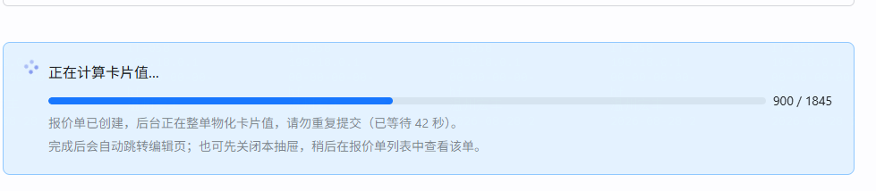

# repair-260828 · 建单物化仍需 106 秒 —— 逐行 DB 往返三根因

> **返修对象**：`task-260825-大单量导入建单性能`（主线交付，合 master merge `76c4b0ab`）
>
> ⚠️ **同日期有两个 `task-260825`，不要认错**：本返修属于**大单量导入建单性能**（`76c4b0ab`，`CreateQuotationMaterializer` 这条线）；
> 另一个 `task-260825-报价单大单量分页与料号查询`（`bef24579`）是**纯前端分页**，与本返修无关。
> 本目录一度误建在后者下（2026-08-28 主线自查后已移正，`INDEX.md` 的「归属存疑」标注同步消解）。
> **立项日期**：2026-08-28
> **状态**：④ 已写完，**停在闸门 A0，等方案裁决**（⑤⑥ 待补）

---

## ① 问题描述

**用户原话**：

> 「这个计算速度很慢，要等待的时间过长，你埋点测试一下具体是什么环节导致的 1845 条记录创建报价单很慢的原因」
>
> 「任务 [task-260825-大单量导入建单性能] 针对这个问题进行修复，但是没有效果」

**客观现象**：从基础数据导入建报价单（1845 行明细），前端抽屉停在「正在计算卡片值…」进度条上超过 **100 秒**才跳转编辑页。



进度条本身工作正常（`materialize-status` 只读轮询、分母 1845 = 明细行数、分子 = 已算出卡片值的行数），**没有报错、没有丢单、没有失败批**——纯粹是慢。

⚠️ **本次返修只针对「慢」**。task-260825 交付的正确性成果（异步化不再 30s 超时、批失败不连坐、批边界确定性、不丢单降级）**全部有效，不在返修范围**。

---

## ② 复现 / 发现方式

| 项 | 内容 |
|---|---|
| **谁怎么发现** | 用户真机操作后提出；主线用现有 B-10 埋点 + jstack 采样定位 |
| **前置数据** | 报价单 `10ca17fb-f02e-47ae-96ba-6dfc836c3c70`（1845 行，DRAFT，含核价模板）；对照单 `d50a65a6`（同规模，18:59 那次）|
| **操作步骤** | 报价单列表 → 从基础数据导入 → Step1 导入 19 Sheet → Step2 选模板 + 填名 → 创建报价单 → 观察抽屉进度条 |
| **环境 / 库** | 主工作区 dev server `localhost:8081`，默认 profile → `10.177.152.12:5432/cpq_db_0724` |
| **出现频率** | **必现**。两次独立建单（18:59 与 22:19）耗时 100481ms / 105906ms，四步分布逐项吻合，非偶发 |

---

## ③ 需求结果

| 编号 | 期望行为 | 对照 AC |
|---|---|---|
| **E-1** | 1845 行整单物化（①~④ 四步合计）耗时**显著下降**，具体目标值随 ⑤ 方案裁决后确定 | task-260825 `AC-1`/`AC-2`（大单量建单不超时）的续 |
| **E-2** | 单个业务操作的 SQL 条数与行数 N **无关**（`backend.md §1` 硬指标）：③④ 两段各自的 SQL 条数在 N=300 与 N=1845 下同量级 | 主任务 `AC-3`（N+1 硬指标）的**延伸**——原 AC-3 只覆盖了 D-1/D-3 那两处循环，本次三个根因是同一硬指标下**未被覆盖**的另外三处 |
| **E-3** | 进度条分子推进速率提升后，`materialize-status` 轮询语义不变（分母仍是明细行数、`done` 仍由 `ready==total` 派生） | task-260825 `AC-13`/`AC-14` |

**反向期望（防止修成「把告警关了」/「把防线拆了」）**：

| 编号 | 仍必须成立 | 为什么单列 |
|---|---|---|
| **E-4** | **`@DynamicUpdate` 的并发防线不得削弱**：并发事务改**不同列**时不得互相整行覆盖。`annual_volume` / `discount_*` / `subtotal` 在 warm × saveDraft 并发下不得被旧值冲掉 | 根因 C 直接指向这个注解。它是 `3a69ca97` 的「修法②」，A/B 实测 OFF **0/8** 存活 → ON **8/8**。**为了性能删它 = 把已修复的数据丢失事故放回来** |
| **E-5** | 卡片值 / Excel 值 / `subtotal` / 单头 `original_amount`·`total_amount` **逐位不变**（同一批输入，改动前后 md5 相同） | 本次是纯性能改动，任何值变化都是回归 |
| **E-6** | 批失败不连坐、`IS NULL` 谓词自愈、不丢单降级、批边界确定性排序 —— 主任务 B-28/B-29/B-30 的成果全部保留（对应其 `AC-12` 部分失败可恢复、`AC-15` B-29 核心断言） | 返修不得踩掉主任务成果。C-丙 换了落库机制，这几条最容易被无声破坏 |
| **E-7** | 单行写路径（`assignQuoteCardValues(li, json, quotationId)` 重载、`editCardValue`、树删除重灌等）行为不变 | 根因 A 的修法会碰 `preloadedCd` 的 fallback 分支，必须保住它对单行路径仍生效 |

---

## ④ 问题原因 / 报告

### 4.1 第一层：四步耗时（现有 B-10 埋点，无需新增代码）

`CreateQuotationMaterializer` 的 `[create-quotation-timing]` 埋点原文（`证据/埋点原文-四步与分批耗时.md`）：

```
22:19:04  quotation=10ca17fb  ①snapshotQuotation=506ms  ②ensureStructure=238ms
                              ③ensureCardValues=71362ms ④ensureExcelValues=33800ms  总计=105906ms
18:59:56  quotation=d50a65a6  ①=504ms ②=328ms ③=69364ms ④=30285ms 总计=100481ms
```

- ①② 合计 **0.7%**，③+④ 占 **99.3%**
- ③ 的 7 批各 10.4~12.0s、④ 的 7 批各 4.6~6.9s，**批间完全平坦，没有异常批、没有失败批**
- ③ 批次耗时求和 = **70190ms**，而 ③ 总计 71362ms → **整单级前置编排（missing 查询 / union / prefetch / 核价树 render / 冻结校验）只占 1172ms**

> 🔑 **这一条直接回答了「task-260825 为什么没效果」**：该任务修的是**编排层**（把整单级工作提到循环外、异步化、分批事务、锁超时）。埋点证明编排层现在只花 1.2 秒——**已经修干净了**。剩下的 104 秒是**逐行成本**，编排层优化在原理上就够不着。

### 4.2 第二层：jstack 采样 —— 不是 CPU 慢，是在等数据库

用产品自带的**幂等自愈端点**复现两段计算（`ensure-card-values` 打一张有 300 行 pending 的单、`ensure-excel-values` 打一张 Excel 全 pending 的单），期间 150ms 间隔 jstack 采样（原始栈见 `证据/jstack原始-*.txt`）：

| 段 | 命中该段的采样数 | 栈顶是 `sun.nio.ch.Net.poll`（阻塞等 PG 返回） |
|---|---|---|
| ③ `ensureCardValues` | 43 | **41（95%）** |
| ④ `ensureExcelValues` | 93 | **90（97%）** |

**CPU 基本没在算，时间全部花在 DB 往返次数上。** 这否定了「公式求值 / JSON 序列化太重」这条方向。

### 4.3 三个根因

#### 根因 A —— `assignQuoteCardValues` 逐行回查 componentData，本单 100% 落空（占 ③ 的 41%）

采样调用链（41 个等 DB 的采样里 **17 次**）：

```
QuotationLineComponentData.list(...)
  <- CardSnapshotService.assignQuoteCardValues(CardSnapshotService.java:808)
  <- CardSnapshotService.snapshotNewLinesCardValuesCore(:715)
  <- CardSnapshotService.snapshotNewLinesCardValuesBatch(:653)
```

`CardSnapshotService.java:806-808`：

```java
List<QuotationLineComponentData> cds = preloadedCd != null
    ? preloadedCd
    : QuotationLineComponentData.list("lineItemId", li.id);   // ← 循环体内查库
```

Pass1.5 的 `preloadComponentDataByLine`（`:912-914`）用 `Collectors.groupingBy(cd -> cd.lineItemId)` 建 Map——**`groupingBy` 只为「有 componentData 的行」建 key**。实测该单：

```sql
 总行数 | 无componentData行 | 有componentData行
   1845 |              1845 |                 0
```

→ `cdByLine.get(li.id)` **每一行都返回 `null`** → 每一行都落进三元的 else 分支 → **1845 条必定查回空结果的 SQL**。

Pass1.5 的注释写着「整批一次 IN 预载…本循环仍是『中间零查询』，批处理不变量不破」，**但在这单上预载 100% 落空，且被 `!= null` 三元静默降级吞掉，不报错、不打日志**。这是 `backend.md §1` 定义的教科书 N+1（循环体里出现查询）。

#### 根因 B —— `recomputeDraftHeaderTotals` 每批全量加载整单实体（占 ③ 的 49%）

采样调用链（41 个里 **20 次**，是 ③ 的最大单项）：

```
QuotationLineItem.list(...)
  <- CardSnapshotService.recomputeDraftHeaderTotals(CardSnapshotService.java:894)
```

`CardSnapshotService.java:894`：

```java
List<QuotationLineItem> all = QuotationLineItem.list("quotationId", q.id);  // 只为累加 subtotal
```

- 加载**整单 1845 行完整实体**，实测 `sum(pg_column_size(li.*))` = **2912 kB**（含 `quote_card_values` / `costing_card_values` 两个大 JSONB 列），**只为把 `subtotal` 相加求和**
- 而它被 `snapshotNewLinesCardValuesCore` 的 Pass2c 调用 = **每批一次，7 批 = 7 次全量加载**

这与 **B-24 已经修过的那一处完全同型**——B-24 的注释原文：「会把整单全部完整实体（含大 JSONB 列，1845 行实测 ≈2.7MB）连表带列一并加载，只为取出一串 UUID id……实测耗时 20~90s」。**同一个坑，同一个类，这一处漏网了。**

⚠️ **不能简单换成 `SELECT sum(subtotal)` 聚合**：方法注释明确写了理由——`QuotationLineItem.list()` 对本批次内的行按 Hibernate 一级缓存**身份**返回的就是刚被改脏的同一个实例，**天然读到覆盖后的 `subtotal`，不需要 flush**；改 JPQL 聚合会绕开一级缓存读到旧值。这是真实约束，修法必须正面处理它（**这正是 A0 要裁决的岔路之一**）。

#### 根因 C —— `@DynamicUpdate` 使 JDBC batch 全程失效（④ 的主因，71/93 采样）

④ 的采样里 **71 次**栈形态一致，关键帧：

```
UpdateCoordinatorStandard.doDynamicUpdate(:962)
MutationExecutorSingleNonBatched.performNonBatchedOperations(:53)   ← 非批量！
AbstractMutationExecutor.performNonBatchedMutation(:145)
PgPreparedStatement.executeUpdate → Net.poll（等 PG）
   ...上游是 SessionImpl.flushBeforeTransactionCompletion → Narayana commit
```

配置里 JDBC batch 是**开着**的（`application.properties:62-64`）：

```properties
quarkus.hibernate-orm.jdbc.statement-batch-size=100
hibernate.order_inserts=true
hibernate.order_updates=true
```

但 `QuotationLineItem` 上的 `@org.hibernate.annotations.DynamicUpdate`（**全工程唯一一个带此注解的实体**）让 Hibernate 走动态列 UPDATE 路径 → `MutationExecutorSingleNonBatched` → **每行一条独立 UPDATE 往返**。1845 行 = **1845 次 round-trip**。

**连带影响（重要）**：③ 的 Pass2 注释写着「一次性赋托管实体 4 字段（中间零查询）→ commit 单次 flush，**P1 batch 合并 N 条 UPDATE**」——**这个前提同样被 C 破坏了**。③ 的写入也没有 batch。所以 C 同时影响 ③ 和 ④ 两段。

**引入时间线（两个提交各自都对，是叠加后失效）**：

| 日期 | 提交 | 做了什么 | 当时的判断 |
|---|---|---|---|
| 2026-06-26 | `ba702814` | 开 `statement-batch-size=100` | 「saveDraft 落库远程往返 **770→个位数**」——当时 batch 确实生效 |
| 2026-08-06 | `3a69ca97` | 给 `QuotationLineItem` 加 `@DynamicUpdate`（task-0729「修法②」） | 注解注释原文：「代价是**失去 JDBC 语句缓存复用**（**本实体的更新非高频热点，可接受**）」 |

🔑 **根因不是某一处写错了，而是那句成本判断在新场景下失效**：2026-08-06 时 `QuotationLineItem` 的更新确实不是高频热点；而 task-260825 引入的**整单 1845 行物化**恰恰把它变成了全项目最高频的写点。

⚠️ **`@DynamicUpdate` 不能删**（见 E-4）：它治的是 4/4 复现的真实事故（warm 的陈旧内存快照整行写回，把用户改的 `annual_volume`/`discount_*` 静默冲掉），A/B 定量 OFF **0/8** → ON **8/8**。已登记的已知边界见 `BL-0130`（同列并发仍 last-write-wins，需 `@Version` 根治）与 `BL-0131`（warm × saveDraft ABBA 死锁，`@DynamicUpdate` 正向缓解）。

### 4.4 影响面

| 面 | 说明 |
|---|---|
| **直接受害** | 大单量建单物化（③④）。1845 行 ≈ 106s；根因 A/B/C 均随行数线性放大 |
| **同源受影响（未实测，需在 ⑤ 评估）** | 任何走 `snapshotNewLinesCardValuesCore` 的路径（`ensureCardValues` 自愈、`submit` 冻结前 force 重算）；任何整单 `ensureExcelValues`（开 Excel 视图 / 导出 / 提交） |
| **不受影响** | 单行写路径（编辑失焦、树删除重灌）——N=1，三个根因都不放大 |
| **数据正确性** | **无影响**。三个根因都只影响耗时，不产生错值（这也是它能潜伏至今的原因） |

### 4.5 为什么测试没拦住

1. **没有性能断言**：`test.md` 的 AC 追溯矩阵覆盖的是「不超时 / 不丢行 / 批失败不连坐」等**正确性**判据，`SqlCountNPlusOneGuardTest` 存在但**未覆盖 `snapshotNewLinesCardValuesCore` 这条路径**——根因 A 的循环体查库因此没被拦。
2. **根因 A 依赖数据形态**：只有当行**没有** componentData 时 `groupingBy` 才 miss。有 componentData 的测试夹具走的是 `preloadedCd != null` 分支，**测试跑的是另一条分支**。
3. **根因 C 无处可断言**：`@DynamicUpdate` 与 `statement-batch-size` 分属实体注解与配置文件，两者都「按自己的说明书正确工作」，失效只发生在**叠加处**，任何单点测试都测不出来。
4. **B-16 其实已经给过信号但归因不全**：task-260825 实测「chunk=2000（1 批）③=51250ms；chunk=300（7 批）③=92376ms（+80%）」，当时正确地定位到 `bomTreeRenderService.render` 被重复执行 chunk 次并提到了循环外——**但没有继续排查还有谁也是「整单级工作留在被多次调用的方法体内部」**。`recomputeDraftHeaderTotals`（根因 B）就是同一模式的第二个实例，被漏掉了。

---

## ⑤ 修复方案

> 闸门 A0 裁决（2026-08-28，用户）：**根因 B 取 B-丙、根因 C 取 C-丙**；根因 A 无岔路，未进 A0。

### 5.0 三修的耦合关系（先看这个，否则会以为可以拆开做）

**B-丙 是 C-丙 的前置条件，两者不是简单叠加**：

- C-丙 要让批量落库不走 Hibernate 脏检查，就必须让这批实体在赋值时**处于游离态**（否则 commit 时 Hibernate 仍会按 `@DynamicUpdate` 逐行 flush 一次，原生写等于白做）。
- 而现状阻止 detach 的**唯一**障碍，正是 `recomputeDraftHeaderTotals` 依赖「一级缓存按身份返回刚改脏的同一实例」来读新 `subtotal`（`:882-886` 注释）。
- B-丙 把它移出批循环 + 改聚合读库后，该依赖**消失**——各批已 `REQUIRES_NEW` 提交，聚合读到的就是权威值。detach 才成为安全动作。

🚫 **因此 B-丙 必须先于 C-丙 落地，不许调换顺序，也不许只做 C-丙。**

### 5.1 修法 A —— 预载补全，消除逐行回查

| 项 | 内容 |
|---|---|
| **改哪个文件** | `CardSnapshotService.java` |
| **怎么改** | `preloadComponentDataByLine`（`:911-914`）在 `groupingBy` 之后，对入参 `lineIds` 里**未出现在结果 Map 中的每个 id 补一个空列表**（`putIfAbsent(id, List.of())`），使返回的 Map 对「预载过但没有 componentData」的行返回**空列表而非 `null`** |
| **为什么改预载方而不是调用方** | 该方法的 javadoc 已经写明「批量路径务必预载后传入，否则会退化成逐行查库」——**纪律是对的，是实现没兑现契约**。补在预载方 = 让契约在源头成立，所有现有及未来调用方一并受益；补在调用方（`getOrDefault`）只治这一处，下一个调用方还会踩 |
| **🔒 不许动的地方** | `assignQuoteCardValues` 里 `preloadedCd != null ? … : QuotationLineComponentData.list(…)` 这条 fallback **原样保留** —— 单行写路径（`assignQuoteCardValues(li, json, quotationId)` 重载显式传 `null`）依赖它（E-7） |
| **影响面** | 批量路径 SQL 条数 `N+1 → 1`。值不变（空列表与「查回空结果」在下游 `for (cd : cds)` 里逐位等价） |
| **协议级** | 否 |

### 5.2 修法 B-丙 —— 单头总额移出批循环 + 改聚合

| 项 | 内容 |
|---|---|
| **改哪个文件** | `CardSnapshotService.java` |
| **怎么改** | ① `snapshotNewLinesCardValuesCore` 的 Pass2c **不再**调 `recomputeDraftHeaderTotals`，改为由**公开入口**负责：`ensureCardValuesDetailed` 在**全部批次循环结束后**调一次；② `recomputeDraftHeaderTotals` 内部把 `QuotationLineItem.list("quotationId", q.id)`（整单完整实体 2912 kB）换成**只读 `subtotal` 的聚合查询** |
| **🔒 单行路径怎么办** | `snapshotNewLinesCardValues`（非批量的那个公开入口）**仍需在自己调用完 Core 之后调一次** `recomputeDraftHeaderTotals` —— 它没有「批循环结束」这个时点。**两个公开入口各自负责，Core 不再负责**（与 B-16 处理 `render` 时确立的是同一条纪律：整单级工作不留在被多次调用的方法体内部） |
| **为什么聚合此时安全** | 移出循环后，各批已通过 `REQUIRES_NEW` **各自提交**，`subtotal` 已在库里。聚合读到的是权威值，不再依赖一级缓存身份。`:882-886` 那段「故意不写聚合」的注释所描述的前提**在新调用位置上已不成立**——⚠️ **该段注释必须同步更新**，注明原因与新位置，否则下一个人会照着旧注释把它改回去 |
| **影响面** | 单次调用数据量 2912 kB → 数十字节；调用次数 7 → 1。合计省约 33s |
| **协议级** | 否 |

### 5.3 修法 C-丙 —— 物化路径改原生批量 UPDATE

**核心思路：`@DynamicUpdate` 原样保留、对其它所有写路径继续生效；只把「整单物化」这一条批量路径的落库动作，从 Hibernate 脏检查换成显式的固定列集批量写。**

「只写本次真正变化的列」这件事的**目标不变**，只是从 Hibernate 运行时推断，换成我们自己写死一份固定列集——语义一致，但可以进 JDBC batch。

| 项 | 内容 |
|---|---|
| **改哪个文件** | `CardSnapshotService.java`（`snapshotNewLinesCardValuesCore` 的 Pass2、`snapshotNewLinesCardValuesBatch`、`ensureExcelValuesBatch`） |
| **③ 的固定列集** | `quotation_line_item`：`quote_card_values`(jsonb) / `costing_card_values`(jsonb) / `subtotal`(numeric) / `quote_values_at` / `card_snapshot_at`；`quotation_line_component_data`：`subtotal`（第二条批量语句，仅当本批有 cd 时发） |
| **④ 的固定列集** | `quotation_line_item`：`quote_excel_values`(jsonb) / `costing_excel_values`(jsonb) |
| **怎么写** | 用 `em.unwrap(Session.class).doWork(conn -> …)` + `PreparedStatement.addBatch()/executeBatch()`，**不用字符串拼 `VALUES` 列表**（参数绑定安全、无注入面、JSONB 用 `setObject(i, json, Types.OTHER)` 或 `?::jsonb`）|
| **🔒 detach 纪律（本修法的关键，做错就等于没改）** | 在 Pass2 赋值**之前**，把本批的 `QuotationLineItem` 与 `QuotationLineComponentData` 全部 `em.detach(...)`。赋值随后作用在**游离对象**上、不触发脏检查，commit 时 Hibernate **零 UPDATE**，落库完全由原生批量语句负责。<br>🚫 **不许改成「先赋托管实体、写完再 `em.clear()`」**——那样在 clear 之前 flush 一旦被任何查询触发（`flush-before-query`），就会先发出 1845 条 UPDATE，改动完全失效且不报错 |
| **🔒 收敛点纪律怎么保住** | `assignQuoteCardValues` **一行不改**，仍是唯一入口，仍走 `CostingSubtotalUtil` 唯一口径，「不覆盖的三种情况」与 `SubtotalOverrideCounter` 计数全部原样。**本修法只换落库机制，不换「算什么值」**——方向3 T1 收敛点管的是后者 |
| **影响面** | ③④ 两段的 UPDATE 往返 `N → ceil(N/chunk)`（1845 → 7）。预计总耗时 106s → 约 12~15s |
| **协议级** | **是**。绕开 ORM 写路径 = 新增一条持久化通道，须在 `backtask.md` 列检查点清单逐项勾（见 `change-protocol.md`）：detach 覆盖完整性 / 事务边界 / JSONB 绑定 / 时间戳一致性 / 失败批语义（B-28）/ `IS NULL` 自愈谓词仍成立 |

### 5.4 不改的东西（划清边界，防止顺手扩范围）

- 🚫 **不删、不改 `@DynamicUpdate`**（E-4）
- 🚫 **不做 `@Version` 乐观锁**——那是 `BL-0130`，独立设计题
- 🚫 **不动 task-260825 的成果**：异步化、`materialize-status` 只读探针、600s 事务包装、10s `lock_timeout`、批失败不连坐、B-30 确定性排序，全部原样
- 🚫 **不动前端**：进度条、轮询、自愈触发逻辑一律不改（详见 `fronttask.md`）
- 🚫 **不碰 `refreshDraftQuoteCards`**：它是另一条路径（重 expand + 保编辑），本次不在范围

**已否决备选**：
- **B-甲（只移出循环）** —— 保留了一次无谓的 2912 kB 大对象加载，且移出后聚合已无风险，没有理由不一并做。
- **B-乙（只改投影）** —— 留在批循环内就仍依赖一级缓存脏值，需要额外实证 flush 时机；且它不解除 detach 的障碍，会挡住 C-丙。
- **C-甲（本次不动 C）** —— ④ 的 34s 原样留着，只能到 42s。
- **C-乙（`@Version` 乐观锁）** —— 风险高、是独立设计题，已登记 `BL-0130`。

---

## ⑥ 验收标准

> 环境统一：dev server `localhost:8081` + 默认 profile（`10.177.152.12:5432/cpq_db_0724`），1845 行真实单。
> **基线数据（改动前，已实测存档 `证据/埋点原文-四步与分批耗时.md`）**：①506ms ②238ms ③71362ms ④33800ms 总计 **105906ms**。

### 阴性 —— 原问题不再复现（性能）

- **AC-1（单点）**：以 `admin` 登录，从基础数据导入建一张 1845 行报价单（客户/模板同基线单 `10ca17fb`）。后端日志 `[create-quotation-timing]` 那一行的**总计 ≤ 20000ms**，且 **③ ≤ 12000ms、④ ≤ 8000ms**。截取该行日志原文作为证据。
- **AC-2（单点）**：同次建单，`[ensure-cardvalues-batch]` 7 条日志中**每条 `elapsed` ≤ 2000ms**（基线为 10435~12004ms）。
- **AC-3（边界）**：`ensureExcelValues` 单独触发（对一张 Excel 全 pending 的 1845 行单 `POST /quotations/{id}/ensure-excel-values`），`[lazy-excel]` 汇总行**总耗时 ≤ 8000ms**（基线 33637ms）。

### 阴性 —— N+1 硬指标（`backend.md §1`）

- **AC-4（单点）**：③ 段对 `quotation_line_component_data` 的 SELECT 条数**与行数无关**。判据：同一张模板/客户，用 N=300 与 N=1845 两次运行，该表 SELECT 条数**同量级且不随 N 线性增长**（推荐口径每表 ≤2 条/批）。用 `SqlCountNPlusOneGuardTest` 新增用例断言，而不是靠读日志。
- **AC-5（单点）**：③④ 两段对 `quotation_line_item` 的 **UPDATE 语句往返次数 = 批数**（1845 行 / chunk=300 → **7 次**，不是 1845 次）。判据：`pg_stat_statements` 不可用，改用 JDBC 层计数断言或 `PreparedStatement.executeBatch()` 调用次数埋点。

### 阳性 —— 该防的仍防住（并发防线不得削弱）

- **AC-6（序列）**：`@DynamicUpdate` 防线仍生效。复刻 `3a69ca97` 的 A/B 判据：并发 warm × saveDraft，改**不同列**（一侧写 `quote_card_values`，另一侧写 `annual_volume`），断言 `annual_volume` 哨兵**存活 8/8**（基线：注解 OFF 时 0/8）。
- **AC-7（边界）**：批失败不连坐仍成立（B-28）。人为让第 3 批命中 `lock_timeout`，断言：其余 6 批正常提交、`EnsureResult.failedBatches=1/failedRows=300`、`warnings` 出现「卡片值物化部分未完成：1 批（共 300 行）未完成」、**再次触发时按 `IS NULL` 谓词只补算那 300 行**（不重算已完成的 1545 行）。

### 无副作用 —— 值逐位不变

- **AC-8（单点）**：同一张导入记录，改动前 / 后各建一次单，**逐行比对 `quote_card_values`、`costing_card_values`、`quote_excel_values`、`costing_excel_values`、`subtotal` 的 md5 完全相同**（时间戳列 `quote_values_at`/`card_snapshot_at` 除外）。
- **AC-9（单点）**：单头 `quotation.original_amount` / `total_amount` 与改动前**逐位相同**（B-丙 改了它的计算位置与查询方式，这是它的专项断言）。
- **AC-10（序列）**：单行写路径不受影响。打开该单编辑页 → 某格改值失焦 → 切走再切回 → 刷新页面，断言该行 `subtotal` 与页签小计**按新值更新且持久**（E-7：`preloadedCd == null` 的 fallback 仍生效）。
- **AC-11（边界）**：**有** componentData 的行不回归。选一张 componentData 非空的单跑 ③，断言各页签 `cd.subtotal` 被正确覆盖、`[subtotal-single-source]` 计数日志与改动前一致（修法 A 只补空列表，不得影响非空分支）。
- **AC-12（边界）**：空/极小单不炸。对 0 行与 1 行的报价单跑 ③④，断言不抛异常、`materialize-status` 的 `done=true`（`total=0` 也算 done）。

### 自检证据（`CLAUDE.md` §6.1，闸门 B 汇报必带）

- **AC-13**：后端强制重启后 `curl /api/cpq/components` → **401**（不是 500）；本次**无 Flyway 迁移**（纯代码改动，不动 schema），须在汇报中显式声明「无迁移」。
- **AC-14**：N+1 自检声明按 `backend.md §1` 格式书写，逐个列出本次改动的循环体及其判定结论。
