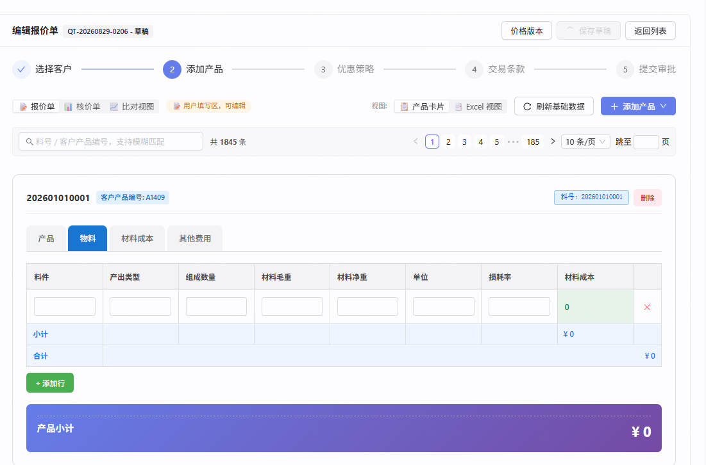

# repair-260829 · 导入后跳转报价单数据为空 —— 卡片值算早了，骨架值把自己锁死

> **返修对象**：`task-260825-大单量导入建单性能`（D-5 异步化 + 前端轮询，`ca243876`）
>
> ⚠️ **本目录是第三个故障，与同任务下另外两个不要混**：
> - `repair-260828-建单物化逐行DB往返`（合 `a1a68112`）修的是**慢**（105906ms → 5900ms）
> - `repair-260829-异步物化事务上下文缺失`（合 `c1daeef7`）修的是 **①步空转写 0 行**（CDI 传播竞态）
> - **本目录**修的是 **③步算早了** —— ①步数据是齐的，③步在它写完前就算了一遍空的并落库
>
> **立项日期**：2026-08-29
> **闸门 A0**：已在对话中裁决（用户选**方案 B：校验产物**），⑤⑥ 直接落
> **状态**：文档已齐，待闸门 A

---

## ① 问题描述

**用户原话**：

> 「那这个页面的页签为空应该是谁来处理，是要等 session[修复draft超时问题] 结束后吗?」
>
> 「B，立项修好这个导入后跳转到报价单数据为空的问题」

**客观现象**：从基础数据导入建报价单后自动跳转到编辑页，产品卡片各页签**只有一行空行**，小计 / 合计 / 产品小计均为 **¥0**。



**与前两个故障的判然区别（一张表说清）**：

| | 卡片全空（`repair-260829-异步物化事务上下文缺失`，已修） | saveDraft 409（并发会话在修） | **本故障** |
|---|---|---|---|
| ①步写 `comp_data` | ❌ **0 行** | ✅ 正常 | ✅ **7380 行，`snapshot_rows` 全有数据** |
| ③步算卡片值 | 在空数据上算 | 正常 | ❌ **在 ①步没写完时就算** |
| 库内表现 | `cd=0`、`qcv` 骨架 | 数据完好、保存请求 409 回滚 | **`cd=7380` 数据齐，但 `qcv` 5 页签 `baseRows` 全 0** |
| 是否自愈 | 否 | 不适用 | **否 —— 且永久锁死**（见 ④） |

🚨 **本故障最恶劣的一点：数据源明明是好的，却永远算不出来。** `snapshot_rows` 7380 行全有数据，只因为卡片值那一栏被写过一次空值，`IS NULL` 判据从此判定「已算过」，**再也不会重算**。

---

## ② 复现 / 发现方式

| 项 | 内容 |
|---|---|
| **谁怎么发现** | 用户真机导入建单后截图报「页签为空」；主线查库 + 日志定位 |
| **前置数据** | `QT-20260829-0206` = `d1c42bbd-7051-46ed-b54f-9c5467346f83`（1845 行，DRAFT，客户 `1f5818d8`，报价模板「正泰模板1」`99ff6aa4`）|
| **操作步骤** | 报价单列表 → 从基础数据导入 → Step1 导入 → Step2 选模板填名 → 创建报价单 → **等抽屉自动跳转** → 观察 Step2 各页签 |
| **环境 / 库** | 主工作区 dev server `localhost:8081`，默认 profile → `10.177.152.12:5432/cpq_db_0724` |
| **出现频率** | **偶发（时序决定）**。同批 `QT-20260829-0205` 正常、`0206` 中招 —— 差别只在轮询与 ①步的相对时序（见 ④） |

**故障时间线**（`backend-dev.log`，完整见 `证据/E1`）：

```
18:47:41.958  Created quotation QT-20260829-0206
18:47:43.107  V6 commit: 服务端建明细行 1845 条
18:47:47.559  [ensure-cardvalues] 补算 1845 行     ← 物化才跑 6 秒，comp_data 还没写完
18:47:58.291  [saveDraft-diag] received lineItems=1845
18:48:09      用户截图（物化仍在跑）
18:48:13.354  [create-quotation-timing] 物化完成
```

---

## ③ 需求结果

| 编号 | 期望行为 | 对照 AC |
|---|---|---|
| **E-1** | 从基础数据导入建单并自动跳转后，各 driver 页签**渲染出非空数据行**，产品小计与总价**非 0**，**无需用户手动刷新或重算** | `task-260825` `AC-1` 的续；本任务 `AC-1` |
| **E-2** | ③步 `ensureCardValues` 在数据源未就绪时**不得把空结果落库** —— 宁可不写、留 `NULL` 让后续自愈，也不能写下会锁死自己的骨架值 | 本任务 `AC-2` |
| **E-3** | 已被骨架值锁死的行**能够自愈**（下次 `ensure-card-values` 应重算而非跳过） | 本任务 `AC-3` |

**反向期望（防止修成「把自愈关了」/「每次都重算」）**：

| 编号 | 仍必须成立 | 为什么单列 |
|---|---|---|
| **E-4** | **合法的空结果仍可落库**：组件视图确实返 0 行（业务上就是没有数据）时，卡片值该写还得写，**不能被本次守卫误判为「算早了」** —— 判据必须能区分「源无数据」与「源有数据但没算出来」 |
| **E-5** | `IS NULL` 自愈判据的**性能收益不得丢失**：不能改成「每次都重算」。1845 行全量重算实测 **27s**，若每次打开都重算是不可接受的回归 |
| **E-6** | 不改 `ensure-card-values` 的**对外契约**（路径 / 方法 / 响应体 / 状态码），前端轮询语义不变 | 该端点是 `task-260825` D-5 前端轮询的依赖；并发会话正在其响应体上加字段，改契约会撞车 |
| **E-7** | 不动 `repair-260829-异步物化事务上下文缺失` 的成果（`MaterializeExecutor` / `checkMaterializeOutcome`）与 `repair-260828` 的批量化成果 | 同一文件三次返修，不得互相踩掉 |
| **E-8** | 核价侧（`costing_card_values`）与非建单路径（`saveDraft` / 加产品 / 从基础刷新）行为**逐位不变** | `AC-17` 核价侧零回归的延续 |

---

## ④ 问题原因 / 报告

### 一句话根因

`ensure-card-values` 这个端点**既是「查进度」又是「触发计算」**；前端按 D-5 设计轮询它等待物化完成，而它在 ①步还没写完 `comp_data` 时就算了一遍卡片值 —— 算出全空的骨架值并落库；此后 `IS NULL` 自愈判据看到卡片值非 NULL，判定「已算过」而**永久跳过**，数据源再齐也不会重算。

### 因果链

| # | 时刻 | 发生什么 |
|---|---|---|
| 1 | 18:47:41 | 建单，明细行 1845 落库，`materialize` 异步启动 |
| 2 | 18:47:43~18:48:13 | ①步 `snapshotQuotation` 展开 driver 写 `comp_data`（**耗时约 30 秒**） |
| 3 | **18:47:47** | 前端轮询的**自愈逻辑**误判「后台任务死了」，主动调 `POST /quotations/{id}/ensure-card-values` —— **此时 ①步只跑了 6 秒，`comp_data` 远未写完**（精确触发点见下方「触发点」小节） |
| 4 | 同上 | 该端点**不只查进度，它真的算**：在残缺/空的 `comp_data` 上渲染 → 5 个页签 `baseRows` 全 0 |
| 5 | 同上 | **空结果落库**（`quote_card_values` 从 NULL 变成非 NULL 的骨架 JSON） |
| 6 | 18:48:13 | ①步终于写完，`comp_data` 7380 行、`snapshot_rows` 全有数据 |
| 7 | 之后 | 任何一次 `ensureCardValues(qid, force=false)` 的 `IS NULL` 判据都看到「非 NULL」→ **跳过，不重算** |
| 8 | 用户 | 打开永远是空表 + ¥0，**且不会自愈** |

### 触发点（2026-08-29 由并发会话 `修复draft超时问题` 定位，本线已逐项复核属实）

`cpq-frontend/src/services/quotationService.ts:329`，`pollMaterializeStatus` 里的自愈分支：

```js
if (status && status.pending > 0 && status.inFlight === false && Date.now() - lastHealAt > healCooldownMs) {
    lastHealAt = Date.now();
    await this.ensureCardValues(id);      // ← 就是这里提前触发了计算
}
```

设计意图是「`pending>0` 且 `inFlight===false` ⇒ 后台任务死了/从没起过 ⇒ 触发一次自愈」。

🔑 **判据失效的原因：`inFlight` 覆盖不到 ①步。**
本线复核：单飞锁 `QUOTATION_CALCULATION_LOCK_KEY_SQL` **只在 `CardSnapshotService`**（`:1739`/`:1746`/`:1815`，即 ③步 `ensureCardValues`）获取，
`ConfigureSnapshotService`（①步 `snapshotQuotation`）**完全不持这把锁**。于是 ①步写 `comp_data` 的那 ~22 秒里：

| 条件 | 实际 | 应然 |
|---|---|---|
| `pending > 0` | ✅ 成立（卡片值当然还没算） | — |
| `inFlight === false` | ✅ 成立（①步不持锁） | ❌ **任务其实活得好好的** |
| ⇒ 自愈触发 | **误触发** | 不该触发 |

`healCooldownMs`（默认 30s）的节流解释了为什么只触发了一次，与日志里 `18:47:47` 仅一条 `ensure-cardvalues` 吻合。

⚠️ **另有四处不受 `inFlight` 判据保护**：`QuotationWizard.tsx:626 / 633 / 816 / 821`（打开页面的 warm 兜底）**无条件**调 `ensureCardValues`。
本线已复核属实 —— 用户若在物化期间打开编辑页，同样会在数据没齐时算。**这是 ⑤ 的产物自检不可省的直接理由**（信号类防线兜不住它们）。

### 证据链（可复跑）

**证据 A —— 故障态：数据源齐、卡片值全空**

```
li=1845   cd=7380   cd_有snapshot_rows=7380   qcv非NULL=1845   sub_nz=0   total=0
5 个页签 baseRows：产品 0 / 其他费用 0 / 材料成本 0 / 正泰产品小计1 0 / 物料 0
```

**证据 B —— 清空重算立刻恢复（证明数据源本来就是好的）**

清 `quote_card_values`/`costing_card_values` → `POST ensure-card-values`（01:50:28 → 01:50:55，**27 秒**）：

| 页签 | baseRows 非空 | 最大行数 |
|---|---|---|
| 产品 | **1845** | 1 |
| 其他费用 | **1845** | 1 |
| 材料成本 | **1845** | 6 |
| 物料 | **1845** | 2 |
| 正泰产品小计1 | 0 | 0（`SUBTOTAL` 类型，本就不出数据行，与健康单 `0198`/`0205` 一致）|

`sub_nz` 0 → **1845**，`total_amount` 0 → **-82729.665597520000**（与全部健康单逐位相同）。

**证据 C —— 时序才是变量，不是数据**：同批同模板的 `QT-20260829-0205` 正常（4 个数据页签全有内容），`0206` 中招。两者唯一差别是轮询与 ①步的相对时机。

### 引入时间线

| 提交 | 日期 | 做了什么 | 当时为什么不犯 |
|---|---|---|---|
| — | — | `ensureCardValues` 的 `IS NULL` 自愈判据（lazy-cardvalues 既有设计） | 同步物化时代：③步永远在 ①步之后跑，不存在「算早了」 |
| **`ca243876`** | **2026-08-28** | **D-5：物化异步化 + 前端改轮询 `ensure-card-values`** | **← 缺陷引入点**。轮询方与计算方是同一个端点，而物化变成了后台异步 ⇒ 首次出现「①步没写完，③步已被外部触发」 |
| `c1daeef7` | 2026-08-29 | 修 ①步空转（CDI 传播竞态） | ①步修好后**才暴露本故障** —— 此前 ①步本来就写 0 行，两种故障表现相同、被前者掩盖 |

### 影响面

| 面 | 说明 |
|---|---|
| **触发条件** | 仅「从基础数据导入建单 + 前端自动跳转」路径；且需轮询恰好落在 ①步完成之前（1845 行时窗口约 30 秒，命中率高） |
| **不受影响** | `saveDraft` / 加产品 / 从基础刷新 / 核价侧 —— 它们不在物化窗口内触发 |
| **数据安全** | **不丢数据**。`comp_data`、`snapshot_rows`、明细行全部完好，坏的只是派生的卡片值 |
| **存量** | 全库扫描（2026-08-29 01:56，判据：`qcv` 非 NULL 且所有页签 `baseRows` 合计 = 0 而 `snapshot_rows` 非空）＝ **0 行**（`0206` 已由主线修复）|
| **可恢复性** | 清 `quote_card_values` 后重算即可，实测 27s/1845 行 |

### 为什么测试没拦住

| # | 原因 |
|---|---|
| 1 | **单元/集成测试里 ①步是同步跑完的** —— 没有「①步进行中」这个状态，构造不出本场景 |
| 2 | **`task-260825` 的 AC 只断言「不超时 / 不丢单 / 卡片值就绪」**，而骨架值**恰好满足「非 NULL = 就绪」** —— `fillStatus` 判 `cardValuesReady=true`，一路绿灯 |
| 3 | 🚨 **日志同样在说谎**：`[ensure-cardvalues] 补算 1845 行（分 7 批…）` 看起来干得漂漂亮亮，**它说的是「处理了多少行」，不是「算出了什么」**。与本任务族前两次同型（`create-quotation-timing` 四步全绿 / 「不碰 snapshot_rows」在 SQL 层不成立），见 `RECORD.md` 规则提议「必须在 X 实际发生的那一层取证」 |

---

## ⑤ 修复方案

> 🚦 **闸门 A0 已裁决（2026-08-29，用户选定）：方案 B —— 校验产物，不依赖状态标志。**

### 改动 1（主体）：③步落库前自检 —— 算出来是空的就不写

**文件**：`cpq-backend/src/main/java/com/cpq/quotation/service/CardSnapshotService.java`

在卡片值落库前加一道判据，命中即**跳过该行的落库**（保持 `quote_card_values` 为 `NULL`，留给后续自愈）：

```
算出的卡片值「所有页签 baseRows 合计 == 0」
  且  该行 comp_data 的 snapshot_rows 「至少有一行非空」
⇒ 判定「算早了」，不落库 + 打 WARN（可观测，不静默）
```

🚨 **两个条件缺一不可**，第二个条件专为 `E-4` 而设：
- 只有第一个条件 → **合法空结果**（组件视图确实返 0 行、业务上就是没数据）会被误判、永远写不进去
- 加上第二个条件 → 「源有数据但没算出来」才拦，「源本来就没数据」照常落库

### 改动 1b：后端 `ensureCardValues` 自检 `MaterializeRegistry`（2026-08-29 开工后补齐）

**文件**：`cpq-backend/src/main/java/com/cpq/quotation/service/CardSnapshotService.java`

③步进入计算前判断：**该 quotation 正在物化中（`materializeRegistry.isInProgress(qid)`）⇒ 本次不计算、不落库**（`IS NULL` 保持，留待后续自愈），并打 WARN（与改动 1 的 WARN 分开，便于分辨「物化中拒算」与「算完发现是空的」）。

🔑 **为什么必须补这一层 —— 改动 1 有一个兜不住的边界**（主线审代码时推演发现）：

```
t0  ①步开始（还没写任何 comp_data）
t1  build 读 comp_data → 空 → 算出空卡片值
t2  cds 预载读 comp_data → 仍空 → hasSourceData = false
t3  改动 1 的判据不拦（条件②不成立）→ 骨架值照样落库
t4  ①步完成，comp_data 有数据
t5  IS NULL 跳过 → 永久锁死                    ← 缺陷复现
```

改动 1 兜住的是「①步**写了一部分**」，兜不住「①步**一行都还没写**」。而 `0206` 的触发点（自愈在物化启动 **6 秒**时误触发）恰恰可能落在后者 —— 1845 行的 ①步要 22 秒，头几秒很可能一行未写。

🔑 **为什么放后端而不是前端**：所有调用方都要经过后端 —— 前端四处无条件 warm、自愈逻辑、手动刷新、未来新增的任何调用点，**一律被这一层挡住**；放前端只能挡住改了判据的那一处。

📌 **这不是扩范围**：同一条 `AC-2`（卡片值不得被写成骨架值）的完整实现，原方案在该边界上不完整，属补齐。

### 三层防线的最终形态

| 层 | 位置 | 兜住 |
|---|---|---|
| **① 后端 `isInProgress` 拒算**（改动 1b） | `CardSnapshotService` ③步入口 | 物化进行中的**一切**计算请求，不论谁发起、不论 ①步写了多少 |
| **② 产物自检**（改动 1，主体） | `CardSnapshotService` 落库前 | registry 覆盖不到的残余：物化已结束但数据仍在途、其它未知原因算空 |
| **③ 前端判据修正**（并发会话 F-4，非本线） | `quotationService.ts` / `QuotationWizard.tsx` | 纯优化 —— 省掉物化期间的无效请求。**正确性已由 ①② 保证，此层可有可无** |

⚠️ **层 ③ 的定性因本次补齐而下调**：原本它是「更靠前一层的正确性防线」，现在后端 ①② 已闭合，它降级为**性能优化**。已知会并发会话。

### 改动 2：`MaterializeRegistry`（服务并发会话，顺带加）

**文件**：新增 `cpq-backend/src/main/java/com/cpq/basicdata/v6/service/MaterializeRegistry.java`；
在 `CreateQuotationMaterializer.materialize()` 开头 `begin(qid)`、**最外层 `finally` 里 `end(qid)`**。

`@ApplicationScoped` + `ConcurrentHashMap.newKeySet()`，内存态（重启丢失可接受 —— 进程重启物化本来也中断了，标志跟着消失语义正确）。

**为什么本次一并加**：它同时修好两个后果 —— 同一个根因（`inFlight` 覆盖不到 ①步）导致 ① 本线的自愈误触发（0206）、② 并发会话 F-4 的信号缺口。落点正是本次要改的 `CreateQuotationMaterializer`，两条线改同一文件容易撞车，**由本线加、对方只在 `QuotationResource.materializeStatus` 消费并修正其自愈判据**（改成 `pending>0 && inFlight===false && !materializeInProgress`）。

🔑 **两层防线，缺一不可**：

| 层 | 作用 | 兜不住什么 |
|---|---|---|
| **registry**（改动 2 + 对方前端接线） | 让它**根本不会算早** —— 修掉自愈误触发这个主要触发源 | `QuotationWizard.tsx:626/633/816/821` 四处**无条件** warm 调用（不看 `inFlight`，registry 除非那四处也加判断否则管不到） |
| **产物自检**（改动 1，本线主体） | 兜住**任何**原因导致的「算早了」，包括上述四处、手动刷新、未来新增的调用点 | — |

⚠️ **本线的修复主体是改动 1**，它独立成立、不依赖 registry。若只做 registry 不做自检，那四处 warm 调用仍会写下骨架值。
⚠️ `begin` 必须放在方法开头那句 `if (r == null || r.quotationId == null) return;` **之后**（否则 `qid` 还没取到）。

### 已否决备选

- **方案 A（物化未完成时拒绝计算）** —— 依赖状态标志，而标志会漏（同族前科：`backendBuiltLinesRef` 那个守卫就没拦住 import-auto-save）。产物自检不依赖任何状态。
- **用 `comp_data` 行数是否完整作判据** —— 期望值定不了：物化只写有 driver 的页签（本模板 4/5），`saveDraft` 写全部 5/5，取 5 会永久误判、取 4 在别的模板上失效（并发会话实测排除，本线采信）。
- **改成每次都重算（去掉 `IS NULL` 判据）** —— 违反 `E-5`，1845 行 27s，不可接受。

---

## ⑥ 验收标准

### 阴性 —— 原路径不再复现

**AC-1（单点）**　以销售角色，用与 `0206` 同一份基础数据（1845 料号）+「正泰模板1」走「从基础数据导入建报价单」，**等抽屉自动跳转**后立即打开 Step2：
4 个 driver 页签（产品 / 物料 / 材料成本 / 其他费用）**各自渲染出非空数据行**，产品小计与单头总价**均不为 0**，**全程无需手动刷新或重算**。

**AC-2（数据层）**　AC-1 同一张单，物化完成后查库：
`quote_card_values` 中「所有页签 `baseRows` 合计 > 0」的行数 == **1845**；`subtotal` 非 0 行数 == **1845**；`total_amount` ≠ 0。

**AC-3（自愈）**　构造一行「卡片值为骨架值（`baseRows` 全 0）+ `snapshot_rows` 非空」，调 `ensure-card-values`：
该行**被重算**且结果 `baseRows > 0`（即不再被 `IS NULL` 判据永久跳过）。

**AC-4（还原实验 · 不可省）**　把改动 1 改回去，用**并发多发**方式复现（参照 `repair-260829-异步物化事务上下文缺失` AC-3 的教训 —— 竞态类缺陷**不能用单发端到端验**）：
在 ①步进行中并发触发 ≥5 次 `ensure-card-values`，改动前**出现**骨架值锁死行，改动后**零**骨架值锁死行。
> 🚨 不做这条 = 白测。本缺陷是时序偶发（`0205` 正常 / `0206` 中招），单次通过不能证明修复有效。

### 阳性 —— 真问题仍能被抓住

**AC-5**　人为让 ①步产出的 `snapshot_rows` 齐全但渲染返回空，触发 ③步：
日志出现 **WARN** 级「算早了，跳过落库」记录，且 `quote_card_values` **保持 NULL**（而非写入骨架值）。
> 零改动基线上此场景会静默落库骨架值、无任何 WARN —— **本条在基线上必然失败**，符合阳性判据。

### 无副作用

**AC-6（合法空结果照常落库）**　组件视图合法返 0 行（`snapshot_rows` 为 `'[]'`、业务上确实没数据）时：
`quote_card_values` **正常落库**、内容为空页签，**不触发**改动 1 的守卫、**不留** WARN。
> 这条守着 `E-4`。判据的两个条件必须同时校验，只看「算出来是空的」会让本条红。

**AC-7（性能未劣化）**　`IS NULL` 自愈判据收益保留：对一张卡片值已就绪的 1845 行单连续两次调 `ensure-card-values`，**第二次识别出的"需要补算"行数 == 0**、耗时显著低于首次（不得退化成每次全量重算）。

**AC-8（其它路径逐位不变）**　对同一张已物化的单依次执行 `saveDraft` / 加产品 / 从基础刷新 / 核价侧渲染，
`quote_card_values`、`costing_card_values`、`subtotal`、`total_amount` 与改动前 **md5 逐位相同**。

**AC-9（契约不变）**　`POST /quotations/{id}/ensure-card-values` 的路径 / 方法 / 请求体 / 响应体 / 状态码**一字未变**（守 `E-6`，并发会话正在其响应上加字段）。

### 边界

**AC-10**　三种边界不误判：① 明细行 0 条的单；② 模板 driver 组件 0 个；③ 单个页签为 `SUBTOTAL` 类型（`baseRows` 本就恒为 0，如「正泰产品小计1」）——
**③ 尤其关键**：判据是「**所有**页签 `baseRows` 合计为 0」，健康单里 SUBTOTAL 页签单独为 0 属正常，不得因此被判「算早了」。

### 序列

**AC-11**　导入建单 → 自动跳转 → 立即打开 Step2（物化可能仍在跑）→ 等待物化完成 → 切走再切回 → 刷新页面：
最终 4 个数据页签均有内容、金额非 0，且**中间态不产生骨架值**（物化完成后不需要人工干预）。

### 自检证据

**AC-12**　闸门 B 汇报须同时给出：① **已自检**行（编译 0 错误 / 相关用例全绿 / 业务端点 401）；② **亲验证据**（AC-1 页面截图 + AC-2 SQL 原始输出 + AC-4 还原实验的改动前后对照）。
