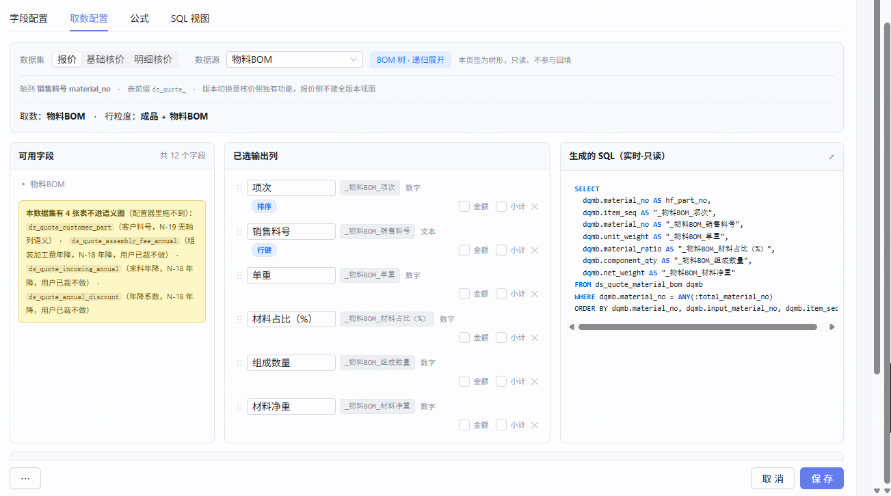

# task-260907 · 取数配置器补齐

> **状态**：立项中 · **闸门 A0 已通过（2026-09-07）** → 待闸门 A
> **来源**：用户 2026-09-07 真机使用后提出 4 条 + 追加 1 条（3 张年降表入语义图）。**第 ② 条已走路径 B 当场修完并合 master（`b8e9435b`），不在本任务范围。**
> **关联主任务**：`task-260904-页签类型收缩`（两批已合 master `0906d6f8` / `2a72b866`）、`task-260819-取数配置器`（已合 `00450d9b`）
> **为什么新建主任务而非挂 260904 下**：本次四项中，F-1（客户料号入语义图）反转的是 `task-260819` 的 N-19 决策、F-3 修的是跨两个任务的取数编译缺陷 —— **跨多个既有主任务 ⇒ 新主任务**（`task-docs.md §1`）。

---

## ① 背景与目标

`task-260904` 把「页签类型」从用户手选改成按数据源推导后，用户第一次真机连续使用取数配置器，暴露四个问题：

| | 问题 | 不做会怎样 |
|---|---|---|
| **F-1** | 「物料」数据源只有物料表，**拖不到客户料号**（客户料号表当初被排除在语义图外） | 用户配不出带客户料号/客户图号的报价页签，只能退回手写 SQL |
| **F-2** | 组件列表徽章还在显示已被淡化的「页签类型」 | 概念收缩做了一半：详情页看不到页签类型了，列表页还在显示，用户认知不一致 |
| **F-3** | 🔴 **物料BOM 页签界面说「递归展开」，生成的 SQL 却是平铺的** | **配置器配出来的 BOM 树页签是坏的** —— 只出一层、树建不起来。用户已在真机撞到 |
| **F-4** | **3 张年降表不在语义图里**（年降系数 / 组装加工费年降 / 来料年降），配置器里选不到 | 年降相关页签配不出来，只能退回手写 SQL |

**目标**：把配置器里**缺的数据源补齐**（客户料号并入物料、3 张年降表独立成源）、**修好坏掉的**（物料BOM 不递归），并让列表页与详情页的概念对齐。

---

## ② 范围

### 做什么

- **F-1 / B-1**：`ds_quote_customer_part` 接入语义图，「物料」数据源同时出两张表的列，**物料为主 + LEFT JOIN 客户料号**（用户裁决）
- **F-2 / B-2**：组件列表徽章由页签类型改为**数据源名**；未绑数据源的显示 **「—」**（用户裁决）
- **F-3 / B-3**：修复物料BOM 生成的 SQL —— **产出边式契约**（见下方 A0 裁决），行为与存量 `tab_type='BOM'` 组件一致
- **B-5**：`costing_bom_tree_config` 的 QUOTE 递归 SQL **改读新表 `ds_quote_material_bom`，不再读 V6 老表 `material_bom_item`**（用户 2026-09-07 裁决），
  并**接上 `customer_no` 的客户隔离 JOIN**（依赖下方跨会话前置）

### 🔗 跨会话前置依赖（用户 2026-09-07 裁决 + 已通知）

> **裁决原文**：「换表增加 +customer_no 维度，将所有报价侧的表都增加 customer_no 字段。将本次表增加客户字段的变更通知到会话 [报价数据导入切换到 ds_ 新表体系]」

| 项 | 归属 | 状态 |
|---|---|---|
| 28 张 `ds_quote_*` 表加 `customer_no` 列 + 导入链路填值 + 唯一约束同步扩 | **`报价数据导入切换到 ds_ 新表体系` 会话** | 已于 2026-09-07 通知，等对方节奏回复 |
| 递归 SQL 接上 `customer_no` JOIN | 本任务 **B-5** | ⛔ **阻塞于上一行** |

实测（2026-09-07 dev 库）：`ds_quote_*` 共 **29** 张，已有 `customer_no` 的仅 **1** 张（`ds_quote_customer_part`）⇒ 需加 **28** 张，其中 **14 对**是 `_history` 镜像表。

⚠️ **排期影响**：F-1 / F-2 / F-4 **不依赖**该前置，可先做；**F-3 的 B-5 部分必须等**。

### 🚦 闸门 A0 裁决（2026-09-07，用户）

**F-3 走「边式契约」，不为每个页签生成递归 SQL。**

呈报时主线给的两个候选**都是错的**，实查后才定位到真实架构（记账见 §④）：

| 阶段 | 谁做 | 产出 |
|---|---|---|
| ① **递归展开** | `costing_bom_tree_config` 的 `sql_template`（**全系统一份，配置化**）—— 实为 `WITH RECURSIVE ... CYCLE material_no SET is_cyc`，从 `unnest(:production_part_nos)` 即**本单根成品**出发 | 本单料号闭包 → `:total_material_no` |
| ② **页签取数** | 各页签自己的 SQL，`= ANY(:total_material_no)` | 集合内的行/边 |

⇒ **递归早已存在且数据量本就有界**（边界是这一单，不是全表）。编译器要做的只是产出与存量一致的边式契约，**三处**：

1. 输出 **`parent_no`**（父列）—— 现在完全没有
2. 过滤改到**子件列**：`input_material_no = ANY(:total_material_no)` —— 现在错在父件列 `material_no`
3. 补 **`UNION ALL` 根分支**（无父边的成品自身）

> **已否决备选**：① 编译器每页签生成 `WITH RECURSIVE` —— 把已有递归再做一遍，且绕开现成的 `CYCLE` 防环与配置化管理；
> ② 「取闭包全边」（去掉过滤全表捞）—— **用户当场否掉：数据量太大**。该措辞是主线呈报时的错误描述，存量根本不全表捞。
- **F-4 / B-4**：3 张年降表（`ds_quote_annual_discount` / `ds_quote_assembly_fee_annual` / `ds_quote_incoming_annual`）接入语义图，**各自成为独立数据源**（一页签一表）
- 收尾订正 `task-260904` 的 `AC-1③`（见 §④）

### 🚫 明确不做什么

| 不做 | 去向 / 理由 |
|---|---|
| 把 3 张年降表**并进「物料」页签** | 🚨 **实测它们与物料是 1:N 不是 1:1**（都带 `discount_seq` 年降档次）—— 并进去会把 47 行放大成 47×N。⇒ 按用户早前定的「其余页签都是一个页签一个表」，**各自独立成源** |
| 3 张年降表的**数据链路验证** | 🚨 **三张表实测均为 0 行**。本期只能验到「结构接入 + 列可拖 + SQL 编译正确」，**验不了数据渲染**。⇒ 按「缺数据未覆盖 ≠ 已实现」如实标缺口（见 AC-11 注），不用空集断言充数 |
| 把客户料号做成**独立数据源**（出现在数据源下拉里） | 用户只要求「物料页签里能拖到」，没要求它单独成源。若做成独立源会多一个用户要理解的概念 |
| 修 `sql-view-builder.spec.ts` 剩余 6 条红 | 属 `task-260819`，A/B 已证在 master 上同样红（见 §④）。本次只保证不新增红 |
| `BL-0213` 的 AC-20④（查名展开字段缺数据） | 与本次三项无关，留 BACKLOG |
| 把「名称列不可达」（`BL-0213` AC-29③）一并解决 | ⚠️ **可能被 F-1 顺带影响**（见 §④），若真被带出可达则回写 BACKLOG，但**不作为本期目标**，不为它单独改语义图 |
| **存量树组件因换表产生的渲染差异** | **用户 2026-09-07 明确「不考虑存量组件的问题」** ⇒ 不量化、不呈报、不为它设合并闸。影响已知（见废止的 AC-13），属被接受的行为变更 |
| 28 张 `ds_quote_*` 表加 `customer_no` 的 schema 变更与导入链路填值 | **归 `报价数据导入切换到 ds_ 新表体系` 会话**，已通知。本任务只**消费**结果（B-5 接 JOIN） |
| 核价两套（`COST_BASIC` / `COST_DETAIL`）的客户料号接入 | 用户原话只说「数据源是物料的页签」，报价侧。核价侧是否要，本期不猜 |

---

## ③ 验收标准（AC）

> 🔑 下列所有数字均为 **2026-09-07 主线亲查 dev 库 `cpq_db_0724`** 的实测值，非估算。
> ⚠️ 它们是**共享库现状**，会随业务数据漂移 —— 用例应优先写不变量，引用具体数字处须注明来源与易变性。

### 单点 AC

**AC-1（物料数据源出两张表的列）**
前置：以 admin 登录 → 组件管理 → 新建组件 → 「取数配置」Tab → 数据集「报价」→ 数据源「物料」。
操作：展开左侧「可用字段」全部分组，清点列。
断言：① 同时出现 `ds_quote_material` 与 `ds_quote_customer_part` 两张表的列；
② 客户料号侧**至少**可拖这四列：`customer_no` / `customer_part_name` / `customer_product_no` / `customer_drawing_no`；
③ 面板里那条「本数据集有 N 张表不进语义图（配置器里拖不到）」的提示：本次 4 张全部接入后 **该提示整条消失**（或 N=0）；至少**不再出现** `ds_quote_customer_part`。

**AC-2（1:1 左连，一行不丢一行不多）**
前置：dev 库现状 —— `ds_quote_material` **47** 行、`ds_quote_customer_part` **19** 行、
`ds_quote_customer_part` 中一个 `material_no` 对多行的情况 **0** 条（⇒ 确为 1:1，但只有 19/47 的物料有客户料号）。
操作：拖入物料侧任一列 + 客户料号侧 `customer_no`，看右侧「生成的 SQL」与实时预览。
断言：① 预览行数 = **47**（不是 19）—— 物料为主、LEFT JOIN，用户 2026-09-07 裁决；
② 那 **28** 个没有客户料号的物料行照常出现，客户料号列为空；
③ 生成的 SQL 含 `LEFT JOIN`，ON 条件用 `material_no`；
④ **不放大行数** —— 预览行数不得 > 47。

**AC-3（组件列表徽章改显示数据源）**
前置：dev 库现状 —— 222 个组件中，绑了数据源的 **20** 个，未绑的 **202** 个（其中 107 个有页签类型、95 个两者皆无）。
断言：① 绑了数据源的组件，列表徽章显示**数据源名**（如「物料BOM」「物料」），**不再显示页签类型值**；
② 未绑数据源的组件徽章显示 **「—」**（用户 2026-09-07 裁决）—— 含那 107 个有页签类型的；
③ 列表接口返回数据源名字段，**前端不从 `tabType` 推导**（判据：前端代码中该徽章的取值不再引用 `comp.tabType`）。

**AC-4（🔴 物料BOM 生成的 SQL 必须能建出树）**
前置：新建组件 → 数据源「物料BOM」→ 拖入若干列。
现状（缺陷，见 `证据/用户报-物料BOM生成的SQL无递归.png`）：
```sql
FROM ds_quote_material_bom dqmb
WHERE dqmb.material_no = ANY(:total_material_no)   -- 只取顶层一层，且从不产出 parent_no
```
断言：① SQL 产出**树契约的父子两列**：`material_no`（子）/ `parent_no`（父），与存量 BOM 树页签同契约
（存量视图头注释原文：`树契约: material_no=子 / parent_no=父 + :total_material_no; 边式全子件 + 根分支`）；
② 取的是**闭包全部边**而非顶层一层 —— 判据：dev 库 `ds_quote_material_bom` 实测 **68 条边 / 24 个父件 / 41 个子件，其中 24 条边的子件本身又是父件**；
对一个有孙级的料号做预览，**孙级行必须出现**；
③ 保存后在报价单上按**树序**展示（走 `BomTreeRenderService`），层级正确。

**AC-11（3 张年降表成为独立数据源）**
前置：dev 库实测三表**均为 0 行**：`ds_quote_annual_discount` 0 · `ds_quote_assembly_fee_annual` 0 · `ds_quote_incoming_annual` 0。
断言：① 数据源下拉出现**三个新选项**：年降系数 / 组装加工费年降 / 来料年降；
② 各自选中后，字段面板出该表的**全部业务列**（物理列减系统列）——
`ds_quote_annual_discount` 业务列 = `material_no, discount_seq, discount_rate, fixed_discount_value, currency, pricing_unit, discount_times`（**7** 列）；
另两张同法逐列核对；
③ 拖入列后 SQL 编译通过、`FROM` 是对应表、带 `:total_material_no` 轴参数；
④ **不并进「物料」页签** —— 选「物料」数据源时，面板里**不出现**这三张表的列（防行放大，见 §② 不做什么）。

> 🚧 **本条只能验到结构层，标为部分覆盖**：三表 0 行 ⇒ 预览必然 0 行、渲染链路无法验证。
> 🚫 **不写「预览返回 0 行」这类断言** —— 它恒真，写了反而掩盖「数据链路从没验过」。
> 补法：待业务导入年降数据后补验，或用例自造前缀化夹具。已在 §④ 登记。

**AC-12（递归换表后客户隔离仍然生效）**
前置：V6 递归 SQL 原有 `JOIN ... AND ch.customer_no = b._cust` 做客户隔离。
用户 2026-09-07 裁决**不是丢掉这个维度，而是把它补进新表体系**（见上方跨会话前置）。
断言：① 改造后的递归 SQL **仍带客户隔离条件**（判据：`costing_bom_tree_config` 的 `sql_template` 里存在 `customer_no` 的 JOIN/过滤，不是被静默删掉）；
② 同一料号在不同客户的报价单下，BOM 树子件集合**各自正确、不互相串**；
③ 递归结果**不包含**不属于本单根成品闭包的料号。
> 🚧 **现网数据验不出阳性，用例必须自造夹具**：实测 V6 老表 QUOTE 当前数据中
> **跨多客户的料号 0 个**、**子件集合因客户而异的料号 0 个** ⇒ 「客户隔离有没有生效」在当前数据下**无法证伪**，
> 断言会以「通过」的形态空跑。⇒ 用例须造**同一料号挂两个客户、子件不同**的前缀化夹具。
> 🔑 本项目出过「跨客户串号」故障（森萨塔，占号表 `material_customer_map` 全局唯一），本条不是理论风险。

**AC-13** ~~（递归换表对存量树组件的影响须逐料号量化并呈报确认）~~ —— 🗑️ **已废止**

> **用户 2026-09-07 裁决：「不考虑存量组件的问题」。**
> 本条原要求逐料号列出换表前后 `:total_material_no` 的差异、并把 21 个存量树组件（`$bom_view` 17 + `$wl_bom_view` 4）
> 的渲染行数变化呈报确认后才合并。**按用户裁决取消。**
>
> ⚠️ **保留这段记录而不是删掉，是为了让后续会话知道这个影响是"已知且被明确接受"的，不是"没人想到"**：
> 实测规模差 `material_bom_item`（QUOTE + is_current）**17** 行 vs `ds_quote_material_bom` **68** 行 ⇒
> 换表**会**改变存量树组件的渲染结果，且递归是全系统共用一份（报价 + 核价所有树渲染都走它）。

### 序列 AC

**AC-5（配置 → 保存 → 切走再切回 → 刷新，状态与产物都不丢）**
操作：数据源「物料」→ 拖入 3 列（含 1 列客户料号侧）→ 保存 → 切到「公式」Tab 再切回「取数配置」→ 刷新页面 → 重新打开该组件。
断言：① 每一步已选列的**内容与顺序**逐字不变；② `LEFT JOIN` 在刷新后仍在 SQL 里；
③ 全程浏览器控制台 **0 个 JS error**；④ **左侧分组的展开态不被重置**（`b8e9435b` 修的那个缺陷不得回归）。

### 边界 AC

**AC-6（边界 · 没有客户料号的物料 / 空数据）**
断言：① 取一个**确定没有**客户料号的物料料号做预览 —— 该行出现，客户料号列显示为空（不是整行消失，也不是报错）；
② 若 `ds_quote_customer_part` 为空表，「物料」数据源仍能正常预览 47 行（LEFT JOIN 退化，不报错）。

**AC-7（边界 · 一个料号挂到多个父件下）**
前置：BOM 是 DAG，同一子件可挂在不同父件下（`repair-0727` 已确立「同料号挂不同父 = 合法 DAG」）。
断言：树渲染出现**多个节点**（每个父件下各一），不去重、不报「重复」错误。

### 反向 AC（防误伤）

**AC-8（反向 · 非树数据源不受 F-3 影响）**
断言：「物料」「自制加工费」「材质元素」等**非树**数据源生成的 SQL **不带**父子列、**不做**闭包展开，与改动前逐字相同。

**AC-9（反向 · `task-260904` 的收缩成果不被改坏）**
断言：① 数据源下拉仍**不含**已退役的「零件 / 外购件」，且「物料BOM」label **只出现一次**；
② QUOTE「材质元素」仍只有 **1 个** `groupKind='PRICE'` 分组（`task-260904` AC-30）；
③ 组件详情表单仍**无**「页签类型」下拉（`task-260904` AC-28）；
④ 传入已退役的 `tabType=零件` 仍返 **200**（`task-260904` AC-25①）。
> 🔑 本任务要动 `FieldTreeBuilder` / `SemanticCompiler` / `ComponentManagement` —— 与 `task-260904` 高度重叠，故设本条回归护栏。

**AC-10（反向 · 存量组件零变化）**
断言：① 202 个未绑数据源的组件，其 `tab_type` / `data_driver_path` / 字段配置**一字不变**（改动前后逐行 md5 比对）；
② 存量 `tab_type='BOM'` 的组件（`$bom_view` 17 个 + `$wl_bom_view` 4 个）渲染结果不变。

---

## ④ 依赖与影响面

### 需回归的既有功能

| 项 | 为什么 |
|---|---|
| `task-260904` 全部 AC | 共用 `FieldTreeBuilder` / `SemanticCompiler` / `SqlViewBuilderTab` / `ComponentManagement` ⇒ **AC-9** |
| 存量 BOM 树渲染（`$bom_view` 17 + `$wl_bom_view` 4） | F-3 动的是树契约的产出方式 ⇒ **AC-10②** |
| `Sec34PriceStrategyTest`（5 条） | 依赖 `FUNC_ELEMENT_PRICE` 的 AUX 挂载 |
| 「主件」数据源现有形态 | F-1 要改它的节点组成 |

### 🚫 三条禁区（均已实证）

1. **不要动 `FieldTreeBuilder.ALL_TAB_TYPES`** —— `TabTypeValueDomainSelfCheckTest` 钉死它与 `VALID_TAB_TYPES` 集合相等。要过滤在 `build()` 输出侧做。
2. **不要改 V413 种子里 `FUNC_ELEMENT_PRICE` 的 AUX 挂载** —— 有意为之（价格策略要作为附属源出现），`Sec34PriceStrategyTest` 5 条靠它，且已应用共享库（动它撞 §3.2 契约销毁红线）。
3. **迁移号是移动靶** —— F-1 要加语义图节点/边 ⇒ 需迁移。取号前先看 master 最新；🚫 已应用到共享库的迁移禁改名改号。

### 已知红（**非本任务引入，判失败时别误归因**）

| 项 | 状态 |
|---|---|
| `e2e/sql-view-builder.spec.ts` | master 上 **8 失败 / 0 通过**（共享 helper 选择器与真实 UI 对不上，9 个用例从未执行过自己的断言）；`task-260904` 修好 helper 后为 **6 失败 / 2 通过**。剩余 6 条属 `task-260819` |
| `Sec35FeeTabPreviewInspectTest.ac25_expenseTabAsSixthType` | master 同型失败 |
| `Sec36aSemanticGraphDbTest.tombstone_retiredSemanticGraphAcs_premiseStillHolds` | master 同型失败 |
| `LegacyZeroChangeAcTest` 的 AC-13 / AC-25② | `task-260904` 已声明**静态基线失效**，🚫 不重采（重采会退化成恒真断言） |

### 架构基线

- 触碰 `docs/三大核心模块基线.md` 的**组件管理**与**报价单渲染**两节（F-3 改树契约产出）⇒ 开发期须逐条评估，破坏性改动要回来裁决
- F-1 改语义图种子，属 `task-260819` 建立的配置驱动体系

### 与 BACKLOG 的关系

- `BL-0213 · AC-29③`：全图唯一带 `PART_NAME` 角色的 2 列在已被 B-50 摘除的 `QUOTE_MATERIAL_BRIDGE` 上 ⇒ 配置器路径「名称列」不可达。
  ⚠️ **F-1 接入 `ds_quote_customer_part` 后，`customer_part_name` 有可能承担名称列角色** —— 若真如此，**回写 `BL-0213`**，但**不作为本期目标**（见 §② 不做什么）。

### 🚨 A0 呈报失误记账（与 F-3 同源，一并留档）

主线呈报 A0 时给的两个候选**都不成立**，是**没查架构就先出选项**：

- 候选 (a) 写「去掉一层过滤改取闭包全边」—— **存量根本不全表捞**，它靠 Java 传入的有界集合过滤。用户当场以「数据量太大」否掉的，是主线描述错的那个东西。
- 候选 (b) 写「编译器生成 `WITH RECURSIVE`」—— **递归早已存在**（`costing_bom_tree_config`，配置化、单份、自带 `CYCLE` 防环），无需重做。

**教训：呈报候选方案前，先把现有实现的架构查到底。** 拿着错的候选让用户选，用户的裁决再对也落不到正确的方案上 ——
本次是用户凭「数据量」这个直觉否掉了错选项，才逼出复查，属于侥幸。

### 收尾时要一并订正

- 🚨 **`task-260904/需求文档.md` 的 `AC-1③` 须订正回来**。当时主线发现「`bom_recursive_expand=true` 的 22 个组件，其视图含 `WITH RECURSIVE` 的 0 个」，据此把该条从「SQL 应含 `WITH RECURSIVE`」改成了「FROM 锚点表 + `:total_material_no`」——
  **把本缺陷写成了规格**。同时还记下了反证（「全库 67 个含 `WITH RECURSIVE` 的视图**全属非树组件**」）却标了句「留给后来人」放过了。
  **教训：实测与规格冲突时，先假设规格对、实现坏，而不是反过来拿实现现状去改规格 —— 后者把缺陷固化成"设计如此"。**

---

## ⑤ 用户原话与素材归档

用户 2026-09-07 原话（逐字）：

> 1. 数据源是物料的页签中要增加客户料号页签的内容,两张表都是1:1的关系,做关联查询,都可以让用户拖拽
> 2. 每次拖拽一个字段,左侧的下拉列表都会收缩,我又需要重新展开再次拖拽
> 3. 页签组件列表 由于原来的 显示 页签属性类型-> 显示 数据源
> 4. 物料BOM页签,是需要递归的BOM页签,与之前页签类型=BOM的规则相同

追加（2026-09-07，本次立项期间）：

> 缺3 个数据源语义图：年降系数 / 组装加工费年降 / 来料年降

第 4 条追加：

> 我看到的配置出来的SQL是没有递归的



### 用户 2026-09-07 的三项裁决

| 问题 | 裁决 |
|---|---|
| 四条怎么走 | **② 先走路径 B 快修（已完成，`b8e9435b`），①③④ 立项** |
| ① 哪张表做主表 | **物料为主 + 左连客户料号** |
| ③ 107 个「有页签类型但没绑数据源」的存量组件显示什么 | **只显示数据源，存量显示「—」** |

### 早前相关原话（`task-260904` 期间，本次沿用）

> 物料页签中同时提供物料和客户料号两个表的数据,可以让用户同时拖拽到一个组件中使用,以客户料号作为主表,使用物料表的品名单重等信息.其余页签都是一个页签一个表

⚠️ **该条当时因与 `task-260819` 冲突撤出**，且其中「以客户料号作为主表」已被 **2026-09-07 的新裁决取代**（改为物料为主）。此处保留仅作演进追溯。
