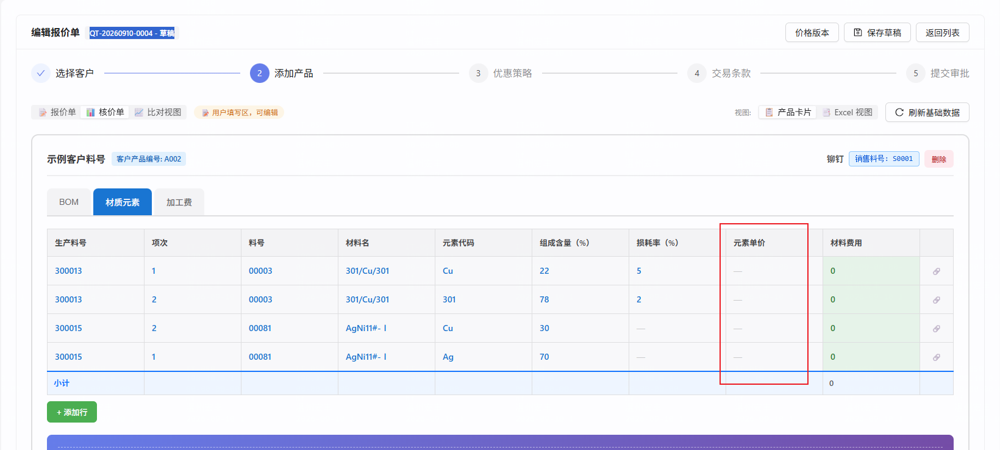

# repair-260910 · 核价侧「无销售料号的生产件」取不到元素单价

> **返修对象**：`task-260908-取数配置器优化/repair-260909-核价侧价格策略配置`
> **发现日期**：2026-09-10 · **发现环节**：用户验收（闸门 B 之后的真机使用）
> **状态：①~④ 已写完，等闸门 A0 方案裁决。⑤⑥ 待裁决后补。**
> 🚫 本文档当前**不含修复方案** —— 按 `task-docs.md §5` 第 3 步，写到根因为止就停。

---

## ① 问题描述

### 用户原话

> 「你连接数据库 cpq_db_0910，我在里面建了个单据 [QT-20260910-0004 - 草稿]，报价侧正确带出了元素单价，核价侧的元素单价为 0」
>
> 「核价侧与报价侧的单价取值策略应该相同，都是去报价单客户的元素价格策略」
>
> 「是的，元素价格和销售料号没有直接关系，**元素价格只根据元素符号和客户编号的策略进行取价**」

### 客观现象



编辑报价单 `QT-20260910-0004`（客户 `正泰` / `CUST-0001`）→ 核价单 → 产品卡片 `示例客户料号`（客户产品编号 `A002`，销售料号 `S0001`）→ 页签「材质元素」：

| 生产料号 | 项次 | 料号 | 材料名 | 元素代码 | 组成含量(%) | **元素单价** | 材料费用 |
|---|---|---|---|---|---|---|---|
| 300013 | 1 | 00003 | 301/Cu/301 | Cu | 22 | **—** | 0 |
| 300013 | 2 | 00003 | 301/Cu/301 | 301 | 78 | **—** | 0 |
| 300015 | 2 | 00081 | AgNi11#-Ⅰ | Cu | 30 | **—** | 0 |
| 300015 | 1 | 00081 | AgNi11#-Ⅰ | Ag | 70 | **—** | 0 |
| 小计 | | | | | | | **0** |

「元素单价」整列为 `—`（空），导致 `材料费用`（`FORMULA` 字段，`formula_name=公式1`，依赖元素单价）恒为 `0`，页签小计为 `0`。

同一张单的**报价侧**同名页签能正确带出元素单价。

---

## ② 复现 / 发现方式

| 项 | 内容 |
|---|---|
| **发现人** | 用户，真机使用 |
| **环境 / 库** | `cpq_db_0910`（`10.177.152.12:5432`）· 前端 5174 / 后端 8081 |
| **前置数据** | 报价单 `QT-20260910-0004`（`id=4fab08dd-6931-4ada-baf7-4708fd68d2e0`，状态 `DRAFT`）<br>客户 `正泰` / `CUST-0001`（`id=9ffbf636-dfe5-4c63-8540-0b06a7dc785e`）<br>行项 `S0001 铆钉`（客户料号 `A002`，`line_item_id=e9cfeb68-93e3-46cd-9575-2090bbbc0f48`） |
| **操作步骤** | ① 打开报价单编辑页 → 步骤 2「添加产品」<br>② 切到「核价单」视图<br>③ 展开产品卡片 `S0001` → 点页签「材质元素」<br>④ 观察「元素单价」列 |
| **出现频率** | **必现**，且与操作顺序无关（SQL 层即可复现，见 ④） |
| **对照** | 同页切「报价单」视图 → 同名页签「材质元素」→ 元素单价有值 |

### 纯 SQL 复现（不依赖前端，可直接复跑）

```sql
-- 核价侧「材质元素」组件（component 54001a3b-fd2e-4580-b90e-4bfa157ea77c）编译产物的取价段
SELECT vdcbeba.production_no, vdcbeba.sales_material_no, vdcbeba.material_part_no,
       vdcbeba.element_code, cep.unit_price AS 元素单价
FROM v_ds_cost_basic_element_bom_all vdcbeba
  LEFT JOIN f_material_element_price('CUST-0001', CURRENT_DATE) cep
         ON cep.element_code = vdcbeba.element_code
        AND cep.material_no  = vdcbeba.sales_material_no
WHERE vdcbeba.is_current
  AND vdcbeba.production_no = ANY(ARRAY['300013','300015','300022','300023','300042'])
ORDER BY vdcbeba.production_no, vdcbeba.item_seq;
```

实测输出（2026-09-10）：

```
 production_no | sales_material_no | material_part_no | element_code |  元素单价
---------------+-------------------+------------------+--------------+------------
 300013        |                   | 00003            | Cu           |            ← 本单，空
 300013        |                   | 00003            | 301          |            ← 本单，空
 300015        |                   | 00081            | Ag           |            ← 本单，空
 300015        |                   | 00081            | Cu           |            ← 本单，空
 300022        | S0005             | 00006            | Ag           | 12050.0000
 300022        | S0005             | 00006            | Ni           |  1500.0000
 300023        | S0006             | 00168            | Cu           |   105.0000
 300023        | S0006             | 00168            | 301          |   800.0000
 300042        | S0013             | 00081            | Ag           | 12050.0000
 300042        | S0013             | 00081            | Cu           |   105.0000
```

⇒ **同一条 SQL、同一个客户、同一个取价函数，唯一变量是 `sales_material_no` 能否桥到。** 桥到就有价，桥不到就空。

---

## ③ 需求结果

| 编号 | 期望 | 对照 AC |
|---|---|---|
| **E-1** | 核价侧「材质元素」页签，**BOM 树中任意生产料号**（含没有销售料号的中间件 / 内部件 / 外购件）的元素行，只要该元素在**本报价单客户**的价格策略下取得到价，「元素单价」列就必须显示该价格 —— 本单 `300013`/`300015` 四行应分别显示 `Cu 105` / `301 800` / `Ag 12050` / `Cu 105`（以取价时刻的策略结果为准） | 🚨 **本条推翻 `repair-260909` 的 `AC-B1`**（原文把「桥不到 → 单价显示空」写成期望行为），见 ④ |
| **E-2** | 核价侧与报价侧对**同一 (客户, 元素)** 必须给出同一个数 | 继承 `repair-260909` 的 `A0-1` 不变量，但**料号维度按用户 2026-09-10 澄清从不变量中移除** |
| **E-3** | 🔁 **反向**：该客户对该元素**确实没有价格策略**（或策略算不出值）时，仍显示**空**，🚫 不许显示 `0`、不许报错、不许卡「加载中…」 | `repair-260909` `AC-B1` 的「不报错不加载中」部分仍然有效 |
| **E-4** | 🔁 **反向**：**报价侧**取价结果**逐位不变**（本单及既有单据） | `repair-260909` `AC-P3` |
| **E-5** | 🔁 **反向**：已冻结 / 已提交的报价单与核价单，其已落库的价格**不被本次改动重算或改写** | `task-260713` 冻结隔离；`memory: 报价侧 frozen 不变` |
| **E-6** | 🔁 **反向**：元素BOM **行数不变**（不因取价改动而翻倍或丢行） | `repair-260909` `AC-B2` |

---

## ④ 问题原因 / 报告

### 一句话根因

核价侧的取价是 **`element_code` + `sales_material_no` 双键** JOIN，而 `sales_material_no` 由视图从「生产料号 → 销售料号」桥接得到；**核价 BOM 树的中间件 / 内部件在业务上根本没有销售料号**，桥接恒为 `NULL` ⇒ 第二键 `cep.material_no = NULL` 恒不成立 ⇒ 单价恒空。

### 证据链

**1 · 取价键是双键**

`component_sql_view` 中核价侧「材质元素」组件（`component_id=54001a3b-fd2e-4580-b90e-4bfa157ea77c`，`sql_view_name=builder_54001a3bfd2e`）的 `sql_template`：

```sql
LEFT JOIN f_material_element_price(:customerCode, :priceBaseDate) cep
       ON cep.element_code = vdcbeba.element_code
      AND cep.material_no  = vdcbeba.sales_material_no   -- ← 第二键
```

**2 · `sales_material_no` 是派生桥接列，不是底表列**

`v_ds_cost_basic_element_bom_all`（`V438`，前身 `V434`）：

```sql
LEFT JOIN LATERAL (SELECT m.material_no::varchar(20)
                     FROM ds_quote_material m
                    WHERE m.production_no::text = e.production_no::text
                    ORDER BY m.material_no LIMIT 1) mm ON true
```

**3 · 本单的两个生产料号在 `ds_quote_material` 里不存在**

```sql
SELECT material_no, production_no FROM ds_quote_material ORDER BY material_no;
--  S0001→300001  S0002→300002  S0003→300003
--  S0004→300021  S0005→300022  S0006→300023  S0007→300024
--  S0008→300031  S0009→300032  S0010→300033  S0011→300034
--  S0012→300041  S0013→300042  S0014→300043     （共 14 行）
-- 300012 / 300013 / 300014 / 300015 一行都没有
```

**4 · 这不是数据录错，是业务形态 —— 这些料号本来就没有销售料号**

`ds_cost_basic_material`（核价物料主表）里：

| 生产料号 | 物料名称 | 是否为可销售件 |
|---|---|---|
| 300012 | **零件12** | 否 |
| 300013 | **零件13** | 否 |
| 300014 | **外购件1** | 否 |
| 300015 | **零件15** | 否 |
| 300022 | 动触头A | 是（`S0005`）|
| 300023 | 静触片A | 是（`S0006`）|
| 300042 | 导电排C | 是（`S0013`）|

⇒ 「核价 BOM 树里存在没有销售料号的中间层/内部件」是**常态**，桥接方案对这类料号**结构性失效**，不是个别数据缺失。

**5 · 价格本身与料号无关（与用户澄清一致）**

`f_material_element_price(customer, date)` 的实现（`V369` 起）由两段 `UNION ALL` 组成：

- `versioned` —— 来自 `material_price_version_ref`（按 `customer_no` + **销售料号**指向冻结版本），本库 **0 行**
- `realtime` —— `candidate_materials` **CROSS JOIN** `f_customer_element_price(customer, date)`

而 `f_customer_element_price` 的签名只有 `(p_customer_no, p_base_date)`，返回 `(element_code, unit_price, currency, price_unit)`，**不含料号维度**。实测：

```
f_customer_element_price('CUST-0001', CURRENT_DATE)
  301 → 800.0000 | Cu → 105.0000 | Ni → 1500.0000 | Ag → 12050.0000

f_material_element_price('CUST-0001', CURRENT_DATE)  -- 同一批值按料号扇出
  S0001/Ag → 12050  S0002/Ag → 12050  S0004/Ag → 12050  S0005/Ag → 12050 …
```

⇒ 在**没有冻结版本**时，`material_no` 在取价函数里**纯属 CROSS JOIN 扇出**，对价格数值零贡献。它唯一的实质作用是 `versioned` 分支的版本指针键。

### 影响面

| 维度 | 实测（`cpq_db_0910`，2026-09-10）|
|---|---|
| `COST_BASIC` 元素BOM当前版行 | 桥到 **11 行 / 5 个生产料号**；**桥不到 4 行 / 2 个生产料号**（`300013`、`300015`）|
| `COST_DETAIL` 元素BOM当前版行 | 本库 **0 行**（该方言无数据，⚠️ 不等于无影响 —— 同一套桥接、同一套边键）|
| 受影响的报价单 | 凡核价 BOM 树含「无销售料号的中间件」的产品行。本库 4 个产品中 **`S0001` 命中**（其余 3 个的子件恰好都登记了销售料号）|
| 下游放大 | 单价空 → `材料费用`（`FORMULA`）为 `0` → 页签小计 `0` → **核价总额系统性偏低**，且不报错、无提示 |

⚠️ **本库的比例（4/15 行）不可外推到生产环境** —— 生产环境核价 BOM 树的层级通常更深，无销售料号的中间件占比只会更高。

### 引入时间线

| 时点 | 提交 | 发生了什么 |
|---|---|---|
| 此前 | — | 核价侧**根本没有价格策略组**，语义图 `FUNC_ELEMENT_PRICE` 只挂 `QUOTE` 方言，`元素单价`列在核价侧不存在 ⇒ 不构成本缺陷 |
| 2026-09-09 | `794f1be3` | `V434`（`repair-260909`）核价侧首次接入价格策略，取价键**定为双键**，并在两张全版本视图上新增桥接列 `sales_material_no`（桥源 `material_master`）|
| 2026-09-09 | `d5169d47` | `V438`（`task-260909-V6老表退役` B-7）桥源 `material_master` → `ds_quote_material`。⚠️ 该迁移的**等价性实测注释里已白纸黑字写着**「`300013 / 300015` 两侧都桥不到」，但当时的判据是「两侧行为一致 ⇒ 等价性成立」，**桥不到本身没有被当成缺陷** |

### 🚨 为什么测试没拦住 —— 不是漏测，是 AC 写反了方向

这是本次最该沉淀的一条：**缺陷在 `repair-260909` 里被显式判为「通过」。**

| 环节 | 当时的记录 | 问题 |
|---|---|---|
| `问题说明.md:180` 「事实 B · 桥接覆盖率当前有缺口」 | 已量化列出桥不到的料号 | 识别到了，但当成**方案的已知代价**而非缺陷 |
| `问题说明.md:190` | 「若选桥接方案，`E-3` 的 AC 必须写成**能桥到的取到价、桥不到的显示空而不是报错**」 | 🚨 **AC 在这一刻把缺陷固化成了期望行为** |
| `AC-B1`（`问题说明.md:385`）| 「桥不到的生产料号 → 单价显示空，不报错不『加载中…』」，并点名 `300013` / `300015` | 同上 |
| `test-report.md:170` | 「逐行：300013×6 + 300015×2，`sales_material_no` 全为空，元素单价全为 NULL，无报错，8 行全部保留」→ 判 `AC-B1` **SQL 层成立** | **测试严格按 AC 执行且执行正确**；AC 说该空，空就是通过 |
| `亲验记录.md:89` | 「`AC-B1a`/`AC-B1b` 全库无有效样本」 | 当成**取证不足**处理，没有反过来质疑 AC 本身 |

⇒ 按 `task-docs.md §8` 归因，本次属 **「AC 不可执行 / AC 编码了错误前提」**，不属「实现确实错了」。
🚫 三道防线（测试执行 / 主线亲验 / 用户验收）里前两道**结构性失效** —— 它们都以 AC 为准绳，而准绳本身指错了方向。唯一能抓住它的只有用户验收，事实上也确实是用户抓住的。

📌 **可晋升的规则线索**（留待结案时按 `change-protocol.md §6` 提议）：
当一条 AC 的内容是「**某种情况下功能不生效是可以接受的**」时，它实际上是在**替用户裁决一个业务边界**。这类 AC 必须在闸门 A 显式向用户点名确认，🚫 不许由主线自行写入。

---

## ⑤ 修复方案

> **闸门 A0 裁决（2026-09-10，用户）**
>
> | 编号 | 裁决 |
> |---|---|
> | **A0-1** | 走**方案甲** —— 把料号维度从核价侧取价键里彻底拿掉，核价侧改用**客户级元素价** `f_customer_element_price(:customerCode, :priceBaseDate)`，**只按 `element_code` 单键连接**。<br>**用户裁决依据（原话）**：「元素价格和销售料号没有直接关系，元素价格只根据**元素符号和客户编号**的策略进行取价」。 |
> | **A0-2** | 已发布模板的 `sql_views_snapshot` 走 **`new-draft` + `publish` 升版重新冻结**，🚫 本次**不**修 `BL-0223`。<br>理由：`sql_views_snapshot` 只在 `TemplateService.publish:262` 写入，`forceRealignSnapshots` 不刷它；修 `BL-0223` 会动 `task-0806`「模板发布全量冻结」定下的「已发布不可变」语义并波及全部既有调用方，**把本次返修的范围扩成「改冻结机制」**。 |
> | **A0-3** | 本次**不做**单据级元素价格表，登记 `BACKLOG`（`P1`/`L`）。<br>它解决的是「两侧同源 + 价格可审计 + 归位简化」这个更大的问题，不是本缺陷；用 `L` 级改造修一个改 1 条迁移就能修的缺陷不划算，且会一次性引入四类风险（第五套价格权威的优先级重裁 / 存量单回填不可靠 / 削弱核价侧可重算定位 / 调价三链路适配）。 |

### 为什么方案甲是 Java 零改动（关键技术依据）

`SemanticCompiler:1560` 生成价格 JOIN 时：

```java
SemanticEdgeKey codeKey = keys.get(0);                       // 编码键，必出
on.add(PRICE_FUNC_ALIAS + "." + codeKey.rightColumn + " = " + codeExpr);
if (keys.size() > 1) { ... }                                  // ← 第 2..N 键，只在多键时进入
plan.joinClause = "LEFT JOIN " + funcNode.funcSignature + " " + PRICE_FUNC_ALIAS + " ON " + ...;
```

⇒ **删掉 `seq=1` 那条边键后 `keys.size()==1`，`if` 不进入，JOIN 自然只剩单键**；函数签名直接取自节点的 `func_signature`。
⇒ 本次与 `repair-260909` 同型：**纯语义图数据配置，Java 零改动、前端零改动**。

### 改哪些东西

**B-1 · 一条迁移：换取价函数 + 双键降为单键**（拟占号待建分支时四方核对）

| 对象 | 改法 |
|---|---|
| `semantic_node` `26090901-0000-4000-8000-000000000001`（`COST_BASIC`）<br>`semantic_node` `26090901-0000-4000-8000-000000000002`（`COST_DETAIL`） | `func_signature`：`f_material_element_price(:customerCode, :priceBaseDate)` → **`f_customer_element_price(:customerCode, :priceBaseDate)`**<br>`display_name`：`价格策略 f_material_element_price` → **`价格策略 f_customer_element_price`**<br>`note`：记 `A0-1` 裁决来由，并**显式写明**「核价侧不再读 `versioned` 冻结版本价，这是知情取舍，去向见 `BACKLOG` 单据级元素价格表」 |
| `semantic_edge_key` | **删除**上述两条 `PRICE` 边的 `seq=1` 键（`sales_material_no` → `material_no`）。**保留 `seq=0`**（`element_code` → `element_code`） |
| `semantic_node_column` | **不动**。`f_customer_element_price` 返回 `(element_code, unit_price, currency, price_unit)`，已登记的两列 `unit_price` / `currency` **原样都在** ⇒ 输出列集不变、`元素单价` 列名不变 |
| `QUOTE` 方言 | 🚫 **一行不动** |

迁移末尾加落库自检（口径同 `V434` §8）：两个节点 `func_signature` 已为新函数、两条 `PRICE` 边各**恰好 1 条**边键、`QUOTE` 侧仍为 **2** 条。

**B-2 · 重编译核价侧组件**

`POST /api/cpq/components/{id}/builder/compile` → `save`，重新生成 `component_sql_view.sql_template`。
本库受影响组件**实测 1 个**：`54001a3b-fd2e-4580-b90e-4bfa157ea77c`（`builder_54001a3bfd2e`）。
⚠️ **组件数必须按实际库现查，不许照搬本行**（`repair-260909` 在 `cpq_db_0724` 上记录的是 8 个已配价格列的组件）。

预期产物（`AC-2` 逐字断言）：

```sql
LEFT JOIN f_customer_element_price(:customerCode, :priceBaseDate) cep
       ON cep.element_code = vdcbeba.element_code
```
—— 单键、**不含 `cep.material_no`**。

**B-3 · 核价模板升版重新冻结**（`A0-2`）

🔑 **升的是 `核价模板`，不是 `正泰模板`** —— 实测两个模板的组件归属：

| 模板 | status | 挂的材质元素组件 | 本次是否升版 |
|---|---|---|---|
| **`核价模板`**（`28c595d3-…`）| PUBLISHED v1.0 | **`54001a3b`（核价侧）** | ✅ **升** |
| `正泰模板`（`62dd00cb-…`）| PUBLISHED v1.0 | `813b4ead`（报价侧）| 🚫 **不许动**（`AC-8` 专钉这条）|

**B-4 · 重算受影响单据的 `costing_card_values`**

核价侧的值**已被物化**在 `quotation_line_item.costing_card_values`（实测本单 16229 字节、材质元素 4 行 `元素单价: None` 已冻存）⇒ **改完 SQL 不会自动变好**，需走「刷新基础数据」重算。本单 `QT-20260910-0004`。

### 明确不改的（每条都有理由，不是漏了）

| 不改 | 理由 |
|---|---|
| 视图 `v_ds_cost_basic_element_bom_all` / `v_ds_cost_detail_element_bom_all` 及其 `sales_material_no` 桥接列 | 方案甲后该派生列不再被取价使用，但它同时登记在**两张视图** + `CostAllVersionViewSelfCheck.REGISTERED_DERIVED_COLUMNS` + `semantic_node_column` 三处；删它要改启动守卫（`@Observes StartupEvent`，不满足即应用起不来）⇒ **风险大于收益，留而不用**。用户 2026-09-10 裁决**不登记 BACKLOG** |
| `CostAllVersionViewSelfCheck` | 不动视图 ⇒ 零改动，也不需要走 `repair-260909` 的两阶段落库纪律 |
| `f_material_element_price` / `f_customer_element_price` | 两个函数本身零改动。报价侧继续用前者 |
| `BL-0223`（`forceRealignSnapshots` 漏刷 `sql_views_snapshot`）| `A0-2` 裁决走模板升版绕开，不动冻结语义 |
| 前端 | 零改动。详见 `fronttask.md` |
| HTTP 契约 | 零改动。详见 `api.md` |

### 已否决备选

- 🪦 **乙 · 版本按「本报价行的根销售料号」锁** —— 要改 `SemanticCompiler`（支持参数型左键）+ 参数注入链路；且**报价侧是按子件自己的销售料号锁版本的**，核价侧按根料号，版本不同时两侧**仍可能不一致** ⇒ 付了改造代价却拿不到它承诺的不变量。
- 🪦 **丙 · 新增 `f_material_element_price` 可空料号重载（桥到用版本价、桥不到退实时价）** —— 同一页签内两类行的价格口径不一致，数据上说得通、业务上无法解释。
- 🪦 **丁 · 给 `300013`/`300015` 补 `ds_quote_material` 映射** —— 给纯内部件（`零件13`/`零件15`）编造销售料号，且 `ds_quote_material` 是报价侧导入产物，会反向污染报价侧料号表。
- 🪦 **顺带修 `BL-0223`** —— 见 `A0-2`。
- 🪦 **本次直接做单据级元素价格表** —— 见 `A0-3`。

---

## ⑥ 验收标准

> ⚠️ **取价函数的返回值随行情与策略变动**（本单报价侧冻的 `Ag=11690`，2026-09-10 实时算是 `12050`）。
> 🚫 **所以断言一律写成「与同一时刻函数返回值逐位相同」，不写死数值**；文中给出的数值是**取证时刻的参考**，不是断言本体。
> 这是 `task-docs.md §4` 的直接要求：写死会让 AC 在行情变动后变成假红。

### 阳性（功能真的生效）

**AC-1 · 核价侧四行全部取到价**（本次核心）
前置：`cpq_db_0910`，报价单 `QT-20260910-0004`（客户 `正泰 CUST-0001`），`B-1`~`B-4` 全部完成。
操作：编辑报价单 → 步骤 2 → 切「核价单」→ 产品卡片 `S0001` → 页签「材质元素」。
断言（四条同时成立）：
1. 四行「元素单价」列**全部非空且 > 0**，🚫 不是 `—`、不是 `0`、不是「加载中…」；
2. 每行的值与**同一时刻** `SELECT * FROM f_customer_element_price('CUST-0001','<本单建单日>')` 里对应 `element_code` 的 `unit_price` **逐位相同**；
3. 「材料费用」列四行**均 > 0**（`FORMULA` 依赖元素单价）；
4. 页签「小计」**> 0**（现状为 `0`）。

📌 取证时刻（2026-09-10）参考值：`300013/Cu=105` · `300013/301=800` · `300015/Ag=12050` · `300015/Cu=105`。

**AC-2 · 编译产物是单键且换了函数**（结构断言，与数据无关）
对受影响的每个核价侧组件，`component_sql_view.sql_template` 同时满足：
① 含 `f_customer_element_price(:customerCode, :priceBaseDate)`；
② 含 `cep.element_code = <锚点别名>.element_code`；
③ **不含** `cep.material_no`；
④ **不含** `f_material_element_price`。

**AC-3 · 序列 AC：四次读数一致**
打开报价单 → 切到「材质元素」→ 切走到「BOM」再切回 → **刷新整页**再看一次。
断言：四次读到的元素单价**完全相同且都非空**。（防「只有首次生效」「切页签后走 cache 拿到空」这类 `AP-31`/`AP-37` 族问题。）

### 阴性 / 反向（真问题仍会被抓住、没修坏别的）

**AC-4 · 报价侧零回归**
① `component_sql_view` 中 `builder_813b4eadd89a` 的 `sql_template` **逐字节不变**（改动前后 `md5` 相同）；
② `正泰模板.sql_views_snapshot` **逐字节不变**；
③ 本单报价侧「材质元素」2 行的已冻值**不被改写**（取证时刻为 `Ag=11690` / `Cu=105`，断言为「与改动前逐字节相同」）。

**AC-5 · 没有价格策略的元素仍显示空，🚫 不许显示 0**
构造：临时把 `CUST-0001` 的某个元素策略置 `INACTIVE`（或删掉其兜底策略），使某元素在 `f_customer_element_price` 里**取不到值**。
断言：该元素行的「元素单价」显示 `—`（空），**不显示 `0`**、不报错、不卡「加载中…」；其余元素行不受影响。
🚦 **本条动全局状态**（`element_price_strategy`），归 `S-全局` 片，`finally` 必须还原原值并复验。

**AC-6 · 已提交单的冻结值不被改动**
⚠️ **本库 0 张已提交单**（实测 `quotation` 仅 1 张 `DRAFT`、`quotation_component_sql_snapshot` **0 行**）⇒ **这条 AC 直接跑必然空跑、必然假绿**。
**必须自造**：造一张含核价侧材质元素的单 → 提交（产生 `quotation_component_sql_snapshot`）→ **记录其渲染值** → 再执行 `B-1`~`B-3` → 复看。
断言：该单的元素单价**逐字节不变**（走单据级冻结 SQL，不受语义图与模板升版影响）。

**AC-7 · 行数不变**
核价侧「材质元素」页签仍为 **4 行**，不翻倍（`repair-260909` `AC-B2` 的基数风险）、不丢行（`LEFT JOIN` 语义）。

**AC-8 · `正泰模板` 未被误升版**
断言：`正泰模板` 的 `version` 仍为 `v1.0`、`updated_at` 与改动前相同、`status` 仍 `PUBLISHED`。
（只有 `核价模板` 该升版；两个模板都是 PUBLISHED，批量操作很容易连带。）

### 边界

**AC-9 · `COST_DETAIL` 方言同步改到位**
⚠️ **本库该方言元素BOM 实测 0 行** ⇒ **不能只验数据，数据面恒空、断言恒绿**。
本条只做**结构断言**：`COST_DETAIL` 的 `FUNC_ELEMENT_PRICE` 节点 `func_signature` 已改为新函数、其 `PRICE` 边**恰好 1 条**边键。
并在 `test-report.md` 里**显式记为「数据面未覆盖」**，🚫 不许写成「通过」。

### 自检证据

**AC-10 · 已自检声明**
须给出**命令与其输出**（不是「应该没问题」）：
① 迁移 `SELECT success FROM flyway_schema_history WHERE version='<本次版本号>'` → `t`；
② **应用真重启成功**（`CostAllVersionViewSelfCheck` 活在 `@Observes StartupEvent` 上，事务内 `ROLLBACK` 碰不到它 —— `repair-260909` 正是在这里栽过）；
③ 后端 `curl -s --noproxy '*' -o /dev/null -w '%{http_code}' http://localhost:8081/api/cpq/components` → `401`；
④ 前端 `curl -s --noproxy '*' -o /dev/null -w '%{http_code}' http://localhost:5174/` → `200`。

### 三类覆盖自查

| 类别 | 覆盖的 AC |
|---|---|
| **单点** | AC-1 · AC-2 · AC-4 · AC-7 · AC-8 |
| **序列** | AC-3（打开 → 切走 → 切回 → 刷新，断言中间态与最终态一致）· AC-6（造单 → 提交 → 改配置 → 复看）|
| **边界** | AC-5（无策略）· AC-9（空数据方言）· AC-6（冻结态）|
