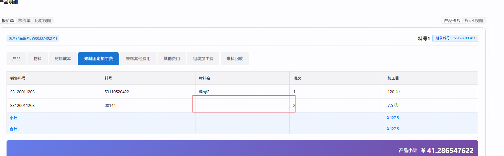

# repair-260916 · 来料类数据源的「材料名」查不到材质料号的名称

> **返修对象**：`task-260908-取数配置器优化`（其 `需求文档.md` §② 与 §⑤ 用户原话里的规则「只有物料BOM表需要连两张表，物料BOM元素连接的是材质表，**其余表连接的都是物料表**」）
> **状态**：立项 · 闸门 A0 已过（方案乙）· ⏳ 闸门 A 待确认
> **档位**：标准档（含数据迁移 + 新增后台接口，不满足轻量档判据 ①④）
> **立项日期**：2026-09-16（`date +%y%m%d` 实取 = `260916`）
> **立项期实测原始输出**：[`证据/立项期实测-260916.md`](./证据/立项期实测-260916.md)

### 本任务的用户裁决（按时间顺序，均为 2026-09-16 对话内选项卡作答）

| # | 问题 | 用户选择 |
|---|---|---|
| `D-1` | 这个问题要不要修、走哪条路 | **立项修复**（路径 A） |
| `D-2` | 补「物料表查不到再查材质表」覆盖哪些数据源 | 先查核价侧 → 查完后选 **B：报价侧 5 个 + 核价侧来料 3 张（基础/明细两套）** |
| `D-3` | 改动要生效到哪一层 | 先选「已有组件和模板也更新」，**随即更正**为：「已有组件更新就行，只更新[施耐德成环检测]目录下的组件」 |
| `D-4` | 只更新组件时，报价单要等发布模板新版才显示名称，可以吗 | **可以，模板我们自己发新版** |
| `D-5` | 设计方案（整体） | 「可以，建目录写文档吧」 |
| `D-6`（A0） | 3 个已有组件用哪种方式更新 | **乙：给后台重编译加「只处理指定组件」选项** |
| `D-7` | COMP-0005 字段名不一致的隐患要不要登记 BACKLOG | **登记** → `BL-0295` |

---

## ① 问题描述

### 用户原话

> 取值配置器中,来料其他费用/来料固定加工费 的材料名只关联了物料表吗? 我的材质料号的材料名都是空的: /home/joii/project/inbox/shot_20260916_180923.png

后续补充（裁决 `D-3` 的原话）：

> 已有组件更新就行,只更新[施耐德成环检测]目录下的组件



### 客观现象

报价单详情页 → 产品卡片（客户产品编号 `W003374021711`，销售料号 `S3120011203`）→「来料固定加工费」页签：

| 行 | 料号 | 材料名 | 说明 |
|---|---|---|---|
| 1 | `S3110520422` | 料号2 | 物料号，在报价物料表里有名称 ✅ |
| 2 | `00144` | **—** | **材质号**，材质表里名称是 `H85`，但页面为空 ❌ |

不报错、不标红、不进诊断 —— 与「这个料号本来就没名称」在页面上长得一模一样。

---

## ② 复现 / 发现方式

- **发现者**：用户在开发环境（`5174` → `8081` → `cpq_db_0724`）真机查看报价单详情页时发现
- **频率**：**必现**。只要来料类数据源里的投入料号是材质号，材料名就一定为空
- **环境**：`10.177.152.12:5432/cpq_db_0724`

### 复现 1 · 配置层（连表配置里只有一条物料表连线）

```sql
SELECT f.dialect, f.node_key, t.node_key AS to_key, t.physical_table, e.coalesce_group, e.fallback_order
  FROM semantic_edge e
  JOIN semantic_node f ON f.id = e.from_node_id
  JOIN semantic_node t ON t.id = e.to_node_id
 WHERE e.edge_kind = 'LOOKUP' AND e.status = 'ACTIVE'
   AND f.node_key IN ('MATERIAL_BOM','INCOMING_FIXED_FEE','INCOMING_OTHER_FEE')
 ORDER BY 1, 2, e.fallback_order;
```

实测（节选）：`QUOTE MATERIAL_BOM` 有两条（`MAT_NAME_LK` fallback 1 + `RECIPE_NAME_LK` fallback 2，同组 `PART_NAME`）；
`QUOTE INCOMING_FIXED_FEE` / `INCOMING_OTHER_FEE` **只有一条** `MAT_NAME_LK`，组与顺序均为空。

### 复现 2 · 编译产物（组件 COMP-0004 已落库的取数视图）

```sql
SELECT sql_template FROM component_sql_view v JOIN component c ON c.id = v.component_id
 WHERE c.code = 'COMP-0004';
```

实测：材料名列是 `dqm.material_name AS "_物料_材料名"`，`FROM` 段只有 `LEFT JOIN ds_quote_material dqm ON dqm.material_no = dqiff.input_material_no AND dqm.customer_no = dqiff.customer_no`，**没有材质表**。
对照组 COMP-0002「物料」（数据源=物料BOM，配置里同样选的是「物料表材料名」）：`COALESCE(dqm.material_name, mr.symbol) AS "_物料_材料名"` + `LEFT JOIN material_recipe mr ON mr.code = dqmb.input_material_no`。

### 复现 3 · 数据层（00144 在哪张表）

```sql
SELECT code, symbol, name FROM material_recipe WHERE code = '00144';                       -- 1 行：00144 | H85 | H85
SELECT customer_no, material_no, material_name FROM ds_quote_material
 WHERE material_no IN ('00144','S3110520422');                                             -- 只有 S3110520422 | 料号2
```

---

## ③ 需求结果

| 编号 | 期望行为 | 对照 AC |
|---|---|---|
| `E-1` | 下列 **11 个数据源**的「材料名」改为：**先查物料表，查不到再查材质表的「符号」列**（与物料BOM同一取法）<br>· 报价侧 5 个：来料固定加工费 / 来料其他费用 / 来料回收折扣 / 来料年降 / 自制加工费<br>· 基础核价、明细核价各 3 个：来料其他费用 / 来料其他固定费用 / 来料加工费 | AC-1、AC-3、AC-4 |
| `E-2` | 同一个号在物料表和材质表里都有时，**取物料表的名称** | AC-5 |
| `E-3` | 两张表都查不到时，材料名为空（页面显示「—」），**行不丢、不报错** | AC-5 |
| `E-4` 🔁反向 | 报价侧查物料表**仍按客户**查：别的客户在物料表里的同号名称**不许**串过来 | AC-5 |
| `E-5` | 配置器面板里每个数据源下**仍然只有一个**「材料名」字段；生成的视图列名仍是 `_物料_材料名`（已有公式、字段绑定不受影响） | AC-2、AC-3 |
| `E-6` | 「施耐德成环检测」目录下的 **COMP-0004 来料固定加工费 / COMP-0005 来料其他费用 / COMP-0008 来料回收** 三个组件的取数视图更新为新取法 | AC-7、AC-13 |
| `E-7` 🔁反向 | 更新这 3 个组件时：它们的**字段表、公式、组件属性一个字不变**；**任何模板**（含施耐德5.4模板全部已发布版本的两份冻结快照）**不变**；**其他组件**的取数视图不变 | AC-6、AC-7、AC-13 |
| `E-8` | 提供一个**按组件限定**的后台重编译能力：先预览（零写入，列出将变化的视图及新旧 SQL），确认后才执行；执行写审计 | AC-6、AC-7、AC-8 |
| `E-9` 🔁反向 | 既有的全量重编译接口（`refresh-all-snapshots`）行为**逐位不变** | AC-9 |
| `E-10` 🔁反向 | 物料BOM、材质元素、其余只连物料表的数据源，材料名取法与结果**不变**；核价侧「S-」前缀料号查不到名称的已知缺口（父任务 `AC-24`）**保持原状** | AC-11 |
| `E-11` | 组件更新后，**发布新版模板**再新建的报价单，页签里材质号那行显示材质名称；旧版本模板建的单保持原样 | AC-10 |
| `E-12` | 迁移可部署到内网库（生成配套 `update-*.sql`） | AC-12 |

> 📌 **与父任务 AC 的关系**：父任务的规则是用户 2026-09-08 的原话，其 AC 忠实编码了「其余表只连物料表」。本返修**修订该规则**（用户 `D-2` 裁决），不是父任务实现跑偏。父任务 `需求文档.md` 已在对应位置加了指向本目录的修订提示，原文保留不改。
> 📌 `docs/PRD-v3.md` 未涉及取数配置器的材料名取法（实查 `grep 取数配置器|材料名` 零命中），无 PRD 冲突需先行回写。

---

## ④ 问题原因 / 报告

### 一句话根因

`task-260908` 按「**除物料BOM外，其余数据源的投入料号都是物料**」这条规则建连表配置，来料费用类数据源只连了物料表；
而**来料费用表里的投入料号就是 BOM 里的投入料号**，BOM 的投入料号本来就可能是材质号 ⇒ 材质号那行在物料表里查不到，名称为空。

### 证据链（均可复跑，原始输出见 `证据/立项期实测-260916.md`）

1. **配置层**：连表配置里，报价侧只有物料BOM的材料名是「物料表 → 材质表」两段（同组 `PART_NAME`，fallback 1/2）；其余 13 个报价数据源、核价两方言除物料BOM/元素BOM外的数据源，都只有一条物料表连线（复现 1）。
2. **来源**：迁移 `V430__task260908_lookup_name_nodes_and_edges.sql` 的规格表里，报价侧来料类 5 行、核价侧来料类 6 行的 `coalesce_group` / `fallback_order` 均为 `NULL`，且没有指向 `RECIPE_NAME_LK` 的行。
3. **数据覆盖率**（开发库，按去重投入料号）：

   | 表 | 投入料号 | 物料表能查到 | 只有材质表能查到 | 两边都查不到 |
   |---|---|---|---|---|
   | 来料固定加工费 `ds_quote_incoming_fixed_fee` | 2 | 1 | **1**（00144） | 0 |
   | 来料其他费用 `ds_quote_incoming_other_fee` | 4 | 1 | **3**（00144 / 00256 / 00257） | 0 |
   | 来料回收折扣 `ds_quote_incoming_recovery` | 1 | 0 | **1**（00144） | 0 |
   | 物料BOM（对照，已两段查） | 21 | 11 | 10 | 0 |
   | 来料年降 / 自制加工费（均为 `_record` 表数据） | 4 / 4 | 全部 | 0 | 0 |
   | 核价侧来料三表（基础 + 明细合计） | 13 | 3 | **0** | 10（全是「S-」前缀，父任务 `AC-24` 同族缺口） |

   同号两表都有 = **0**（与父任务「材质号与物料号不重号」的实测一致）。
4. **语义同源**：三张来料表里出现的 4 个投入料号（00144 / 00256 / 00257 / S3110520422）**全部**能在同客户同销售料号的 `ds_quote_material_bom.input_material_no` 里找到 ⇒ 来料表的投入料号与 BOM 投入料号是同一个集合。
5. **机制可行性**（对照组 COMP-0002）：配置里选的都是「物料表材料名」（`sourceNodeKey = MAT_NAME_LK`），只要该数据源的两条连线同组，编译器就产出 `COALESCE(物料表.material_name, 材质表.symbol)`；配置器面板按组去重只显示一个字段（`FieldTreeBuilder.syntheticLookupFields` 的 `coalesceGroup` 去重分支，以 fallback 最小的那条为代表）⇒ **已有组件的配置不用改，列名 `_物料_材料名` 不变**。

### 引入时间线

- `V430`（`task-260908`，合 master `f1e69512`，2026-09-08）**首次**给这些数据源加上「材料名」—— 在此之前它们**根本选不到材料名**（`BL-0213` 缺口 G-A）。
- ⇒ **不是回归**，是新加能力时按一条未经数据验证的全称规则建图。

### 影响面

| 层 | 实测（开发库） |
|---|---|
| 数据源 | 报价 5 个 + 核价 6 个 = 11 个 |
| 已配材料名的组件（本 11 个数据源上） | 报价侧 9 个视图：COMP-0004 / COMP-2413 / COMP-0005 / COMP-0008 / COMP-2296 / COMP-2414 / COMP-2424（ACTIVE）+ COMP-2425 / COMP-2426（DISABLED）；**核价侧 0 个** |
| 本次更新对象（裁决 `D-3`） | 「施耐德成环检测」目录（`74659a5a-9826-48f6-9a12-c9984cd18df1`）下的 **COMP-0004 / COMP-0005 / COMP-0008**（该目录其余 7 个组件的数据源不在范围内，或未选材料名） |
| 模板 | 施耐德5.4模板**全部已发布版本**都冻结了这 3 个视图（立项时 v1.0~v1.4，md5 相同 `73549a04…`；开工采集基线时用户已续发 v1.5 / v1.6，见 `证据/基线-改动前/`）⇒ 报价单渲染读冻结快照，只更新组件**不会**改变这些版本建的单（裁决 `D-4` 已知情接受） |
| 已提交报价单 | 另有单据级冻结（`quotation_component_sql_snapshot`），永远不变 |

### 为什么测试没拦住

父任务的 AC 忠实编码了用户规则：费用类数据源只断言「连了物料表、且连接条件含客户」（父任务 `AC-1`），覆盖率实测只对**物料BOM**（父任务 `AC-2 ②`）和**核价物料BOM**（父任务 `AC-24`）做了。
立项期「报价 BOM 投入料号命中物料表 61 / 材质表 23」的实测**只在 BOM 上做**，没有对被归入「其余」的来料费用表抽样。

🔑 **教训**：规则里出现「**其余都是 X**」这类全称假设时，立项实测要**对每个被归入「其余」的对象各抽一次样**，而不是只验被点名的那一个。

### 方案制定期的新发现（影响了方案选型，`D-6`）

**配置器的保存接口不能拿来「原样重存」已有组件**，它有两个副作用（读 `BuilderService.save` 确认）：

1. 按取数配置里的**字段名整张重写组件字段表**；
2. 把引用该组件的已发布模板的**组件配置快照**重推一遍（`forceRealignSnapshots`）。

而 COMP-0005 的取数配置字段名（「要素名称」「比例（%）」）与字段表（「要素」「比例」）**已经不一致**；COMP-0002「物料」有 4 个公式（来料回收费 / 来料财务费 / 来料损耗率 / 来料加工费取值公式）按「要素」「比例」「费用」引用 COMP-0005 的字段。
⇒ 重存 COMP-0005 会把字段改回旧名，这 4 个公式**静默按 0 算**（`BL-0292` 同族）。该隐患独立登记为 `BL-0295`，**本期不修**。

---

## ⑤ 修复方案（闸门 A0 裁决：方案乙）

### 1. 数据迁移 `V444`（连表配置，纯数据，Java 零改动的部分）

对 11 个数据源，各做两件事（详见 `backtask.md` B-1）：

- 已有的物料表查名连线 → 归入组 `PART_NAME`、顺序 1；
- 新增一条材质表查名连线（指向本方言的 `RECIPE_NAME_LK`）→ 组 `PART_NAME`、顺序 2，连接键只有一条：`<锚点料号列> = material_recipe.code`（**不带客户键**，材质表无客户维度）。

锚点料号列：报价侧 = `input_material_no`；核价侧 = `incoming_material_no`。
物料表那条连线的连接键**不动**（报价侧仍是「料号 + 客户」两键）。

### 2. 新增后台接口「按组件重编译取数视图」（后端 Java）

`POST /api/cpq/config-center/recompile-components`（契约见 `api.md`）：

- 只处理请求里列出的组件的取数视图，写入路径与既有全量重编译**同一条**（`ComponentSqlViewService.update`）⇒ 产物与「全量重编译」对该视图的产物逐字相同；
- **不改**组件字段表、公式、组件属性；**不推**任何模板快照；
- `confirm=false` 预览零写入并返回每个将变化视图的新旧 SQL；`confirm=true` 单事务执行，每个变化的视图写一条审计；
- 既有 `refresh-all-snapshots` 接口**一行不动**。

### 3. 内网部署脚本

按 `deploy/db/README.md §②`（改了 `semantic_*` 系统配置种子 ⇒ 必须生成）：生成 `deploy/db/update-260916-lookup-name-recipe-fallback.sql` + 更新 README §① 当前节点 + 临时库验证。

### 4. 开发库落地（合并后，主线执行）

合并后 `8081` 重启自动跑 `V444` → 主线对 COMP-0004 / COMP-0005 / COMP-0008 调预览 → **把预览结果（3 个视图 + 新旧 SQL）呈报用户批准** → 执行 → 核对（AC-13）。
模板由用户自行发布新版（裁决 `D-4`）。

### 明确不改的（每条都有理由）

| 不改 | 理由 |
|---|---|
| 施耐德5.4模板各版本及任何其他模板 | 用户裁决 `D-3` / `D-4`；已发布模板快照只能由发布写（`方案制定前必读.md` 改动 5） |
| 目录外的 6 个已配材料名组件（COMP-2413 / 2296 / 2414 / 2424 / 2425 / 2426） | 用户裁决 `D-3`。⚠️ 连表配置是全局的：它们以后被人重存、或有人跑全量重编译时，会**自动**带上新取法 —— 这是期望行为，不拦 |
| 已有报价单 | 用户裁决 |
| 核价侧「S-」前缀料号查不到名称 | 父任务 `AC-24` 已知缺口，与本次无关 |
| 组成件其他费用、以销售料号为轴的数据源 | 不在 `D-2` 范围 |
| 材料名取材质表的「名称」列 | 沿用父任务 `D-1`：取 `symbol`（NOT NULL）；00144 两列同为 H85，全库 264 条里 5 条两列不同 |
| `V430` 迁移文件 | 已应用到共享库，禁改（`backend.md §4`） |
| `semantic_node` / `semantic_node_column` | 查名节点与列已存在，只加/改连线 |
| COMP-0005 字段名不一致 | 独立登记 `BL-0295`（用户裁决 `D-7`） |
| 前端 | 零改动（见 `fronttask.md`） |

### 已否决备选

- **甲：先手工把 COMP-0005 取数配置里的字段名改成与字段表一致，再走配置器保存** —— 仍会重推施耐德5.4模板 5 个已发布版本的组件配置快照，违背 `D-3`；且另外两个组件若有未发现的不一致同样会被改掉。
- **丙：迁移里直接写死这 3 个视图的新 SQL** —— 这 3 个组件只存在于开发库（`cpq_db_test` 无），迁移到别的库找不到对象；手写 SQL 与编译器产物会漂移（`BuilderRecompileService` 注释明令禁止）。
- **跑既有全量重编译** —— 会重写全部 110 个取数视图并改写所有已发布模板的两份快照，远超 `D-3` 范围。
- **在语义图管理界面里改连线** —— 界面改的数据不进迁移，内网库与测试库都不会同步。

---

## ⑥ 验收标准

> 🔑 **数据源说明**（`task-docs.md §4`「查测试实际会跑的那个库」）：
> - 下文带具体料号 / 组件编号的断言取自 **开发库 `cpq_db_0724`** 的实测值；这些 AC 在**验收库 `cpq_db_260916`**（开工时从 `cpq_db_0724` 克隆的一次性库，见 `test.md §0`）上验，**不在共享开发库上跑**（`V444` 未合并前不能进共享库）。
> - `cpq_db_test` **没有** COMP-0004/0005/0008，也没有来料费用样本（实测 `ds_quote_incoming_fixed_fee` 中 00144 = 0 行）⇒ 在它上面跑的片（AC-5 / AC-8）一律**自造前缀数据**，断言写成「与自造数据一致」，不照搬本文的字面量。
> - 材质号 `00144`（symbol `H85`）在两个库**都存在**，测试可只读引用它。

### 单点

**AC-1 · 连表配置结构**
迁移 `V444` 执行后，查 `semantic_edge`（`ACTIVE`、`edge_kind='LOOKUP'`）：下表 11 个（方言, 数据源）**每个恰好 2 条**同组 `PART_NAME` 的查名连线 —— 顺序 1 指向本方言 `MAT_NAME_LK`、顺序 2 指向本方言 `RECIPE_NAME_LK`；

| 方言 | 数据源 node_key | 材质表连线的连接键（seq 0，且只有这一条） |
|---|---|---|
| QUOTE | `INCOMING_FIXED_FEE` / `INCOMING_OTHER_FEE` / `INCOMING_RECOVERY` / `INCOMING_ANNUAL` / `SELF_PROCESS_FEE` | `input_material_no` = `code` |
| COST_BASIC | `INCOMING_OTHER_FEE` / `INCOMING_OTHER_FIXED_FEE` / `INCOMING_PROCESS_FEE` | `incoming_material_no` = `code` |
| COST_DETAIL | `INCOMING_OTHER_FEE` / `INCOMING_OTHER_FIXED_FEE` / `INCOMING_PROCESS_FEE` | `incoming_material_no` = `code` |

且：① 这 11 条物料表连线的连接键与迁移前**逐条相同**（报价侧 seq0 `input_material_no=material_no` + seq1 `customer_no=customer_no`；核价侧 seq0 `incoming_material_no=production_no`）；
② 指向 `MAT_NAME_LK` / `MAT_PROD_LK` / `RECIPE_NAME_LK` 的 ACTIVE 连线总数 = **迁移前 + 11**，连接键总数 = **迁移前 + 11**（开发库与测试库迁移前实测均为 46 条连线 / 60 条键）；
③ 其余 35 条既有查名连线的 `coalesce_group` / `fallback_order` / 连接键**逐条不变**。

**AC-2 · 配置器面板只有一个「材料名」**
以 admin 登录 → 组件管理 → 打开 COMP-0004「来料固定加工费」→「取数配置」页签 → 左侧「可用字段」中「来料固定加工费」分组下，名为「材料名」的字段**恰好 1 个**；面板中**不存在**名为「材质」或「材质（查名）」的独立分组。
同样检查：新建组件 → 数据集选「基础核价」→ 数据源选「来料加工费」→ 「材料名」恰好 1 个；数据集选「明细核价」→ 数据源选「来料其他固定费用」→「材料名」恰好 1 个。

**AC-3 · 生成的 SQL 形态**
在 AC-2 的 COMP-0004 界面，右侧「生成的 SQL」中：
① 材料名列为 `COALESCE(<物料表别名>.material_name, <材质表别名>.symbol) AS "_物料_材料名"`（列名逐字不变）；
② `FROM` 段含 `LEFT JOIN material_recipe <别名> ON <别名>.code = <锚点别名>.input_material_no`，该 `ON` 子句**不含** `customer_no`；
③ `LEFT JOIN ds_quote_material` 的 `ON` 子句**仍同时含** `input_material_no` 与 `customer_no` 两个条件。
核价侧：基础核价「来料加工费」拖入「材料名」后，SQL 含 `COALESCE(<别名>.material_name, <别名>.symbol)`、`LEFT JOIN ds_cost_basic_material … ON … .production_no = … .incoming_material_no`、`LEFT JOIN material_recipe … ON … .code = … .incoming_material_no`；明细核价「来料其他固定费用」同理（`ds_cost_detail_material`）。
⚠️ 表名匹配按**标识符边界**（`ds_quote_material` 是 `ds_quote_material_bom` 的前缀，沿用父任务 `D-16`）。

**AC-4 · 真实数据预览出名称**
在 COMP-0004「取数配置」页签，预览参数填客户 `CUST-0004`、料号 `S3120011203` → 预览表格 **2 行**：投入料号 `00144` 的材料名 = **`H85`**；`S3110520422` 的材料名 = **`料号2`**。
COMP-0005 预览（`CUST-0004` / `S3110520422`）：投入料号 `00256` 的每一行材料名 = **`TU2丝`**，`00257` = **`羰基镍粉`**；（`CUST-0004` / `S3120011203`）：`00144` = `H85`，`S3110520422` = `料号2`。
COMP-0008 预览（`CUST-0004` / `S3120011203`）：`00144` = `H85`。
预览的 `diagnostics` 中**无**该列的 ERROR 级条目；**无**材料名为空的行。

**AC-6 · 按组件重编译：预览零写入**
以 SYSTEM_ADMIN 调 `POST /api/cpq/config-center/recompile-components`，`componentIds` = COMP-0004 / COMP-0005 / COMP-0008 的 id，`confirm=false` →
① HTTP 200，`preview=true`，`views=3`，`changed=3`，`changes` 恰含 `builder_c35c2bd590fe` / `builder_4602c64a0c38` / `builder_46f244df7ede` 三项，每项 `newSqlTemplate` 含 `material_recipe`、`oldSqlTemplate` 不含；
② 调用前后比对，以下**全部逐字节不变**：3 个组件的 `component_sql_view`（`sql_template` / `declared_columns` / `builder_config` / `builder_version` / `updated_at`）、`component`（`fields` / `formulas` / `row_key_fields` / `updated_at`）、全部模板的 `sql_views_snapshot` / `components_snapshot` / `updated_at`、`template_component_snapshot` 全表 md5、`operation_log` 行数。

**AC-7 · 按组件重编译：执行只改指定组件的视图**
接 AC-6，同一请求改 `confirm=true` →
① HTTP 200，`preview=false`，`changed=3`，`changedViewNames` 为上述 3 个视图名，`operationLogIds` **恰 3 个**，对应 `operation_log` 行 `operation_type='COMPONENT_VIEW_RECOMPILE'`、`target_type='COMPONENT'`、`target_id` 为对应组件 id；
② 3 个视图的 `sql_template` **逐字等于** AC-6 预览里的 `newSqlTemplate`，且**逐字等于**同一时刻全量重编译会产出的文本 —— 取证法（2026-09-16 开工后澄清，断言不变）：执行后立即调全量重编译**预览**（`refresh-all-snapshots`，`{recompile:true, confirm:false}`），这 3 个视图名**不在** `recompileChangedViewNames` 中（执行前它们在 AC-11 的集合 A 中）；全量预览只返回视图名、不返回 SQL 文本，而它判「会变」的依据正是「编译产物 ≠ 已落库文本」；`declared_columns` 的列名集合与执行前相同；`builder_version` = 当前编译器版本；
③ **不变**：3 个组件的 `component.fields` / `formulas` / `row_key_fields` / `part_no_field` / `part_name_field` / `sort_field`（逐字节）；施耐德5.4模板**执行前实查到的全部版本**的 `sql_views_snapshot`（md5 逐版本等于执行前值）、`components_snapshot`、`updated_at`、各自的 `template_component_snapshot` 行（md5）；**其余所有** `component_sql_view` 行的 `sql_template` / `updated_at`（含 COMP-2413 / 2296 / 2414 / 2424 等同数据源组件）。
④ 以 admin 在 COMP-0004「取数配置」页签打开时**不出现**「配置已过期」类提示（`isStale=false`）。

### 边界

**AC-5 · 取值优先级与空值**
（自造数据，前缀 `R260916-`）
① 同一个号在**本客户**物料表与材质表**都有** → 材料名 = **物料表名称**；
② 两表都没有 → 该行**仍在**，材料名为空（接口返回 `null`，页面显示「—」），不报错；
③ 该号只在**另一个客户**的物料表里有、材质表里也有 → 材料名 = **材质表 symbol**（不取别的客户的物料名称）；只在另一个客户物料表里有、材质表里没有 → 材料名为空；
④ 核价侧：来料料号在核价物料表 `production_no` 里有 → 取物料表名称；只在材质表有 → 取 symbol；都没有 → 空。

**AC-8 · 按组件重编译的参数与权限**
① `componentIds` 缺失或为空数组 → HTTP 400，body `code='COMPONENT_IDS_REQUIRED'`，零写入；
② `componentIds` 里有**不存在**的 id（与存在的 id 混在一起）→ HTTP 404，`code='COMPONENT_NOT_FOUND'`，body 列出缺失的 id；**存在的那些也不写**；
③ 含一个**没有取数配置器视图**的组件（如 COMP-0009「产品小计」这类无 `builder_config` 的组件）→ HTTP 200，该 id 出现在 `skippedComponentIds`，不写它，其余照常；
④ 对同一组组件**连续执行两次** `confirm=true` → 第二次 `changed=0`、`operationLogIds` 为空、`operation_log` 行数不再增加；
⑤ 非 SYSTEM_ADMIN 角色（如 SALES_REP）调用 → HTTP 403；未登录 → HTTP 401；
⑥ 列表中某个组件的 `builder_config` 无法反序列化 → HTTP 500，`code='RECOMPILE_CONFIG_CORRUPT'`，**列表中其他组件的视图也不写**（整体回滚）。

### 回归（反向）

**AC-9 · 既有全量重编译接口不变**
`POST /api/cpq/config-center/refresh-all-snapshots`，body `{recompile:true, confirm:false}` → 响应的**键集合**与改动前逐一相同；`recompileViews` = 当前库 builder 视图总数；预览期间零写入。`BuilderRecompileService` 既有公开方法签名不变。

**AC-11 · 其余查名取法不变 + 变化面恰好符合预期**
取两个全量重编译**预览**（`refresh-all-snapshots`，body `{recompile:true, confirm:false}`，零写入）的「将变化视图名」集合：
`B` = 克隆验收库的**同一时刻**，在共享 `8081`（master 代码、无 `V444`、`cpq_db_0724`）上取的预览；
`A` = 验收库执行 `V444` 后、**任何按组件重编译执行之前**，在 worktree 临时后端上取的预览。
断言：`A − B` **恰好等于**「`builder_config.columns` 里有 `sourceNodeKey='MAT_NAME_LK'` 的列、且其余列的 `sourceNodeKey` 属于 AC-1 表中 11 个数据源之一」的视图集合（开发库实测 9 个：COMP-0004 / 2413 / 0005 / 0008 / 2296 / 2414 / 2424 / 2425 / 2426 所属视图；执行时在验收库按同一 SQL 现查，不写死）；`B − A` 为空。
另：COMP-0002「物料」与 COMP-0003「材料成本」在 `V444` 前后的编译 SQL（`POST /api/cpq/components/{id}/builder/compile`，body = 其 `builder_config`）**逐字相同**。

### 序列

**AC-10 · 用户视角完整路径（验收库）**
在验收库上，按以下顺序操作并逐步断言：
1. 组件管理 → COMP-0004「取数配置」→ 预览（`CUST-0004` / `S3120011203`）→ `00144` 行材料名 `H85`；
2. 调按组件重编译（COMP-0004/0005/0008，先预览后执行）→ AC-7 ①② 成立；
3. 模板管理 → 施耐德5.4模板 → 基于**当前最新版本**新建草稿 → 发布为新版本；
4. 报价单 → 新建（客户 `CUST-0004`，模板选新版本）→ 添加产品 `S3120011203` → 保存草稿 → 打开「来料固定加工费」页签：`00144` 行材料名 **`H85`**，`S3110520422` 行 **`料号2`**；
5. 切到「来料其他费用」页签：`00144` 行 `H85`；再切到「来料回收」页签：`00144` 行 `H85`；切回「来料固定加工费」：仍为 `H85`；
6. 浏览器整页刷新（F5）后重新打开该页签：仍为 `H85`；
7. 打开该单**详情页**：同一页签 `00144` 行 `H85`；
8. 🔁 反向：打开一张用**第 3 步之前就已存在的版本**建的既有报价单（优先截图那张）→ 同一页签 `00144` 行**仍为「—」**（模板冻结语义未被破坏，符合 `D-4`）。
全程页面**不出现**「加载中…」永久占位、`null` 字面量、红框报错。

### 部署与落地

**AC-12 · 迁移与内网脚本**
① `flyway_schema_history` 中 `version='444'` 的行 `success=t`（验收库与测试库）；后端**真重启**后业务端点返 401、前端返 200；
② `deploy/db/update-260916-lookup-name-recipe-fallback.sql` 存在，文件头写明源迁移 `V444`，末尾上调 flyway 基线到 `444` 并附自检 SQL；
③ 在临时库上「全量脚本 + 全部增量脚本」按序执行（`ON_ERROR_STOP=1`）成功，**再执行一次本增量脚本**仍成功（幂等），自检 SQL 输出与 AC-1 结构一致；与源库六维比对无本次引入的差异；
④ `deploy/db/README.md §①` 当前节点已更新为基线 `V444`、增量清单含本文件；
⑤ 脚本满足 README §③ Navicat 七条（无 psql 元命令等）。

**AC-13 · 开发库落地（合并后）**
合并后 `8081` 自动执行 `V444`（`success=t`）→ 主线对 COMP-0004/0005/0008 调预览：`changed=3` 且 `changes` 只含这 3 个视图 → **用户批准后**执行 →
① 3 个视图的 `sql_template` 含 `material_recipe`；
② `operation_log` 新增恰 3 行 `COMPONENT_VIEW_RECOMPILE`；
③ 施耐德5.4模板**执行前实查到的全部版本**：`sql_views_snapshot` md5 与 `updated_at` 逐版本等于**紧邻执行前**的采样值（⚠️ 用户会在配置器里保存组件，那会刷新全部版本的 `updated_at` —— 故只比「紧邻执行前 vs 紧邻执行后」）；3 个组件 `fields` md5 不变；
④ COMP-0004 在界面预览（`CUST-0004` / `S3120011203`）`00144` 行 = `H85`。

### 自检证据（闸门 B 汇报必附）

- 后端：`./mvnw test` 本任务测试类结果（worktree 内、清产物后）+ N+1 自检声明 + `V444 success=t` + 重启后 `401`
- 前端：零改动 ⇒ `git diff --stat master -- cpq-frontend/src` 为空的输出
- 冷启动：有新增迁移 ⇒ **必跑**（`testing.md §5.1`）

### 三类覆盖自查

| 类 | AC |
|---|---|
| 单点 | AC-1 / 2 / 3 / 4 / 6 / 7 |
| 序列 | AC-10 |
| 边界 | AC-5 / 8 |
| 回归（反向） | AC-9 / 11（另 AC-6②、AC-7③、AC-10⑧ 含反向断言） |
| 部署 / 落地 | AC-12 / 13 |
