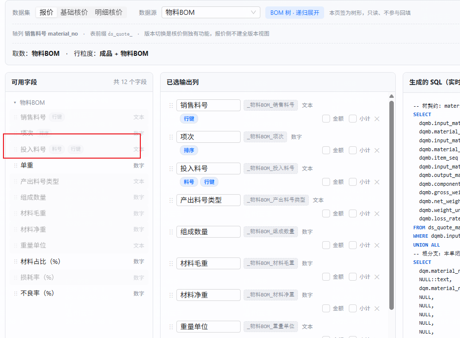
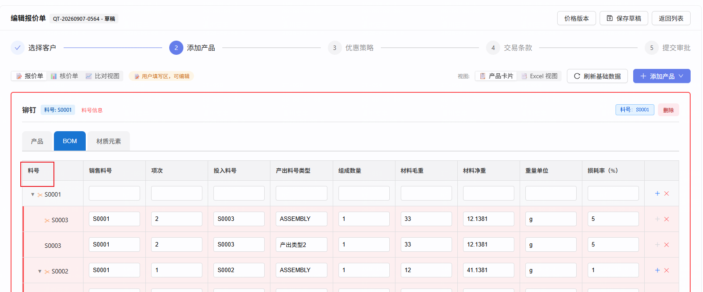

# 取数配置器优化（6 项）

> 建目录日期：2026-09-08（`date +%y%m%d` 实取）
> 路径：**A · 标准档**（用户 2026-09-08 裁决）
> 状态：**立项**

---

## ① 背景与目标

用户 2026-09-07 起真机连续使用取数配置器（`task-260819` 交付、`task-260904` 收缩页签类型、`task-260907` 补齐）配置报价/核价组件模板，暴露 6 项使用层面的缺口。它们分两类：

**第一类：配出来的视图缺业务必需的列（需求 1/2/3）**

料号是编码，人看不懂。当前配置器配出的任何数据源，**只能拖出料号列，拖不出对应的名称列** —— 实测全语义图带 `PART_NAME` 角色的列只有 2 个，且都在已被 `B-50` 摘除的 `QUOTE_MATERIAL_BRIDGE` 上（已登记缺口 `BL-0213`：配置器路径「名称列」实际不可达，那道「料号列或名称列至少配一个」的闸等于「料号列必填」）。

后果：实施人员配出来的报价单/核价单，用户看到的是一列 `S-3110520789`，要知道它是什么得另开一个页面查。

**第二类：配置界面把不相关的配置项摊给用户（需求 4/5/6）**

- 组件绑定区固定显示 5 个下拉（料号列 / 名称列 / 元素列 / 元素单价列 / 货币列），但**元素列与元素单价列只对「物料与元素BOM」数据源有意义**，其余 40 个数据源的用户看到的是 3 个永远该留空的框；货币列实测 38 个组件里只有 1 个在用。
- 行键列决定行身份（删行、回填、墓碑匹配全靠它），**配漏了会导致删错行/回填错位**，但当前要靠用户自己记得去拖。
- 料号列拖出后默认名是各表的物理语义名（「投入料号」「组成料号」「材质料号」），同一个概念在不同页签叫不同名字，模板做出来不一致。

**不做会怎样**：第一类使 `BL-0213` 继续挂着，实施人员配的每个模板都缺名称列；第二类使配置器的误配率维持在当前水平（`task-260904` 已因料号列校验有两个执行点、只改下游而返工过一次）。

---

## ② 范围

### 做什么

| # | 用户诉求（原话见 ⑤） | 交付物 |
|---|---|---|
| **S-1** | 所有数据源的料号标签字段下增加名称字段「材料名」 | 42 个数据源各挂查名边，材料名列内联在锚点分组内、紧跟料号列 |
| **S-2** | 报价 BOM 数据源增加「生产料号」字段 | `MATERIAL_BOM`(QUOTE) 按**销售料号**查 `ds_quote_material.production_no` |
| **S-3** | S-1/S-2 的字段存进 `extend_column` 的 json | **验收断言，非编码项**（机制已存在，见 ④） |
| **S-4** | 只有「物料与元素BOM」在顶部显示元素列/元素单价列；移除货币列；其余只显示料号列和名称列 | `ComponentManagement.tsx` 绑定区条件渲染 |
| **S-5** | 选中/切换数据源时已选输出列默认带出行键列，且必选 | `SqlViewBuilderTab.tsx` 自动带出 + ✕ 置灰 |
| **S-6** | 料号列拖出后默认名「料号」（报价侧销售料号除外 / 核价侧生产料号除外）；BOM 树的字段列改名「BOM」 | 配置器默认命名规则 + 两处树表头文案 |

**方言范围**：报价（QUOTE）· 基础核价（COST_BASIC）· 明细核价（COST_DETAIL）**三套全做**（`D-9`）。

### 🚫 明确不做什么

| 不做的事 | 为什么 / 去向 |
|---|---|
| **核价 BOM 不加「生产料号」列** | `D-12` 用户裁决：核价侧的轴本身就是生产料号。文档留此条，以后要加随时可加 |
| **核价 BOM 的材料名不接报价物料表 `ds_quote_material`** | `D-10` 用户知情裁决。实测接了能到 96/100，只接对应 ds_ 物料表 + 材质表是 17/100（基础）、7/22（明细）—— **本期接受这个覆盖率，写成显式交付缺口**（见 ④ 与 `AC-24`） |
| **不给 `ds_quote_*` / `ds_cost_*` 加任何物理列** | 材料名/生产料号一律 JOIN 实时带出。这是 `S-3` 能成立的前提 —— 加了物理列它就归锚点、不再落 `extend_column` |
| **货币列不做 DDL 删除、不清理 8 个消费点** | `D-4` 用户裁决只从 UI 拿掉下拉。彻底删属 `CLAUDE.md §3.2` 红线（`DROP COLUMN`），且会波及 `MaterialVersionUpgradeService`（价格调整写卡片值货币）与 `TemplateFreezeDriftService`（冻结漂移比对）两条活链路 |
| **电镀方案（`PLATING_SCHEME`）不加材料名** | `D-3`。实测三方言下它**都没有 `semantic_tab_view` 行** ⇒ 配置器里本就选不到，**不构成例外规则、不需要 AC** |
| **不改编译器 / 字段面板 / record 回填的任何 Java 代码** | 四个所需机制均已存在（见 ④）。本次后端 = 纯语义图数据配置 |
| **不动存量已保存组件的 `sql_template`** | 已发布模板读 `sql_views_snapshot`，存量视图不因语义图新增边而变化。存量要用新列须自行 `new-draft` + 重新发布（`AC-9` 反向断言） |
| **「材料名」不接 `material_master` 等其他主数据** | 只接 `ds_quote_material` / `ds_cost_*_material` / `material_recipe` 三类，与用户给的规则逐字一致 |

---

## ③ 验收标准（AC）

> 📌 断言里的所有数字均为 **2026-09-08 在 `10.177.152.12:5432/cpq_db_0724` 实测**，取数口径写在每条括号里，可复跑。
> ⚠️ 共享库数据会漂移。执行时若数字对不上，**先用括号里的口径重采一次基准**，再判断是不是回归。

### 原型对照（前端 AC 的视觉基准）

导航：[`原型图/index.html`](./原型图/index.html)（📌 当前基准，**局部基准** —— 只管下表这两块区域，区域以外见上游原型）

| 原型文件 | 状态 | 对应 AC |
|---|---|---|
| `01-组件绑定区.html` | 状态 1（物料与元素BOM，4 下拉） | **AC-10** |
| | 状态 2（其余源，2 下拉） | **AC-11** |
| | 状态 3（货币列移除对照） | **AC-12** |
| | 状态 4（存量已配元素列，边界） | **AC-13** |
| | 状态 5（空态） | **AC-25** |
| | 状态 6（最长文案 / 禁用态） | AC-11 的极值形态 |
| `02-取数配置器-已选输出列.html` | 状态 1（刚选源，行键锁定） | **AC-14 / AC-15** |
| | 状态 2（拖入业务列与查名列后） | **AC-17**，并示意 AC-7 的 `lookupLib` 徽标形态 |
| | 状态 3（切源往返，序列） | **AC-16** |
| | 状态 4（默认命名规则表） | **AC-17 / AC-18 / AC-19** |
| | 状态 5（空态 + 价格策略组边界） | AC-14 的边界形态 |

🚫 **F-4（树表头改「BOM」）不出原型** —— `frontend.md §1.3` 把纯文案改动明确列在不触发清单里。它由 AC-20/21/22 的**截图证据**约束，不由原型约束。

### 单点 AC

> 📌 **AC 中点名的组件均为 2026-09-08 实测存在**（`component` × `component_sql_view.builder_config`）：
> `04375490-927f-4802-bcc7-4156df4fc27d`「T260907-来料其他费用」（费用类/INCOMING_OTHER_FEE/QUOTE）·
> `f6d51727-bd1e-4cc3-a839-94208cc12f41`「T260907-物料BOM」（BOM/QUOTE）·
> `c6a71e5e-217a-49ab-8cce-a9cee88469a4`「T260907-物料」（主件/QUOTE）·
> `dc3297cc-e9a3-4184-8bc8-bb61db2a07d2`「材质元素」（材质元素/QUOTE）·
> `786b487c-fe71-473e-9b84-f13e4a4c5b48`「产品」（主件/COST_BASIC）
> 若执行时组件已被清理，**换一个同 `(tabType, variantKey, dialect)` 坐标的组件即可**，坐标才是判据。

**AC-1 · 报价侧普通数据源的材料名（连物料表，带客户维度）**
以 admin 打开组件 `04375490-927f-4802-bcc7-4156df4fc27d`（「T260907-来料其他费用」）的「取数配置」Tab（数据集=报价、数据源=来料其他费用）→ 左侧「可用字段」面板中存在字段 **「材料名」**，带 `lookupLib` 徽标 → 拖入「已选输出列」→ 右侧「生成的 SQL」中出现 `LEFT JOIN ds_quote_material` 且 `ON` 子句**同时含两个条件**：`.input_material_no = <别名>.material_no` 与 `.customer_no = <别名>.customer_no`（`D-11`）。

**AC-2 · 报价 BOM 的材料名是双表 COALESCE**
打开组件 `f6d51727-bd1e-4cc3-a839-94208cc12f41`（「T260907-物料BOM」）→ 拖入「材料名」→ 生成的 SQL 中该列表达式形如 `COALESCE(<物料表别名>.material_name, <材质表别名>.symbol)`，且 `FROM` 段同时出现 `LEFT JOIN ds_quote_material` 与 `LEFT JOIN material_recipe` 两条。
执行预览（客户选实测有数据的客户）→ 返回 **97 行**，其中材料名非空 **84 行**（口径：`ds_quote_material_bom` 全表 97 行，`input_material_no` 命中 `ds_quote_material`(同客户) 61 行 + 命中 `material_recipe.code` 23 行，两者交集 **0 行**、均不命中 13 行）。

**AC-3 · 报价 BOM 的生产料号走独立 JOIN（不被别名缓存吞掉）**
在 AC-2 的基础上再拖入「生产料号」→ 生成的 SQL 中 `ds_quote_material` 出现 **2 次且别名不同**：一条 `ON .input_material_no = ...`（材料名用）、一条 `ON .material_no = ...`（生产料号用，`D-2`）。
🚫 反向断言：**不允许**两列共用同一个别名 —— 那正是 `SemanticCompiler.ensureLeftJoin` 按 `target.id` 缓存别名会造成的静默失效形态（第二条边的连接键被吞、值取错且不报错）。

**AC-4 · 物料与元素BOM 只连材质表**
打开组件 `dc3297cc-e9a3-4184-8bc8-bb61db2a07d2`（「材质元素」）→ 拖入「材料名」→ 生成的 SQL **含 `LEFT JOIN material_recipe`、不含 `ds_quote_material`**。预览返回 **107 行**、材料名非空 **58 行**（口径：`ds_quote_element_bom` 107 行，`material_part_no` 命中 `material_recipe.code` 58 行）。

**AC-5 · 物料数据源同表退化，不产生自连接**
打开组件 `c6a71e5e-217a-49ab-8cce-a9cee88469a4`（「T260907-物料」）→ 拖入「材料名」→ 生成的 SQL 中 `ds_quote_material` **只出现 1 次**（锚点自己），材料名列直接取锚点别名的 `material_name`，**无 `LEFT JOIN ds_quote_material`**（`SemanticCompiler:614` 同物理表分支）。
同时左侧面板中「品名」与「材料名」**两个字段并存**（值相同）—— 这是 `D-7`「规则无例外」的已知代价，是预期行为不是缺陷。

**AC-5b · 核价「物料」数据源的列名撞名由去重机制消解**
打开组件 `786b487c-fe71-473e-9b84-f13e4a4c5b48`（「产品」，主件/COST_BASIC）→ 拖入「材料名」→ 断言两件事：
① SQL 中 `ds_cost_basic_material` **只出现 1 次**（同 AC-5 的同表退化）；
② 该列的视图列名**不是**裸 `material_name`（会与锚点自己的 `material_name` 撞），而是 `SemanticCompiler.dedupeAlias:1524` 加过后缀的形式 —— **把实际生成的列名记进证据**。
🔑 起因是核价侧视图列名规则为**裸 `dbColumn`**（`AliasGenerator.viewColumn:30`），而 `ds_cost_*_material` 自身就有 `material_name` 列（2026-09-08 实测：核价侧只有这两张表有该列）。这是预期行为，**断言的是「撞名被正确消解」而不是「不该撞名」**。

**AC-6 · 核价两套的材料名**
数据集选「基础核价」→ 数据源选「加工费&组装费」→ 拖入「材料名」→ SQL 含 `LEFT JOIN ds_cost_basic_material` 且 `ON` **只有一个条件** `.production_no = <别名>.production_no`（核价侧无客户维度，`D-11`）→ 预览 8 行、材料名非空 **8 行**。
数据集选「明细核价」→ 数据源选「模具工装成本」→ 同上（表名换 `ds_cost_detail_material`）→ 预览 2 行、非空 **2 行**。

**AC-7 · 材料名内联在锚点分组内，不另起分组**
AC-1 的界面状态下，「材料名」字段出现在**锚点数据源自己的分组**（如「来料其他费用」标题下），🚫 面板中**不存在**名为「物料」「材质」之类的独立查名分组（`FieldTreeBuilder.syntheticLookupFields` 内联机制）。

**AC-8 · 材料名/生产料号落 `extend_column`**（⚠️ 依赖项见 ④）
用含材料名列的组件配出的模板建一张报价单 → 提交 → 查 `ds_quote_material_bom_record`：该单对应行的 `extend_column` jsonb **含 key「材料名」**，值与页面显示一致；且主表 `ds_quote_material_bom` **没有** `material_name` 列（结构断言，证明它确实走的是 extend 通道）。

**AC-10 · 物料与元素BOM 显示元素列/元素单价列**
组件管理 → 打开 `dc3297cc-e9a3-4184-8bc8-bb61db2a07d2`（「材质元素」，绑定「物料与元素BOM」）→ 绑定区显示 **4 个下拉**：料号列 / 名称列 / 元素列 / 元素单价列，且元素列回填 `元素`、元素单价列回填 `元素单价`。

**AC-11 · 其余数据源不显示元素列/元素单价列**
分别打开 `f6d51727-bd1e-4cc3-a839-94208cc12f41`（「T260907-物料BOM」，BOM 源）与 `04375490-927f-4802-bcc7-4156df4fc27d`（「T260907-来料其他费用」，费用类源）→ 两者绑定区均**只显示 2 个下拉**：料号列 / 名称列。🚫 页面上不出现「元素列」「元素单价列」字样。

**AC-12 · 货币列在任何数据源下都不显示**
遍历上述两种组件 → 页面上均**不出现「货币列」字样**。
🚫 反向断言（`D-4`）：后端 `component.element_currency_field` 列仍在、`ComponentDTO.elementCurrencyField` 仍返回、存量有值的组件其值**未被清空**：
```sql
select element_currency_field from component where id='196aadee-b89f-4f81-984b-4c6747b59149';
-- 期望仍为 '货币'。该组件（「T260907-物料与元素BOM」）是 2026-09-08 实测全库唯一 element_currency_field 非空者
```
⚠️ **断言写成点名单行，不写成 `count(*)=1`** —— 全局计数会被同批并行的别片造数打红，且红得像业务回归（`testing.md §4.5`）。

**AC-14 · 选中数据源自动带出全部行键列**
新建组件 → 取数配置 Tab → 数据集「报价」→ 数据源选「物料BOM」→ **无需任何拖拽**，「已选输出列」中已存在该源全部带 `行键` 角色的列（实测 `MATERIAL_BOM`(QUOTE) 为 `material_no`「销售料号」与 `input_material_no`「投入料号」**2 列**）。

**AC-15 · 行键列不可移除**
AC-14 状态下，这 2 行的 ✕ 按钮为禁用态（置灰、点击无效），hover 显示原因文案（`frontend.md §1.2`：禁用但可见 + 说明原因）。非行键列的 ✕ 仍可正常点击移除。

**AC-17 / AC-18 / AC-19 · 料号列拖入后的默认字段名**
| AC | 场景 | 断言 |
|---|---|---|
| AC-17 | 报价「物料BOM」拖入 `input_material_no`（面板显示「投入料号」） | 已选输出列中该行字段名输入框的值是 **「料号」** |
| AC-18 | 报价「电镀费用」拖入 `material_no`（面板显示「销售料号」） | 字段名保持 **「销售料号」**（销售料号例外，`D-8`） |
| AC-19 | 明细核价「模具工装成本」拖入 `production_no`（面板显示「生产料号」）| 字段名保持 **「生产料号」**；而基础核价「物料BOM」拖入 `component_no`（「组成料号」）→ 字段名为 **「料号」** |

三条共同的反向断言：**左侧「可用字段」面板中的显示名保持原样不变**（仍是「投入料号」「组成料号」），只有拖入右侧后的字段名被改（`D-8`）。

**AC-20 / AC-21 · 树列表头改「BOM」**
| AC | 入口 | 断言 |
|---|---|---|
| AC-20 | 报价单**编辑页** Step2 → 打开含 BOM 树页签的产品卡片 | 树结构列表头文案为 **「BOM」**（原「料号」），列内仍显示带展开箭头的料号值 |
| AC-21 | 报价单**详情页**（只读） | 同上文案为 **「BOM」** |

🚨 两条必须同时通过 —— `ReadonlyProductCard.tsx` 的既有注释记录过一次「只改编辑页、漏改只读页」的事故（AP-50 同族）。

**AC-22 · 核价侧树表头同步改**
核价单视图下打开含 BOM 树的卡片 → 树结构列表头同为 **「BOM」**，其右侧的「版本」列**仍在**（`cardSide === 'COSTING'` 分支未被误删）。

### 序列 AC

**AC-16 · 切源往返，行键列不堆积不丢失**
新建组件 → 数据源选「物料BOM」（自动带出 2 个行键列）→ 手动拖入 1 个业务列「材料毛重」→ 切换数据源到「来料其他费用」→ 断言：已选输出列被重置为该源的行键列集合（实测 `INCOMING_OTHER_FEE`(QUOTE) 的 `ROW_KEY` 列），**不残留上一个源的列** → 再切回「物料BOM」→ 断言：已选输出列恰好是 2 个行键列，**不是 4 个**（不重复追加）、不含刚才那个业务列。

**AC-9 · 存量视图零变化（跨会话序列）**
执行本次迁移**前**，采一份基准：`select id, md5(sql_template) from component_sql_view where sql_template is not null order by id`。迁移应用后**重采一次** → 两份逐行 `diff` **完全一致**。
再打开任一存量组件的取数配置 Tab（不点保存）→ 关闭 → 重采第三次 → 仍完全一致。
🔑 这条钉的是「语义图加边不会改动任何已保存视图」，因为**新边只在重新编译时才参与**。

### 边界 AC

**AC-23 · 材料名取不到值时显示空，不是报错也不是「加载中…」**
用 AC-2 的配置执行预览 → 那 13 行两表都不命中的行，材料名列显示**空单元格或 `—`**。
🚫 反向断言：不出现「加载中…」（AP-31/AP-38 族）、不出现 `null` 字面量、预览的 `diagnostics` 中**不含**该列的 ERROR 级条目。

**AC-24 · 核价 BOM 材料名的已知低覆盖（显式缺口断言）**
基础核价「物料BOM」拖入材料名 → 预览返回 **100 行**、材料名非空 **17 行**（口径：`v_ds_cost_basic_material_bom_all` 100 行，`component_no` 命中 `ds_cost_basic_material.production_no` 10 行 + 命中 `material_recipe.code` 7 行，交集 0）。
明细核价「物料BOM」→ 返回 **22 行**、非空 **7 行**（口径：`v_ds_cost_detail_material_bom_all` 22 行，命中核价物料表 **0** 行 + 命中材质表 7 行）。
🔑 **这条 AC 断言的是「按 `D-10` 裁决的口径，覆盖率就是这么低」，不是断言功能正常。** 它存在的意义是把这个缺口钉在验收记录里，防止后续会话把「大部分为空」误判成 BUG 又查一遍。根因是 `component_no` 实测为**销售料号口径**（样本 `S-3110520789` vs 核价物料表 `3110520789`，差 `S-` 前缀）。

**AC-13 · 未绑数据源但已配元素列的组件，不被隐藏成僵尸值**

🚨 **本条必须自造数据，🚫 不许拿现网组件验。**
2026-09-08 实测：全库仅 2 个组件配了元素绑定（`dc3297cc-…`「材质元素」、`196aadee-…`「T260907-物料与元素BOM」），而**两个都有 `builder_config` 且 `tabType='材质元素'`** ⇒ `boundSemantic` 恒为 `'MATERIAL_ELEMENT'`。
⇒ 拿它们验，**无论判据写成「只看 semantic」还是「semantic 或已有值」都会绿** —— 这条 AC 会验一个恒真的东西，是零证据不是弱证据。

**前置状态**：造一个组件 `T260908-S2-legacy-elem`，直接写库设 `element_code_field='元素'`、`element_price_field='元素单价'`，且**不建 `component_sql_view` 记录**（模拟 `builder_config` 为空的存量形态 ⇒ 前端 `boundSemantic === undefined`）。
**操作**：组件管理中打开它。
**断言**：绑定区**显示** 4 个下拉，元素列回填 `元素`、元素单价列回填 `元素单价`。

**阳性对照（必做，否则这条仍不算数）**：把 F-1 的判据临时改成只看 `boundSemantic === 'MATERIAL_ELEMENT'` → 重跑本条 → **必须变红**。不红说明判据没生效或用例没测到点上。

**AC-25 · 未绑定数据源、也没配元素列的存量组件不崩**
打开 `010a2589-dfa4-4606-9a3d-9917bc0c2380`（「BOM」，2026-09-08 实测无 `builder_config`、无元素绑定）→ 绑定区只显示料号列/名称列两个下拉、页面无红色遮罩、控制台无未捕获异常。
🔑 与 AC-13 配对：AC-13 验「有值就显示」，本条验「没值就不显示」，**两条一起才把 F-1 的判据两侧都钉住**。

---

## ④ 依赖与影响面

### 依赖的既有机制（**本次全部复用，不改代码**）

| 机制 | 位置 | 承担 |
|---|---|---|
| 查名字段内联进锚点分组 | `FieldTreeBuilder.syntheticLookupFields:483-535` | AC-7；且它按 `coalesceGroup` 去重、用 `fallback_order` 最小的节点代表 |
| 多源 COALESCE | `SemanticCompiler.resolveLookup:698-716` | AC-2、AC-24；按角色 `pickColumnByRole` 挑分支列 |
| 同物理表直读 | `SemanticCompiler.resolveColumn:614-623` | AC-5 |
| 非锚点列落 `extend_column` | `DsSheetBindingResolver:246-258`（**在 `feat/task-260907-record-backfill` 分支**） | AC-8 |
| 前端语义三态判据 | `cpq-frontend/src/utils/tabSemantic.ts` | AC-10/11/13/25 |

### 本任务闭合的既有 Backlog 缺口

**`BL-0213`（`docs/BACKLOG.md:489`「`task-260904` 第二批的两条 AC 未真正验过」）的两个缺口，本任务都会闭合：**

| 缺口 | 原文记的状态 | 本任务如何闭合 |
|---|---|---|
| **G-A** · `AC-20④` 查名展开字段 | 「机制在实现里存在，但**当前数据下 39 个数据源产出合计 0 个**，用例只能写成空集断言」 | S-1 让 42 个数据源**全部**产出查名展开字段 ⇒ 该 AC 首次有非空样本可验（本任务 `AC-7` 即其对应断言） |
| **G-B** · `AC-29③` 只配名称列应能保存 | 「全图带 `PART_NAME` 的列 = 2 个，全在已被 B-50 摘除的 `QUOTE_MATERIAL_BRIDGE` 上 ⇒ 那道闸对 builder 组件**实际等于料号列必填**」 | S-1 新增 7 个带 `PART_NAME` 角色的查名节点、挂 46 条边 ⇒ 42 个数据源**都能选到名称列**，闸恢复成它本来的语义 |

📌 `BL-0213` 原文给了两个待定选项：**① 把 `QUOTE_MATERIAL_BRIDGE` 重新挂回去**（会连带改回 `AC-20` 的组数）、**② 把闸的文案与逻辑诚实改成「料号列必填」**。
**本任务走的是第三条路**：不动那个被摘除的桥（避免连带影响），也不降级那道闸，而是**给每个数据源配一个真正属于它自己的名称来源**。
⇒ 结案时应把 `BL-0213` 标 `[x]` 并注明由本任务闭合。

⚠️ **顺带发现（不属本任务范围，报请用户裁决）**：`docs/BACKLOG.md` 里 **`BL-0213` 编号被用了两次** —— 第 38 行「antd v6 下 Tooltip 包 disabled 按钮失效」与第 489 行「`task-260904` 测试缺口」。本文引用的是**后者**。

### 🚨 跨任务依赖

**`AC-8` 硬依赖 `feat/task-260907-record-backfill` 合入 master。**
实测：master 上 `ds_quote_*_record` 的 `extend_column` **没有任何 Java 写入点**（全仓仅 `DdlExtensionService` 命中同名符号，那是无关的 DDL 扩展功能）；写入逻辑 `DsRecordProjector:182-188` 只存在于该分支。
若合并时它仍未进 master，`AC-8` 降级为**结构断言**（「材料名列的 `sourceNodeKey` ≠ 锚点节点 ⇒ 按 `DsSheetBindingResolver:248` 的规则必落 extend」），并在闸门 B 汇报里列为显式缺口。

### 影响面（需回归）

| 面 | 判断 |
|---|---|
| **存量 `sql_template`** | 零影响。语义图加边只影响**新编译**；已发布模板读 `sql_views_snapshot`。`AC-9` 正是这条的断言 |
| **`component` 表 5 个绑定字段** | 只改 UI 可见性，**后端读写路径一行不动**（`D-4`）。`AC-12` 反向断言值未被清空 |
| **报价单/核价单渲染** | 仅树列表头文案（`AC-20/21/22`）。`th` 是两侧共用的，改动会同时影响核价侧 —— 这是 `D-6` 用户明确要的 |
| **`semantic_edge` 唯一约束** | `(from_node_id, to_node_id, edge_kind)`。本次新增 46 条边**均为不同 (from,to) 组合**，不撞键；这正是 S-1 与 S-2 在物料BOM 上必须拆成两个查名节点的原因 |
| **价格策略原子组** | 不碰。`PRICE` 边与本次的 `LOOKUP` 边互不影响；`ELEMENT_BOM` 新增的查名边不进 `tab_view_node`，不会与 `B-23` 修过的「两个价格策略组」缺陷重叠 |

### 架构基线

**不触碰** `docs/架构基线.md` 与 `docs/三大核心模块基线.md` 的任何基线项：
- 未改渲染链路契约（树契约固定列 `material_no`/`parent_no` 原样不动，只改表头**文案**）
- 未改组件/模板的存储结构
- 未新增字段类型（不触发 `AP-44` 的 17 检查点协议）

### 并发风险

| 风险 | 处置 |
|---|---|
| **Flyway 号争抢** | 2026-09-08 实测：源码树最大 `V429`，共享库 `flyway_schema_history` 最大 `V429`，**两侧一致、无孤儿无落后**。本任务拟用 `V430`，**开工时必须重新四方核对**（共享库 × master × 当前分支 × `target/classes/db/migration`，见 `RECORD.md` 2026-09-07 两次迁移事故） |
| **语义图种子被并发改** | `task-260904` 的 worktree 仍在。本次只**新增**节点/边、不修改既有行，冲突面小；但迁移落库前须重采一次 `semantic_node`/`semantic_edge` 行数 |
| **`SqlViewBuilderTab.tsx` / `ComponentManagement.tsx` 是热点文件** | `INDEX.md` 反查表记录 `ComponentManagement.tsx` 被 9 个任务改过。开工前跑一次 `git log --oneline -5 --` 确认无在途改动 |

---

## ⑤ 用户原话与素材归档

### 首次提出（2026-09-08）

> 组件管理中,取值配置器中,进行优化:
> 1. 在所有数据源的料号标签的字段下增加一个名称字段[材料名] -> 根据料号列 去 物料表连表查询带出
> 2. 在BOM数据源增加生产料号字段, 连表物料表,查询销售料号对应的生产料号
> 3. 1和2增加的字段都存储在extend_column的json中
> 4. 只有物料BOM元素 在顶部显示 元素列和元素单价列配置, 并且移除货币列.  其余数据源的页签只显示料号列和料号名称列
> 5. 选中了数据源或者切换数据源,已选输出列默认带出行键列,并且必选
> 6. 除了销售料号作为料号列数据源,其余数据源的料号列才选出后默认名称为[料号]. 其中BOM数据源中,默认的树的字段列占用了名称[料号],将树的字段列改名为[BOM]

### 澄清补充一：材料名的取值规则

> 材料名 取的是带有料号标签的列,如 [截图1] 物料bom中就是取投入料号.如果投入料号是材质号的话,取材质表的名称.所以这个要连物料表和材质表,进行判断,默认材质号与物料表不会出现料号相同的情况.
> 并且也只有物料BOM表需要连两张表,物料BOM元素连接的是材质表. 其余表连接的都是物料表



*（截图要点：「投入料号」带 `料号`+`行键` 两个 badge，「销售料号」只有 `行键` ⇒ 取名锚定的是 `PART_NO` 角色列）*

### 澄清补充二：树的字段列在哪

> [截图2]



*（截图要点：报价单编辑页 BOM 树页签第一列表头「料号」= 树结构列，显示 S0001/S0003 带展开箭头）*

### 澄清补充三：核价侧规则（用户答「三套都做」时给出）

> 三套都做:
> 核价组件
> 1.除了生产料号作为料号列数据源,其余数据源的料号列才选出后默认名称为[料号]
> 2.在所有数据源的料号标签的字段下增加一个名称字段[材料名] -> 根据料号列 去 对应的ds_物料表连表查询带出,物料bom中就是取组成料号.如果组成料号是材质号的话,取材质表的名称.所以这个要连物料表和材质表,进行判断,默认材质号与物料表不会出现料号相同的情况. 并且也只有物料BOM表需要连两张表,物料BOM元素连接的是材质表. 其余表连接的都是物料表
> 3. 选中了数据源或者切换数据源,已选输出列默认带出行键列,并且必选
> 4. 只有物料BOM元素 在顶部显示 元素列和元素单价列配置, 并且移除货币列.  其余数据源的页签只显示料号列和料号名称列

### 澄清补充四：放大风险的处置

> 核价侧没有客户,生产料号不存在重号. 报价侧需要带入客户一起查询

---

## ⑥ 裁决台账

| 编号 | 裁决 | 依据 |
|---|---|---|
| `D-1` | 材质表的「名称」取 `material_recipe.symbol`（牌号），不取 `name` | 用户选择。`symbol` 有 NOT NULL 约束，`name` 可空 |
| `D-2` | 报价 BOM 的生产料号用**销售料号 `material_no`**（轴列）查，不用投入料号 | 用户选择，与其原话「查询销售料号对应的生产料号」一致 |
| `D-3` | 电镀方案排除 | 用户选择。补充实测：三方言下它都无 `semantic_tab_view` 行 ⇒ 本就不可达，**不构成例外规则** |
| `D-4` | 货币列**只从 UI 拿掉下拉**，后端字段与 8 个消费点全保留 | 用户选择。避开 `§3.2` 红线与两条活链路 |
| `D-5` | **全部** `ROW_KEY` 列都带出，且**都不可移除** | 用户选择 |
| `D-6` | 树列表头改「BOM」**报价侧核价侧都改** | 用户选择。那个 `th` 两侧共用 |
| `D-7` | 「物料」数据源**也加**材料名，规则无例外 | 用户选择。代价（面板出现「品名」+「材料名」两个同值列）已告知；实现上编译器走同表分支，无冗余 JOIN |
| `D-8` | 只改**拖入后**的字段名，左侧可用字段面板保持原名 | 用户选择 |
| `D-9` | 三套方言都做 | 用户选择 |
| `D-10` | 核价 BOM 材料名**只连对应 ds_ 物料表 + 材质表**，不接 `ds_quote_material` | 用户知情裁决（已看过 96/100 vs 17/100 的实测对比） |
| `D-11` | 报价侧连物料表**带 `customer_no` 一起查**；核价侧无客户维度、生产料号不重号 ⇒ 单列连接键 | 用户裁决。副产物：不再碰 `ds_quote_material` 后，跨客户重号的放大风险自然消失 |
| `D-12` | 核价 BOM **不加**生产料号列 | 用户裁决 |

> 🚦 **A0 记录**：本任务在「核价 BOM 材料名连哪几张表」上存在三个合理选项，已按 `CLAUDE.md §4.5` 走闸门 A0 呈报（含改动面/覆盖率实测/风险）并由用户裁决为 `D-10`/`D-11`/`D-12`。其余 5 项方案唯一，未走 A0。
