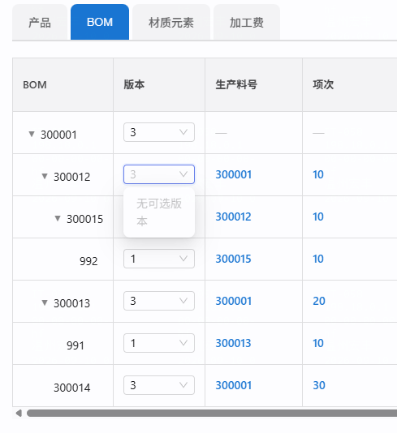

# repair-260910 · 核价树版本切换：候选列表恒空（树分支硬编码查 V6 老表）

> **返修对象**：`task-260909-核价树骨架分档与轴口径统一`（同根因第二个执行点，主任务仍在闸门 B 后待结案）
> **状态**：🔵 立项 · ①~④ 已写到根因 · **待闸门 A0 方案裁决**

---

## ① 问题描述

**用户原话（2026-09-10 验收期）**：

> 「核价单选择版本号列表是空,你检查下整条切换版本的链路是否用到了V6旧表」

**客观现象**：核价单 BOM 页签的树渲染**正常**（7 行、层级正确），「版本」列也**正确显示了当前版本**（`3/3/3/1/3/1/3`），但点开任意一行的版本下拉，内容是 **「无可选版本」**（空列表）。



⚠️ **注意这个组合本身就是线索**：能显示当前版本、却给不出候选 ⇒ **显示值与候选值来自两个不同的数据源**，其中一个已经迁走了。

---

## ② 复现 / 发现方式

| 项 | 内容 |
|---|---|
| **谁怎么发现** | 用户在 `task-260909-取数配置器字段类型选择` 的闸门 B 验收期，顺手点核价单版本下拉时发现 |
| **前置数据** | 客户「正泰」的核价单；核价模板 `核价模板1`（PUBLISHED）；BOM 页签组件 `COMP-2299`（`bom_recursive_expand=true`）；树内料号 `300001/300012/300015/992/300013/991/300014` |
| **操作步骤** | 报价单 → 编辑 → 下一步（Step2）→ 切「📊核价单」→ BOM 页签 → 点任意一行的「版本」下拉 |
| **环境 / 库** | dev server `8081` + `5174`，默认 profile 库 `cpq_db_0724` |
| **出现频率** | **必现**，且**与点哪一行无关** —— 树内 7 个料号在老表里全部 0 行（见 ④ 证据链 E-2） |
| **影响范围** | 不限于这一张单：**所有以 `ds_*` 数据集为源的核价树，版本切换的候选列表全部失效** |

---

## ③ 需求结果

| 编号 | 期望行为 | 对照 |
|---|---|---|
| **E-1** | 树内**非根**节点的版本下拉，列出「该料号**作为子件**出现过的全部 BOM 版本」。例：`300012` → `[3, 2, 1]`；`300014` → `[3, 1]` | 与骨架 SQL 递归体 `bom_version = ch.version_no` 同源 |
| **E-2** | 树**根**节点的版本下拉，列出「该成品**自己那张 BOM** 的全部版本」。例：`300001` → `[3, 2, 1]` | 与骨架 SQL 锚点 `WHERE bv.production_no = s.production_no` 同源 |
| **E-3** | 下拉里高亮的「当前版本」与「版本」列显示值**逐字一致**（实测应为 `is_current=true` 那个） | 现状显示值已正确，不得改坏 |
| **E-4** | 两套核价数据集**各查各的**：`COST_BASIC` 走 `v_ds_cost_basic_*`，`COST_DETAIL` 走 `v_ds_cost_detail_*` | 承接主任务 `D-2`「两棵树各自独立维护」 |
| **E-5** | 选中某版本后，切换动作照常生效（`switchVersion` 现状已正确，**不得回归**） | —— |

### 🚫 反向期望（防止「修成把告警关了」）

| 编号 | 该报的仍要报 / 该拦的仍要拦 |
|---|---|
| **E-6** | **不许给出该料号并不存在的版本**。例：`300014` 在版本 2 里不存在 ⇒ 候选**必须只有 `[3,1]`**，🚫 不许因为「父件 `300001` 有 3 个版本」就给它 3 个。<br>📌 这正是 `repair-0590`「下拉给了料号它没有的版本」修过的坑，不许复发 |
| **E-7** | 真的没有可选版本时（如某叶子只有 1 个版本），**仍应显示「无可选版本」或单项**，不许伪造 |
| **E-8** | 非树组件（`dsCostBase != null` 分支）与报价侧行为**逐位不变** —— 那一支已适配新表，本次不碰 |
| **E-9** | `仅 PENDING 可切换` 的状态校验、`CostingOrderVersionOverride` 的覆盖优先级，**逐字不变** |

---

## ④ 问题原因 / 报告

### 一句话根因

`CostingVersionService#listVersionOptions` 的**树组件分支**把查询**硬编码**在 Java 里，仍查 V6 老表 `material_bom_item(system_type='PRICING', customer_no='_GLOBAL_')`；而正泰这批数据早已迁到 `ds_*` 新表，老表里一行都没有 ⇒ 候选集恒空。

### 出问题的代码（`CostingVersionService.java:105-120`）

```java
boolean tree = isTreeComponent(componentId);
String dsCostBase = tree ? null : dsCostBaseTableOf(componentId);   // ← 树被显式短路，拿不到 ds 表名

if (tree) {
    em.createNativeQuery(
        "SELECT bom_version, is_current FROM material_bom_item " +      // ← V6 老表
        "WHERE system_type='PRICING' AND customer_no='_GLOBAL_' AND material_no=:p " +
        "AND bom_version IS NOT NULL")
      .setParameter("p", partNo)...
} else if (dsCostBase != null) {
    // 非树组件：已适配 ds_cost_* 新表（主表 UNION _history），这一支是好的
}
```

### 证据链（可复跑）

**E-1 · 老表里没有这批料号**
```sql
SELECT p, (SELECT count(*) FROM material_bom_item m
           WHERE m.system_type='PRICING' AND m.customer_no='_GLOBAL_'
             AND m.material_no=p AND m.bom_version IS NOT NULL)
FROM unnest(ARRAY['300001','300012','300015','992','300013','991','300014']) p;
-- 实测：7 个料号 全部 0 行
```

**E-2 · 老表里存的是完全另一批数据**
```
customer_no=_GLOBAL_ / system_type=PRICING → 68 行 / 20 个料号
样本：2120011658, 3110520789, TEST0813-P01, VS-FG0 …（无一个 3000xx）
最后写入：2026-09-02 11:54:39
```

**E-3 · 新表里数据是齐的，且语义可直接对应**
```sql
SELECT component_no, production_no, version_no, is_current
FROM v_ds_cost_basic_material_bom_all WHERE component_no IN ('300012','300014');
-- 300012 | 300001 | 1 f / 2 f / 3 t     ⇒ 候选[3,2,1] 当前3
-- 300014 | 300001 | 1 f /     / 3 t     ⇒ 候选[3,1]   当前3（版本2里没有它）
SELECT DISTINCT production_no, version_no, is_current
FROM v_ds_cost_basic_material_bom_all WHERE production_no='300001';
-- 300001 | 1 f / 2 f / 3 t              ⇒ 根节点候选[3,2,1] 当前3
```
与截图显示的当前版本**逐字吻合**。视图 = `ds_cost_basic_material_bom` **UNION ALL** `..._history`，且**自带 `is_current` 列** ⇒ 与老表字段**一一对应，属同构替换**。

**E-4 · 两个数据集的视图都存在**：`v_ds_cost_basic_material_bom_all` / `v_ds_cost_detail_material_bom_all`

**E-5 · 骨架 SQL 已给出标准答案**（主任务 B-9 交付物，注释原文）：
> 递归体：`bom_version` 取【这条边所属 BOM 的版本】= `ch.version_no` …
> 锚点：`(SELECT bv.version_no FROM v_ds_cost_basic_material_bom_all bv WHERE bv.production_no = s.production_no …)`

⇒ **根按 `production_no` 查、非根按 `component_no` 查**，候选列表照抄这两个分支即可与显示值同源。

### 引入时间线（不是「改坏了」，是**数据搬家后的失配**）

| 时间 | 事件 |
|---|---|
| **2026-07-14** `b69d7af8` | `task-0713 核价单版本选择` 写入这段查询。**当时数据确实在 `material_bom_item`，代码是对的** |
| 2026-07-27 之后 | 核价数据改由 `ds_*` 数据集承载，老表不再接收新料号 |
| 2026-09-02 | `material_bom_item(PRICING/_GLOBAL_)` 最后一次写入（68 行旧数据）之后再无更新 |
| 2026-09-08 | 报价侧骨架切到 `v_compat_material_bom_item` |
| **2026-09-09** 主任务 | 把 `COST_BASIC` 骨架 SQL 切到 `v_ds_cost_basic_material_bom_all` ⇒ **树渲染恢复正常** |
| **⚠️ 同时** | 这段查询**硬编码在 Java 里、不在配置层**，主任务够不着 ⇒ **渲染好了、候选列表还空着** |

### 影响面

| 范围 | 判断 |
|---|---|
| **失效** | 所有以 `ds_*` 为源的核价树页签，版本**候选列表**恒空（不限于本单） |
| **未受影响** | ① `switchVersion` 切换动作本身 —— 它走 `bomTreeRenderService.render(...)`，用的是**已修好的骨架 SQL**，不查老表；② 非树组件（`dsCostBase != null` 分支）已适配新表；③ 报价侧 |
| **数据安全** | **零风险** —— 纯读路径，不写库；当前表现是「少给选项」不是「给错数据」 |
| **同类点** | 全工程另有 **9 处**硬编码 `FROM material_bom_item`（`BuilderService:659`、`SemanticCompiler:1640`、`QuotePendingRewriter:461/526`、`MaterialBomItemRepository:63/77`、`MaterialMasterRepository:364/401` 等），**是否同病需单独评估**，是否并入本次由闸门 A0 裁决 |
| **与并发会话** | `task-260909-V6老表退役` 的范围是 `costing_bom_tree_config.sql_template` 与视图定义，**未覆盖本处**（已核）⇒ 不撞车 |

### 为什么测试没拦住

1. **主任务 AC 未覆盖版本切换** —— `task-260909-核价树骨架` 的 22 条 AC 全部围绕「树能不能渲染出来」，**没有一条验版本下拉**（已实查：AC 正文里 `版本` 零命中）。任务范围是「骨架分档与轴口径」，版本候选被当成了不相干的功能。
2. **症状本身具有欺骗性** —— 树渲染正常、当前版本也正确显示，**看起来功能是好的**；只有点开下拉才暴露。任何「看渲染结果」型的验证都抓不到它。
3. **主任务亲验用的是 UI 截图比对**，比的是树结构与单元格值，未展开交互控件。

> 📌 **这条属于「同一根因第 2 次出现」**（`CLAUDE.md §4.3` BUG 判据表命中项）：主任务修的是**配置层**的老表引用，本次是**代码层**的同一件事。
> 教训候选：**「某张表停止接收新数据」这类迁移，必须同时枚举配置层与代码层两处引用面**，只改配置层会留下静默失效点。
