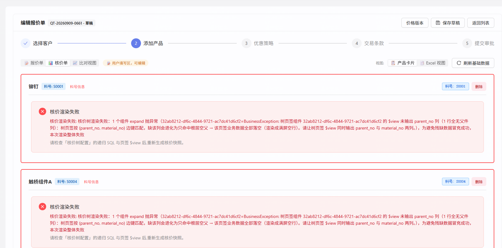

# 需求文档 · 核价树骨架分档与轴口径统一

| 项 | 值 |
|---|---|
| 任务目录 | `dev-docs/task-260909-核价树骨架分档与轴口径统一/` |
| 建档日期 | 2026-09-09（`date +%y%m%d` 实取） |
| 路径 / 档位 | **路径 A · 标准档**（碰权限 + 跨端契约 + 存量配置处理，轻量档判据①④不满足） |
| 当前状态 | `立项` · 待闸门 A |
| 关联主任务 | `task-260907-取数配置器补齐`（引入树页签根分支）· `repair-260814-发布冻结后tabType护栏误拦`（引入 parent_no 硬拦）· `task-260902-报价与核价建表与导入方案新规范`（引入三数据集）。**跨三个主任务，故新建主任务**（`task-docs.md §1`） |

---

## ① 背景与目标

### 起点现象

2026-09-09 用户在「编辑报价单 `QT-20260909-0661`（正泰 `CUST-0004`）→ 核价单 → 产品卡片」看到 **4 张产品卡片全部红框**，文案：

> 核价渲染失败：核价树渲染失败：1 个组件 expand 抛异常（`32ab8212-df6c-4844-9721-ac7dc41d6cf2`=BusinessException: 树页签组件 … 的 `$view` 未输出 `parent_no` 列（1 行全无父件列）…）



### 根因（三层，全部已用真实数据复算证实）

| 层 | 根因 | 实证 |
|---|---|---|
| **L1 · 守卫误报** | `BomTreeRenderService.assertParentNoPresent`（`:581`）把「**所有行的 `parent_no` 值为 NULL**」判定为「视图漏了 `parent_no` 列」。但取数配置器自 `888bb6b0`（2026-09-07 · task-260907 B-3）起生成的树页签 SQL 带一支**根分支**，其 `parent_no` 恒为 `NULL` 是**设计**。闭包无边时 100% 的行都是根行 ⇒ 必然误报 | 该视图 `declared_columns` 含 `parent_no`；实算 `$view` 返回 **1 行**（根行 300001），与报错文案「1 行全无父件列」逐字对上。全库 5 个树页签**全部**是配置器生成、**全部**带根分支 ⇒ 守卫 2026-08-14 立规矩时依据的「18/18 零反例」已于 24 天后失效 |
| **L2 · 骨架查错表** | 核价树骨架配置 `costing_bom_tree_config(usage='COSTING')` 自 **2026-07-27** 未动，仍查 V6 老表 `material_bom_item WHERE customer_no='_GLOBAL_' AND system_type='PRICING'`；而正泰数据在 `ds_*` 新表 | 该条件下 `material_no IN ('S0001','S0004','S0008','S0012')` 实测 **0 行**；复算闭包 = **4 个根节点、零边**。对照：`usage='QUOTE'` 那条已于 **2026-09-08** 切到 `v_compat_material_bom_item`，报价侧树正常（快照实测 `__nodeId='S0001/S0003'`、`__lvl=2`，子件业务值已挂上） |
| **L3 · 轴口径与行归属键错配** | ①核价侧 `:total_material_no` 今天必须是**销售料号**（`COST_*` 页签靠 `ds_quote_material` 桥翻译），而核价 BOM 的子件（300012/300013/…）**在 `ds_quote_material` 里根本没有销售料号** ⇒ 边分支恒 0；②`BomTreeRenderService:459` 非树页签写死按 `material_no` 分桶，而平台约定的行归属键是 `hf_part_no` | ①`ds_quote_material` 中 `300012/300013/300014` 实测 **0 行**；②全库 42 个生效视图中 **41 个有 `hf_part_no`**、**仅 5 个有 `material_no`**（正好是 5 个树页签）⇒ 核价模板1 的「产品」「材质元素」页签今天**行全部落选、恒空**（`kept=0`，守卫按设计不判，连红都不红） |

**三层是串联的**：只修 L1 → 不报错但树是光杆；只修 L1+L2 → 树有了但每行业务数据全空；三层都修，核价卡片才成立。

### 目标

1. 核价 BOM 树在 `ds_cost_basic_*` 数据集上**渲染出完整树与业务数据**
2. 骨架配置的维度**对齐数据集**（`QUOTE` / `COST_BASIC` / `COST_DETAIL`），使**基础核价与详细核价两套模板各用各的树**，互不串
3. 把「行归属键 = `hf_part_no`，料号空间由方言决定」确立为**两侧共用的口径基线**
4. 「核价树配置」收敛为**管理员专属**能力

### 不做会怎样

核价侧当前**完全不可用**：任一核价模板只要含树页签就整卡报错；即使绕过报错，产品/材质元素/加工费三个页签也恒空。且一旦建出第二张（详细核价）模板，两套模板会**静默抢用同一条骨架配置**，渲染出对方数据集的树而不报错。

---

## ② 范围

### 做什么

| # | 交付项 | 层 |
|---|---|---|
| 1 | 守卫判据修正：`assertParentNoPresent` 不再把「全是根行」判成缺列；真缺列仍抛 400 | L1 |
| 2 | 骨架维度 `usage` 由 2 值扩到 **4 值**（`QUOTE` / `COST_BASIC` / `COST_DETAIL`，保留 `COSTING` 作为 `COST_BASIC` 的**只读兼容别名**） | L2 |
| 3 | 渲染期**按树页签组件的方言**解析该用哪条骨架配置（数据来源 `component_sql_view.builder_config.dialect`，**无需新增字段**） | L2 |
| 4 | 骨架未配置时的报错文案带上数据集名（`无 usage=COST_DETAIL …` 而非恒 `COSTING`） | L2 |
| 5 | 核价侧轴口径统一为**生产料号**：`COST_*` 页签不再发 `ds_quote_material` 桥，轴直接落方言轴列；销售→生产的翻译**只在骨架 SQL 的种子处发生一次**（带 `:customerCode`） | L3 |
| 6 | 非树页签行归属键改为 **`hf_part_no`**（`hf_part_no` 缺失时回落 `material_no`，仅为保护全库唯一 1 个非配置器视图） | L3 |
| 7 | 模板发布期**告警不拦**：模板含非本数据集页签时提示「本模板含 N 个非本数据集页签：<页签名>(<方言>)」 | 新增 |
| 8 | 「组件管理 → 核价树配置」页签**仅 `SYSTEM_ADMIN` 可见**；后端端点角色由 `{SALES_MANAGER, SYSTEM_ADMIN}` 收紧为 `{SYSTEM_ADMIN}` | 新增 |
| 9 | 前端该页签切换控件由 2 项改 3 项（**报价 / 基础核价 / 详细核价**），默认落「基础核价」，说明文案与空态同步 | 新增 |
| 10 | **配置动作**（非代码）：配出 `COST_BASIC` 骨架 SQL 并设为生效、老 `COSTING` 配置下线、`COMP-2319 加工费` 组件方言由 `QUOTE` 改回 `COST_BASIC` 并重编译 | 配置 |

### 明确不做（本期边界）

| 不做的事 | 去向 |
|---|---|
| **全模板同方言的发布期硬拦** | 用户 2026-09-09 裁决 `D-3`：只管树页签，混方言只告警不拦（交付项 7）。**已否决，不进 Backlog** |
| **配出 `COST_DETAIL` 的骨架 SQL 内容** | 本期只交付「机制支持 + 界面能配 + 空态正确」。库里 `COST_DETAIL` 方言组件实测 **0 个**，没有可验的模板 ⇒ 等业务建详细核价模板时再配。**进 `BACKLOG`** |
| **取数配置器建 BOM 树页签时附带写骨架配置** | `task-260728` 需求说明 v8 §10.2 的规划，属该任务「BOM 树是否纳入本期（+30%）」的**未裁决遗留项**。**不在本期扩范围** |
| **`costing_order` 的版本切换链路**（`CostingVersionService` / `costing_order_version_override`） | 本期不碰。实测 `costing_order_version_override` 现有 **0 行**，版本切换在本库从未被使用 |
| **报价侧任何改动** | 报价侧当前正常（AC-17/AC-18 作为零回归门禁）。`usage='QUOTE'` 配置一个字节不动 |
| **`BomTreeRenderService` 树页签边键改用 `hf_part_no`** | 树行上 `hf_part_no ≡ material_no`（`SemanticCompiler:334`，树的 `hf_part_no` 取子件），改了等价但无收益、徒增风险。**已否决** |
| **补 `material_no` 到非树页签的编译产物** | 闸门 A0 已裁决走渲染层改正（`D-8`）。**已否决** |

---

## ③ 验收标准（AC）

> 统一前置环境：dev server（前端 `5174` / 后端 `8081`）+ 默认 profile 库 `10.177.152.12:5432/cpq_db_0724`；
> 统一测试单据：`QT-20260909-0661`（客户 `CUST-0004` 正泰，草稿，4 行：`S0001` 铆钉 / `S0004` 触桥组件A / `S0008` 铆钉组件B / `S0012` 端子组件C）；
> 核价模板：`核价模板1 v1.0`（`9d89e95d-f0e1-42eb-bf6d-0a815e531f0e`，PUBLISHED，5 页签）。
> 报价模板：`正泰测试模板1 v1.1`（`6dedb30b-a3f2-49db-ba11-9570613a66f7`）。

### 一、骨架分档（机制）

**AC-1（单点）** 以 `admin`（`SYSTEM_ADMIN`）打开「组件管理 → 核价树配置」，顶部切换控件显示**三项**：`报价` / `基础核价` / `详细核价`，默认选中 **`基础核价`**；页面标题显示「基础核价树配置」。

**AC-2（单点·空态）** 在 AC-1 基础上点「详细核价」：表格 0 行并显示空态文案 **「暂无详细核价树配置」**，「新增」按钮仍可点（不禁用），页面不报错。

**AC-3（单点）** 在「基础核价」下新增一条名为 `基础核价BOM树-v1` 的配置并「设为生效」后：
`SELECT usage, count(*) FROM costing_bom_tree_config WHERE is_active GROUP BY 1` 返回 **`COST_BASIC=1` 且 `QUOTE=1`**，且 `usage='QUOTE'` 的生效记录 `id` 与操作前**逐字相同**。

**AC-4（边界）** 在「基础核价」下保存一条**缺 `node_path` 输出列**的递归 SQL：返回 **400**，消息含 **「递归 SQL 缺输出列: node_path」**，且 `costing_bom_tree_config` 记录数与操作前相同（不新增）。

**AC-5（边界·阴性）** 把 `usage='COST_BASIC'` 的生效配置改为不生效后，重新渲染 `QT-20260909-0661` 的核价单：错误文案中出现 **`usage=COST_BASIC`**（而非 `usage=COSTING`）。恢复生效后错误消失。

### 二、核价树渲染

**AC-6（单点·核心）** 打开 `QT-20260909-0661` → 核价单 → 产品卡片：**4 张卡片均无红色「核价渲染失败」框**。

**AC-7（单点·核心）** `S0001` 卡片的 **BOM 页签**显示 **7 行**，BOM 列（树列）自上而下为：
`300001` / `300012` / `300015` / `992` / `300013` / `991` / `300014`，最大缩进层级 **4 层**（`300001 → 300012 → 300015 → 992`）。

**AC-8（边界·无数据）** `S0004` / `S0008` / `S0012` 三张卡片的 BOM 页签**各显示 1 行**（分别为 `300021` / `300031` / `300041`），业务列显示 `—`，**不报错、不出现「加载中…」**。

**AC-9（单点）** `S0001` 卡片 BOM 页签中 `300012` 那一行的「**组成用量**」列显示 **`1`**、「**组成用量单位**」`PCS`、「项次」`10`；`991` 行的「组成用量」显示 **`3.5`**、「组成用量单位」`KG`。
> 🔧 **2026-09-09 事实订正**：初稿把列标签写成「组成数量 / 单位」，与 `COMP-2299` 实配字段名（`组成用量` / `组成用量单位`）不符。**断言的值一字未改**，只订正列标签。

### 三、轴口径统一（方案甲）

**AC-10（单点·核心）** `S0001` 卡片的**材质元素页签**显示 **4 行**，「**元素代码**」集合为 `{Cu, 301, Ag, Cu}`，其中 2 行归属料号 `300013`、2 行归属料号 `300015`。
> 🔑 修复前该页签实测 **0 行**（元素数据全挂在子件上，旧桥只能翻出 4 个成品）。
> 🔧 **2026-09-09 事实订正**：初稿把列标签写成「元素编码」，`COMP-2300` 实配为「元素代码」。**断言的值一字未改**。

**AC-11（单点）** `S0001` 卡片的**产品页签**显示 **5 行**，生产料号集合为 `{300001, 300012, 300013, 300014, 300015}`。

**AC-12（单点）** `COMP-2319 加工费` 方言改回 `COST_BASIC` 并重编译后，`S0001` 卡片的**加工费页签**显示 **4 行**，工序号集合为 `{Z002, Z008, Z053, Z490}`，全部归属料号 `300012`。

**AC-13（契约）** 重新编译后的 3 个 `COST_BASIC` 组件（`COMP-2298` / `COMP-2299` / `COMP-2300`）的 `component_sql_view.sql_template` 中：
**不再出现** `ds_quote_material` 子查询；轴谓词形如 `<轴列> = ANY(:total_material_no)`。

**AC-14（边界·客户隔离不丢）** 渲染 `QT-20260909-0661` 时后端日志**不出现** `[bom-tree render] … 解析不到本单客户` 告警；骨架 SQL 的种子子查询含 `AND dqm.customer_no = :customerCode`，且实际绑定值为 `CUST-0004`。

### 四、行归属键

**AC-15（契约·后端用例）** 非树页签的 driver 行：
① 只有 `hf_part_no`（无 `material_no`）时，按 `hf_part_no` 分桶落到对应卡片；
② 只有 `material_no`（无 `hf_part_no`）时，回落 `material_no` 分桶（存量保护）；
③ 两者都无时，该行落选且不计入 `kept`。

### 五、发布期告警

**AC-16（单点）** 由 `核价模板1` 派生一份草稿副本 `T260909-混方言验证`（5 个页签原样，其中加工费组件方言为 `QUOTE`）→ 发布：返回 **200（不拦）**，响应体 `data.warnings` 含一条文案 **「本模板含 1 个非本数据集页签：加工费(QUOTE)」**。
再派生一份草稿副本 `T260909-同方言验证`，把其中的加工费页签换成 `COST_BASIC` 方言组件 → 发布：返回 **200**，`data.warnings` 为 **`[]`**（空数组，非 null）。
> 🚫 两次验证都在**派生副本**上做，**不动 `核价模板1` 本体**（它是本任务其余 AC 的取证对象）。

### 六、权限

**AC-17（单点）** 以 `admin`（`SYSTEM_ADMIN`）打开 `/components`：页签栏显示 **4 个**页签（组件 / 数据源 / 全局变量 / **核价树配置**）。
以 `test1`（`SALES_MANAGER`）打开同一页面：页签栏显示 **3 个**，**不含**「核价树配置」。

**AC-18（边界·权限不足）** 以 `test1`（`SALES_MANAGER`）的 token 直接 `GET /api/cpq/costing-bom-tree-config` → **403**；以 `admin` 调同一端点 → **200**。
`POST` / `PUT` / `PATCH …/activate` / `DELETE` 四个写端点对 `SALES_MANAGER` 同样返回 **403**。

### 七、序列 AC

**AC-19（序列）** 以 `admin`：在「基础核价」新增配置 `A` → 设为生效 → 切到「报价」确认其生效配置未变 → 切回「基础核价」→ **刷新整页** → `A` 仍显示「生效中」，且「基础核价」列表中标「生效中」的**恰好 1 条**。

**AC-20（序列）** 打开 `QT-20260909-0661` 核价单 → BOM 页签 7 行 → 切到材质元素页签 4 行 → 切回 BOM 仍 **7 行** → 点「刷新基础数据」并确认 → 两个页签行数**仍为 7 / 4**，且不出现红框。

### 八、零回归（报价侧）

**AC-21（无副作用）** 同一张单的**报价单**页签，`S0001` 卡片各页签行数为：产品 **1** / BOM **4** / 材质元素 **2** / 加工费 **1** / 自制加工费 **1**，与改动前逐位相同。
（改动前基线已实测记录：`S0004` = 1/6/4/1/2，`S0008` = 1/6/3/1/1，`S0012` = 1/5/4/1/1）

**AC-22（无副作用）** `costing_bom_tree_config` 中 `usage='QUOTE'` 的生效记录，其 `id` 与 `sql_template` 在本次交付前后**逐字节不变**。

---

## ④ 依赖与影响面

### 依赖

| 依赖 | 说明 |
|---|---|
| `component_sql_view.builder_config.dialect` | 渲染期解析树页签方言的**唯一数据来源**，已实测存在（`COMP-2299` = `"COST_BASIC"`）。**零迁移** |
| `TemplateService.assertAtMostOneTreeTab`（`:966`） | 保证「模板 → 树页签 → 方言」是单值映射，是交付项 3 成立的前提 |
| `costing_bom_tree_config.usage` | `varchar(16)`、**无 CHECK 约束**；唯一索引 `uq_bom_tree_config_active_per_usage = UNIQUE(usage) WHERE is_active` ⇒ **扩值零 DDL、零索引改动**（`COST_DETAIL` 长 11 < 16） |
| `CostingTreeSqlValidator` | 新骨架 SQL 必须满足：含 `:production_part_nos`、输出 `root_no/material_no/bom_version/parent_no/node_path` 五列；`:customerCode` 由校验器加桩 |
| `ds_cost_basic_material_bom` / `v_ds_cost_basic_material_bom_all` | 新骨架 SQL 的数据源。实测 23 条边、无 `customer_no` 维度、`is_current` 为 `_all` 视图的派生列（基表无此列） |

### 影响面（需回归）

| 受影响对象 | 判断 |
|---|---|
| **报价侧渲染** | `usage='QUOTE'` 配置与报价侧 `$view` **零改动**；但交付项 1（守卫）与 6（行归属键）在 `BomTreeRenderService` 内**两侧共用** ⇒ 必须回归（AC-21/AC-22） |
| **存量核价单** | 库内 `costing_order` 91 条、`quotation.costing_card_template_id` 非空的单 **2 张**；`costing_order_version_override` **0 行** ⇒ 影响面极小，且当前核价渲染本就 100% 失败 |
| **存量组件重编译** | 需重编的 `COST_BASIC` 组件 **3 个**（`COMP-2298/2299/2300`）+ 改方言后的 `COMP-2319`，全部创建于 2026-09-09，无历史包袱 |
| **权限收紧的用户面** | `SALES_MANAGER` 实测仅 3 个账号（`fe-eval-tester` / `test0806_bob` / `test1`），全为测试号；真实账号 `admin` / `2205024` 均为 `SYSTEM_ADMIN` ⇒ **零业务影响** |
| **架构基线** | 触碰 `docs/三大核心模块基线.md` 的「报价单渲染」一节（行归属键口径）。**本次是把渲染层向既有平台约定（`hf_part_no`）收敛，不是引入新契约**；结案时须回写该基线文档 |

### 协议级判定（`change-protocol.md §1`）

**本次属协议级改动**，命中第 1、2、4 类：跨端契约（`usage` 枚举值）、渲染主链路文件（`BomTreeRenderService`）、一处改多处静默失效（轴口径）。
⇒ 强制走 `change-protocol.md §2` 四步 SOP，检查点清单写进 `backtask.md`，交付必含 E2E 证据 + 前后对比截图。

---

## ⑤ 用户原话与素材归档

### 用户原话（2026-09-09 会话，按时间序）

1. 「分析这张报价单中的核价侧产品卡片渲染失败的原因」（附截图 → 已归档为 `./现象-核价渲染失败.png`）
2. 「核价侧和报价侧的渲染逻辑有什么区别? 核价侧多了一个版本列和版本切换」
3. 「那本次核侧的渲染问题根因已经找到了吗? 与最近的哪个任务修改有关? 用大白话向我说明下问题起因, 因为以前的渲染和版本切换功能都是好的」
4. 「按你说的乙方案的话, 我们现在核价树配置这个功能还有作用吗? 报价侧以前是不是也用这个配置的, 现在报价侧的BOM递归是否已经不用了? 修改后核价侧是否在这个递归的功能上与报价侧的逻辑相同」
5. 「现在核价侧有两个, 一个基础核价, 一个明细核价, 现在核价树怎么能同时满足这两个核价模板类型」
6. **「是两棵（各自独立维护）, 但是一张报价单同时只使用其中一个。改为 COST_BASIC / COST_DETAIL 的话, 页面上有什么变化。并且将核价树配置这个页签仅管理员可见」**
7. 「(a) 只管树页签（推荐）, 加工费是我选错了」
8. 「刚刚那个问题, 报价侧是匹配的 material_no 还是 hf_part_no, 两侧规则保持一致, 只是报价侧用的是销售料号, 核价侧用的是生产料号」

### 裁决台账

| # | 裁决 | 出处 |
|---|---|---|
| **D-1** | 走**路径 A · 标准档**立项 | 主线推荐，用户以「写完给我过闸门 A」确认 |
| **D-2** | 基础核价与详细核价是**两棵独立维护的树**；一张报价单同时只用其中一个 | 用户原话 6 |
| **D-3** | 「一张单只用一套」**只管树页签**，不加全模板同方言硬校验 | 用户原话 7 |
| **D-4** | `COMP-2319 加工费` 的 `QUOTE` 方言**是选错的**，应改回 `COST_BASIC` | 用户原话 7 |
| **D-5** | 「核价树配置」页签**仅管理员可见**（前端隐藏 + 后端角色收紧，两处都改） | 用户原话 6 |
| **D-6** | 闸门 A0 · 轴方案取**甲**：核价侧 `:total_material_no` 统一为生产料号，`COST_*` 页签不发桥，翻译只在骨架种子处发生一次 | `AskUserQuestion` 2026-09-09 |
| **D-7** | 混方言页签 → **发布期告警，不拦** | `AskUserQuestion` 2026-09-09 |
| **D-8** | 非树页签行归属键断链 → **并入本次，走渲染层改正**（`hf_part_no` 优先，`material_no` 回落） | `AskUserQuestion` 2026-09-09 |
| **D-9** | 口径基线表述定为「**统一按 `hf_part_no` 归属行，料号空间由方言决定**」，而非「兼容旧列名」 | 用户原话 8 + 主线实证（41/42 视图有 `hf_part_no`，仅 5 个有 `material_no`） |

### 实证素材（本次立项期实查，供开发/测试复核）

```sql
-- L2 实证：老骨架配置在新数据上查不到任何边
SELECT count(*) FROM material_bom_item
 WHERE material_no IN ('S0001','S0004','S0008','S0012');            -- 实测 0

-- L3 实证：核价 BOM 的子件没有销售料号
SELECT count(*) FROM ds_quote_material
 WHERE material_no IN ('300012','300013','300014')
    OR production_no IN ('300012','300013','300014');                -- 实测 0

-- 修复后 S0001 应有的树形（7 行 4 层）
WITH RECURSIVE t AS (
  SELECT p::text AS material_no, NULL::text AS parent_no, 1 AS lvl
    FROM unnest(ARRAY['300001']) AS p
  UNION ALL
  SELECT v.component_no::text, v.production_no::text, t.lvl+1
    FROM v_ds_cost_basic_material_bom_all v JOIN t ON v.production_no = t.material_no
   WHERE v.is_current)
SELECT * FROM t;                                                     -- 实测 7 行, max(lvl)=4

-- 行归属键的全库分布（D-9 依据）
SELECT count(*) AS live,
       count(*) FILTER (WHERE EXISTS (SELECT 1 FROM jsonb_array_elements(declared_columns::jsonb) e
                                       WHERE e->>'name'='hf_part_no')) AS has_hf,
       count(*) FILTER (WHERE EXISTS (SELECT 1 FROM jsonb_array_elements(declared_columns::jsonb) e
                                       WHERE e->>'name'='material_no')) AS has_matno
  FROM component_sql_view WHERE status='ACTIVE';                     -- 实测 42 / 41 / 5
```
