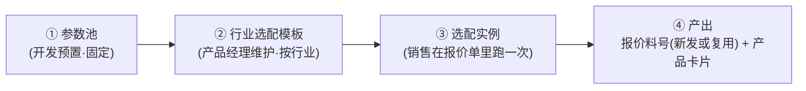
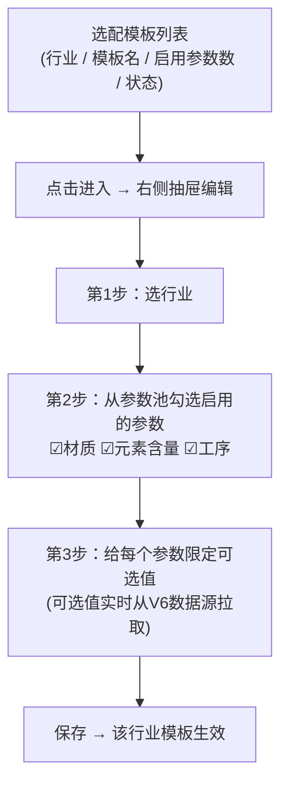
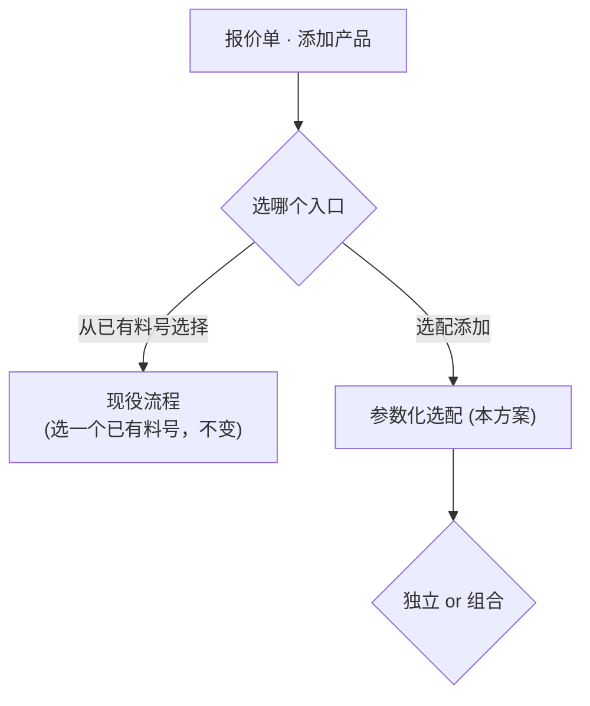
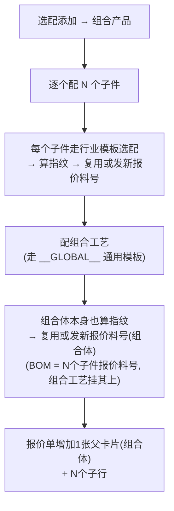
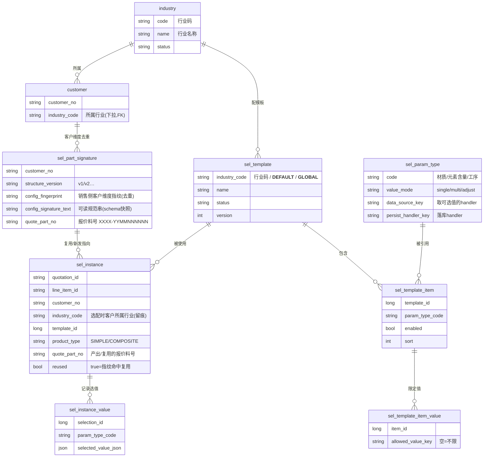
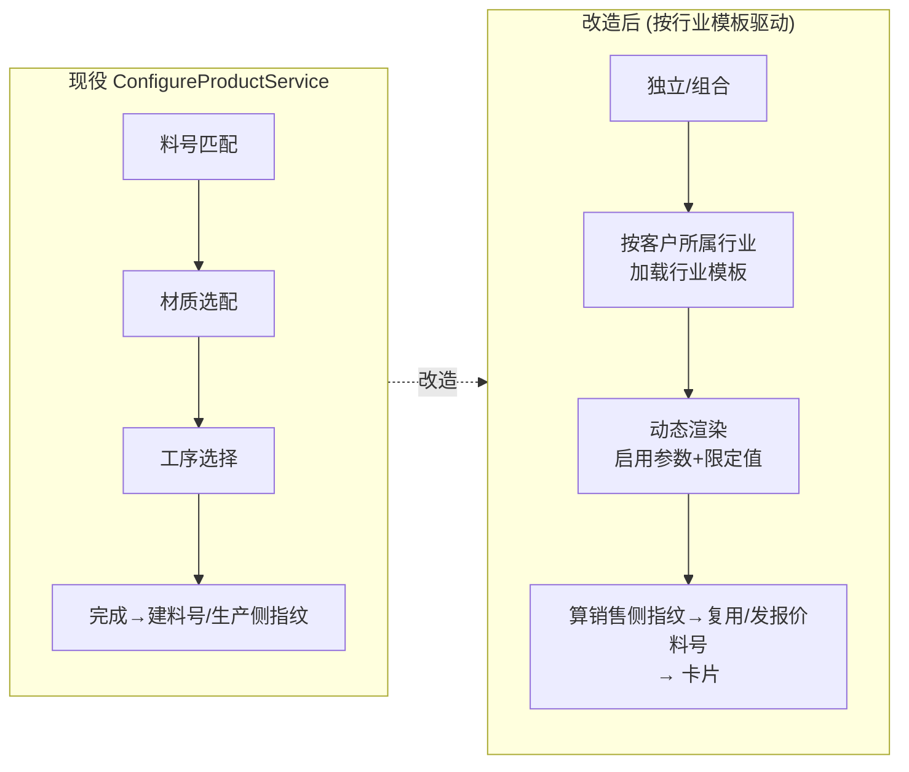

# 报价单「参数化选配」方案设计

> 状态：设计定稿 v4（待评审）｜日期：2026-07-06（v4 修订 2026-07-07）｜范围：报价单产品选配功能改造
>
> 本文只讲清楚"要做成什么样、为什么这么做"，不含代码。配一批流程图帮助理解。
>
> 变更史：
> - v2：模板维度由「客户」改为「**行业**」；客户管理新增「行业管理」，客户所属行业改下拉选择。
> - v3：报价料号增加**签名指纹**，选配结果指纹命中则**直接复用、不建新数据**（反转 v1「不去重」）。
> - **v4.1（据 Spec1 契约复核修订）**：`mintAndRegister` 一次完成发号+登记（不再并列 `ensureRegistered`）；发号传 V6 `customer.code`；补"选配须为报价料号建 `material_master` 行 + 按 `sales_part_no` 落库"防 AP-53 mirror 断链；补 `isCfg` 重估。
> - **v4（据独立评审 + 用户澄清修订）**：
>   - 厘清**销售料号 vs 生产料号**：指纹/去重做在**销售料号（=报价料号）**上，不是 `material_master`（生产料号，共享·全局）。评审 B1「与全局唯一冲突」前提作废——**客户维度去重成立**。
>   - 料号并入**统一报价料号体系** `XXXX-YYMMNNNNNN`（走现役 `QuoteMaterialNoAllocator`），不再自造 `XP-`/不退回 `CFG-`。本方案以「报价料号统一 Spec 1」为**硬前置**（发号服务 + `material_customer_map.system_type`）。
>   - 本方案是**改造现役 `com.cpq.configure` 链路**，非全新功能；不触发 AP-44 字段类型 17 检查点（不改 `field_type`）。
>   - 新表统一 `sel_` 前缀，避开已存在的 `config_*`（V203）/ `product_config_*`（3D，已搁置）。

---

## 0. 一句话概括

> 给**每个行业**建一套"选配菜单"，客户按其**所属行业**自动套用。销售在报价单里点几下，就能**从零配出一个报价料号**并生成产品卡片。同一客户、同一套选配结果**按指纹自动复用**已有报价料号，不重复造数据。

---

## 1. 为什么要改（现状 vs 目标）

**现状**：报价单「添加产品」已有现役选配链路 `com.cpq.configure`（`ConfigureProductService` + `Step0~5` 向导）：`产品类型 → 料号匹配 → 材质选配 → 工序选择 → 完成`。它的 `custom` 分支其实**已能"无前置料号从零建料号 + 元素 + 子件"**，也已有一套**生产侧全局指纹**（`FingerprintCalculator` + `material_master.config_fingerprint`）。

痛点：
- 向导对**所有客户/行业写死**同一套材质/工序，不区分不同行业的可选范围。
- 料号发号**散装**（`CFG-`、9 字头等），正由「报价料号统一」程序收敛为一套报价料号。

**目标**：把"材质、工序"环节改成**按客户所属行业的模板动态生成**；选配产出**统一报价料号**；同客户相同结果**按销售侧指纹复用**：

```
选独立/组合 → 按客户所属行业加载行业模板 → 只显示该行业能选的参数和取值
           → 选完算销售侧指纹 → 命中则复用该客户旧报价料号 / 未命中则发新报价料号 + 卡片
```

---

## 2. 核心思想：三层模型



| 层 | 是什么 | 谁维护 | 举例 |
|---|---|---|---|
| **① 参数池** | 系统内置的一批"参数类型"，**固定三类**：材质 / 元素含量 / 工序。每类由开发写死"可选值从哪来、选完怎么落库"。 | 开发（一次性） | 材质的可选值 = V6 材质字典 |
| **② 行业模板** | **每个行业一套**。从参数池里**勾选启用哪些参数**，并**限定每个参数该行业能选哪些值**。 | 产品经理（配置端） | 汽车行业：材质只能选304/H62，工序只能选电镀/抛光 |
| **③ 选配实例** | 销售在报价单里配一次的记录。 | 销售（运行时） | 给报价单QT-001配了一个不锈钢+电镀的产品 |
| **④ 产出** | 一个**报价料号**（新发或指纹命中时复用）+ 报价单上的**一张产品卡片**。 | 系统自动 | 报价料号 `0007-2607000123` |

**客户与行业**：客户在「客户管理」维护，每个客户**所属一个行业**（下拉单选）。报价单选配时用客户的所属行业匹配行业模板。

### 参数池三类参数（一期固定，不可自助新增）

| 参数 | 单/多选 | 可选值来源 | 选完落库到哪 | 备注 |
|---|---|---|---|---|
| **材质** | 单选 | V6 材质字典（`material_recipe`，现役 `Step2Material` 已用） | 报价料号的材质配比（销售料号维度） | 选它才有元素含量 |
| **元素含量** | 微调 | **由所选材质派生**（字典派 default/min/max，BOM 派回退，见 AP-53 续5） | 元素 override | 不能脱离材质单独启用；只微调 |
| **工序** | 多选 | V6 工序定义 | 工序清单（对齐「销售料号维度落库」程序，按 `sales_part_no` 落各按料号表） | 比对**不区分顺序**（排序集合） |

> "固定三类"= 想加第四类（如"表面处理"）需要开发改代码（接数据源 + 写落库逻辑）。产品经理只能在模板里勾选和限值，不能发明参数类型。

---

## 3. 配置端

### 3.1 客户管理：新增「行业管理」+ 所属行业改下拉

**位置**：客户管理 → 行业管理

- **行业字典 `industry`**：维护"行业码 / 行业名称 / 状态"（扁平，一期不做多级）。列表 + 抽屉编辑，遵守列表操作规范与"抽屉替代弹窗"规范。
- **客户「所属行业」**：由**输入框改为下拉单选**（选项来自行业字典）。原自由文本列迁移期保留，人工核对回填后再废弃。


### 3.2 「选配模板管理」按行业配置

**位置**：配置管理 → 选配模板管理

**页面**：列表 + 抽屉编辑。列表列：**行业** / 模板名 / 启用参数数 / 状态。



**三种特殊行业码**（同一张表，靠行业码区分）：

| 行业码 | 含义 | 用途 |
|---|---|---|
| 具体行业码 | 该行业专属模板 | 优先使用 |
| `__DEFAULT__` | 默认模板 | 客户所属行业没配模板（或客户没填行业）时**自动回退**，不报错 |
| `__GLOBAL__` | 通用组合工艺模板 | 组合产品的"组合工艺"参数集，全行业共享 |

---

## 4. 报价单端：选配使用流程

### 4.1 入口

「添加产品」两个入口，本方案**改造/增强"选配添加"**，保留"从已有料号选择"：



### 4.2 独立产品流程（含销售侧指纹去重）

```mermaid
flowchart TD
    A["选配添加 → 独立产品"] --> B["取报价单客户的所属行业<br/>加载该行业的选配模板"]
    B --> B2{该行业有专属模板?}
    B2 -->|有| L1["用行业专属模板"]
    B2 -->|无 / 客户未填行业| L2["回退用 __DEFAULT__ 默认模板"]
    L1 --> R["渲染启用的参数 + 限定的可选值"]
    L2 --> R
    R --> P["用户选值：材质→(派生元素,可微调)→工序"]
    P --> FP["提交 → 计算销售侧签名指纹<br/>= 哈希(结构版本 ‖ 模板启用参数的规范选值串)"]
    FP --> DUP{该客户已有报价料号<br/>同结构版本 + 同指纹? (查 sel_part_signature)}
    DUP -->|命中| REUSE["直接复用该报价料号<br/>不发新号、不建新数据"]
    DUP -->|未命中| G1["① QuoteMaterialNoAllocator 发新报价料号<br/>XXXX-YYMMNNNNNN + 登记 sel_part_signature"]
    G1 --> G2["② 各参数按销售料号维度落库<br/>(材质/元素/工序 → sales_part_no)"]
    REUSE --> CARD["③ 报价单增加1张产品卡片"]
    G2 --> CARD
```

### 4.3 组合产品流程

> 组合产品 = N 个独立子件 + 组合工艺。每个子件、组合体各自走"算指纹→命中复用/未命中发新号"。



### 4.4 关键约定

- **模板按行业匹配**：报价单 → 客户 → 客户所属行业 → 行业模板；行业没配（或客户没填行业）→ 回退默认模板，不报错。
- **料号是选配的产出**：选配 = 发/复用**统一报价料号** `XXXX-YYMMNNNNNN`；想复用旧料号请走"从已有料号选择"。
- **销售/生产料号分离 + 落库主键**：选配产出**报价料号（销售侧）**，发号即在 `material_customer_map` 建 QUOTE 行；**同时为该报价料号建 `material_master` 行并按 `sales_part_no` 落材质/元素/工序**（否则 AP-53 mirror 视图按 `material_master.material_no` JOIN 取数 → 产品卡片四 Tab 空）。ERP 生产料号 `production_no` 可后补（"1:N"指一个 ERP 生产号可对多个报价料号，**不是**"选配时不建生产侧行"）。
- **按销售侧指纹去重复用**：选配结果指纹命中**该客户**已有报价料号（且同结构版本）→ 直接挂用、不发新号、不建新数据；未命中才发新号。详见 §5。

---

## 5. 销售侧签名指纹与去重复用

### 5.1 目标与"销售侧"定位

同一个**客户**，若两次选配结果实质相同，应指向**同一个报价料号**。判定"实质相同"靠**销售侧签名指纹**。

- 它是**新引入**的、**客户维度**的指纹，落在**报价料号（销售侧）**的去重登记表 `sel_part_signature` 上。
- 与现役 `FingerprintCalculator` + `material_master.config_fingerprint` 的**生产侧全局指纹**是**两码事**：那套是生产料号去重（客户无关、全局唯一），本方案不改它。
- **客户维度**成立且无冲突：报价料号本就按客户（号里嵌客户码 `XXXX`，↔客户料号 1:1）。

### 5.2 指纹怎么算（与模板有关，但不哈希模板 ID）

**指纹 = `哈希( 结构版本 ‖ 规范化选配串 )`**，按 `(customer_no, structure_version, fingerprint)` 唯一登记在 `sel_part_signature`。

**规范化选配串**由"本次实际使用模板中**启用**的参数项"投影而来（这就是"与模板有关"）：

1. 取模板 `enabled=true` 的参数项，按 `param_type_code` 排序。
2. 每个参数渲染成规范 token：

   | 参数 | token 规则 | 示例 |
   |---|---|---|
   | 材质 | 材质/配比编码 | `MAT=304` |
   | 元素含量 | 按元素码排序的 `码:含量`，含量规范化（去尾零，与串内其它 token 口径一致；**微调值计入**） | `ELE=C:0.08,Cr:18,Ni:8` |
   | 工序 | 工序码**排序集合**（不区分顺序） | `PRC=抛光,电镀` |
   | 启用但未选/为空 | 显式空哨兵，**不省略** | `PRC=∅` |

3. 串首带**结构版本号**（如 `v1`，与现役算法版本位统一命名，避免 `v1`/`FPV1` 双轨）：`v1|MAT=304|ELE=...|PRC=抛光,电镀`。

**为什么"与模板有关"却不哈希模板 ID**：
- 启用参数集不同 → 规范串槽位不同 → 指纹天然不同（模板加了"表面处理"，新料号自然区别于老料号）。
- 模板只改某参数**可选值范围**（没动启用项）→ 规范串结构不变 → 相同选值仍命中复用。**只有真正改变产品构成的模板变更才另起料号**。
- 不哈希模板 ID/版本：否则模板每发一版就把同一实体分裂成多个报价料号，去重失效。

### 5.3 去重登记表 `sel_part_signature`（不污染共享大表）

去重索引**单独建表**，不往被三个 spec 共改的 `material_customer_map` 上加选配列：

| 列 | 含义 |
|---|---|
| `customer_no` | 客户 |
| `structure_version` | 结构/算法版本（如 `v1`） |
| `config_fingerprint` | 指纹哈希（比对用） |
| `config_signature_text` | 可读规范串（含全部槽位+空哨兵，= 该料号 schema 快照，供人肉核对 + 重算自洽） |
| `quote_part_no` | 命中/新发的报价料号（→ `material_customer_map` QUOTE 行的 `material_no`） |

唯一约束：`UNIQUE(customer_no, structure_version, config_fingerprint)`。

### 5.4 指纹更新时机（写时算、读时用，绝不读时算）

**核心纪律**：指纹只依赖料号自身快照的 config 值 + 出生时的结构，在明确的"写"时刻计算，绝不因外部变化或"打开/渲染"而重算。

| # | 触发 | 动作 |
|---|---|---|
| **A** | 选配提交、发新报价料号 | 计算指纹 + 规范串，写入 `sel_part_signature`（主写入点） |
| **B** | 已生成料号的 config 被人为修改（材质/元素/工序）——**本方案允许编辑** | 在**保存修改的同一事务里重算**指纹；若撞该客户已有料号 → **拦截并提示改为复用**（不新建、不违约） |
| **C** | 指纹算法升级（结构版本 v1→v2） | **不运行时懒重算**，走一次性**离线迁移脚本**显式重算并升版 |

**🚫 绝不自动重算**：模板被编辑 / V6 基础资料漂移 / 打开报价单渲染卡片 —— 历史料号一律不动（选值已快照在 `config_signature_text`，指纹只依赖快照；本项目有"打开即 autosave 风暴致空白"事故，指纹必须写时算读时用）。

**🔑 比对纪律**：**同结构版本才比指纹**（v2 选配只跟 v2 料号比，不误撞 v1 老料号）。

### 5.5 并发

沿用现役两道防护：报价料号发号走 `QuoteMaterialNoAllocator` 的序列/客户码并发算法（`ON CONFLICT DO NOTHING` + 竞态败者回读）；`sel_part_signature` 的唯一键 + `ON CONFLICT DO NOTHING` 兜底"同客户并发两次相同选配"，败者回读既有 `quote_part_no` 再挂卡片。

---

## 6. 数据模型



**表职责速览**：

| 表 | 一句话 | 归属 |
|---|---|---|
| `industry` | 行业字典（客户管理→行业管理维护） | 本方案新建 |
| `customer` | 既有客户表，新增 `industry_code`（下拉单选，原自由文本迁移） | 改造既有 |
| `sel_param_type` | 参数池种子表（封闭 3 行），存取值/落库 handler key | 本方案新建 |
| `sel_template` | **行业**选配模板（一行业一套；含默认/通用两个保留行业码） | 本方案新建 |
| `sel_template_item` | 模板启用了哪些参数 | 本方案新建 |
| `sel_template_item_value` | 每个参数该行业能选的值子集（空=不限） | 本方案新建 |
| `sel_part_signature` | **销售侧客户维度指纹去重登记**，`UNIQUE(customer_no,structure_version,config_fingerprint)` → 报价料号 | 本方案新建 |
| `sel_instance` | 一次选配实例（产出/复用的报价料号 + 是否复用 + 客户/行业留痕），可反查审计 | 本方案新建 |
| `sel_instance_value` | 这次每个参数具体选了什么 | 本方案新建 |
| `material_customer_map`（QUOTE 行） | **报价料号权威登记**（`material_no`）。`mintAndRegister` **一次完成发号+登记 QUOTE 行**（`customer_product_no=NULL`），本方案不加选配列 | 复用（报价料号统一 Spec 1 所有） |
| `material_master` | **生产料号**主表（客户无关·全局）；其 `config_fingerprint` 是**生产侧全局指纹**，本方案不改 | 复用 |

> 取数/落库按 `data_source_key` / `persist_handler_key` 分发（沿用 DataSource Resolver SPI 思路）。销售侧指纹计算/比对为独立组件，写时（选配提交、料号编辑）触发。

---

## 7. 与现役实现的关系（改造范围 + 依赖）

### 7.1 改造现役 `com.cpq.configure` 链路（非全新）



- **去掉**"料号匹配"前置（迁到"从已有料号选择"入口）。
- **材质/工序**两步 → 行业模板驱动的动态参数渲染（材质/派生元素来源复用现役 `Step2Material` + `material_recipe`）。
- **新增**销售侧客户维度指纹 + 去重登记表 `sel_part_signature`。
- **料号发号**改走统一 `QuoteMaterialNoAllocator.mintAndRegister`（一次发号+登记 QUOTE 行，取代 `CFG-`；传入 **V6 `customer.code`**、非 UUID）。
- **重估 `MaterialBomMergeHandler.isCfg`**：选配料号从 `CFG-` 改为 `XXXX-YYMMNNNNNN` 后 `isCfg` 不再匹配，导入/BOM 合并的拒绝逻辑须随之调整（承接 Spec2 该子项）。
- **保留复用**：SIMPLE/COMPOSITE 分支、组合工艺、提交生成 lineItem+卡片骨架、生产侧写库与全局指纹。
- **不触发 AP-44**：本方案不新增/不改组件 `field_type`，产品卡片仍走既有模板渲染，17 检查点协议不涉及。

### 7.2 硬前置依赖

| 依赖 | 说明 |
|---|---|
| 🔒 **报价料号统一 Spec 1** | 提供 `QuoteMaterialNoAllocator` 发号服务 + `material_customer_map.system_type/production_no` + 客户四位码分配。本方案发号/登记依赖它，须其**先落 master** 或协调排期（本方案 = 该程序 "Spec 2 选配发号统一" 的落地承接）。 |
| **销售料号维度落库** | 材质/元素/工序按 `sales_part_no` 落各按料号表的口径，以其 `V6.2 落库定义` 为准。 |

---

## 8. 已定决策清单（评审基线）

| # | 决策点 | 结论 |
|---|---|---|
| 1 | 模板控制粒度 | 开关参数项 + **限定可选值子集** |
| 2 | 参数池性质 | 类型封闭（3类），可选值动态取自 V6 |
| 3 | 料号匹配去留 | 选配=发/复用报价料号；旧料号另有入口 |
| 4 | 产出料号 | **统一报价料号 `XXXX-YYMMNNNNNN`**（走 `QuoteMaterialNoAllocator`），非 `XP-`/非 `CFG-` |
| 5 | 去重 | **按销售侧客户维度指纹去重复用**，命中复用不发新号（反转 v1） |
| 6 | 模板维度 | **按行业**（一行业一套·扁平），不再按客户 |
| 7 | 组合体料号 | 组合体也算指纹→复用/发新号，BOM=N子件 |
| 8 | 初始参数池 | 材质 / 元素含量 / 工序 |
| 9 | 元素含量 | 依附材质、派生后仅微调，不独立启用 |
| 10 | 指纹落点 | **销售侧**（报价料号），落 `sel_part_signature`；**不改**生产侧 `material_master` 全局指纹 |
| 11 | 通用组合工艺模板 | 存 `sel_template`，行业码 `__GLOBAL__` |
| 12 | 行业无模板 / 客户没填行业 | 回退 `__DEFAULT__` 默认模板，不报错 |
| 13 | 行业管理 | 客户管理模块内新增行业字典（扁平）；客户「所属行业」输入框改**下拉单选** |
| 14 | 指纹构成 | `哈希(结构版本 ‖ 模板启用参数投影规范串)`，**不哈希模板 ID**；工序**不区分顺序**（排序集合）；元素微调值计入、去尾零 |
| 15 | 指纹更新时机 | 写时算（A 发号 / B 编辑同事务重算+撞号拦截复用 / C 离线升版）；模板变、基础资料漂移、打开渲染**均不重算**；同结构版本才比 |
| 16 | 料号可编辑 | **允许**编辑已生成料号的材质/元素/工序；编辑保存时重算指纹 |
| 17 | 表命名 | 新表 `sel_` 前缀族 + `industry`；避开 `config_*`(V203) / `product_config_*`(3D) |
| 18 | 前置依赖 | 以「报价料号统一 Spec 1」为硬前置；落库对齐「销售料号维度」程序 |
| 19 | 与 AP-44 | 不触发（不改 `field_type`）；改造面 = 重构 `com.cpq.configure` 链路 |

---

## 9. 待后续实现计划细化的点（非阻塞）

- 参数值"落库 handler"的**具体写入表/字段映射**（材质配比、元素 override、工序清单按 `sales_part_no` 落哪些按料号表），以「销售料号维度落库 `V6.2`」口径为准。**须显式确认该口径覆盖"为报价料号建 `material_master` 行"**（否则 AP-53 mirror 视图断链、卡片四 Tab 空——唯一会阻塞渲染的硬约束）。
- 报价料号 `YYMM` 的取值时点（报价创建日 vs 发号 `now()`）未定，实现前明确。
- **存量客户自由文本"所属行业"→ 行业字典的迁移映射**（清洗 + 建初始行业字典 + 回填 `industry_code`，迁移期保留原文本列）。
- 组合体报价料号与子件报价料号的 BOM 关系落表（对齐现役 `insertMaterialBomAssemblyV6` 雏形）。
- 选配模板的版本/发布状态机（一期可"直接生效"，草稿/发布为增强）。
- 报价料号编辑重算撞指纹的**处置细节**（拦截提示复用 / 禁止编辑成已存在结构 —— §5.4 已定"拦截复用"，实现细节待定）。
- **与「报价料号统一 Spec 1/2」的边界确认**：建议实现前由架构 agent 或 spec 作者复核本方案发号/登记与 Spec 1 契约完全对齐，避免部分阅读造成偏差。

> 这些属于实现细节，进入 writing-plans 阶段再逐条定，不影响本设计定稿。
